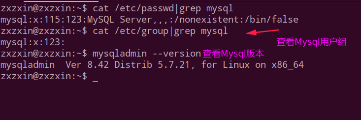
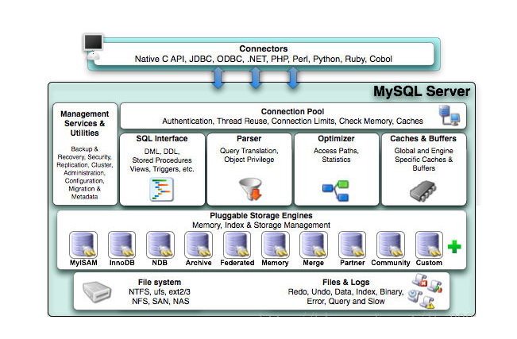

# MYSQL高级

* 一、Mysql的架构介绍
* 二、索引优化分析
* 三、查询截取分析
* 四、主从复制
* 五、Mysql锁机制

## 一、Mysql的架构介绍

### 1、Mysql在Linux下的基本安装配置

#### 1)、查看是否已经安装好



#### 2)、Mysql的启动和停止

```shell
service mysql start # 启动
service mysql stop # 停止
# 另外一种启动停止的方式
/etc/init.d/mysql start
/etc/init.d/mysql stop
```

#### 3)、在Linux下配置Mysql的密码

方式一(在mysql系统之外):
在mysql系统外:

```shell
mysqladmin -u root -p password "test123"
Enter password: 【输入原来的密码】
```

方式二(登录mysql):

```shell
mysql -u root -p
Enter password: 【输入原来的密码】
mysql>use mysql;
mysql> update user set password=password("test") where user='root';
mysql> flush privileges;
mysql> exit;      
```

#### 4)、Mysql在linux下的安装位置

| 路径              | 解释                      | 备注                         |
| ----------------- | ------------------------- | ---------------------------- |
| /var/lib/mysql/   | mysql数据库文件的存放路径 | /var/lib/mysql/              |
| /usr/share/mysql  | 配置文件目录              | mysql.server命令以及配置文件 |
| /usr/bin          | 相关命令目录              | mysqladmin mysqldump等命令   |
| /etc/init.d/mysql | 启停相关脚本              |                              |

#### 5)、中文乱码问题

一个很重要的点: **乱码问题解决是你修改完配置之后再建的新的表，之前的表还是会是乱码**。

给一个博客讲解。

> https://www.2cto.com/database/201305/215563.html

### 2、主要配置文件

* 二进制日志`log-bin` : 主从复制；
* 错误日志`log-error` : **默认是关闭的**，记录严重的警告和错误信息，每次启动和关闭的详细信息等；
* 查询日志`log` : 默认关闭，记录查询的`sql`语句，如果开启会减低`mysql`的整体性能，因为记录日志也是需要消耗系统资源的；
* 数据文件


* 如何配置: ①`windows`: `my.ini`文件；②`linux`: `/etc/my.cnf`文件；

### 3、Mysql逻辑架构介绍

Mysql逻辑架构图如下:


下面是mysql官网的体系图:



各层的基本概述

> 1.连接层
>
> 最上层是一些**客户端和连接服务**，包含本地sock通信和大多数基于客户端/服务端工具实现的类似于`tcp/ip`的通信。主要完成一些类似于连接处理、授权认证、及相关的安全方案。在该层上引入了**线程池**的概念，为通过认证安全接入的客户端提供线程。同样在该层上可以实现基于SSL的安全链接。服务器也会为安全接入的每个客户端验证它所具有的操作权限。
>
> 2.服务层
>
> 第二层架构主要完成大多少的核心服务功能，如SQL接口，并完成**缓存的查询，SQL的分析和优化及部分内置函数的执行**。所有跨存储引擎的功能也在这一层实现，如**过程、函数**等。在该层，服务器会解析查询并创建相应的内部解析树，并对其完成相应的优化如确定查询表的顺序，是否利用索引等，最后生成相应的执行操作。如果是select语句，服务器还会查询内部的缓存。如果缓存空间足够大，这样在解决大量读操作的环境中能够很好的提升系统的性能。
>
> 3.引擎层
>
> 存储引擎层，存储引擎真正的负责了MySQL中数据的存储和提取，服务器通过APl与存储引擎进行通信。不同的存储引擎具有的功能不同，这样我们可以根据自己的实际需要进行选取。
>
> 4.存储层
>
> 数据存储层，主要是将数据存储在运行于裸设备的文件系统之上，并完成与存储引擎的交互。

