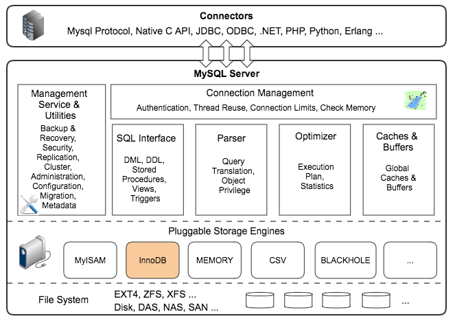

# MYSQL高级

* 一、Mysql的架构介绍
  * [1、Mysql在Linux下的基本安装配置](#1mysql在linux下的基本安装配置)
  * [2、主要配置文件](#2主要配置文件)
  * [3、Mysql逻辑架构介绍](#3mysql逻辑架构介绍)
  * [4、Mysql存储引擎](#4mysql存储引擎)
* [二、索引优化分析](#二、索引优化分析)
* 三、查询截取分析
* 四、主从复制
* 五、Mysql锁机制

## 一、Mysql的架构介绍

### 1、Mysql在Linux下的基本安装配置

#### 1)、查看是否已经安装好


#### 2)、Mysql的启动和停止

```shell
service mysql start # 启动
service mysql stop # 停止
# 另外一种启动停止的方式
/etc/init.d/mysql start
/etc/init.d/mysql stop
```

#### 3)、在Linux下配置Mysql的密码

方式一(在mysql系统之外):
在mysql系统外:

```shell
mysqladmin -u root -p password "test123"
Enter password: 【输入原来的密码】
```

方式二(登录mysql):

```shell
mysql -u root -p
Enter password: 【输入原来的密码】
mysql>use mysql;
mysql> update user set password=password("test") where user='root';
mysql> flush privileges;
mysql> exit;      
```

#### 4)、Mysql在linux下的安装位置

| 路径              | 解释                      | 备注                         |
| ----------------- | ------------------------- | ---------------------------- |
| /var/lib/mysql/   | mysql数据库文件的存放路径 | /var/lib/mysql/              |
| /usr/share/mysql  | 配置文件目录              | mysql.server命令以及配置文件 |
| /usr/bin          | 相关命令目录              | mysqladmin mysqldump等命令   |
| /etc/init.d/mysql | 启停相关脚本              |                              |

#### 5)、中文乱码问题

一个很重要的点: **乱码问题解决是你修改完配置之后再建的新的表，之前的表还是会是乱码**。

给一个博客讲解。

> https://www.2cto.com/database/201305/215563.html

### 2、主要配置文件

* 二进制日志`log-bin` : 主从复制；
* 错误日志`log-error` : **默认是关闭的**，记录严重的警告和错误信息，每次启动和关闭的详细信息等；
* 查询日志`log` : 默认关闭，记录查询的`sql`语句，如果开启会减低`mysql`的整体性能，因为记录日志也是需要消耗系统资源的；
* 数据文件


* 如何配置: ①`windows`: `my.ini`文件；②`linux`: `/etc/my.cnf`文件；

### 3、Mysql逻辑架构介绍

Mysql逻辑架构图如下:


下面是mysql官网的体系图:




各层的基本概述

> 1.连接层
>
> 最上层是一些**客户端和连接服务**，包含本地sock通信和大多数基于客户端/服务端工具实现的类似于`tcp/ip`的通信。主要完成一些类似于连接处理、授权认证、及相关的安全方案。在该层上引入了**线程池**的概念，为通过认证安全接入的客户端提供线程。同样在该层上可以实现基于SSL的安全链接。服务器也会为安全接入的每个客户端验证它所具有的操作权限。
>
> 2.服务层
>
> 第二层架构主要完成大多少的核心服务功能，如SQL接口，并完成**缓存的查询，SQL的分析和优化及部分内置函数的执行**。所有跨存储引擎的功能也在这一层实现，如**过程、函数**等。在该层，服务器会解析查询并创建相应的内部解析树，并对其完成相应的优化如确定查询表的顺序，是否利用索引等，最后生成相应的执行操作。如果是select语句，服务器还会查询内部的缓存。如果缓存空间足够大，这样在解决大量读操作的环境中能够很好的提升系统的性能。
>
> 3.引擎层
>
> 存储引擎层，存储引擎真正的负责了MySQL中数据的存储和提取，服务器通过APl与存储引擎进行通信。不同的存储引擎具有的功能不同，这样我们可以根据自己的实际需要进行选取。
>
> 4.存储层
>
> 数据存储层，主要是将数据存储在运行于裸设备的文件系统之上，并完成与存储引擎的交互。

### 4、Mysql存储引擎

查看数据库存储引擎两个命令:

```mysql
show engines;
show variables like '%storage engine%';// 查看默认的存储引擎
```

演示:


关于MyISAM和InnoDB的简单对比:


> 问：MyISAM和InnoDB引擎的区别
>
> - MyISAM 不支持外键，而 InnoDB 支持
>
> - MyISAM 是非事务安全型的，而 InnoDB 是事务安全型的。
>
> - **MyISAM 锁的粒度是表级，而 InnoDB 支持行级锁定**。
>
> - MyISAM 支持全文类型索引，而 InnoDB 不支持全文索引。
>
> - MyISAM 相对简单，所以在效率上要优于 InnoDB，小型应用可以考虑使用 MyISAM。
>
> - MyISAM 表是保存成文件的形式，在跨平台的数据转移中使用 MyISAM 存储会省去不少的麻烦。
>
> - InnoDB 表比 MyISAM 表更安全，可以在保证数据不会丢失的情况下，切换非事务表到事务表（`alter  table tablename type=innodb`）。
>
> 应用场景:
> * MyISAM 管理非事务表。它提供高速存储和检索，以及全文搜索能力。如果应用中需要执行大量的 SELECT 查询，那么 MyISAM 是更好的选择。
> * InnoDB 用于事务处理应用程序，具有众多特性，包括 ACID 事务支持。如果应用中需要执行大量的 INSERT 或 UPDATE 操作，则应该使用 InnoDB，这样可以提高多用户并发操作的性能。
>

## 二、索引优化分析

需要优化的原因：性能低、执行时间太长、等待时间太长、SQL语句欠佳（连接查询）、索引失效、服务器参数设置不合理（缓冲、线程数）	。

<div align="center"></div><br>

先看SQL执行的顺序:

```mysql
编写过程：
select dinstinct  ..from  ..join ..on ..where ..group by ...having ..order by ..limit ..

解析过程：			
from .. on.. join ..where ..group by ....having ...select dinstinct ..order by limit ...
```

解析图:


> 详细参考这篇博客: https://www.cnblogs.com/annsshadow/p/5037667.html

SQL优化， 主要就是在优化索引

*  相当于书的目录；
*  index是帮助MYSQL高效获取数据的数据结构。索引是数据结构（树：B树(默认)、Hash树...）；

> 索引的弊端：
>
> * 索引本身很大， 可以存放在内存/硬盘（通常为 硬盘）
> * 索引不是所有情况均适用： a.少量数据  b.频繁更新的字段   c.很少使用的字段
> * 索引会降低增删改的效率（增删改  查）
>
> 优势：
>
> * 提高查询效率（降低IO使用率）
> * 降低CPU使用率 （...order by age desc，因为 B树索引 本身就是一个 好排序的结构，因此在排序时  可以直接使用）

索引分类:

* 主键索引：  不能重复。id    不能是null
* 唯一索引  ：不能重复。id    可以是null
* 单值索引  ： 单列， 一个表可以多个单值索引。
* 复合索引  ：多个列构成的索引 （相当于二级目录 ：  z: zhao）  (name,age)   (a,b,c,d,...,n)

创建索引的两种方式:

```mysql
创建索引：
	方式一：
	create 索引类型  索引名  on 表(字段)
	单值：
	create index   dept_index on  tb(dept);
	唯一：
	create unique index  name_index on tb(name) ;
	复合索引
	create index dept_name_index on tb(dept,name);

	方式二：alter table 表名 索引类型  索引名（字段）
	
	单值：
	alter table tb add index dept_index(dept) ;
	唯一：
	alter table tb add unique index name_index(name);
	复合索引
	alter table tb add index dept_name_index(dept,name);

	注意：如果一个字段是primary key，则改字段默认就是 主键索引	
```

删除索引

```mysql
删除索引：
drop index 索引名 on 表名 ;
drop index name_index on tb ;
```
查询索引
```mysql
查询索引：
show index from 表名 ;
show index from 表名 \G
```


