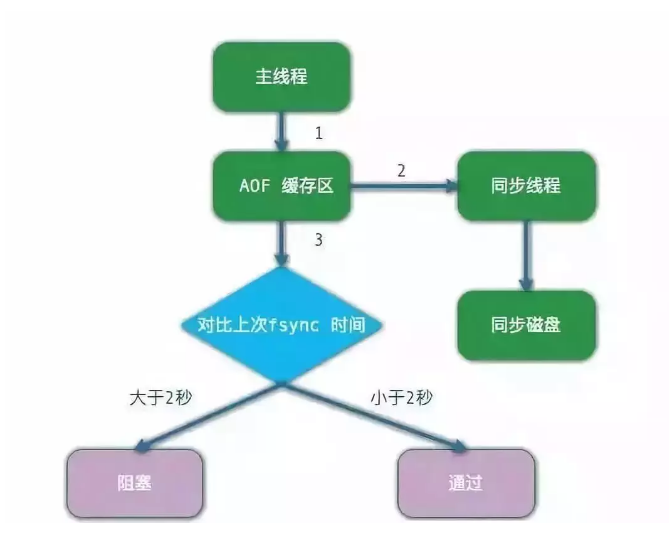

# Redis持久化

转载: <https://mp.weixin.qq.com/s/nOfd37J21axDMnlYK9WDrg>

由于 RDB 的数据实时性问题，目前用 AOF 比较多了，而持久化恢复也是优先 AOF。

RDB 是旧的模式，现在基本上都使用 AOF。

**恢复的时候，优先加载 AOF，当没有 AOF 时才加载 RDB**。

## 一、RDB

Redis会单独创建（fork）一个子进程来进行持久化，会先将数据写入到 一个临时文件中，待持久化过程都结束了，再用这个临时文件替换上次持久化好的文件。

 

RDB特点: 

1、RDB 是一种快照模式，即——保存的是 key value 数据内容。

2、RDB 有 2 种持久方式，同步 save 模式和异步 bgsave 模式。由于 save 是同步的，所以可以保证数据一致性，而 bgsave 则不能。

3、save 可以在客户端显式触发，也可以在 shutdown 时自动触发；bgsave 可以在客户端显式触发，也可以通过配置由定时任务触发，也可以在 slave 节点触发。

4、save 导致 redis 同步阻塞，基本已经废弃。bgsave 则不会导致阻塞，但也有缺点：在 fork 时，需要增加内存服务器开销，因为当内存不够时，将使用虚拟内存，导致阻塞 Redis 运行。所以，需要保证空闲内存足够。

5、默认执行 shutdown 时，如果没有开启 AOF，则自动执行 bgsave。

6、每次的 RDB 文件都是替换的。

**关于优化：**

Redis 会压缩 RDB 文件，使用 LZF 算法，让最终的 RDB 文件远小于内存大小，默认开启。但会消耗 CPU。

**RDB 缺点：**

1、**无法秒级持久化**。

2、老版本 Redis 无法兼容新版本 RDB。

**RDB 优点：**

1、文件紧凑，适合备份，全量复制场景。例如每 6 小时执行 bgsave，保存到文件系统之类的。

2、**Redis 加载 RDB 恢复数据远远快于 AOF**。

## 二、AOF

由于 RDB 的数据实时性问题，AOF（append only file） 是目前 Redis 持久化的主流方式。

**AOF 特点：**

1、默认文件名是 appendonly.aof。和 RDB 一样，保存在配置中 dir 目录下。

2、AOF 相比较于 RDB，每次都会保存写命令，数据实时性更高。

3、AOF 由于每次都会记录写命令，文件会很大，因此需要进行优化，称之为“重写机制”（下面详细说）。

4、AOF 每次保存的写命令都放在一个缓冲区，根据不同的策略（下面详细说）同步到磁盘。

**“重写机制” 细节：**

1、fork 子进程（类似 bgsave）

2、主进程会写到2个缓冲区，一个是原有的 “AOF 缓存区”，一个是专门为子进程准备的 “AOF 重写缓冲区”；

3、子进程写到到新的 AOF 文件中，批量的，默认 32m；写完后通知主进程。

4、主进程把“AOF 重写缓冲区”的数据写到新 AOF 文件中。

5、将新的 AOF 文件替换老文件。

重写流程图(`rewrite`)：

**缓冲区同步策略，由参数 appendfsync 控制，一共3种：**

1、always：调用系统 `fsync()` 函数，直到同步到硬盘返回；严重影响redis性能(同步性好)。

2、everysec：先调用 OS write 函数， 写到缓冲区，然后 redis 每秒执行一次 OS fsync 函数。推荐使用这种方式（默认配置）。

3、no: 只执行 write OS 函数，具体同步硬盘策略由 OS 决定；不推荐，数据不安全，容易丢失数据。

## 三、性能优化

**1、fork 操作**

当 Redis 做 RDB 或者 AOF 重写时，必然要进行 fork 操作，对于 OS 来说，fork 都是一个重量级操作。而且，fork 还会拷贝一些数据，虽然不会拷贝主进程所有的物理空间，但会复制主进程的空间内存页表。对于 10GB 的 Redis 进程，需要复制大约 20MB 的内存页表，因此 fork 操作耗时跟进程总内存量息息相关，再加上，如果使用虚拟化技术，例如 Xen 虚拟机，fork 会更加耗时。

一个正常的 fork 耗时大概在 20毫秒左右。为什么呢，假设一个 Redis 实例的 OPS 在 5 万以上，如果 fork 操作耗时在秒级，那么僵拖慢几万条命令的执行，对生产环境影响明显。

我们可以在 Info stats 统计中查询 latestforkusec 指标获取最近一次 fork 操作耗时，单位微秒。

**如何优化：**

1) 优先使用物理机或者高效支持 fork 的虚拟化技术，避免使用 Xen。

2) 控制 redis 实例最大内存，尽量控制在 10GB 以内。

3) 合理配置 Linux 内存分配策略，避免内存不足导致 fork 失败。

4) 降低 fork 的频率，如适度放宽 AOF 自动触发时机，避免不必要的全量复制。

**2、子进程开销**

fork 完毕之后，会创建子进程，子进程负责 RDB 或者 AOF 重写，这部分过程主要涉及到 CPU，内存，硬盘三个地方的优化。

1) CPU 写入文件的过程是 CPU 密集的过程，通常子进程对单核 CPU 利用率接近 90%。如何优化呢？既然是 CPU 密集型操作，就不要绑定单核 CPU，因为这样会和父 CPU 进行竞争。同时，不要和其他 CPU 密集型服务不是在一个机器上。如果部署了多个 Redis 实例，尽力保证统一时刻只有一个子进程执行重写工作。

2) 内存子进程通过 fork 操作产生，占用内存大小等同于父进程，理论上需要两倍的内存完成持久化操作，但 Linux 有 copy on write 机制，父子进程会共享相同的物理内存页，当父进程处理写操作时，会把要修改的页创建对应的副本，而子进程在 fork 操作过程中，共享整个父进程内存快照。即——如果重写过程中存在内存修改操作，父进程负责创建所修改内存页的副本。这里就是内存消耗的地方。如何优化呢？尽量保证同一时刻只有一个子进程在工作；避免大量写入时做重写操作。

3) 硬盘 硬盘开销分析：子进程主要职责是将 RDB 或者 AOF 文件写入硬盘进行持久化，势必对硬盘造成压力，可通过工具例如 iostat，iotop 等，分析硬盘负载情况。

**如何优化：**

1)、不要和其他高硬盘负载的服务放在一台机器上，例如 MQ，存储。

2)、AOF 重写时会消耗大量硬盘 IO，可以开启配置 `no-appendfsync-on-rewrite`，默认关闭。表示在 AOF 重写期间不做 fsync 操作。

3)、当开启 AOF 的 Redis 在高并发场景下，如果使用普通机械硬盘，每秒的写速率是 100MB左右，这时，Redis 的性能瓶颈在硬盘上，建议使用 SSD。

4)、对于单机配置多个 Redis 实例的情况，可以配置不同实例分盘存储 AOF 文件，分摊硬盘压力。

**3、AOF 追加阻塞**

当开启 AOF 持久化时，常用的同步硬盘的策略是“每秒同步” everysec，用于平衡性能和数据安全性，对于这种方式，redis 使用另一条线程每秒执行 fsync 同步硬盘，当系统资源繁忙时，将造成 Redis 主线程阻塞。

流程图如下：

通过上图可以发现：everysec 配置最多可能丢失 2 秒数据，不是 1 秒；如果系统 fsync 缓慢，将会导致 Redis 主线程阻塞影响效率。

**问题定位：**

1)、发生 AOF 阻塞时，会输入日志。用于记录 AOF fsync 阻塞导致拖慢 Redis 服务的行为。

2)、每当 AOF 追加阻塞事件发生时，在 info Persistence 统计中，aofdelayedfsync 指标会累加，查看这个指标方便定位 AOF 阻塞问题。

3)、AOF 同步最多运行 2 秒的延迟，当延迟发生时说明硬盘存在性能问题，可通过监控工具 iotop 查看，定位消耗 IO 的进程。

**4、单机多实例部署**

Redis 单线程架构**无法充分利用多核CPU，通常的做法是一台机器上部署多个实例，当多个实例开启 AOF 后，彼此之间就会产生CPU 和 IO 的竞争**。

如何解决这个问题呢？

让所有实例的 AOF 串行执行。

我们通过 info Persistence 中关于 AOF 的信息写出 Shell 脚本，然后串行执行实例的 AOF 持久化。

整个过程如图：

 

通过不断判断 AOF 的状态，手动执行 AOF 重写，保证 AOF 不会存在竞争。