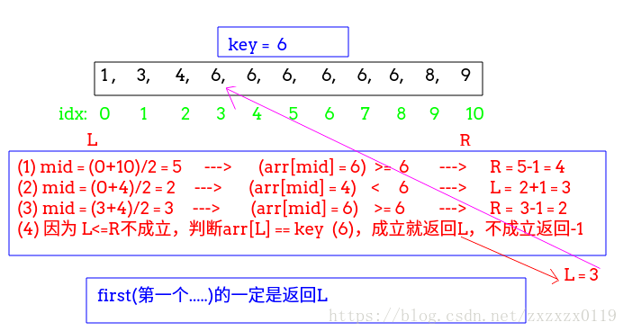
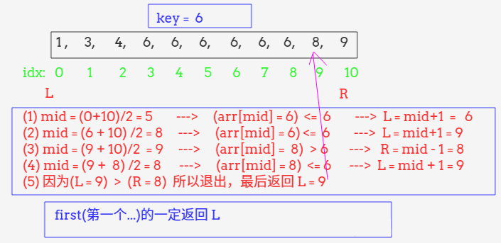
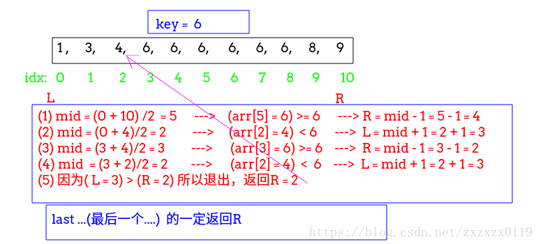

## 二分查找的总结

 - [普通的二分查找](#普通的二分查找)

 - [普通二分查找的另一种写法](#普通二分查找的另一种写法)

 - [第一个`=key`的，不存在返回`-1`](#第一个=key的不存在返回-1)

 - [第一个`>=key`的](#第一个>=key的)

 - [第一个`>key`的](#第一个>key 的 )

 - [第一个`...`的总结](#第一个的总结)

 - [最后一个`=`key的，不存在返回`-1`](#最后一个=key的不存在返回-1)

 - [最后一个`<=key`的](#最后一个<=key的) 

 - [最后一个`<key` 的](#最后一个<key的)

 - [最后一个`...`的总结](#最后一个的总结)

 - [完整测试代码](#完整测试代码)

***


### 普通的二分查找
最普通的写法: 

 - 范围在`[L,R]`闭区间中，`L = 0`、`R = arr.length - 1`；
 - 注意循环条件为 `L <= R` ，而不是`L < R`；


```java
    static int bs1(int[] arr,int key){
        int L = 0,R = arr.length - 1; //在[L,R]范围内寻找key
        int mid;
        while( L <= R){
            mid = L + (R - L) / 2;
            if(arr[mid] == key)
                return mid;
            if(arr[mid] > key)
                R = mid - 1;// key 在 [L,mid-1]内
            else
                L = mid + 1;
        }
        return -1;
    }
```
***
### 普通二分查找的另一种写法
首先说明，这个和上面的二分查找是完全一样的，只不过我们定义的区间不同而已: 

 - 上面的二分查找是在`[L,R]`的闭区间中查找，而这个二分查找是在`[L,R`<font color =red>)</font>的左闭右开区间查找；

 - 所以<font color =red>此时的循环条件是`L < R` ，因为`R`本来是一个不可到达的地方，我们定义为了开区间，所以`R`是一个不会考虑的数，所以我们循环条件是`L  < R`；

 - 同理，当`arr[mid] > key`的时候，不是`R = mid -  1`，因为我们定义的是开区间，所以`R = mid` ，因为不会考虑`arr[mid]`这个数；

```java
    //和上面的完全一样，只是一开始R不是arr.length-1 而是arr.length
    static int bs2(int[] arr,int key){
        int L = 0, R = arr.length; //注意这里R = arr.length 所以在[L,R)开区间中找
        int mid;
        while( L < R){ //注意这里 不是 L <= R
            mid = L + (R - L)/2;
            if(arr[mid] == key)
                return mid;
            if(arr[mid] > key)
                R = mid; // 在[L,mid)中找
            else
                L = mid + 1;
        }
        return -1;
    }
```
<font color =red>上面的两种方式一般还是第一种方式用的多一点。</font>
***
### 第一个`=key`的，不存在返回`-1`
这个和之前的不同是: 

 - **数组中可能有重复的`key`，我们要找的是第一个`key`的位置；**

 - 和普通二分查找法不同的是在我们要`R = mid - 1`前的判断条件不是`arr[mid] > key`，而是`arr[mid] >= key`；

 - 为什么是上面那样，**其实直观上理解，我们要找的是第一个，那我们去左边找的时候不仅仅`arr[mid] > key`就去左边找，等于我也要去找，因为我要最左边的等于的；**

 - 最后我们要判断`L`是否越界(`L` 有可能等于`arr.length`)，而且最后`arr[L]`是否等于要找的`key`；

 - 如果`arr[L]`不等于`key`，说明没有这个元素，返回`-1`；

**举个例子:** 





```java
	/**查找第一个与key相等的元素的下标，　如果不存在返回-1　*/
    static int firstEqual(int[] arr,int key){
        int L = 0, R = arr.length - 1; //在[L,R]查找第一个>=key的
        int mid;
        while( L <= R){
            mid = L + (R - L)/2;
            if(arr[mid] >= key)
                R = mid - 1;
            else
                L = mid + 1;
        }
        if(L < arr.length && arr[L] == key)
            return L;
        return -1;
    }

```
***
### 第一个`>=key`的
这个和上面那个寻找第一个等于`key`的唯一的区别就是: 

 - 最后我们不需要判断(` L < arr.length && arr[L] == key`)，因为如果不存在`key`的话，我们返回第一个`> key`的元素即可；

 - **注意这里没有判断越界(`L  < arr.length `)，因为如果整个数组都比`key`要小，就会返回`arr.length`的大小；**

```java
	/**查找第一个大于等于key的元素的下标*/
    static int firstLargeEqual(int[] arr,int key){
        int L = 0, R = arr.length - 1;
        int mid;
        while( L <= R){
            mid = L + (R - L) / 2;
            if(arr[mid] >= key)
                R = mid - 1;
            else
                L = mid + 1;
        }
        return L;
    }
```
***
### 第一个`>key`的 
这个和上两个的不同在于: 

 - <font color = red>`if(arr[mid] >= key) `改成了` if(arr[mid]  > key)`</font>，因为我们不是要寻找 `= key`的；

 - **看似和普通二分法很像，但是我们在循环中没有判断`if(arr[mid] == key)`就返回`mid`(因为要寻找的不是等于`key`的)，而是在最后返回了`L` ；**

举个例子: 



```java
    /**查找第一个大于key的元素的下标 */
    static int firstLarge(int[] arr,int key){
        int L = 0,R = arr.length - 1;
        int mid;
        while(L <= R){
            mid = L + (R - L) / 2;
            if(arr[mid] > key)
                R = mid - 1;
            else
                L = mid + 1;
        }
        return L;
    }

```
***
### <font color  =red>第一个`...`的总结
上面写了三个第一个`.....`的程序，可以发现一些共同点 ，也可以总结一下它们微妙的区别: 

 - **最后返回的都是`L`；**

 - 如果是寻找第一个等于`key`的，是`if( arr[mid]  >= key) R = mid -  1`，且最后要判断`L `的合法以及是否存在`key`；

 - 如果是寻找第一个大于等于`key`的，也是`if(arr[mid] >= key) R = mid - 1`，但是最后直接返回`L`；

 - 如果是寻找第一个大于`key`的，则判断条件是`if(arr[mid]  > key) R = mid - 1`，最后返回`L` ；

***
### 最后一个`=`key的，不存在返回`-1`
和寻找第一个 `= key`的很类似，不过是方向的不同而已: 

 - 数组中有可能有重复的`key`，我们要查找的是最后一个 `= key`的位置，不存在返回`-1`；

 - 为了更加的直观的理解，和寻找第一个...的形成对比，这里是当`arr[mid] <= key`的时候，我们要去右边查找(`L = mid + 1`)，**同样是直观的理解，因为我们是要去找到最后一个 `=  key`的，所以不仅仅是`arr[mid]  < key`要去左边寻找，等于`key`的时候也要去左边寻找；**

 - <font color  = red>和第一个....不同的是，我们返回的都是`R`；

 - 同时我们也要判断`R`的下标的合法性，以及最后的`arr[R]`是否等于`key`，如果不等于就返回`-1`；

举个例子: 


```java
    /**查找最后一个与key相等的元素的下标，　如果没有返回-1*/
    static int lastEqual(int[] arr,int key){
        int L = 0, R = arr.length - 1;
        int mid;
        while( L <= R){
            mid = L + (R - L)/2;
            if(arr[mid] <= key)
                L = mid + 1;
            else
                R = mid - 1;
        }
        if(R >= 0 && arr[R] == key)
            return R;
        return -1;
    }
```
***
### 最后一个`<=key`的 
这个和上面那个寻找最后一个等于`key`的唯一的区别就是: 

 - 最后我们不需要判断 (`R >= 0 && arr[R] == key`)，**因为如果不存在`key`的话，我们返回最后一个  `< key`的元素即可；**

 - **注意这里没有判断越界(`R >=  0 `)，因为如果整个数组都比`key`要大，数组最左边的更左边一个(也就是`-1`)；**
```java
    /**查找最后一个小于等于key的元素的下标 */
    static int lastSmallEqual(int[] arr,int key){
        int L = 0, R = arr.length - 1;
        int mid;
        while( L <= R){
            mid = L + (R - L) / 2;
            if(arr[mid] <= key)
                L = mid + 1;
            else
                R = mid - 1;
        }
        return R;
    }
```
***
### 最后一个`<key` 的
这个和上面两个不同的是: 

 - <font color = red>和上面的程序唯一不同的就是`arr[mid] <= key`改成了 `arr[mid]  < key`，因为我们要寻找的不是` = key`的；</font>

 - 注意这三个最后一个的都是先对`L`的操作`L = mid + 1`，然后在`else` 中进行对`R`的操作；


```java
    /**查找最后一个小于key的元素的下标*/
    static int lastSmall(int[] arr,int key){
        int L = 0, R = arr.length - 1;
        int mid;
        while(L <= R){
            mid = L + (R - L) / 2;
            if(arr[mid] < key)
                L = mid + 1;
            else
                R = mid - 1;
        }
        return R;
    }

```
***
### <font color  =red>最后一个`...`的总结
上面三个都是求最后一个`.....`的，也进行一下总结: 

 - **最后返回的都是`R`；**

 - **第一个`if`判断条件(不管是`arr[mid] <= key`还是`arr[mid] < key`) ，都是`L`的操作，也就是去右边寻找；**

 - 如果是寻找最后一个 等于` key`的， ` if(arr[mid] <= key) L = mid + 1;` 不过最后要判断`R`的合法性以及是否存在`key`；

 - 如果是寻找最后一个 小于等于 `key`的，也是`if(arr[mid] <= key) L = mid + 1`；不过最后直接返回`R`；

 - 如果是寻找最后一个 小于 `key`的，则判断条件是  ` if(arr[mid] < key) L = mid + 1` ，最后返回`R`；

***
### 完整测试代码

```java
public class BinarySearch {

    //最普通的二分搜索法
     static int bs1(int[] arr,int key){
        int L = 0,R = arr.length - 1; //在[L,R]范围内寻找key
        int mid;
        while( L <= R){
            mid = L + (R - L) / 2;
            if(arr[mid] == key)
                return mid;
            if(arr[mid] > key)
                R = mid - 1;// key 在 [L,mid-1]内
            else
                L = mid + 1;
        }
        return -1;
    }

    //和上面的完全一样，只是一开始R不是arr.length-1 而是arr.length
     static int bs2(int[] arr,int key){
        int L = 0, R = arr.length; //注意这里R = arr.length 所以在[L,R)开区间中找
        int mid;
        while( L < R){ //注意这里 不是 L <= R
            mid = L + (R - L)/2;
            if(arr[mid] == key)
                return mid;
            if(arr[mid] > key)
                R = mid; // 在[L,mid)中找
            else
                L = mid + 1;
        }
        return -1;
    }


    /**查找第一个与key相等的元素的下标，　如果不存在返回-1　*/
     static int firstEqual(int[] arr,int key){
        int L = 0, R = arr.length - 1; //在[L,R]查找第一个>=key的
        int mid;
        while( L <= R){
            mid = L + (R - L)/2;
            if(arr[mid] >= key)
                R = mid - 1;
            else
                L = mid + 1;
        }
        if(L < arr.length && arr[L] == key)
            return L;
        return -1;
    }

    /**查找第一个大于等于key的元素的下标*/
    static int firstLargeEqual(int[] arr,int key){
        int L = 0, R = arr.length - 1;
        int mid;
        while( L <= R){
            mid = L + (R - L) / 2;
            if(arr[mid] >= key)
                R = mid - 1;
            else
                L = mid + 1;
        }
        return L;
    }


    /**查找第一个大于key的元素的下标 */
    static int firstLarge(int[] arr,int key){
        int L = 0,R = arr.length - 1;
        int mid;
        while(L <= R){
            mid = L + (R - L) / 2;
            if(arr[mid] > key)
                R = mid - 1;
            else
                L = mid + 1;
        }
        return L;
    }


    /**查找最后一个与key相等的元素的下标，　如果没有返回-1*/
     static int lastEqual(int[] arr,int key){
        int L = 0, R = arr.length - 1;
        int mid;
        while( L <= R){
            mid = L + (R - L)/2;
            if(arr[mid] <= key)
                L = mid + 1;
            else
                R = mid - 1;
        }
        if(R >= 0 && arr[R] == key)
            return R;
        return -1;
    }

    /**查找最后一个小于等于key的元素的下标 */
    static int lastSmallEqual(int[] arr,int key){
        int L = 0, R = arr.length - 1;
        int mid;
        while( L <= R){
            mid = L + (R - L) / 2;
            if(arr[mid] <= key)
                L = mid + 1;
            else
                R = mid - 1;
        }
        return R;
    }


    /**查找最后一个小于key的元素的下标*/
    static int lastSmall(int[] arr,int key){
        int L = 0, R = arr.length - 1;
        int mid;
        while(L <= R){
            mid = L + (R - L) / 2;
            if(arr[mid] < key)
                L = mid + 1;
            else
                R = mid - 1;
        }
        return R;
    }


    public static void main(String[] args) {

        int[] arr = {1,3,4,6,6,6,6,6,6,8,9};

        System.out.println("----------general-----------");

        System.out.println(bs1(arr,3));//1
        System.out.println(bs2(arr,3));//1
        System.out.println(bs2(arr,6));//5


        System.out.println("-----------first------------");

        //第一个 =  的
        System.out.println(firstEqual(arr,6));//3

        //第一个　>= 的
        System.out.println(firstLargeEqual(arr,5));//3
        System.out.println(firstLargeEqual(arr,6));//3

        //第一个 > 的
        System.out.println(firstLarge(arr,6));//9

        System.out.println("------------last------------");

        //最后一个 =  的
        System.out.println(lastEqual(arr,6));//8

        // 最后一个 <= 的
        System.out.println(lastSmallEqual(arr,7));//8
        System.out.println(lastSmallEqual(arr,6));//8

        //最后一个 < 的
        System.out.println(lastSmall(arr,6));//2

    }
}

```
效果:

