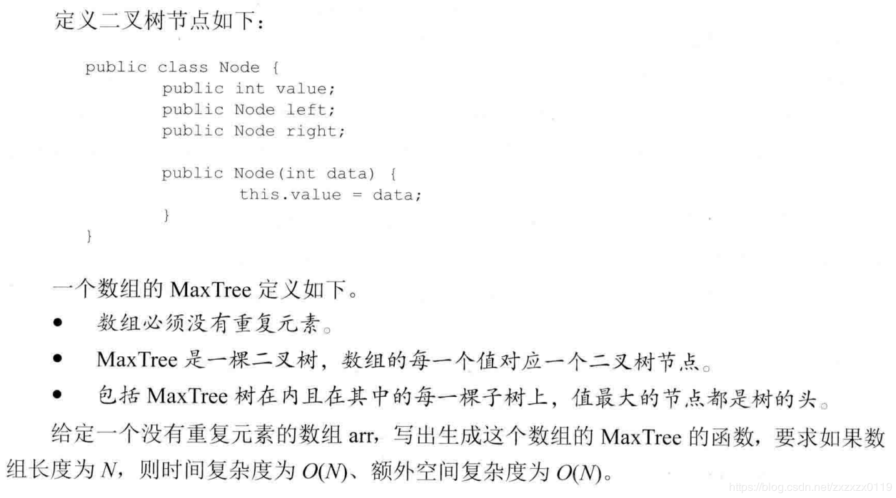
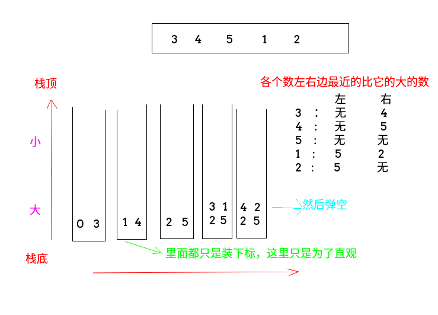
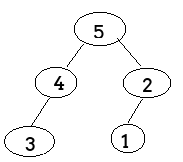

## 单调栈介绍以及构造数组的MaxTree问题
 - 单调栈介绍
 - 单调栈解决构造数组的MaxTree问题
 - 堆解决构造数组的MaxTree问题
 - 完整测试代码
***

#### 题目(构造数组的MaxTree问题)



### 单调栈介绍
单调栈最初解决的问题就是**寻找一个数组中 ，每一个数的左右两边离它最近的数**。

 - 遍历一个数组，如果**栈为空或者栈顶比当前数大(或者相等，相等的话就多个下标对应一个值)，就把当前数入栈**；
 - 如果栈顶比当前数小，那么就**处理这个栈顶，即这个栈顶右边第一个比它大的数就是当前数，左边第一个比它大的数就是在栈里面它的下面的那个数，也就是它出栈之后的栈顶**；
 -  当遍历完所有的数之后，栈中还有数，这时，逐个判断栈中的数，每一个数，**它的右边不存在比它大的**，如果这个数在栈里面它的下面还有数，它左边离他最近的大的数就是它下面的数；



### 单调栈解决构造数组的MaxTree问题
按照下面的方法来建树

 - 每一个树的**父节点是它左边第一个比它大的数和它右边第一个比它大的数中，比较<font color = red>小</font>的那个**；
 - 如果左边没有没有比它大的数，右边也没有。也就是说，这个数是整个数组的最大值，那么这个数是`MaxTree`的头结点；

按照大根堆和上面的方案放置如下：


相关证明:


```java
	//返回构造的树的头结点
    static Node getMaxTree(int[] arr) {
        Node[] nArr = new Node[arr.length];  //生成树的结构,数组中的每一个值都代表一个结点
        for (int i = 0; i < arr.length; i++) {
            nArr[i] = new Node(arr[i]);
        }

        Stack<Node> stack = new Stack<>();
        HashMap<Node, Node> lMap = new HashMap<>();
        HashMap<Node, Node> rMap = new HashMap<>();

        //找每一个数左边离它最近的大的
        for (int i = 0; i < nArr.length; i++) {
            Node cur = nArr[i];
            while (!stack.isEmpty() && stack.peek().value < cur.value) {
                popStackSetValue(stack, lMap);
            }
            stack.push(cur);
        }
        while (!stack.isEmpty()) {
            popStackSetValue(stack, lMap);
        }

        //找每一个数右边比它最近的大的
        for (int i = nArr.length - 1; i >= 0; i--) {
            Node cur = nArr[i];
            while (!stack.isEmpty() && stack.peek().value < cur.value) {
                popStackSetValue(stack, rMap);
            }
            stack.push(cur);
        }
        while (!stack.isEmpty()) {
            popStackSetValue(stack, rMap);
        }

        //开始构造这棵树
        Node head = null;
        for (int i = 0; i < nArr.length; i++) {
            Node cur = nArr[i];
            Node L = lMap.get(cur); //左边离cur最近的
            Node R = rMap.get(cur); //右边离cur最近的

            if (L == null && R == null) {
                head = cur;
            } else if (L == null) {
                if (R.left == null)R.left = cur;
                else R.right = cur;
            } else if (R == null) {
                if (L.left == null)L.left = cur;
                else L.right = cur;
            } else {
                Node minNode = L.value < R.value ? L : R;
                if (minNode.left == null) minNode.left = cur;
                else minNode.right = cur;
            }
        }
        return head;
    }

    //弹出来一个数，并且得到它左/右边边最近的比他大的数
    static void popStackSetValue(Stack<Node> stack, HashMap<Node, Node> map) {
        Node top = stack.pop();
        if (stack.isEmpty()) {
            map.put(top, null);
        } else {
            map.put(top, stack.peek());
        }
    }
```

### 堆解决构造数组的MaxTree问题
由于从上到下减小，所以正好是一个堆，可以使用堆来写: 

```java
    static Node getMaxTree2(int[] arr) {
        Node[] nArr = new Node[arr.length];
        for(int i = 0; i < arr.length; i++) nArr[i] = new Node(arr[i]);
        for (int i = 0; i < nArr.length; i++) {
            heapfiyInsert(nArr,i);
        }
        for(int i = 0; i < nArr.length; i++){
            if(2 * i + 1 < nArr.length){
                nArr[i].left = nArr[2*i + 1];
            }
            if(2 * i + 2 < nArr.length){
                nArr[i].right = nArr[2*i + 2];
            }
        }
        return nArr[0];
    }

    static void heapfiyInsert(Node[] nArr, int index) {
        while (nArr[index].value > nArr[(index - 1) / 2].value) {
            swap(nArr,index,(index-1)/2);
            index = (index-1)/2;
        }
    }

    static void swap(Node[] nArr,int a,int b){
        Node temp = nArr[a];
        nArr[a] = nArr[b];
        nArr[b] = temp;
    }
```
### 完整测试代码

```java
import java.util.HashMap;
import java.util.Stack;

/** 利用单调栈解决构造数组的 maxTree问题 */
public class MaxTree {

    static class Node {
        public int value;
        public Node left;
        public Node right;

        public Node(int value) {
            this.value = value;
        }
    }


    //返回构造的树的头结点
    static Node getMaxTree(int[] arr) {
        Node[] nArr = new Node[arr.length];  //生成树的结构,数组中的每一个值都代表一个结点
        for (int i = 0; i < arr.length; i++) {
            nArr[i] = new Node(arr[i]);
        }

        Stack<Node> stack = new Stack<>();
        HashMap<Node, Node> lMap = new HashMap<>();
        HashMap<Node, Node> rMap = new HashMap<>();

        //找每一个数左边离它最近的大的
        for (int i = 0; i < nArr.length; i++) {
            Node cur = nArr[i];
            while (!stack.isEmpty() && stack.peek().value < cur.value) {
                popStackSetValue(stack, lMap);
            }
            stack.push(cur);
        }
        while (!stack.isEmpty()) {
            popStackSetValue(stack, lMap);
        }

        //找每一个数右边比它最近的大的
        for (int i = nArr.length - 1; i >= 0; i--) {
            Node cur = nArr[i];
            while (!stack.isEmpty() && stack.peek().value < cur.value) {
                popStackSetValue(stack, rMap);
            }
            stack.push(cur);
        }
        while (!stack.isEmpty()) {
            popStackSetValue(stack, rMap);
        }

        //开始构造这棵树
        Node head = null;
        for (int i = 0; i < nArr.length; i++) {
            Node cur = nArr[i];
            Node L = lMap.get(cur); //左边离cur最近的
            Node R = rMap.get(cur); //右边离cur最近的

            if (L == null && R == null) {
                head = cur;
            } else if (L == null) {
                if (R.left == null) R.left = cur;
                else R.right = cur;
            } else if (R == null) {
                if (L.left == null) L.left = cur;
                else L.right = cur;
            } else {
                Node minNode = L.value < R.value ? L : R;
                if (minNode.left == null) minNode.left = cur;
                else minNode.right = cur;
            }
        }
        return head;
    }

    //弹出来一个数，并且得到它左/右边边最近的比他大的数
    static void popStackSetValue(Stack<Node> stack, HashMap<Node, Node> map) {
        Node top = stack.pop();
        if (stack.isEmpty()) {
            map.put(top, null);
        } else {
            map.put(top, stack.peek());
        }
    }

    static Node getMaxTree2(int[] arr) {
        Node[] nArr = new Node[arr.length];
        for (int i = 0; i < arr.length; i++) nArr[i] = new Node(arr[i]);
        for (int i = 0; i < nArr.length; i++) {
            heapfiyInsert(nArr, i);
        }
        for (int i = 0; i < nArr.length; i++) {
            if (2 * i + 1 < nArr.length) {
                nArr[i].left = nArr[2 * i + 1];
            }
            if (2 * i + 2 < nArr.length) {
                nArr[i].right = nArr[2 * i + 2];
            }
        }
        return nArr[0];
    }

    static void heapfiyInsert(Node[] nArr, int index) {
        while (nArr[index].value > nArr[(index - 1) / 2].value) {
            swap(nArr, index, (index - 1) / 2);
            index = (index - 1) / 2;
        }
    }


    static void swap(Node[] nArr, int a, int b) {
        Node temp = nArr[a];
        nArr[a] = nArr[b];
        nArr[b] = temp;
    }


    static void printTree(Node head, int height, String to, int len) {
        if (head == null) return;
        printTree(head.right, height + 1, "v", len);

        String val = to + head.value + to;  //两边指示的字符
        int lenV = val.length();
        int lenL = (len - lenV) / 2;   //左边的空格(分一半)
        int lenR = len - lenV - lenL;  // 右边的空格
        System.out.println(getSpace(len * height) + getSpace(lenL) + val + getSpace(lenR));

        printTree(head.left, height + 1, "^", len);
    }

    //获取指定的空格
    static String getSpace(int len) {
        StringBuffer str = new StringBuffer();
        for (int i = 0; i < len; i++) str.append(" ");
        return str.toString();
    }

    //测试
    public static void main(String[] args) {
        int[] uniqueArr = {3, 4, 5, 1, 2};
        Node head = getMaxTree(uniqueArr);
        printTree(head, 0, "H", 10);

        System.out.println("-----------------");
        head = getMaxTree2(uniqueArr);
        printTree(head, 0, "H", 10);
    }
}
```
效果


这里没有用二叉树遍历来验证，直接用的直观打印二叉树的方法，上面打印二叉树的程序可以看[**这篇博客**](https://blog.csdn.net/zxzxzx0119/article/details/81096554)。