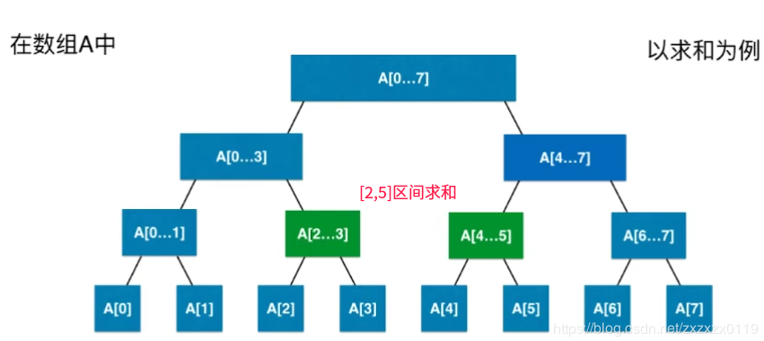
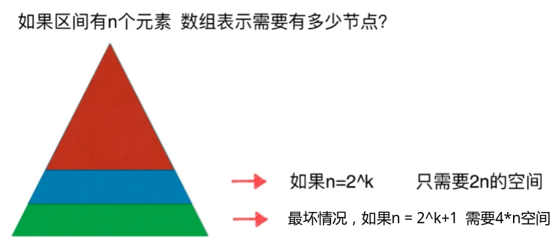
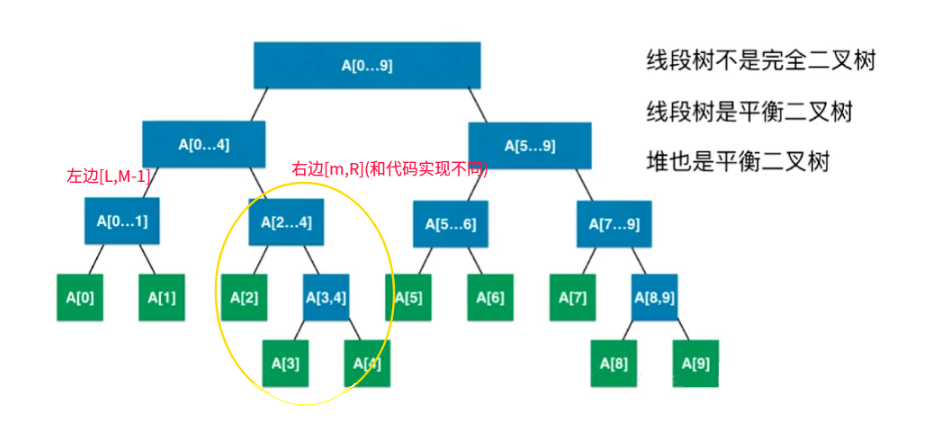
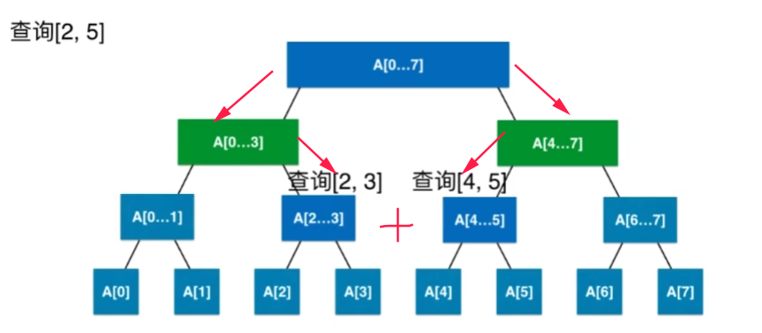
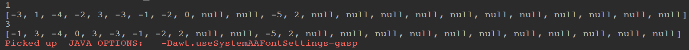

## 线段树总结以及LeetCode - 307. Range Sum Query - Mutable

 - [线段树介绍](#线段树介绍)
 - [线段树创建](#线段树创建)
 - [线段树查询](#线段树查询)
 - [线段树更新](#线段树更新)
 - [完整测试代码](#完整测试代码)
 - [LeetCode - 307. Range Sum Query - Mutable](#leetcode---307-range-sum-query---mutable)

***
### 线段树介绍
**线段树 ： 它在各个节点保存一条线段（数组中的一段子数组），主要用于高效解决连续区间的动态查询问题，由于二叉结构的特性，它基本能保持每个操作的复杂度为`O(logn)`。**

线段树解决的是类似下面频繁的对一段区间进行查询的问题: 


**线段树的每个节点表示一个区间，子节点则分别表示父节点的左右半区间，例如父亲的区间是`[L,R]`，那么(`m=(L+R)/2`)左儿子的区间是`[L,m]`，右儿子的区间是`[m+1,R]`。**

### 线段树创建

 - 线段树的创建是一个递归和类似二分的过程，首先我们将我们的整个区间(也就是整个数组)作为整颗线段的叶子结点；
 - 然后我们将区间分为两半，`[L,m] `和` [m+1,R]`，然后递归的去创建各自的线段树；
 - 边界条件是直到我们的区间中只有一个元素的时候，我们就可以使用这个这个元素建立出叶子结点；


<font color = red>那么用数组创建线段树需要多少结点呢? </font>

(1) 第一种情况： 我们的元素全部落在最后一层，这样的话我们大概只需要`2*n`(`n`是数组，也是最后一层的元素的个数)。


(2) 第二种情况: 我们的元素不全部是在最后一层，而是在倒数第二层也有:这样的话我们最多可能需要`4*n`的空间。


**上面的第二种情况就是我们的数组元素有在倒数第二层的情况: 例如下面的例子，当区间的划分的个数是奇数个的时候，势必左右两边的个数不同，下面的图是左边比右边的少一个，也就是左边区间是`[L,m-1]`，右边的区间是`[m,R]` (但是我在代码实现的时候，左边是`[L,m]`，右边是`[m+1,R]`，也就是左边多一个)。**



**我们保存树的结构是类似和堆一样的使用数组来保存，使用下标来对应左右孩子**: </font>

```java
public class SegmentTree<E> {

    //操作的方式:   求和 | 查询最大值 | 最小值
    private interface Merger<E>{
        E merge(E a,E b);
    }

    private E[] tree;
    private E[] data;
    private Merger<E> merger;
    
    public SegmentTree(E[] arr,Merger merger) {
        this.merger = merger;

        data = (E[]) new Object[arr.length];
        for(int i = 0; i < arr.length; i++) data[i] = arr[i];
        tree = (E[]) new Object[4 * arr.length];   //最多需要4 * n
        buildSegmentTree(0, 0, arr.length - 1);
    }
}
```
注意其中：

 - 接口`Merger`表示的处理方式，比如<font color = red>查询区间和，查询最大值，查询最小值</font>。
 - `data`用来保存用户传进来的`arr`值，是它的拷贝。
 - `tree`就是用数组来描述树的结构，注意大小为` 4 * arr.length`。
 - `buildSegmentTree()`函数是创建线段树。


然后就是对线段树的创建: </font>
要注意的是: 

 - 我创建的时候二分是左区间`[L,m]`，右区间`[m+1,R]`，当然也可以右区间多一个元素；

一个例子:

 

建树代码:

```java
	 // tree是树的结构(类似堆的存储)
    public void buildSegmentTree(int treeIndex,int L,int R){
        if( L == R){//叶子结点　　直接创建赋值
            tree[treeIndex] = data[L];
            return;
        }
        int treeL = treeIndex * 2 + 1; //左孩子对应的下标
        int treeR = treeIndex * 2 + 2; //右孩子下标
        int m = L + (R - L) / 2; //

        // 先把左右子树给我建好
        //[0,4] ---> [0,2](3), [2,4](2)
        buildSegmentTree(treeL,L,m);
        buildSegmentTree(treeR,m+1,R);

        //然后我再把左右子树合并(sum | max | min)
        tree[treeIndex] = merger.merge(tree[treeL],tree[treeR]);
    }
```

***
### 线段树查询

假设查询的区间为`[qL,qR]`分为三种情况: 

 - `qR <= m`，说明我们要去左边的区间查询；
 - `qL > m `，说明我们要去右边的区间查询；
 - 其他情况，说明左右两边都要查询，查完之后，记得合并；

```java
    //查询[qL,qR]的 sum | max | min
    public E query(int qL,int qR){
        if(qL < 0 || qL >= data.length || qR < 0 || qR >= data.length || qL > qR)return null;
        return query(0,0,data.length - 1,qL,qR);
    }

    // [treeIndex,L,R]表示的是结点为treeIndex的树的左右区间范围(arr的下标)
    private E query(int treeIndex,int L,int R,int qL,int qR){
        if(L == qL && R == qR){
            return tree[treeIndex];
        }
        int m = L + (R - L) / 2;

        int treeL = treeIndex * 2 + 1;
        int treeR = treeIndex * 2 + 2;

        if(qR <= m){ //和右区间没关系 ,直接去左边查找 [0,4]  qR <= 2 [0,2]之间查找
            return query(treeL,L,m,qL,qR);
        }else if(qL > m ) {//和左区间没有关系，直接去右边查找 [0,4] qL > 2  --> [3,4]
            return query(treeR,m+1,R,qL,qR);
        }else { //在两边都有，查询的结果  合并
            return merger.merge(query(treeL,L,m,qL,m), //注意是查询 [qL,m]
                    query(treeR,m+1,R,m+1,qR));   //查询[m+1,qR]
        }
    }
```
***
### 线段树更新
线段树的更新也是类似的，首先修改数组的值，然后递归的查找到叶子，然后沿途修改树中结点的值即可。
```java
    public void update(int index,E e){
        if(index < 0 || index >= data.length )return;
        data[index] = e; //首先修改data
        update(0,0,data.length-1,index,e);
    }

    private void update(int treeIndex,int L,int R,int index,E e){
        if(L == R){
            tree[treeIndex] = e;
            return;
        }
        int m = L + (R - L ) / 2;
        int treeL = 2 * treeIndex + 1;
        int treeR = 2 * treeIndex + 2;
        if(index <= m){ //左边
            update(treeL,L,m,index,e);
        }else {
            update(treeR,m+1,R,index,e);
        }
        tree[treeIndex] = merger.merge(tree[treeL],tree[treeR]); //更新完左右子树之后，自己受到影响，重新更新和
    }
```
***
### 完整测试代码

```java
import java.util.Arrays;

public class SegmentTree<E> {

    //操作的方式:   求和 | 查询最大值 | 最小值
    private interface Merger<E>{
        E merge(E a,E b);
    }

    private E[] tree;
    private E[] data;
    private Merger<E> merger;

    public SegmentTree(E[] arr,Merger merger) {
        this.merger = merger;

        data = (E[]) new Object[arr.length];
        for(int i = 0; i < arr.length; i++) data[i] = arr[i];
        tree = (E[]) new Object[4 * arr.length];   //最多需要4 * n
        buildSegmentTree(0, 0, arr.length - 1);
    }

    // tree是树的结构(类似堆的存储)
    public void buildSegmentTree(int treeIndex,int L,int R){
        if( L == R){
            tree[treeIndex] = data[L];
            return;
        }
        int treeL = treeIndex * 2 + 1;
        int treeR = treeIndex * 2 + 2;
        int m = L + (R - L) / 2;

        // 先把左右子树给我建好
        //[0,4] ---> [0,2](3), [2,4](2)
        buildSegmentTree(treeL,L,m);
        buildSegmentTree(treeR,m+1,R);

        //然后我再把左右子树合并(sum | max | min)
        tree[treeIndex] = merger.merge(tree[treeL],tree[treeR]);
    }

    //查询[qL,qR]的 sum | max | min
    public E query(int qL,int qR){
        if(qL < 0 || qL >= data.length || qR < 0 || qR >= data.length || qL > qR)return null;
        return query(0,0,data.length - 1,qL,qR);
    }

    // [treeIndex,L,R]表示的是结点为treeIndex的树的左右区间范围(arr的下标)
    private E query(int treeIndex,int L,int R,int qL,int qR){
        if(L == qL && R == qR){
            return tree[treeIndex];
        }
        int m = L + (R - L) / 2;

        int treeL = treeIndex * 2 + 1;
        int treeR = treeIndex * 2 + 2;

        if(qR <= m){ //和右区间没关系 ,直接去左边查找 [0,4]  qR <= 2 [0,2]之间查找
            return query(treeL,L,m,qL,qR);
        }else if(qL > m ) {//和左区间没有关系，直接去右边查找 [0,4] qL > 2  --> [3,4]
            return query(treeR,m+1,R,qL,qR);
        }else { //在两边都有，查询的结果  合并
            return merger.merge(query(treeL,L,m,qL,m), //注意是查询 [qL,m]
                    query(treeR,m+1,R,m+1,qR));   //查询[m+1,qR]
        }
    }

    public void update(int index,E e){
        if(index < 0 || index >= data.length )return;
        data[index] = e; //首先修改data
        update(0,0,data.length-1,index,e);
    }

    private void update(int treeIndex,int L,int R,int index,E e){
        if(L == R){
            tree[treeIndex] = e;
            return;
        }
        int m = L + (R - L ) / 2;
        int treeL = 2 * treeIndex + 1;
        int treeR = 2 * treeIndex + 2;
        if(index <= m){ //左边
            update(treeL,L,m,index,e);
        }else {
            update(treeR,m+1,R,index,e);
        }
        tree[treeIndex] = merger.merge(tree[treeL],tree[treeR]); //更新完左右子树之后，自己受到影响，重新更新和
    }

    public static void main(String[] args) {
        int[] nums = {-2, 0, 3, -5, 2, -1};
        Integer[] arr = new Integer[nums.length];
        for(int i = 0; i < nums.length; i++) arr[i] = nums[i];

        SegmentTree<Integer>segmentTree = new SegmentTree<Integer>(arr, new Merger<Integer>() {
            @Override
            public Integer merge(Integer a, Integer b) {
                return a + b;
            }
        });
        System.out.println(segmentTree.query(0, 2));
        System.out.println(Arrays.toString(segmentTree.tree));

        segmentTree.update(1,2);
        System.out.println(segmentTree.query(0, 2));

        System.out.println(Arrays.toString(segmentTree.tree));

    }
}
```
上面的例子输出：

***
### LeetCode - 307. Range Sum Query - Mutable
#### [题目链接](https://leetcode.com/problems/range-sum-query-mutable/description/)

> https://leetcode.com/problems/range-sum-query-mutable/description/

#### 题目

#### 解析
知道了上面的操作，这个题目完全就是上面的操作的结合: 

```java
class NumArray {
    private interface Merger<E> {
        E merge(E a, E b);
    }

    private class SegmentTree<E> {

        private E[] tree;
        private E[] data;
        private Merger<E> merger;

        public SegmentTree(E[] arr, Merger merger) {
            this.merger = merger;

            data = (E[]) new Object[arr.length];
            for (int i = 0; i < arr.length; i++) data[i] = arr[i];
            tree = (E[]) new Object[4 * arr.length];   //最多需要4 * n
            buildSegmentTree(0, 0, arr.length - 1);
        }

        public void buildSegmentTree(int treeIndex, int L, int R) {
            if (L == R) {
                tree[treeIndex] = data[L];
                return;
            }
            int treeL = treeIndex * 2 + 1;
            int treeR = treeIndex * 2 + 2;
            int m = L + (R - L) / 2;

            buildSegmentTree(treeL, L, m);
            buildSegmentTree(treeR, m + 1, R);

            tree[treeIndex] = merger.merge(tree[treeL], tree[treeR]);
        }


        public E query(int qL, int qR) {
            if (qL < 0 || qL >= data.length || qR < 0 || qR >= data.length || qL > qR) return null;
            return query(0, 0, data.length - 1, qL, qR);
        }

        private E query(int treeIndex, int L, int R, int qL, int qR) {
            if (L == qL && R == qR) {
                return tree[treeIndex];
            }

            int m = L + (R - L) / 2;
            int treeL = treeIndex * 2 + 1;
            int treeR = treeIndex * 2 + 2;

            if (qR <= m) { //和右区间没关系 ,直接去左边查找 [0,4]  qR <= 2 [0,2]之间查找
                return query(treeL, L, m, qL, qR);
            } else if (qL > m) {//和左区间没有关系，直接去右边查找 [0,4] qL > 2  --> [3,4]
                return query(treeR, m + 1, R, qL, qR);
            } else { //在两边都有，查询的结果  合并
                return merger.merge(query(treeL, L, m, qL, m), //注意是查询 [qL,m]
                        query(treeR, m + 1, R, m + 1, qR));   //查询[m+1,qR]
            }
        }

        public void update(int index, E e) {
            if (index < 0 || index >= data.length) return;
            data[index] = e; //首先修改data
            update(0, 0, data.length - 1, index, e);
        }

        private void update(int treeIndex, int L, int R, int index, E e) {
            if (L == R) {
                tree[treeIndex] = e;
                return;
            }
            int m = L + (R - L) / 2;
            int treeL = 2 * treeIndex + 1;
            int treeR = 2 * treeIndex + 2;
            if (index <= m) { //左边
                update(treeL, L, m, index, e);
            } else {
                update(treeR, m + 1, R, index, e);
            }
            tree[treeIndex] = merger.merge(tree[treeL], tree[treeR]); //更新完左右子树之后，自己受到影响，重新更新和
        }
    }

    private SegmentTree<Integer> segTree;

    public NumArray(int[] nums) {
        if (nums == null || nums.length == 0) return;
        Integer[] arr = new Integer[nums.length];
        for (int i = 0; i < nums.length; i++) arr[i] = nums[i];
        segTree = new SegmentTree<Integer>(arr, new Merger<Integer>() {
            @Override
            public Integer merge(Integer a, Integer b) {
                return a + b;
            }
        });
    }

    public void update(int i, int val) {
        if (segTree == null) return;
        segTree.update(i, val);
    }

    public int sumRange(int i, int j) {
        return segTree.query(i, j);
    }

}
```

将上面的代码改的简单一点(不用泛型):

```java
class NumArray {

    class SegTree {

        int[] tree;
        int[] data;

        public SegTree(int[] arr) {
            data = new int[arr.length];
            for (int i = 0; i < arr.length; i++) data[i] = arr[i];
            tree = new int[4 * arr.length];   //最多需要4 * n
            buildTree(0, 0, arr.length - 1);
        } 
  
        public void buildTree(int treeIndex, int start, int end) {
            if (start == end) {
                tree[treeIndex] = data[start];
                return; 
            } 
            int treeLid = treeIndex * 2 + 1; 
            int treeRid = treeIndex * 2 + 2;  
            int m = start + (end - start) / 2;
            buildTree(treeLid, start, m);
            buildTree(treeRid, m + 1, end);
            tree[treeIndex] = tree[treeLid] + tree[treeRid]; //区间求和
        }

        public int query(int qL, int qR) {
            if (qL < 0 || qL >= data.length || qR < 0 || qR >= data.length || qL > qR) return -1;
            return query(0, 0, data.length - 1, qL, qR);
        } 
 
        private int query(int treeIndex, int start, int end, int qL, int qR) {
            if (start == qL && end == qR) {
                return tree[treeIndex];
            }   
            int mid = start + (end - start) / 2;
            int treeLid = treeIndex * 2 + 1;
            int treeRid = treeIndex * 2 + 2; 

            if (qR <= mid) { //和右区间没关系 ,直接去左边查找 [0,4]  qR <= 2 [0,2]之间查找
                return query(treeLid, start, mid, qL, qR);
            } else if (qL > mid) {//和左区间没有关系，直接去右边查找 [0,4] qL > 2  --> [3,4]
                return query(treeRid, mid + 1, end, qL, qR);
            } else {         //在两边都有，查询的结果  合并
                return query(treeLid, start, mid, qL, mid) + //注意是查询 [qL,m]
                        query(treeRid, mid + 1, end, mid + 1, qR);   //查询[m+1,qR]
            }
        }

        public void update(int index, int val) {
            data[index] = val; //首先修改data
            update(0, 0, data.length - 1, index, val);
        }
  
        private void update(int treeIndex, int start, int end, int index, int val) {
            if (start == end) {
                tree[treeIndex] = val; // 最后更新
                return; 
            } 
            int m = start + (end - start) / 2; 
            int treeLid = 2 * treeIndex + 1; 
            int treeRid = 2 * treeIndex + 2;
            if (index <= m) { //左边
                update(treeLid, start, m, index, val);
            } else {
                update(treeRid, m + 1, end, index, val);
            }
            tree[treeIndex] = tree[treeLid] + tree[treeRid]; //更新完左右子树之后，自己受到影响，重新更新和
        }
    }

    private SegTree segTree;

    public NumArray(int[] nums) {
        if (nums == null || nums.length == 0) return;
        segTree = new SegTree(nums);
    }

    public void update(int i, int val) {
        segTree.update(i, val);
    }

    public int sumRange(int i, int j) {
        return segTree.query(i, j);
    }
}
```

再附上后来写的用树的引用的代码:

```java
class SegNode{
    int start; // 表示的区间的左端点
    int end;   // 表示区间的右端点 , 当start == end的时候就只有一个元素
    int sum;
    SegNode left;
    SegNode right;

    public SegNode(int start, int end, int sum, SegNode left, SegNode right) {
        this.start = start;
        this.end = end;
        this.sum = sum;
        this.left = left;
        this.right = right;
    }
}

class NumArray {

    SegNode root;
    int[] arr;

    private SegNode buildTree(int s, int e){
        if(s == e)
            return new SegNode(s, e, arr[s], null, null);
        int mid = s + (e - s) / 2;
        SegNode L = buildTree(s, mid);
        SegNode R = buildTree(mid+1, e);
        return new SegNode(s, e, L.sum + R.sum, L, R);
    }

    private void update(SegNode node, int i, int val){
        if(node.start == node.end && node.start == i){
            node.sum = val;
            return;
        }
        int mid = node.start + (node.end - node.start) / 2;
        if(i <= mid)
            update(node.left, i, val);
        else
            update(node.right, i, val);
        node.sum = node.left.sum + node.right.sum; // 记得下面的更新完之后，更新当前的和
    }

    private int query(SegNode node, int i, int j){
        if(node.start == i && node.end == j)
            return node.sum;
        int mid = node.start + (node.end - node.start) / 2;
        if(j <= mid){ // 区间完全在左边
            return query(node.left, i, j);
        }else if(i > mid) { // 区间完全在右边
            return query(node.right, i, j);
        }else {
            return query(node.left, i, mid) + query(node.right, mid+1, j);
        }
    }

    public NumArray(int[] nums) {
        arr = new int[nums.length];
        for(int i = 0; i < nums.length; i++) arr[i] = nums[i];
        if(nums.length != 0) 
            root = buildTree(0, nums.length-1);
    }

    public void update(int i, int val) {
        arr[i] = val;
        update(root, i, val);
    }

    public int sumRange(int i, int j) {
        return query(root, i, j);
    }
}
```

