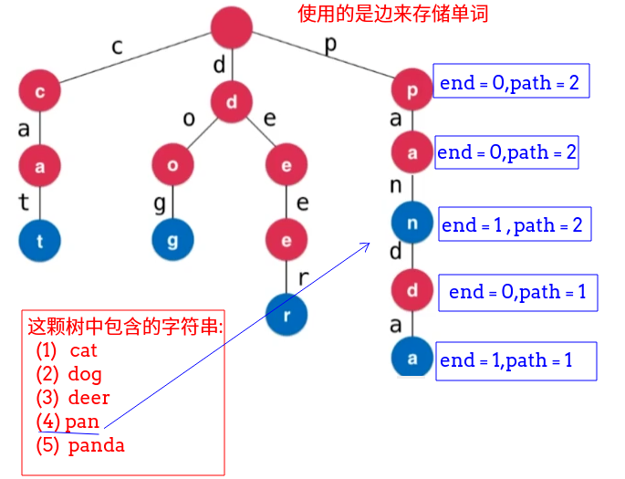
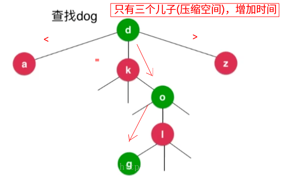

## LeetCode - 208. Implement Trie (Prefix Tree)以及实现字典树(前缀树)
 - 基础知识和结构
 - 字符串的插入
 -  统计某个字符串的数量 || 查询是否有某个字符串
 - 统计以某个字符串为前缀的字符串数量  ||  是否有某个前缀
 - 字符串的删除
 - 完整测试代码
 - 题目解析　
 - 使用Map来保存next
 - 更多字典树

***
### 基础知识和结构
`Map`和`Trie`的差别，关于映射集合等可以看[**这篇博客**](https://blog.csdn.net/zxzxzx0119/article/details/79891408)。


 -  <font color = red> **字典树也叫做前缀树，可以存储一组元素(一般是字符串)，可以快速的查找某个字符串在树中的个数以及寻找以某个字符串为前缀的字符串的个数，先看下图为一些字符串插入到字典树中的情形。**

字典树的存储结构: 

 - **首先字母是画在树的边上的；**
 - **而结点中的`path`代表的是经过这个结点的字母的次数；**
 - **为了方便前缀的计算，而`end`表示的是以这个结点结尾的字符串的数量，方便统计树中某个字符串的数量。**
 - **而`next`表示的是多个儿子结点，因为可以有大小写字母，所以我初始化为`52`(如果是小写字母的就为`26`)(也可以使用`Map`来存储)。**

```java
public class Trie {

    private class Node{
        public int path;
        public int end;
        public Node[] next;//使用整数表示字符　c - 'a'

        public Node() {
            path = 0;
            end = 0;
            next = new Node[26];
        }
    }

    private Node root;

    public Trie() {
        root = new Node();
    }
}
```

例如: 下面的这颗字典树: 




再如:  **树中有`"abc","ab","ab","abd","bc","bd","cd","cde","ce"`总共`9`个字符串。如下的结构:** 


***
### 字符串的插入

 - 遍历每个字符，算出每个`字符-'a'`的值，表示的是在结点儿子中的位置；
 - 一开始结点的儿子都是`null`(`nexts`数组结构)，如果对应的位置为`null`，创建即可，然后走向下一个结点，并维护`path`。
 - 记得遍历完之后，最后一个结点的`end++`。

```java
    //插入一个字符
    public void insert(String word){
        if(word == null)
            return ;
        Node cur = root;
        int index = 0;
        for(int i = 0; i < word.length(); i++){
            index = word.charAt(i) - 'a';
            if(cur.next[index] == null){ //没有就新建
                cur.next[index] = new Node();
            }
            cur = cur.next[index];
            cur.path++; //经过这里
        }
        cur.end++;//以这个结尾
    }
```
***
### 统计某个字符串的数量 || 查询是否有某个字符串

 - 这个很简单，怎么插入的就怎么查找，如果查找到某个结点(数组还没有遍历完)，就找到`nexts[index]`为空，直接返回`0`就可以了；
 - 否则遍历完之后，返回结点的`end`的值。

```java
	//统计某个字符串的数量
    public int count(String word){
        if(word == null)
            return 0;
        Node cur = root;
        int index = 0;
        for(int i = 0; i < word.length(); i++){
            index = word.charAt(i) - 'a';
            if(cur.next[index] == null)
                return 0;
            cur = cur.next[index];
        }
        return cur.end;
    }
	//查询是否有某个字符串
    public boolean search(String word){
        return count(word) > 0;
    }
```
***
### 统计以某个字符串为前缀的字符串数量  ||  是否有某个前缀

 - 这个和上面都是一个套路，遍历完之后，返回结点的`path`的值。

```java
	public int prefixNum(String prefix){
        if(prefix == null)
            return 0;
        Node cur = root;
        int index = 0;
        for(int i = 0; i < prefix.length(); i++){
            index = prefix.charAt(i) - 'a';
            if(cur.next[index] == null)
                return 0;
            cur = cur.next[index];
        }
        return cur.path; //返回这个经过的　　也就是以这个为前驱的
    }
	//是否有某个前缀(以某个字符串开头)
    public boolean startsWith(String prefix){
        return prefixNum(prefix) > 0;
    }
```
***
### 字符串的删除
我们删除某个字符串的时候，不能直接删除，要看某个结点的`path`的值：

 - **如果`path`是`1`，以后的所有结点都可以删除了(释放后面所有结点)；**


 - **否则只是将结点的`path--`就可以了。**


```java
  public void remove(String word){
        if(word == null)
            return;
        if(!search(word)) //不包含这个字符串
            return;
        Node cur = root;
        int index = 0;
        for(int i = 0; i < word.length(); i++){
            index = word.charAt(i) - 'a';
            if(--cur.next[index].path == 0){
                cur.next[index] = null; //释放掉下面的这棵树
                return ;
            }
            cur = cur.next[index];
        }
        cur.end--; //最后这个字符串也要--
    }

```
***
### 完整测试代码
上面图形的例子：
```java
public class Trie {

    private class Node{
        public int path;
        public int end;
        public Node[] next;//使用整数表示字符　c - 'a'

        public Node() {
            path = 0;
            end = 0;
            next = new Node[26];
        }
    }

    private Node root;

    public Trie() {
        root = new Node();
    }

    //插入一个字符
    public void insert(String word){
        if(word == null)
            return ;
        Node cur = root;
        int index = 0;
        for(int i = 0; i < word.length(); i++){
            index = word.charAt(i) - 'a';
            if(cur.next[index] == null){ //没有就新建
                cur.next[index] = new Node();
            }
            cur = cur.next[index];
            cur.path++; //经过这里
        }
        cur.end++;
    }

    //统计某个字符串的数量
    public int count(String word){
        if(word == null)
            return 0;
        Node cur = root;
        int index = 0;
        for(int i = 0; i < word.length(); i++){
            index = word.charAt(i) - 'a';
            if(cur.next[index] == null)
                return 0;
            cur = cur.next[index];
        }
        return cur.end;
    }

    public boolean search(String word){
        return count(word) > 0;
    }

    public int prefixNum(String prefix){
        if(prefix == null)
            return 0;
        Node cur = root;
        int index = 0;
        for(int i = 0; i < prefix.length(); i++){
            index = prefix.charAt(i) - 'a';
            if(cur.next[index] == null)
                return 0;
            cur = cur.next[index];
        }
        return cur.path; //返回这个经过的　　也就是以这个为前驱的
    }

    public boolean startsWith(String prefix){
        return prefixNum(prefix) > 0;
    }

    public void remove(String word){
        if(word == null)
            return;
        if(!search(word)) //不包含这个字符串
            return;
        Node cur = root;
        int index = 0;
        for(int i = 0; i < word.length(); i++){
            index = word.charAt(i) - 'a';
            if(--cur.next[index].path == 0){
                cur.next[index] = null; //释放掉下面的这棵树
                return ;
            }
            cur = cur.next[index];
        }
        cur.end--; //最后这个字符串也要--
    }


    public static void main(String[] args) {
        Trie trie = new Trie();

        trie.insert("abc");
        trie.insert("ab");
        trie.insert("ab");
        trie.insert("abd");
        trie.insert("bc");
        trie.insert("bd");
        trie.insert("cd");
        trie.insert("cde");
        trie.insert("ce");

        System.out.println(trie.count("ab"));
        trie.remove("ab");
        System.out.println(trie.count("ab"));

        System.out.println(trie.count("abd"));
        trie.remove("ab");
        System.out.println(trie.count("ab"));
        System.out.println(trie.count("abd"));

        trie.remove("abd");
        System.out.println(trie.count("abd"));
    }
}

```
测试结果输出: 

```c
2
1
1
0
1
0
```

***
### 题目解析
#### [题目链接](https://leetcode.com/problems/implement-trie-prefix-tree/description/)

> https://leetcode.com/problems/implement-trie-prefix-tree/description/

#### 题目


#### 解析
运用上面的操作完全能解决这个问题：

```java
class Trie {
    private class Node{
        public int path;
        public int end;
        public Node[] next;//使用整数表示字符　c - 'a'

        public Node() {
            path = 0;
            end = 0;
            next = new Node[26];
        }
    }

    private Node root;

    public Trie() {
        root = new Node();
    }

    //插入一个字符
    public void insert(String word){
        if(word == null)
            return ;
        Node cur = root;
        int index = 0;
        for(int i = 0; i < word.length(); i++){
            index = word.charAt(i) - 'a';
            if(cur.next[index] == null){ //没有就新建
                cur.next[index] = new Node();
            }
            cur = cur.next[index];
            cur.path++; //经过这里
        }
        cur.end++;
    }

    //统计某个字符串的数量
    public int count(String word){
        if(word == null)
            return 0;
        Node cur = root;
        int index = 0;
        for(int i = 0; i < word.length(); i++){
            index = word.charAt(i) - 'a';
            if(cur.next[index] == null)
                return 0;
            cur = cur.next[index];
        }
        return cur.end;
    }

    public boolean search(String word){
        return count(word) > 0;
    }

    public int prefixNum(String prefix){
        if(prefix == null)
            return 0;
        Node cur = root;
        int index = 0;
        for(int i = 0; i < prefix.length(); i++){
            index = prefix.charAt(i) - 'a';
            if(cur.next[index] == null)
                return 0;
            cur = cur.next[index];
        }
        return cur.path; //返回这个经过的　　也就是以这个为前驱的
    }

    public boolean startsWith(String prefix){
        return prefixNum(prefix) > 0;
    }
}
```
***
### 使用Map来保存next
还有一种写法就是 

 - 使用`Map`来保存`next`数组，这样不只可以存`26`或者`52`个孩子: 

还是上面那个题目代码: 
```java
   private class Node{
        public int path;
        public int end;
        public HashMap<Character,Node>next;

        public Node() {
            path = 0;
            end = 0;
            next = new HashMap<>();
        }
    }

    private Node root;

    public Trie() {
        root = new Node();
    }

    //插入一个字符
    public void insert(String word){
        if(word == null)
            return ;
        Node cur = root;
        char c;
        for(int i = 0; i < word.length(); i++){
            c = word.charAt(i);
            if(cur.next.get(c) == null){ //没有就新建
                cur.next.put(c,new Node());
            }
            cur = cur.next.get(c);
            cur.path++; //经过这里
        }
        cur.end++;
    }

    //统计某个字符串的数量
    public int count(String word){
        if(word == null)
            return 0;
        Node cur = root;
        char c;
        for(int i = 0; i < word.length(); i++){
            c = word.charAt(i);
            if(cur.next.get(c) == null)
                return 0;
            cur = cur.next.get(c);
        }
        return cur.end;
    }

    public boolean search(String word){
        return count(word) > 0;
    }

    public int prefixNum(String prefix){
        if(prefix == null)
            return 0;
        Node cur = root;
        char c;
        for(int i = 0; i < prefix.length(); i++){
            c = prefix.charAt(i);
            if(cur.next.get(c) == null)
                return 0;
            cur = cur.next.get(c);
        }
        return cur.path; //返回这个经过的　　也就是以这个为前驱的
    }

    public boolean startsWith(String prefix){
        return prefixNum(prefix) > 0;
    }

    public void remove(String word){
        if(word == null)
            return;
        if(!search(word)) //不包含这个字符串
            return;
        Node cur = root;
        char c;
        for(int i = 0; i < word.length(); i++){
            c = word.charAt(i);
            if(--cur.next.get(c).path == 0){
                cur.next.remove(c);
                return ;
            }
            cur = cur.next.get(c);
        }
        cur.end--; //最后这个字符串也要--
    }
```

***
### 更多字典树

 - **压缩字典树；**


 - **三分搜索树；**

