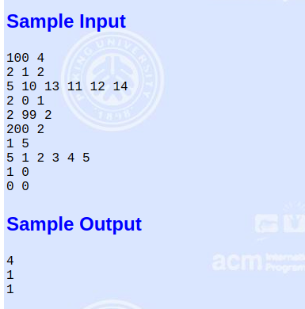
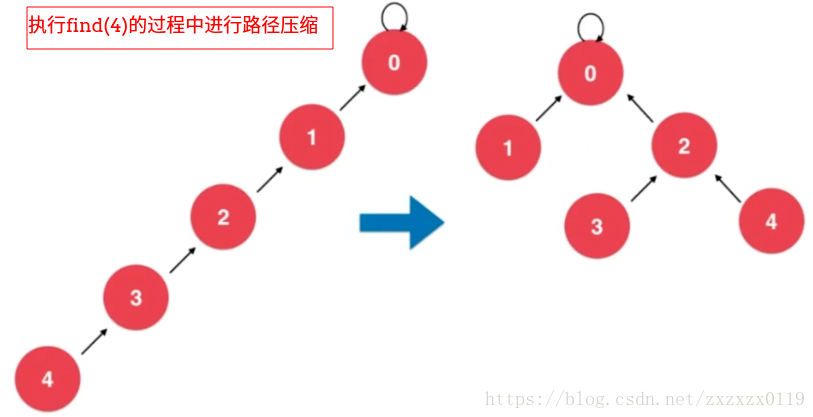
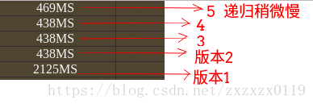

## POJ - 1611. The Suspects以及并查集总结

 - 题目
 - 基本并查集
 - Size优化并查集
 - Rank优化并查集
 - 路径压缩优化一(最好)
 - 路径压缩优化二(递归)

#### [题目链接](http://poj.org/problem?id=1611)

> http://poj.org/problem?id=1611

#### 题意

 就是告诉你`0`号同学被感染了，他还参加了一些社团，给出一些社团以及里面的人，问总共多少人感染。输入给出`n`表示人数(标号为`0~n-1`)，`m`表示社团数目，接下来`m`行每行第一个数`k` ，表示该社团有`k`人，然后是`k`个人的编号。要你输出有多少个人感染了病毒。



### 解析
题目本身并不难: 

 - 把每个社团加入到各自的集合中，然后不断的合并相同的集合，最后看哪些和`0`号同学在同一个集合中，使用一个变量记录和`0`号同学在同一个集合中的人数即可；
 - 这里主要是总结并查集几种优化的方式；


### 基本并查集
基本并查集，记录一个每个结点p的父亲结点是`parent[p]`，然后是一个不断从孩子找父亲的过程: 

 - `find()`操作，` while(p != parent[p])p = parent[p]`，一直往上找根的过程；
 - `union()`操作，就是找到两个结点的根节点，然后将其中一个结点的根节点挂到另一个结点的根节点即可；

<font color =red>例如: `union()`操作合并6和3所在的集合:  

```java
import java.io.BufferedInputStream;
import java.util.Scanner;

public class Main {

    static class UnionSet {
        private int[] parent;

        public UnionSet(int size) {
            parent = new int[size];
            /** 初始化, 每一个parent[i]指向自己, 表示每一个元素自己自成一个集合 */
            for (int i = 0; i < size; i++)
                parent[i] = i;
        }

        public int size() {
            return parent.length;
        }

        // 查找过程, 查找元素p所对应的集合编号
        private int find(int p) {
            if (p < 0 || p >= parent.length)
                throw new IllegalArgumentException("p is out of bound.");
            while (p != parent[p])
                p = parent[p];
            return p;
        }

        public boolean isSameSet(Integer a, Integer b) {
            return find(b) == find(a);
        }

        // 合并元素p和元素q所属的集合
        public void union(int a, int b) {
            int aRoot = find(a);
            int bRoot = find(b);
            if (aRoot == bRoot)
                return;
            parent[aRoot] = bRoot;
        }
    }


    public static void main(String[] args) {
        Scanner cin = new Scanner(new BufferedInputStream(System.in));
        while (cin.hasNext()) {
            int n = cin.nextInt();
            int m = cin.nextInt();
            if (n == 0 && m == 0)
                break;
            UnionSet unionSet = new UnionSet(n);

            for (int i = 0; i < m; i++) {
                int k = cin.nextInt();
                int root = cin.nextInt();
                for (int j = 0; j < k - 1; j++) { //k-1个
                    int x = cin.nextInt();
                    unionSet.union(root, x); //这个集合的根
                }
            }
            int sum = 1; //0号已经被感染
            for (int i = 1; i < n; i++) {
                if (unionSet.isSameSet(0, i)) {
                    sum++;
                }
            }
            System.out.println(sum);
        }
    }
}
```
***
### `Size`优化并查集

 - 在`union()`操作中，有一种情况会使得我们的集合变得深度很深，这对查询来说是会降低效率的；
 - **例如下面的`union`，合并`3`和`9`所在的集合，如果我们将`3`的根`8`挂在`9`下面，会使得高度变成`4`：(不好的）**；


<font color =red>于是，我们的解决办法是: </font>

 - <font color =red>每一个集合记录一个`size`，在`union()`操作的时候，我们将`size`小的挂到`size`大的下面，这样会使得深度稍微小一点； </font>
 - <font color =red>操作完之后记得维护被挂的那个集合的`size()`；


```java
    static class UnionSet{
        private int[] parent;
        private int[] sz;     // sz[i]表示以i为根的集合中元素个数

        public UnionSet(int size) {
            parent = new int[size];
            sz = new int[size];
            /** 初始化, 每一个parent[i]指向自己, 表示每一个元素自己自成一个集合 */
            for( int i = 0 ; i < size ; i ++ ) {
                parent[i] = i;
                sz[i] = 1;
            }
        }

        public int size(){
            return parent.length;
        }

        private int find(int p){
            if(p < 0 || p >= parent.length)
                throw new IllegalArgumentException("p is out of bound.");
            while(p != parent[p])
                p = parent[p];
            return p;
        }

        public boolean isSameSet(Integer a, Integer b){
            return find(b) == find(a);
        }

        public void union(int a,int b){
            int aRoot = find(a);
            int bRoot = find(b);
            if(aRoot == bRoot)
                return;

            /**
             * 根据两个元素所在树的元素个数不同判断合并方向
             * 将元素个数少的集合合并到元素个数多的集合上
             */
            if(sz[aRoot] < sz[bRoot]){
                parent[aRoot] = bRoot;
                sz[bRoot] += sz[aRoot];
            }else {
                parent[bRoot] = aRoot;
                sz[aRoot] += sz[bRoot];
            }
        }
    }
```
***
### `Rank`优化并查集

* <font color= red>基于`rank`的优化，其中`rank[i]`表示的是根节点为`i`的树的高度；

发现问题: 

 - <font color =red>虽然上面的`size`优化已经很不错，但是如果出现下面的情况，例如合并`0`和`3`所在的集合，如下，这样会使得高度变成`4`，而如果反着合并就只需要变成`3`；
 - 于是我们需要记录的不是`size`，而是记录一个高度`rank`即可；


<font color =red>下面是改造的做法，我们将高度小的挂在高度大的下面，这样使得深度更低；

```java
    static class UnionSet{
        private int[] parent;
        private int[] rank;   // rank[i]表示以i为根的集合所表示的树的层数

        public UnionSet(int size) {
            parent = new int[size];
            rank = new int[size];
            for( int i = 0 ; i < size ; i ++ ) {
                parent[i] = i;
                rank[i] = 1;
            }
        }

        public int size(){
            return parent.length;
        }

        private int find(int p){
            if(p < 0 || p >= parent.length)
                throw new IllegalArgumentException("p is out of bound.");
            while(p != parent[p])
                p = parent[p];
            return p;
        }

        public boolean isSameSet(Integer a, Integer b){
            return find(b) == find(a);
        }

        public void union(int a,int b){
            int aRoot = find(a);
            int bRoot = find(b);
            if(aRoot == bRoot)
                return;

            /**
             *根据两个元素所在树的rank不同判断合并方向
             *将rank低的集合合并到rank高的集合上
             */
            if(rank[aRoot] < rank[bRoot])
                parent[aRoot] = bRoot; // a 挂在 b 下
            else if(rank[bRoot] < rank[aRoot])
                parent[bRoot] = aRoot;
            else {  //rank[aRoot] == rank[bRoot]
                parent[aRoot] = bRoot; // a 挂在　b 下
                rank[bRoot]++; //此时维护rank的值
            }

        }
    }

```
***
### 路径压缩优化一(最好)
并查集另一个优化就是<font color =red>路径压缩: </font>

 - 例如下面的三个集合是等价的，但是查询的效率确实逐渐的增加的，第一个查询效率最低，第三个查询效率最高；
 - 我们需要做的就是在find()的时候，沿途将查找的孩子结点改变他们的父亲parent达到路径压缩的目的；


<font color =red>首先来看改造成第二个版本: (使用非递归   )

 - <font color =red>这个优化就是对于沿途的结点，我们从底到上，依次更改他们的父亲结点为他们的父亲结点的父亲结点`(parent[p] = parent[parent[p]] )`；
 - 例如我们查询`find(4)`，第一步，我们先将`parent[4] = 2`，（`2`就是`4`的父亲(`3`)的父亲）；


 - 继续往上，把`2`的父亲结点改为`2`的父亲结点的父亲结点，也就是`0`结点，此时我们的树结构变成了下面的样子；


**于是我们就完成了从第一种情况到第二种情况的优化:** 



 - 代码如下： 在代码中的更改只有上一个版本中find()函数中增加了一行代码: parent[p] = parent[parent[p]]；
```java
    static class UnionSet{
        private int[] parent;

        /**
         *  在后续的代码中, 我们并不会维护rank的语意, 也就是rank的值在路径压缩的过程中, 有可能不在是树的层数值
         *  这也是我们的rank不叫height或者depth的原因, 他只是作为比较的一个标准
         */
        private int[] rank;

        public UnionSet(int size) {
            parent = new int[size];
            rank = new int[size];
            for( int i = 0 ; i < size ; i ++ ) {
                parent[i] = i;
                rank[i] = 1;
            }
        }

        public int size(){
            return parent.length;
        }

        private int find(int p){
            if(p < 0 || p >= parent.length)
                throw new IllegalArgumentException("p is out of bound.");
            while(p != parent[p]) {
                /** p这个结点的父亲设置为它父亲的父亲   ,  相对于第三个版本只增加了这一行代码 */
                parent[p] = parent[parent[p]];
                p = parent[p];
            }
            return p;
        }

        public boolean isSameSet(Integer a, Integer b){
            return find(b) == find(a);
        }

        public void union(int a,int b){
            int aRoot = find(a);
            int bRoot = find(b);
            if(aRoot == bRoot)
                return;

            if(rank[aRoot] < rank[bRoot])
                parent[aRoot] = bRoot;
            else if(rank[bRoot] < rank[aRoot])
                parent[bRoot] = aRoot; 
            else {
                parent[aRoot] = bRoot;
                rank[bRoot]++;
            }

        }
    }
```
***
### 路径压缩优化二(递归)
<font color = red>继续完成从第一种情况到第三种情况的优化，其实核心代码只有几行: 

```java
    private int find(int p){
        if(p != parent[p])
            parent[p] = find(parent[p]);
        return parent[p];
    }
```

 - **我们宏观的就是将`parent[p]`执行了最终的那个根节点，并返回了；**


```java
    static class UnionSet{
        private int[] parent;
        private int[] rank;

        public UnionSet(int size) {
            parent = new int[size];
            rank = new int[size];
            for( int i = 0 ; i < size ; i ++ ) {
                parent[i] = i;
                rank[i] = 1;
            }
        }

        public int size(){
            return parent.length;
        }

        private int find(int p){
            if(p < 0 || p >= parent.length)
                throw new IllegalArgumentException("p is out of bound.");

            /**和上一种路径压缩不同的是　这里使用的是递归　会将所有的孩子都直接挂在根下面*/
            if(p != parent[p])
                parent[p] = find(parent[p]);
            return parent[p];
        }

        public boolean isSameSet(Integer a, Integer b){
            return find(b) == find(a);
        }

        public void union(int a,int b){
            int aRoot = find(a);
            int bRoot = find(b);
            if(aRoot == bRoot)
                return;

            if(rank[aRoot] < rank[bRoot])
                parent[aRoot] = bRoot;
            else if(rank[bRoot] < rank[aRoot])
                parent[bRoot] = aRoot;
            else {
                parent[aRoot] = bRoot;
                rank[bRoot]++;
            }

        }
    }
```
***
POJ上测试效率对比，从下到上，从版本一到版本五的时间: 



