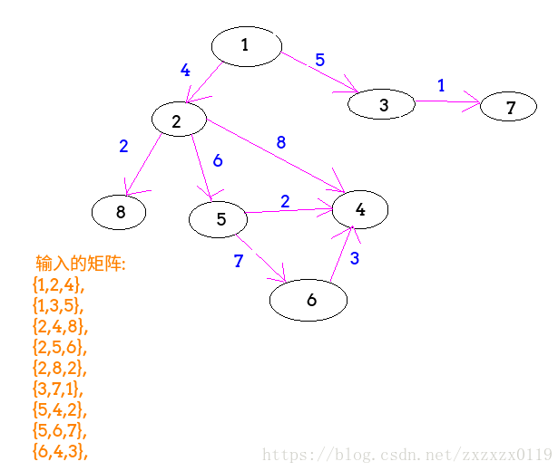
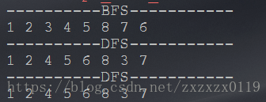
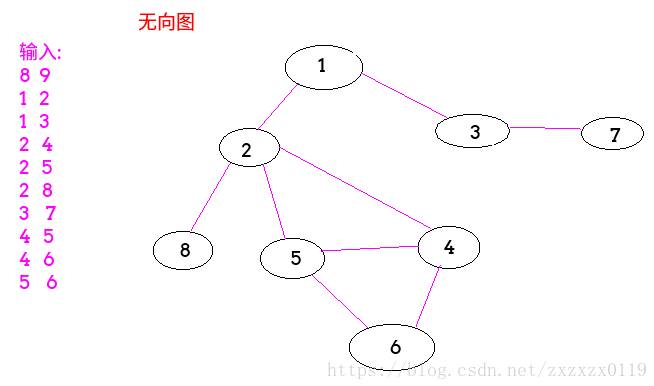
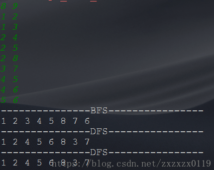

## 图的基本结构以及BFS和DFS(递归和非递归)

 - 完整的图结构
 - 有向图建图以及BFS和DFS
 - 无向图建图以及BFS和DFS
 - DFS和BFS常见应用

***
### 完整的图结构
 - 图的每个顶点包括顶点的值、入度、出度、和**它相邻的点(或者在有向图中就是下一个可以到达的点)的集合**、以及**以它为起点出发的边的集合；**
 - 图的每条边包括边的权值、边的起点、边的终点；
 - 一个图包括点的集合和边的集合；

综上可以得到如下的图结构:

```java
	//点  (默认我是from的情况下)
    static class Node{
        public int value;
        public int in; //入度
        public int out; //出度
        public ArrayList<Node>nexts;// 从我出发能到达的下一级结点，就是邻居结点  可以有多个(邻居)(跳一步)	
        public ArrayList<Edge>edges;//我是from的情况下，从我出发，发散出边的集合

        public Node(int value) {
            this.value = value;
            in = 0;
            out = 0;
            nexts = new ArrayList<>();
            edges = new ArrayList<>();
        }
    }
    //边
    static class Edge{
        public int weight;
        public Node from;
        public Node to;

        public Edge( Node from, Node to, int weight) {
            this.from = from;
            this.to = to;
            this.weight = weight;
        }
    }

    //图
    static class Graph{
        HashMap<Integer,Node>nodes; // 点的编号,以及实际对应的node
        HashSet<Edge>edges;

        public Graph() {
            nodes = new HashMap<>();
            edges = new HashSet<>();
        }
    }
```
***
### 有向图建图以及BFS和DFS
这里使用一个二维矩阵来表示图(**每一行都代表输入一条边**)，第一列表示的是边的起点、第二列是边的终点、第三列是边的权值。如下例子: 




使用上面的例子来建图并进行BFS(广度遍历)和DFS(深度遍历)的代码如下: (**在遍历的过程中边的集合几乎用不到**)

```java
import java.util.*;

/**
 * 完整的图的结构
 */
public class GraphTest {

    //点
    static class Node {
        public int value;
        public int in; //入度
        public int out; //出度
        public ArrayList<Node> nexts;
        public ArrayList<Edge> edges;

        public Node(int value) {
            this.value = value;
            in = 0;
            out = 0;
            nexts = new ArrayList<>();
            edges = new ArrayList<>();
        }
    }

    //边
    static class Edge {
        public int weight;
        public Node from;
        public Node to;

        public Edge(Node from, Node to, int weight) {
            this.from = from;
            this.to = to;
            this.weight = weight;
        }
    }

    //图
    static class Graph {
        HashMap<Integer, Node> nodes;
        HashSet<Edge> edges;

        public Graph() {
            nodes = new HashMap<>();
            edges = new HashSet<>();
        }
    }


    static Graph createGraph(Integer[][] matrix) {
        Graph graph = new Graph();
        for (int i = 0; i < matrix.length; i++) {
            Integer from = matrix[i][0];
            Integer to = matrix[i][1];
            Integer weight = matrix[i][2];

            if (!graph.nodes.containsKey(from)) graph.nodes.put(from, new Node(from));
            if (!graph.nodes.containsKey(to)) graph.nodes.put(to, new Node(to));

            Node fromNode = graph.nodes.get(from);
            Node toNode = graph.nodes.get(to);

            fromNode.nexts.add(toNode);//有向图
            fromNode.out++;
            toNode.in++;

            Edge newEdge = new Edge(fromNode, toNode, weight);
            fromNode.edges.add(newEdge);
            graph.edges.add(newEdge);
        }
        return graph;
    }


    static void bfs(Node node) {
        if (node == null)
            return;
        Queue<Node> que = new LinkedList<>();
        HashSet<Node> set = new HashSet<>(); //相当于记录是否访问过
        que.add(node);
        set.add(node);
        while (!que.isEmpty()) {
            Node cur = que.poll();
            System.out.print(cur.value + " ");
            for (Node next : cur.nexts) {
                if (!set.contains(next)) {
                    set.add(next);
                    que.add(next);
                }
            }
        }
    }

    //递归的
    static void dfs1(Node node, HashSet<Node> set) {
        if (node == null) return;
        set.add(node);
        System.out.print(node.value + " ");
        for (Node next : node.nexts) {
            if (!set.contains(next)) dfs1(next, set);
        }
    }

    //非递归的
    static void dfs2(Node node) {
        if (node == null) return;
        Stack<Node> stack = new Stack<>();
        HashSet<Node> set = new HashSet<>();
        stack.push(node);
        System.out.print(node.value + " ");
        set.add(node);
        while (!stack.isEmpty()) {
            Node cur = stack.pop();
            for (Node next : cur.nexts) {
                if (!set.contains(next)) {
                    stack.push(cur); //注意这个也要入栈
                    stack.push(next);
                    set.add(next);
                    System.out.print(next.value + " ");
                    break;
                }
            }
        }
    }

    public static void main(String[] args) {
        //每一列分别代表的是    边的 起点,终点,和权值
        Integer[][] martix = {
                {1, 2, 4},
                {1, 3, 5},
                {2, 4, 8},
                {2, 5, 6},
                {2, 8, 2},
                {3, 7, 1},
                {5, 4, 2},
                {5, 6, 7},
                {6, 4, 3},
        };
        Graph G = createGraph(martix);
        System.out.println("----------BFS-----------");
        bfs(G.nodes.get(1));
        System.out.println();
        System.out.println("----------DFS-----------");
        dfs1(G.nodes.get(1), new HashSet<>());
        System.out.println();
        System.out.println("----------DFS-----------");
        dfs2(G.nodes.get(1));
    }
}
```
 - BFS就是按照到起点的距离(按层次)遍历; 
 - DFS就是只要某个结点可以往下走，就一直走下去(一条路走到黑)，走不了了再回溯回来;
 - 其中非递归的DFS使用栈完成，注意，**访问某个结点的`next`结点集合的时候，只访问一个，然后结点本身还是要先入栈;** 
 - BFS和DFS都要记录某个结点是否已经被访问过; 

上面例子的遍历结果: 




***
### 无向图建图以及BFS和DFS
无向图和有向图的区别就是**度没有出度和入度之分，结点的`nexts`域、和结点相邻的边集要相互的添加**；
看下图的例子: 




建图以及BFS和DFS遍历如下: (这里省去了边的集合)

```java
import java.io.BufferedInputStream;
import java.util.*;

//无向图BFS和DFS
public class BFS_DFS {

    static class Node {
        public int value;
        public ArrayList<Node> nexts;

        public Node(int value) {
            this.value = value;
            nexts = new ArrayList<>();
        }
    }

    static class Graph {
        HashMap<Integer, Node> nodes;

        public Graph() {
            nodes = new HashMap<>();
        }
    }

    //建一个无向图
    public static void main(String[] args) {
        Scanner cin = new Scanner(new BufferedInputStream(System.in));
        while (cin.hasNext()) {
            int n = cin.nextInt();
            int m = cin.nextInt();
            if (n == 0 && m == 0) break;
            Graph G = new Graph();
            for (int i = 0; i < m; i++) {
                int a = cin.nextInt();
                int b = cin.nextInt();
                if (!G.nodes.containsKey(a)) G.nodes.put(a, new Node(a));
                if (!G.nodes.containsKey(b)) G.nodes.put(b, new Node(b));
                Node from = G.nodes.get(a);
                Node to = G.nodes.get(b);
                from.nexts.add(to);
                to.nexts.add(from); //无向图
            }
            System.out.println("---------------BFS----------------");
            bfs(G.nodes.get(1)); // 从某个结点开始BFS遍历
            System.out.println();
            System.out.println("---------------DFS----------------");
            dfs1(G.nodes.get(1), new HashSet<>());
            System.out.println();
            System.out.println("---------------DFS----------------");
            dfs2(G.nodes.get(1));
            System.out.println();
        }
    } 

    static void bfs(Node node) {
        if (node == null) return;
        Queue<Node> que = new LinkedList<>();
        HashSet<Node> set = new HashSet<>(); //相当于记录是否访问过
        que.add(node);
        set.add(node);
        while (!que.isEmpty()) {
            Node cur = que.poll();
            System.out.print(cur.value + " ");
            for (Node next : cur.nexts) {
                if (!set.contains(next)) {
                    set.add(next);
                    que.add(next);
                }
            }
        }
    }

    //递归的
    static void dfs1(Node node, HashSet<Node> set) {
        if (node == null) return;
        set.add(node);
        System.out.print(node.value + " ");
        for (Node next : node.nexts) {
            if (!set.contains(next)) dfs1(next, set);
        }
    }

    //非递归的
    static void dfs2(Node node) {
        if (node == null) return;
        Stack<Node> stack = new Stack<>();
        HashSet<Node> set = new HashSet<>();
        stack.push(node);
        System.out.print(node.value + " ");
        set.add(node);
        while (!stack.isEmpty()) {
            Node cur = stack.pop();
            for (Node next : cur.nexts) {
                if (!set.contains(next)) {
                    stack.push(cur); //注意这个也要入栈
                    stack.push(next);
                    set.add(next);
                    System.out.print(next.value + " ");
                    break;
                }
            }
        }
    }

}
```
遍历结果




***
### DFS和BFS常见应用

`DFS` :  求一个图的连通分量以及判断两个点是否可通，以及求出任意一条路径；
`DFS`：求最短路径；


代码：（未测试）

```java
import java.util.ArrayList;
import java.util.*;

//无权图
public class SparseGraph { // 稀疏图

    private class Graph {
        public int n; // vertex num
        public int m; // edge num
        public boolean directed; // is a directed graph
        public ArrayList<Integer>[] g;

        public Graph(int n, boolean directed) {
            this.n = n;
            this.m = 0;
            this.directed = directed;
            g = new ArrayList[n];
            for (int i = 0; i < n; i++)
                g[i] = new ArrayList<>();
        }

        public void addEdge(int from, int to) {
            g[from].add(to);
            if (from != to && !directed) // 自环, 无向图
                g[to].add(from);
            m++;
        }

        // from to is connected
        boolean hasEdge(int from, int to) {
            for (int i = 0; i < g[from].size(); i++) {
                if (g[from].get(i) == to)
                    return true;
            }
            return false;
        }
    }


    // 求一个图的连通分量以及　判断两个点是否可通
    private class Component{
        public Graph G;
        public boolean[] vis;  // 记录dfs的过程中节点是否被访问
        public int count;
        public int[] id;        // 每个节点所对应的联通分量标记

        public Component(Graph G){
            this.G = G;
            vis = new boolean[G.n];
            id = new int[G.n];
            count = 0;
            for(int i = 0; i < G.n; i++) {
                vis[i] = false;
                id[i] = -1;
            }
        }

        //返回连通分量
        public int getCount(){
            for(int i = 0; i < G.n; i++){
                for(int j = 0; j < G.g[i].size(); j++){
                    if(!vis[j]){
                        dfs(j);
                        count++;
                    }
                }
            }
            return count;
        }

        private void dfs(int v){
            vis[v] = true;
            id[v] = count; // 当前节点在第count个连通分量
            for(int i = 0; i < G.g[v].size(); i++){
                if(!vis[i])
                    dfs(i);
            }
        }

        public boolean isConnected(int i, int j){
            return id[i] == id[j]; // 判断两个点所属连通分量是不是同一个
        }
    }


    //使用dfs获取路径
    private class Path{
        public Graph G;
        public boolean[] vis;
        public int[] pre; // 记录路径, pre[i]表示查找的路径上i的上一个节点

        public Path(Graph G){
            this.G = G;
            vis = new boolean[G.n];
            pre = new int[G.n];
            for(int i = 0; i < G.n; i++){
                vis[i] = false;
                pre[i] = -1;
            }
        }

        private void dfs(int v){
            vis[v] = true;
            for(int i = 0; i < G.g[i].size(); i++){
                if(!vis[i]){
                    pre[i] = v; // is important
                    dfs(i);
                }
            }
        }
        public ArrayList<Integer> getPath(int start, int end){
            dfs(start);
            if(!vis[end])
                return null; // no path
            Stack<Integer>stack = new Stack<>();
            int p = end;
            while(p != -1){
                stack.push(p);
                p = pre[p];
            }
            ArrayList<Integer>res = new ArrayList<>();
            while(!stack.isEmpty())
                res.add(stack.pop());
            return res;
        }
    }


    //使用BFS求最短路径
    private class ShortestPath{
        public Graph G;
        public boolean[] vis;
        public int[] pre;

        public ShortestPath(Graph G){
            this.G = G;
            vis = new boolean[G.n];
            pre = new int[G.n];
            for(int i = 0; i < G.n; i++){
                vis[i] = false;
                pre[i] = -1;
            }
        }

        //获取从s到所有顶点的最短路径
        public int[] getShortestPath(int start){
            int[] dist = new int[G.n];
            for(int i = 0; i < G.n; i++) dist[i] = -1;
            Queue<Integer>queue = new LinkedList<>();
            queue.add(start);
            vis[start] = true;
            dist[start] = 0;
            while(!queue.isEmpty()){
                int cur = queue.poll();
                for(int i = 0; i < G.g[cur].size(); i++){
                    if(!vis[i]){
                        queue.add(i);
                        vis[i] = true;
                        pre[i] = cur;
                        dist[i] = dist[cur]+1;
                    }
                }
            }
            return dist;
        }

        private void dfs(int v){
            vis[v] = true;
            for(int i = 0; i < G.g[i].size(); i++){
                if(!vis[i]){
                    pre[i] = v; // is important
                    dfs(i);
                }
            }
        }

        public ArrayList<Integer> getPath(int start, int end){
            dfs(start);
            if(!vis[end])
                return null; // no path
            Stack<Integer>stack = new Stack<>();
            int p = end;
            while(p != -1){
                stack.push(p);
                p = pre[p];
            }
            ArrayList<Integer>res = new ArrayList<>();
            while(!stack.isEmpty())
                res.add(stack.pop());
            return res;
        }
    }
}
```

