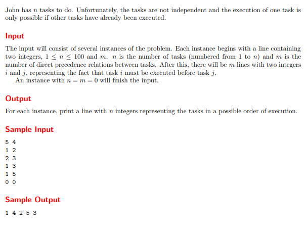
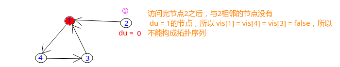

## Uva - 10305. Ordering Tasks | LeetCode - 207. Course Schedule (拓扑排序)

* [Uva - 10305. Ordering Tasks](#1)
* [LeetCode - 207. Course Schedule](#2)

***

### <font color = red id = "1">Uva - 10305. Ordering Tasks
#### [题目链接](https://uva.onlinejudge.org/index.php?option=com_onlinejudge&Itemid=8&page=show_problem&problem=1246)

> https://uva.onlinejudge.org/index.php?option=com_onlinejudge&Itemid=8&page=show_problem&problem=1246

#### 题意



给你`n、m`，`n`代表点的个数，`m`代表边的条数，然后下面给出`m`条边，都是有向的(有向图)，要你建出一个图，并且找出一种序列，这种序列即拓扑序列 。

> 拓扑排序  是对有向无环图（`DAG`)进行的一种操作，这种操作是将`DAG`中的所有顶点排成一个线性序列，使得图中的任意一对顶点`u,v`满足如下条件：若边`(u,v) ∈ E(G)`，则`u`在最终的线性序列中出现在`v`的前面;
> 拓扑排序的应用常常和`AOV`网相联系，在一个大型的工程中，某些项目不是独立于其他项目的，这意味着这种非独立的项目的完成必须依赖与其它项目的完成而完成，不妨记为`u,v`，则若边`(u,v)∈E(G)`，代表着必须在项目`u`完成后，`v`才能完成。

 **所以如果存在有向环，则不存在拓扑排序**，反之则存在。
#### 解析
拓扑排序可以使用`BFS`或者`DFS`来求解。


<font color = purple>**①`BFS`**</font>

拓扑排序使用`BFS`解题的过程: 

 * 找出入度为`0`的结点并加入队列；
 * 在队列中弹出一个结点，并访问，**并把它的相邻结点的入度`-1`，如果减一之后入度为`0`，则也进队列；**
 * 直到队列为空，访问完毕 ；

通过上述过程即可以得到图的拓扑序列。
```java
import java.io.*;
import java.util.*;

public class Main {
    
    static ArrayList<Integer> G[];
    static int[] in;
    static int n , m;
    static PrintStream out;

    static void sortedTopology(){
        Queue<Integer>queue = new LinkedList<>();
        for(int i = 1; i <= n; i++){
            if(in[i] == 0)
                queue.add(i);
        }
        boolean flag = true; // for output
        while(!queue.isEmpty()){
            int cur = queue.poll();
            if(flag){
                out.print(cur);
                flag = false;
            }else
                out.print(" " + cur);
            for(int i = 0; i < G[cur].size(); i++){
                int to = G[cur].get(i);
                if(--in[to] == 0)
                    queue.add(to);
            }
        }
        out.println();
    }

    public static void main(String[] args){
        Scanner cin = new Scanner(new BufferedInputStream(System.in));
        out = System.out;
        while(cin.hasNext()){
            n = cin.nextInt();
            m = cin.nextInt();
            if(n == 0 && m == 0)
                break;
            in = new int[n + 1];
            G = new ArrayList[n + 1];
            for(int i = 0; i <= n; i++)
                G[i] = new ArrayList<>();
            for(int i = 0; i < m; i++){
                int from = cin.nextInt();
                int to = cin.nextInt();
                G[from].add(to);
                in[to]++;
            }
            sortedTopology();
        }
    }
}
```
<font color = purple>**②`DFS`**</font>
使用`DFS`求解拓扑排序的过程:


* 这里的`vis`需要表示三个状态，即: `vis[i] = 0`表示还从未访问过、`vis[i] = 1`表示已经访问过、`vis[i] = 2`表示正在访问；
* 只需要通过上述的设置，即可以判断是否能得到拓扑排序(或者说是否有环)；
* 然后我们还需要记录拓扑序列，因为递归不断进行到深层，所以我们需要用栈来记录拓扑序列，这里用一个数组<font color = red>从后往前</font>存即可；

```java
import java.io.*;
import java.util.*;

public class Main {
    
    static ArrayList<Integer> G[];
    static int[] vis;
    static int n , m;
    static PrintStream out;
    static int[] res;
    static int p;
    
    static boolean dfs(int cur){ 
        vis[cur] = 2; // now is visiting 
        for(int to : G[cur]){  
            if(vis[to] == 2 || (vis[to] == 0 && !dfs(to))) // exist directed cycle 
                return false;
        }
        vis[cur] = 1; // now is visited
        res[p--] = cur;
        return true;
    }

    public static void main(String[] args){
        Scanner cin = new Scanner(new BufferedInputStream(System.in));
        out = System.out;
        while(cin.hasNext()){
            n = cin.nextInt();
            m = cin.nextInt();
            if(n == 0 && m == 0)
                break;
            G = new ArrayList[n + 1];
            vis = new int[n + 1];
            for(int i = 0; i <= n; i++)
                G[i] = new ArrayList<>();
            for(int i = 0; i < m; i++) {
                int from = cin.nextInt();
                int to = cin.nextInt();
                G[from].add(to);
            } 
            p = n - 1;  // back to front
            res = new int[n + 1];
            boolean ok = true;
            for(int i = 1; i <= n; i++){ 
                if(vis[i] == 0)
                    dfs(i);
            }       
            for(int i = 0; i < n-1; i++)
                out.print(res[i] + " ");
            out.println(res[n-1]);
        }
    }
}
```

***
### <font color = red id = "2">LeetCode - 207. Course Schedule

#### [题目链接](https://leetcode.com/problems/course-schedule/)

> https://leetcode.com/problems/course-schedule/

#### 题目


#### 解析
和上一个题目差不多，这个题目更加简单，只需要你判断能不能得到拓扑序列。

<font color = purple>**①`BFS`**</font>

* 总体过程和上一题差不多；
* 这里增加一个`vis`数组，当我们进行完`BFS`过程之后，如果还有点没有被访问到`vis[i] = false`，则说明不能得到拓扑序列(有环)；



```java
import java.io.*;
import java.util.*;

class Solution {

    // topological sorting should be used on directed acyclic graph 
    public boolean canFinish(int numCourses, int[][] prerequisites) {
        int n = numCourses;
        ArrayList<Integer> G[] = new ArrayList[n];
        int[] in = new int[n];
        boolean[] vis = new boolean[n];
        for(int i = 0; i < n; i++)
            G[i] = new ArrayList<>();
        for(int i = 0; i < prerequisites.length; i++){ 
            int to = prerequisites[i][0];
            int from = prerequisites[i][1];
            G[from].add(to);
            in[to]++;
        }
        Queue<Integer>queue = new LinkedList<>();
        for(int i = 0; i < n; i++)
            if(in[i] == 0)
                queue.add(i);
        while(!queue.isEmpty()){ 
            Integer cur = queue.poll();
            vis[cur] = true;
            for(int i = 0; i < G[cur].size(); i++){ 
                int to = G[cur].get(i);
                if(--in[to] == 0)
                    queue.add(to);
            }
        }
        for(int i = 0; i < n; i++)
            if(!vis[i]) // 有些点没有访问到
                return false;
        return true;
    }

    public static void main(String[] args){
        PrintStream out = System.out;
        int numCourses = 2;
        int[][] prerequisites = { 
             {1, 0},
             {0, 1}
        };
        out.println(new Solution().
            canFinish(numCourses, prerequisites)
        );
    }
}
```
<font color = purple>**②`DFS`**</font>

这个和上面的`DFS`也是一样的，区别就是这里不需要记录拓扑序列了。


`DFS`访问顺序以及记录的拓扑序列(`res`)如下: 

可以看到访问的顺序和结果的顺序正好相反: 

|<font color = red>**vertex**|<font color = red>**visiting**( `vis = 2`)|<font color = red>**visited**(`vis = 1`)|`res`|
|-|-|-|-|
|<font color = purple>**0**|**{0}**|**{}**|**{}**|
|<font color = purple>**1**|**{0, 1}**|**{}**|**{}**|
|<font color = purple>**0**|**{0**}|**{1}**|**{1}**|
|<font color = purple>**7**|**{0, 7}**|**{1}**|**{1}**|
|<font color = purple>**0**|**{0}**|**{1, 7}**|{**7, 1}**|
|<font color = purple>**-**|**{}**|**{1, 7, 0}**|**{0, 7, 1}**|
|<font color = purple>**2**|**{2}**|**{1, 7, 0}**|**{0, 7, 1}**|
|<font color = purple>**-**|**{}**|**{1, 7, 0, 2}**|**{2, 0, 7, 1}**|
|<font color = purple>**3**|**{3}**|**{1, 7, 0, 2}**|**{2, 0, 7, 1}**|
|<font color = purple>**-**|**{}**|**{1, 7, 0, 2, 3}**|**{3, 2, 0, 7, 1}**|
|<font color = purple>**4**|**{4}**|**{1, 7, 0, 2, 3}**|**{3, 2, 0, 7, 1}**|
|<font color = purple>**6**|**{4, 6}**|**{1, 7, 0, 2, 3}**|**{3, 2, 0, 7, 1}**|
|<font color = purple>**4**|**{4}**|**{1, 7, 0, 2, 3, 6}**|**{6, 3, 2, 0, 7, 1}**|
|<font color = purple>**-**|**{}**|**{1, 7, 0, 2, 3, 6, 4}**|**{4, 6, 3, 2, 0, 7, 1}**|
|<font color = purple>**5**|**{5}**|**{1, 7, 0, 2, 3, 6, 4}**|**{4, 6, 3, 2, 0, 7, 1}**|
|<font color = purple>**-**|**{}**|**{1, 7, 0, 2, 3, 6, 4, 5}**|**{5, 4, 6, 3, 2, 0, 7, 1}**|


```java
import java.io.*;
import java.util.*;

class Solution {

    private ArrayList<Integer> G[];
    private int[] vis; // 0: not visited, 1 : visited, 2 : visiting

    // topological sorting should be used on directed acyclic graph 
    public boolean canFinish(int numCourses, int[][] prerequisites) {
        int n = numCourses;
        G = new ArrayList[n];
        vis = new int[n];
        for(int i = 0; i < n; i++)
            G[i] = new ArrayList<>();
        for(int i = 0; i < prerequisites.length; i++){ 
            int to = prerequisites[i][0];
            int from = prerequisites[i][1];
            G[from].add(to);
        }
        for(int i = 0; i < n; i++)
            if(!dfs(i))
                return false;
        return true;
    }

    private boolean dfs(int cur){ 
        vis[cur] = 2; // visiting 
        for(int to : G[cur]){ 
            if((vis[to] == 2) || (vis[to] == 0 && !dfs(to)))
                return false;
        }
        vis[cur] = 1; // visited
        return true;
    }

    public static void main(String[] args){
        PrintStream out = System.out;
        int numCourses = 2;
        int[][] prerequisites = { 
             {1, 0},
             {0, 1}
        };
        out.println(new Solution().
            canFinish(numCourses, prerequisites)
        );
    }
}
```


另外`DFS`函数也可以这样写:
```java
private boolean dfs(int cur){ 
    if(vis[cur] == 1)
        return true;
    if(vis[cur] == 2)
        return false;
    vis[cur] = 2; // visiting 
    for(int to : G[cur]){ 
        if(!dfs(to))
            return false;
    }
    vis[cur] = 1; // visited
    return true;
}
```

