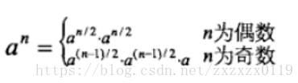
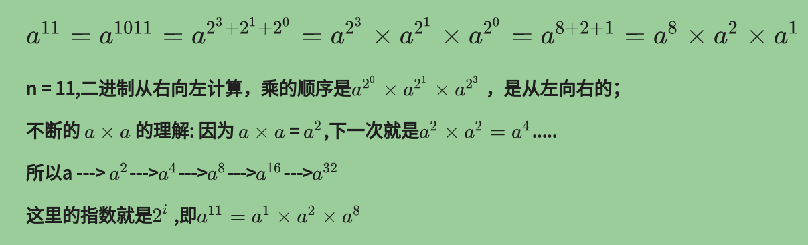
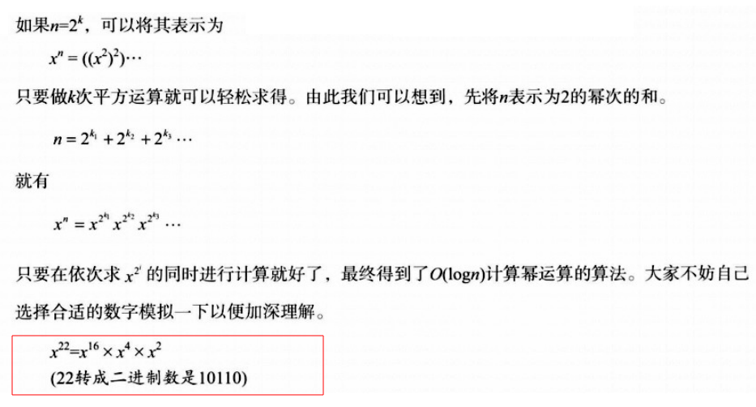
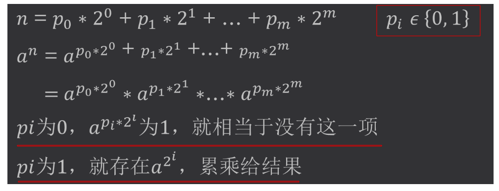
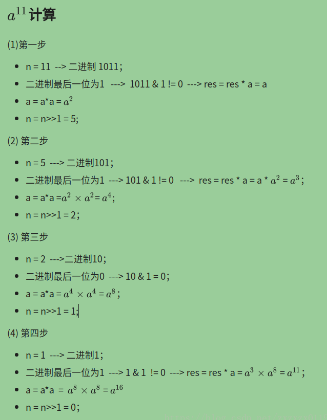
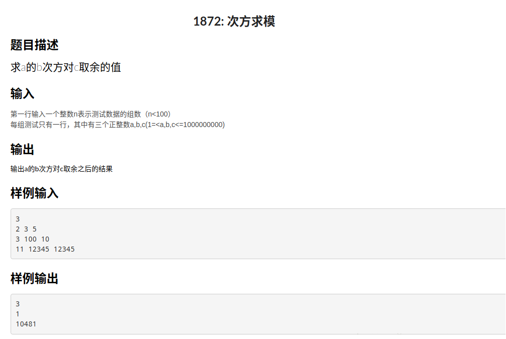

# 乘法快速幂相关总结  & LeetCode - 50. Pow(x, n)
* 递归计算 (a <sup>n</sup>) % mod
* 非递归计算 (a <sup>n</sup>) % mod
* 计算 ( a * b ) % mod
* 配合 ( a * b ) % mod和乘法快速幂
* XYNUOJ - 1872. 次方求模题解
* LeetCode - 50. Pow(x, n)题解


## 1、递归计算 (a <sup>n</sup>) % mod
递归计算其实是更容易理解的: 
* 为了求a<sup>n</sup>，我们先递归去求出a<sup>n/2</sup>，得到结果记录为`halfRes`；
* 然后如果`n`为偶数，很好办，再乘以一个`halfRes`就可以了(再取模一下)，也就是可以返回`halfRes*halfRes`；
* 但是如果`n`为奇数的话，就需要再乘以一个`a`，然后再返回；




代码:

```java
static long pow_mod(long a, long n, long mod) {
    if (n == 0)      // a^0 = 1
        return 1;
    // 先求一半的 --> 你先给我求出 a ^ (n/2) 的结果给我
    long halfRes = pow_mod(a, n >> 1, mod); // n >> 1 --> n/2

    long res = halfRes * halfRes % mod;

    if ((n & 1) != 0)       // odd num
        res = res * a % mod;
    return res;
}
```
***
## 2、非递归计算  (a <sup>n</sup>) % mod




假设一个整数是`10`，如何最快的求解`10`的`75`次方。

* ① `75`的二进制形式为`1001011`；
* ②`10`的`75`次方  = **10<sup>64</sup> × 10<sup>8</sup> × 10<sup>2</sup> × 10<sup>1</sup>**；
* 在这个过程中，我们先求出**10<sup>1</sup>**，然后根据**10<sup>1</sup>**求出**10<sup>2</sup>**，再根据**10<sup>2</sup>**求出**10<sup>4</sup>**。。。。，最后根据**10<sup>32</sup>**求出**10<sup>64</sup>**，**即`75`的二进制数形式总共有多少位，我们就使用了多少次乘法；**
* ③ 在步骤②进行的过程中，把应该累乘的值相乘即可，比如**10<sup>64</sup>**、**10<sup>8</sup>**、**10<sup>2</sup>**、**10<sup>1</sup>**应该累乘，因为`64、8、2、1`对应到`75`的二进制数中，相应位上是`1`；而**10<sup>32</sup>**、**10<sup>16</sup>**、10<sup>4</sup>不应该累乘，因为`32、16、 4`对应到`75`的二进制数中，相应位是`0`；

```java
    static long pow_mod2(long a, long n, long mod) {
        long res = 1;
        while (n > 0) {
            if ((n & 1) != 0) // 二进制最低位 是 1 --> (n&1) != 0  -->  乘上 x ^ (2^i)   (i从0开始)
                res = res * a % mod;
            a = a * a % mod;  // a = a^2
            n >>= 1;          // n -> n/2      往右边移一位
        }
        return res;
    }
```
使用`a ^ 11`来模拟一下计算过程: 




## 3、计算 ( a * b ) % mod


```java
	// 计算 (a * b) % mod
    static long mul_mod(long a, long b, long mod){
        long res = 0;

        while(b > 0){
            if( (b&1) != 0)  // 二进制最低位是1 --> 加上 a的 2^i 倍, 快速幂是乘上a的2^i ）
                res  = ( res + a) % mod;
            a = (a << 1) % mod;    // a = a * 2    a随着b中二进制位数而扩大 每次 扩大两倍。
            b >>= 1;               // b -> b/2     右移  去掉最后一位 因为当前最后一位我们用完了，
        }

        return res;
    }
```
***
## 4、配合 ( a * b ) % mod和乘法快速幂
可以使用非递归的乘法快速幂和上面的` (a*b) % mod` 来计算快速幂，差别不大: 
```java
    // 计算 (a * b) % mod
    static long mul_mod(long a,long b,long mod){
        long res = 0;
        while(b > 0){
            if( (b&1) != 0)  // 二进制最低位是1 --> 加上 a的 2^i 倍, 快速幂是乘上a的2^i ）
                res  = ( res + a) % mod;
            a = (a << 1) % mod;    // a = a * 2    a随着b中二进制位数而扩大 每次 扩大两倍。
            b >>= 1;               // b -> b/2     右移  去掉最后一位 因为当前最后一位我们用完了，
        }
        return res;
    }

    //非递归 计算 (a^n) % mod   配合 mul
    static long pow_mod3(long a,long n,long mod){
        long res = 1;
        while(n > 0) {
            if( (n&1) != 0 ) // 二进制最低位 是 1 --> (n&1) != 0  -->  乘上 x ^ (2^i)   (i从0开始)
                res = mul_mod(res,a,mod) % mod;
            a = mul_mod(a,a,mod) % mod;  // a = a^2
            n >>= 1;          // n -> n/2      往右边移一位
        }
        return res;
    }

```
***
## 5、XYNUOJ - 1872. 次方求模题解
#### [题目链接](http://xyoj.xynu.edu.cn/problem.php?id=1872)

> http://xyoj.xynu.edu.cn/problem.php?id=1872

#### 题目


完全的模板题，三种方法都可以通过: 

```java
import java.io.BufferedInputStream;
import java.util.Scanner;

/**
 * 题目链接:  http://xyoj.xynu.edu.cn/problem.php?id=1872&csrf=mmofuzhUWGip3c6WlmhiFY6bLxeVHZta
 */
public class Main {  //提交时改成Main

    //递归 计算 (a^n) % mod
    static long pow_mod(long a,long n,long mod){
        if(n == 0)      // a^0 = 1
            return 1;
        // 先求一半的 --> 你先给我求出 a ^ (n/2) 的结果给我
        long halfRes = pow_mod(a, n >> 1, mod); // n >> 1 --> n/2

        long res = halfRes * halfRes % mod;

        if( (n&1) != 0)       // odd num
            res = res * a % mod;
        return res;
    }

    //非递归 计算 (a^n) % mod
    static long pow_mod2(long a,long n,long mod){
        long res = 1;

        while(n > 0) {
            if( (n&1) != 0 ) // 二进制最低位 是 1 --> (n&1) != 0  -->  乘上 x ^ (2^i)   (i从0开始)
                res = res * a % mod;
            a = a * a % mod;  // a = a^2
            n >>= 1;          // n -> n/2      往右边移一位
        }

        return res;
    }

    // 计算 (a * b) % mod
    static long mul_mod(long a,long b,long mod){
        long res = 0;

        while(b > 0){
            if( (b&1) != 0)  // 二进制最低位是1 --> 加上 a的 2^i 倍, 快速幂是乘上a的2^i ）
                res  = ( res + a) % mod;
            a = (a << 1) % mod;    // a = a * 2    a随着b中二进制位数而扩大 每次 扩大两倍。
            b >>= 1;               // b -> b/2     右移  去掉最后一位 因为当前最后一位我们用完了，
        }

        return res;
    }

    //非递归 计算 (a^n) % mod   配合 mul
    static long pow_mod3(long a,long n,long mod){
        long res = 1;

        while(n > 0) {
            if( (n&1) != 0 ) // 二进制最低位 是 1 --> (n&1) != 0  -->  乘上 x ^ (2^i)   (i从0开始)
                res = mul_mod(res,a,mod) % mod;
            a = mul_mod(a,a,mod) % mod;  // a = a^2
            n >>= 1;          // n -> n/2      往右边移一位
        }

        return res;
    }


    public static void main(String[] args) {
        Scanner cin = new Scanner(new BufferedInputStream(System.in));
        int T = cin.nextInt();
        while(T-- > 0){
            int a = cin.nextInt();
            int n = cin.nextInt();
            int mod = cin.nextInt();
//            System.out.println(pow_mod(a,n,mod));
//            System.out.println(pow_mod2(a,n,mod));
            System.out.println(pow_mod3(a,n,mod));
        }
    }
}

```
***
## 6、LeetCode - 50. Pow(x, n)题解
#### [题目链接](https://leetcode.com/problems/powx-n/description/)

> https://leetcode.com/problems/powx-n/description/

#### 题目

#### 解析
这个题目和普通的求幂不同的是: 
* **其中`x`(底数)是`double`类型的，且`n`是范围是`Integer`范围的(可正可负) :** 
* **要注意的就是当`n`为负数的时候，我们可以转换成求` 1.0 / pow(x,-n)`；**
* <font color = red>还一个很重要的地方就是当`n = Integer.MIN_VALUE`的时候要特殊处理，因为整形范围是-2<sup>31</sup>到2<sup>31</sup>-1，所以或者我们使用`long`来存转换的数，或者特殊判断一下；</font>
##### 递归求解: 
两种写法意思一样，第二种写法更加简洁: 
```java
class Solution {
    public double myPow(double x, int n) {
        if (n > 0) {
            return pow(x, n);
        } else {
            if (n == Integer.MIN_VALUE) {
                return 1.0 / (pow(x, -(Integer.MIN_VALUE + 1)) * x); // MAX_VALUE = -(Integer.MIN_VALUE + 1)
            }
            return 1.0 / pow(x, -n);
        }
    }

    public double pow(double x, int n) {
        if (n == 0)
            return 1;
        double half = pow(x, n / 2);
        if (n % 2 == 0)
            return half * half;
        else
            return x * half * half;
    }
}
```

```java
class Solution {
    public double myPow(double x, int n) {
        if (n == 0)
            return 1.0;
        if (n < 0) {
            if (n == Integer.MIN_VALUE) {
                // return 1.0 / (myPow(x,-(Integer.MIN_VALUE+1)) * x);
                return 1.0 / (myPow(x, Integer.MAX_VALUE) * x);
            }
            return 1.0 / myPow(x, -n);
        }
        double half = myPow(x, n / 2);
        if (n % 2 == 0)
            return half * half;
        else
            return x * half * half;
    }
}
```
##### 非递归求解: 
三种写法的意思都是一样，只不过处理`Integer.MIN_VALUE`的方式不同而已。
```java
class Solution {
    public double myPow(double x, int n) {
        if (n == 0)
            return 1.0;
        if (n < 0) {
            if (n == Integer.MIN_VALUE) {
                return 1.0 / (myPow(x, Integer.MAX_VALUE) * x);
            } else {
                return 1.0 / myPow(x, -n);
            }
        }
        double res = 1.0;
        while (n > 0) {
            if ((n & 1) != 0)
                res *= x;
            x = x * x;
            n >>= 1;
        }
        return res;
    }
}
```

```java
class Solution {
    public double myPow(double x, int n) {
        if (n == 0)
            return 1.0;
        double res = 1.0;
        if (n < 0) {
            x = 1 / x;
            n = -(1 + n);  // for Integer.MIN_VALUE   
            res *= x;  // x is 1/x   because n is -(n+1) so should do this 
        }
        while (n > 0) {
            if ((n & 1) != 0)
                res *= x;
            x = x * x;
            n >>= 1;
        }

        return res;
    }
}
```

```java
class Solution {
    public double myPow(double x, int n) {
        if (n == 0)
            return 1.0;

        long abs = Math.abs((long) n); // also for Integer.MIN_VALUE

        double res = 1.0;
        while (abs > 0) {
            if ((abs & 1) != 0)
                res *= x;
            x = x * x;
            abs >>= 1;
        }
        if (n < 0)
            return 1.0 / res;
        return res;
    }
}
```

