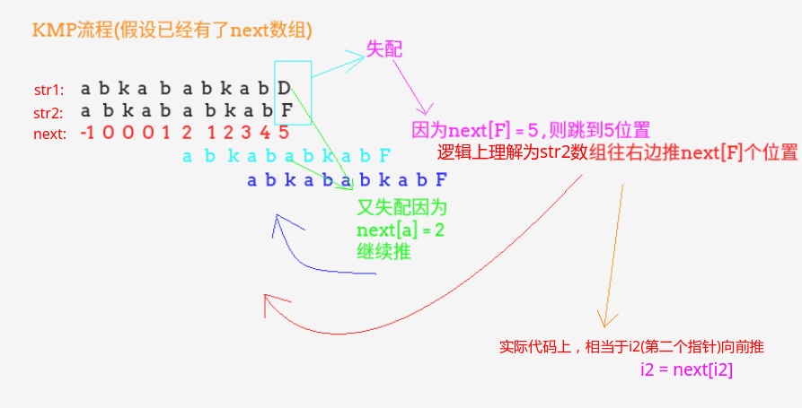
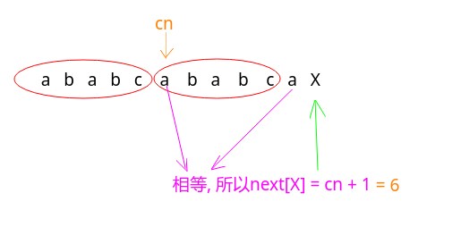
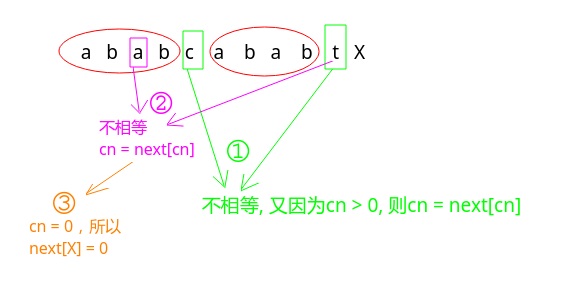
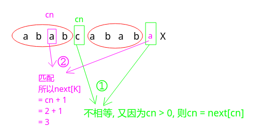

# Hdu - 1711. Number Sequence以及KMP算法总结

 - KMP求解流程
 - KMP next数组求解
 - Hdu - 1711. Number Sequence模板题
***
#### [题目链接](http://acm.hdu.edu.cn/showproblem.php?pid=1711)

> http://acm.hdu.edu.cn/showproblem.php?pid=1711

#### 题目

就是求`str2`有没有在`str1`中出现，如果出现就返回第一个出现的位置。


### KMP求解流程

**这里先说明`next`数组的含义。**

 -  `next[i]`的含义是在`str[i]`之前的字符串`str[0...i]`中，必须以`str[i-1]`结尾的后缀子串(不能包含`str[0]`)与必须以`str[0]`开头的前缀子串(不能包含`str[i-1]`)的最大匹配长度；
 - 这里我们先认为已经求得了匹配串的这个`next`数组(后面讲`next`数组求解)。

然后再看KMP求解流程:

 - 当主串的指针`i1`和匹配串的指针`i2`所在位置`str1[i1] == str2[i2]`的时候，`i1++，i2++`；
 - 否则，让`i2`直接跳到`i2`位置的next数组的值的位置，也就是`i2 = next[i2]`，这个过程相当于`str2`向右推动，看下图的两个失配的做法；
 - 当然，如果`next[i2] = -1`了，说明`i2`到了`0`位置，开头都配不上，那`i1++`吧；



按照上面流程写出的代码:
```java
static int kmp(String s,String p){
    if(s == null || p == null || p.length() < 1 || s.length() < p.length() )return -1;
    char[] str1 = s.toCharArray();
    char[] str2 = p.toCharArray();

    int i1 = 0,i2 = 0; //甲乙
    int[] next = getNext(str2);
    while(i1 < str1.length && i2 < str2.length){
        if(str1[i1] == str2[i2]){ //能配上，继续
            i1++; i2++;
        }else {
            if(next[i2] == -1) { //我str2到了第一个你都配不上(第一个位置都配不上),那你str1就下一个吧
                i1++;
            }else {//逻辑概念是str2往右边推
                i2 = next[i2]; //来到next数组指示(最长公共前缀后缀)
            }
        }
    }
    return i2 == str2.length ? i1 - i2 : -1;//返回匹配的第一个位置
}
```

***
### KMP next数组求解

 `next`数组使用的数学归纳法，假设我们已经求得了`next[0]、next[1]、....next[i-1]`，现在要求`next[i]`。

这个过程是不断的分开往前面匹配的过程: 

一个`cn`位置表示的是`next[i-1]`的值(`0  ~  i-2`的最大前缀后缀匹配长度的后一个位置)

看几个例子:

当前判断`X`，比较前一个位置`a == str[cn]`。相等就是`cn+1`。

<div align="center"></div><br>

连续不匹配的情况:

<div align="center"></div><br>

两次能匹配的情况:

<div align="center"></div><br>

根据上面的分析写出代码

```java
static int[] getNext(char[] str2) {
    if(str2.length == 1)return new int[]{-1};
    int[] next = new int[str2.length];
    next[0] = -1;
    next[1] = 0;
    int cn = 0;
    for(int i = 2; i < str2.length;){
        if(str2[i-1] == str2[cn]){
            next[i++] = ++cn; //就是cn+1
        }else {
            if(cn > 0) cn = next[cn];//往前面跳
            else next[i++] = 0;
        }
    }
    return next;
}
```
### Hdu - 1711. Number Sequence模板题

这个就是一个KMP最简单的模板题，将字符串改成数组就ok了。
```java
import java.io.BufferedInputStream;
import java.util.Scanner;

public class Main {

    static int kmp(int[] s,int[] p){
        if(s == null || p == null || s.length < p.length || p.length == 0)
        	return -1;
        int[] next = getNext(p);
        int i1 = 0,i2 = 0;
        while(i1 < s.length && i2 < p.length){
            if(s[i1] == p[i2]) {
                i1++; i2++;
            }else {
                if(next[i2] == -1){
                    i1++;
                }else {
                    i2 = next[i2];
                }
            }
        }
        return i2 == p.length ? i1 - i2 : -1;

    }

    static int[] getNext(int[] arr){
        if(arr.length == 1)return new int[]{-1};
        int[] next = new int[arr.length];
        next[0] = -1;
        next[1] = 0;
        int cn = 0;
        for(int i = 2; i < arr.length; ){
            if( arr[i-1] == arr[cn]){
                next[i++] = ++cn;
            }else {
                if(cn > 0){
                    cn = next[cn];
                }else {
                    next[i++] = 0;
                }
            }
        }
        return next;
    }

    public static void main(String[] args) {
        Scanner cin = new Scanner(new BufferedInputStream(System.in));
        int k = cin.nextInt();
        while (k-- > 0) {
            int n = cin.nextInt();
            int m = cin.nextInt();
            int[] s = new int[n], p = new int[m];//切记ACM题中这个长度是很重要的，不能随便new int[n+1]因为后面用length代替了n
            for(int i = 0; i < n; i++)s[i] = cin.nextInt();
            for(int i = 0; i < m; i++)p[i] = cin.nextInt();
            int res = kmp(s,p);
            System.out.println(res == -1 ? -1 : res+1);
        }
    }
}
```

