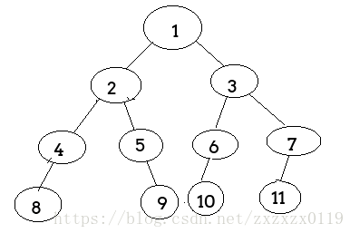
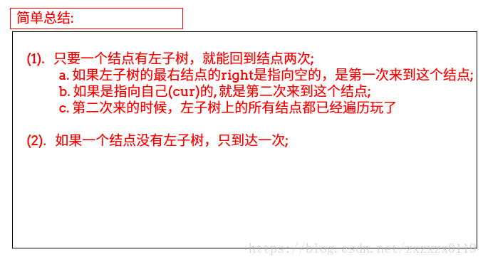

## 二叉树之Morris遍历

 - 递归理解以及`morris`遍历
 - 由`morris`遍历改成前序遍历
 - 由`morris`遍历改成中序遍历
 - 由`morris`遍历改成后续遍历
 - 完整测试代码
***
### 递归理解以及`morris`遍历

```java
    static void rec(Node head) { 
        if (head == null) return;
        System.out.print(head.value + " "); //这里打印就是前序遍历
        rec(head.left);
        System.out.print(head.value + " "); //这里打印就是中序遍历
        rec(head.right);
        System.out.print(head.value + " "); //这里打印就是后续遍历
    }
```
这是我们用递归写的三种遍历方法，如果是下面的例子，上面程序输出如下：



程序输出:

```c
1 2 4 8 8 8 4 4 2 5 5 9 9 9 5 2 1 3 6 10 10 10 6 6 3 7 11 11 11 7 7 3 1
```

 - **可以看到，每一个结点都会被访问三次，也就是说，访问的过程中，每一个结点都会经过三次；**
 - **一个结点如果没有`parent`指针或者我们在非递归遍历中使用栈，是不能回到它的父节点的；**
 - **而`morris`就是借助叶子结点的空闲指针帮助我们想办法回到父亲结点，省去了递归的空间，或者栈的空间，达到`O(1)`空间；**

每个结点来到三次: 


下面介绍`morris`遍历规则(现在和前、中、后序无关，就是`morris`序):


流程看下图的举例:

 




s


按照上面的解释可以完全写出下面的`morris`遍历过程(没有打印)：

```java
    static void morris(Node head){
        if(head == null)return;
        Node cur = head;
        Node mostRight = null;//左子树上最右的结点

        while(cur != null){
            mostRight = cur.left;   //cur的第一个左结点
            if(mostRight != null){  //如果左子树不为空

                while(mostRight.right != null && mostRight.right != cur){ //找到最右边的结点 有两种情况
                    mostRight = mostRight.right;
                }

                if(mostRight.right == null){ //第一次来到这个结点  满足第二大条中的第一条
                    mostRight.right = cur;
                    cur = cur.left;
                    continue; //  cur = cur.left 直接结束所有的
                }else { //第二次来到这个结点         满足第二大条中的第二条
                    mostRight.right = null;
                }
            }
            cur = cur.right;  //包括两种情况的 左子树为空和第二次来到这个结点
        }
    }
```

***

### 由`morris`遍历改成前序遍历
需要注意几点: 

 - 首先可以肯定是第一次来到这个结点的时候打印，所以是当`mostRight.right == null`(第一次来的时候，打印当前的`cur`)；
 - **其次，如果一个结点没有左子树，相当于只会来到结点一次，就直接打印一遍就可以了；**
 - **其实这样的做法等同于在递归的时候把打印的行为放在第一次来到这个结点的时候；**


```java
    //先序遍历
    static void morrisPre(Node head){
        if(head == null)return;
        Node cur = head;
        Node mostRight = null;

        while(cur != null){
            mostRight = cur.left;
            if(mostRight != null){

                while(mostRight.right != null && mostRight.right != cur){
                    mostRight = mostRight.right;
                }

                if(mostRight.right == null){
                    mostRight.right = cur;
                    System.out.print(cur.value + " ");   //先序是第一次来到这个结点的时候打印
                    cur = cur.left;
                    continue;
                }else {
                    mostRight.right = null;
                }
            }else {    //如果一个结点没有左子树  相当于只会来到这个结点一次  直接打印，然后往右走
                System.out.print(cur.value + " ");
            }
            cur = cur.right;
        }
        System.out.println();
    }
```

***
### 由`morris`遍历改成中序遍历
中序更加简单: 

 - 如果一个结点有左子树，那么我打印的时机是我遍历完左子树之后的打印，也就是第二次来到这个结点时候打印，也就是`mostRight.right = cur`的时候打印；
 - 如果一个结点没有左子树，那么本来也要打印一下，打印完就往右边窜了；
 - 本质就是不论怎么样要处理玩左子树才打印根结点；

```java
    //中序遍历
    static void morrisIn(Node head){
        if(head == null)return;
        Node cur = head;
        Node mostRight = null;

        while(cur != null){
            mostRight = cur.left;
            if(mostRight != null){

                while(mostRight.right != null && mostRight.right != cur){
                    mostRight = mostRight.right;
                }

                if(mostRight.right == null){
                    mostRight.right = cur;
                    cur = cur.left;
                    continue;
                }else {
                    mostRight.right = null;
                }
            }
            System.out.print(cur.value + " ");//这里包括两种情况 没有左子树和有左子树的第二次来到这里打印
            cur = cur.right;
        }
        System.out.println();
    }
```
***
### 由`morris`遍历改成后续遍历
后续遍历比较麻烦:  因为`morris`只会来到一个结点两次，但是递归会来到一个结点三次: 

主要看以下几点: 

 - 我们只关心那些有左子树，也就是会到一个结点两次的结点；
 - 逆序打印有左子树结点的左子树的右边界；
 - 最后打印整棵树的右边界的逆序；


```java
    //morris后续
    static void morrisPos(Node head){
        if(head == null)return;
        Node cur = head;
        Node mostRight = null;

        while(cur != null){
            mostRight = cur.left;
            if(mostRight != null){

                while(mostRight.right != null && mostRight.right != cur){
                    mostRight = mostRight.right;
                }

                if(mostRight.right == null){
                    mostRight.right = cur;
                    cur = cur.left;
                    continue;
                }else { //第二次来的时候
                    mostRight.right = null;
                    printEdge(cur.left); //打印左子树的右边界
                }
            }
            cur = cur.right;
        }
        printEdge(head); //最后打印整棵树的右边界
        System.out.println();
    }

    //打印边界
    static void printEdge(Node head) {
        //先逆序边界
        Node tail = reverseEdge(head);
        //打印
        Node cur = tail;
        while(cur != null){
            System.out.print(cur.value + " ");
            cur = cur.right;
        }
        //再逆序回来
        reverseEdge(tail);
    }

    //有点类似链表的逆序
    static Node reverseEdge(Node cur) {
        Node pre = null;
        Node next = null;
        while(cur != null){
            next = cur.right;//先保存下一个
            cur.right = pre;
            pre = cur;
            cur = next;
        }
        return pre;
    }
```
***
完整测试代码(例子就是上面的例子): 

```java
public class Morris {

    static class Node {
        public int value;
        public Node left;
        public Node right;

        public Node(int value) {
            this.value = value;
        }
    }


    static Node createTree(int[] arr, int i) {
        if (i >= arr.length || arr[i] == -1) return null;
        Node head = new Node(arr[i]);
        head.left = createTree(arr, 2 * i + 1);
        head.right = createTree(arr, 2 * i + 2);
        return head;
    }


    static void process(Node head) {
        if (head == null) return;
        System.out.print(head.value + " ");
        process(head.left);
        System.out.print(head.value + " ");
        process(head.right);
        System.out.print(head.value + " ");
    }


    static void pre(Node head) {
        if (head == null) return;
        System.out.print(head.value + " ");
        pre(head.left);
        pre(head.right);
    }

    static void in(Node head) {
        if (head == null) return;
        in(head.left);
        System.out.print(head.value + " ");
        in(head.right);
    }

    static void pos(Node head) {
        if (head == null) return;
        pos(head.left);
        pos(head.right);
        System.out.print(head.value + " ");
    }


    static void morris(Node head) {
        if (head == null) return;
        Node cur = head;
        Node mostRight = null;//左子树上最右的结点

        while (cur != null) {
            mostRight = cur.left;   //cur的第一个左结点
            if (mostRight != null) {  //如果左子树不为空

                while (mostRight.right != null && mostRight.right != cur) { //找到最右边的结点 有两种情况
                    mostRight = mostRight.right;
                }

                if (mostRight.right == null) { //第一次来到这个结点  满足第二大条中的第一条
                    mostRight.right = cur;
                    cur = cur.left;
                    continue; //  cur = cur.left 直接结束所有的
                } else { //第二次来到这个结点         满足第二大条中的第二条
                    mostRight.right = null;
                }
            }
            cur = cur.right;  //包括两种情况的 左子树为空和第二次来到这个结点
        }
    }


    //先序遍历
    static void morrisPre(Node head) {
        if (head == null) return;
        Node cur = head;
        Node mostRight = null;

        while (cur != null) {
            mostRight = cur.left;
            if (mostRight != null) {

                while (mostRight.right != null && mostRight.right != cur) {
                    mostRight = mostRight.right;
                }

                if (mostRight.right == null) {
                    mostRight.right = cur;
                    System.out.print(cur.value + " ");   //先序是第一次来到这个结点的时候打印
                    cur = cur.left;
                    continue;
                } else {
                    mostRight.right = null;
                }
            } else {    //如果一个结点没有左子树  相当于只会来到这个结点一次  直接打印，然后往右走
                System.out.print(cur.value + " ");
            }
            cur = cur.right;
        }
        System.out.println();
    }

    //中序遍历
    static void morrisIn(Node head) {
        if (head == null) return;
        Node cur = head;
        Node mostRight = null;

        while (cur != null) {
            mostRight = cur.left;
            if (mostRight != null) {

                while (mostRight.right != null && mostRight.right != cur) {
                    mostRight = mostRight.right;
                }

                if (mostRight.right == null) {
                    mostRight.right = cur;
                    cur = cur.left;
                    continue;
                } else {
                    mostRight.right = null;
                }
            }
            System.out.print(cur.value + " ");
            cur = cur.right;
        }
        System.out.println();
    }

    //morris后续
    static void morrisPos(Node head) {
        if (head == null) return;
        Node cur = head;
        Node mostRight = null;

        while (cur != null) {
            mostRight = cur.left;
            if (mostRight != null) {

                while (mostRight.right != null && mostRight.right != cur) {
                    mostRight = mostRight.right;
                }

                if (mostRight.right == null) {
                    mostRight.right = cur;
                    cur = cur.left;
                    continue;
                } else { //第二次来的时候
                    mostRight.right = null;
                    printEdge(cur.left); //打印左子树的右边界
                }
            }
            cur = cur.right;
        }
        printEdge(head); //最后打印整棵树的右边界
        System.out.println();
    }

    //打印边界
    static void printEdge(Node head) {
        //先逆序边界
        Node tail = reverseEdge(head);
        //打印
        Node cur = tail;
        while (cur != null) {
            System.out.print(cur.value + " ");
            cur = cur.right;
        }
        //再逆序回来
        reverseEdge(tail);
    }

    //有点类似链表的逆序
    static Node reverseEdge(Node cur) {
        Node pre = null;
        Node next = null;
        while (cur != null) {
            next = cur.right;//先保存下一个
            cur.right = pre;
            pre = cur;
            cur = next;
        }
        return pre;
    }


    public static void main(String[] args) {
        int[] arr = {1, 2, 3, 4, 5, 6, 7, 8, -1, -1, 9, 10, -1, 11, -1};
        Node head = createTree(arr, 0);
        System.out.println("------------递归树每个结点回到三次-----------");
        process(head);
        System.out.println();
        System.out.println();

        System.out.println("---------------------前序----------------");
        pre(head);
        System.out.println();
        morrisPre(head);
        System.out.println();


        System.out.println("---------------------中序----------------");
        in(head);
        System.out.println();
        morrisIn(head);
        System.out.println();


        System.out.println("---------------------后序----------------");
        pos(head);
        System.out.println();
        morrisPos(head);
        System.out.println();

    }
}
```

测试结果:

