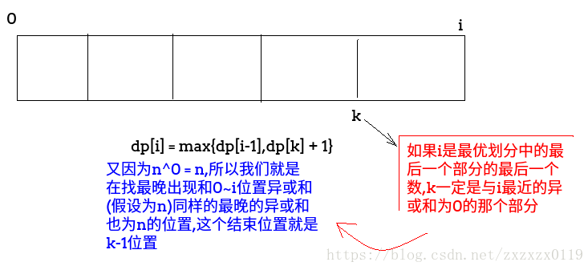
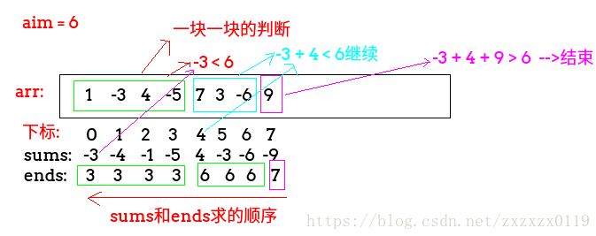
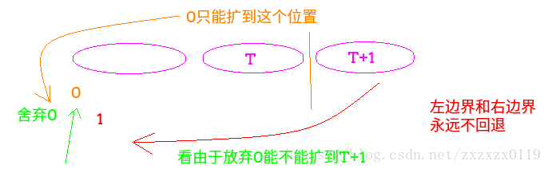

### 子数组累加和为aim(小于等于aim)的三个问题

 - 累加和` = aim`的最长子数组的长度(**数组可`+`,`-`,`0`**)；
 - 累加和` = aim`的最长子数组的长度(**数组`+`**)(只有正数)；
 - 累加和` <= aim`的最长子数组的长度(**数组可`+`,`-`,`0`**)；

***
### 累加和` = aim`的最长子数组的长度(**数组可`+`,`-`,`0`**)；
这个题目使用`HashMap`来存储前面出现过的累加和的下标，具体过程如下: 

 - 使用变量`sum`表示从`0`位置开始一直加到i位置所有元素的累加和；
 - `HashMap`中`key`表示从`arr`最左边开始累加过程中出现过的`sum`值，`value`表示的是`sum`值出现最早的位置；、
 - 假设当前元素为`arr[i]`，则`sum += arr[i]`，之前所有累加和为`sum` ，查看`map`中是否有`sum - aim`这个值，如果有，且对应`value`为`j`，那么就找到一个子数组累加和为`aim`的，且长度为 `i -  j  + 1`；
 - 检查现在的`sum `是否在`map`中出现，如果不存在，说明此时是第一次出现的，把`(sum,i)`加入到`map`中；
 - 继续遍历数组；

<font color = red> 很重要的一个地方就是一开始`map`中要存`(0,-1)`这个值，直观理解是一个数也没有的时候也可以累加出`0`</font>
看下面例子: 
`[1,2,3,3] ， aim = 6`；
如果没有存`(0,-1)`，累加到下标为`2`的时候，`sum = 6` 此时，`sum - aim = 6 - 6 =  0`，但是没有`0`这个累加和，就会忽略； 

```java
	/**　O(n)时间 O(n)空间 */
    static int getMaxLength(int[] arr,int aim){
        if(arr == null || arr.length== 0 )return 0;
        HashMap<Integer,Integer>map = new HashMap<Integer, Integer>(); //表示key这个累加和最早出现在value位置
        map.put(0,-1);     //这个很重要
        int sum = 0;
        int res = 0;
        for(int i = 0; i < arr.length; i++){
            sum += arr[i];
            if(map.containsKey(sum - aim)){ //如果之前出现了
                res = Math.max(res,i - map.get(sum - aim));
            }
            if(!map.containsKey(sum)){
                map.put(sum,i);
            }
        }
        return res;
    }
```
问题变式: 给定一个数组，求正数和负数个数相等最长子数组长度。
解: 把正数变成`1`，负数变成`-1`即可。


还有一个扩展问题: 

题目: 
> 定义数组的异或和的概念: 
> 数组中所有的数异或起来，得到的结果叫做数组的异或和，比如数组`{3, 2, 1}`的异或和是: `3 ^ 2 ^ 1 = 0 `。
> 给定一个数组`arr`，你可以任意把`arr`分成很多不相容的子数组，你的目的是: <font color = red>分出来的子数组中，异或和为`0`的子数组最多。
> 请返回: 分出来的子数组中，异或和为`0`的子数组最多是多少?  

解析: 可以利用这个思想找到**最晚出现和`0~i`内异或和(假设为`xor`)同样异或和的更小的范围内最晚出现的位置，因为最后一个部分是异或和为`0`，且`xor^0 = xor`。**


```java
	 /**
     * dp[i] = max(dp[i-1],dp[k] + 1) k表示的是i 如果是最优划分中的最后一个部分的最后一个数的话，k是那个部分的开始的地方的前一个
     * 从 0~i-1中异或还是  xor的最晚的位置  :
     * @param arr
     * @return
     */
    static int maxEor(int[] arr){
        HashMap<Integer,Integer>map = new HashMap<>();//存放某个异或和最晚出现的位置
        int res = 0,xor = 0;
        int[] dp = new int[arr.length];
        map.put(0,-1);
        for(int i = 0; i < arr.length; i++){
            xor ^= arr[i];
            if(map.containsKey(xor)){// 找到上一个异或和为xor的最晚出现的位置　　　因为xor^0 = xor
                int k = map.get(xor); //k
                dp[i] = k == -1 ? 1 : dp[k] + 1;
            }
            if(i > 0){
                dp[i] = Math.max(dp[i],dp[i-1]);
            }
            map.put(xor,i); //每次都要put进去
            res = Math.max(dp[i],res);
        }
        return res;
    }
```

***
### 累加和` = aim`的最长子数组的长度(**数组`+`**)(只有正数)；
这个和上面唯一的不同就是数组中只有正数，这里使用类似窗口移动的做法，给出两个指针，`L、R`表示窗口的左右边界 ，`sum`表示的是`arr[L,R]`之间的累加和，`L`，`R`一直往右动。

 - 如果窗口内`sum < aim`，`R`就往右扩，并且`sum += arr[R]`；
 - 如果窗口内`sum > aim`，`L` 就往右扩，并且`sum -= arr[L]`；
 - 如果窗口内`sum = aim`， 就说明这个窗口内累加和为`sum` ，此时记录最大值即可；


```java
    static int getMax(int[] arr,int aim){
        if(arr == null || arr.length == 0 || aim < 0)return 0;
        int L = 0,R = 0;
        int res = 0, sum = arr[0];
        while(R < arr.length){
            if(sum == aim){
                res = Math.max(res,R - L + 1);
                sum -= arr[L++];
            }else if(sum < aim){//小于等于就往右边扩
                if(++R == arr.length) break;
                sum += arr[R];
            }else {           // 大于就往左边扩  sum > aim
                sum -= arr[L++];
            }
        }
        return res;
    }
```
***
### 累加和` <= aim`的最长子数组的长度(**数组可`+`,`-`,`0`**)；
两个数组`sum`和`ends`，`sum[i]`表示的是以`arr[i]`开头(必须包含`arr[i]`)的所有子数组的最小累加和，对应的`ends[i]`表示的是取得这个最小累加和的右边界。 一开始先求出`sums`数组和`ends[]`数组。


这个题目最精华的是左右边界不回退，就是说，如果从`0`位置扩到`T`区间，`T+1`区间不能扩了，此时不是回到`1`位置开始扩，而是舍弃`0`位置，看能不能由于舍弃`0`位置把`T+1`位置加进来：



```java
    static int getMaxLength2(int[] arr,int aim){
        if(arr == null || arr.length == 0)return 0;
        int[] sums = new int[arr.length]; //以arr[i]开头所有子数组的最小累加和
        int[] ends = new int[arr.length]; //取得最小累加和的最右边界
        sums[arr.length-1] = arr[arr.length-1];
        ends[arr.length-1] = arr.length-1;
        for(int i = arr.length - 2; i >= 0; i--){ //求出sums数组和ends数组
            if(sums[i+1] < 0){
                sums[i] = arr[i] + sums[i+1];
                ends[i] = ends[i+1];
            }else {
                sums[i] = arr[i];
                ends[i] = i;
            }
        }
        int sum = 0; //目前的累加和  sum -> R
        int R = 0;//每一次扩到的右边界
        int res = 0; //答案
        for(int start = 0; start < arr.length; start++){//每一次开头
            while(R < arr.length && sum + sums[R] <= aim){//一整块一整块的扩
                sum += sums[R];
                R = ends[R] + 1;
            }
            sum -= R > start ? arr[start] : 0;//如果R>start，下面start要++了，窗口内减去arr[start]
            res = Math.max(res,R - start);//窗口是start ~ R-1  ,所以是长度为R-start
            R = Math.max(R,start + 1);  //有没有可能扩不出去
        }
        return res;
   }
```

