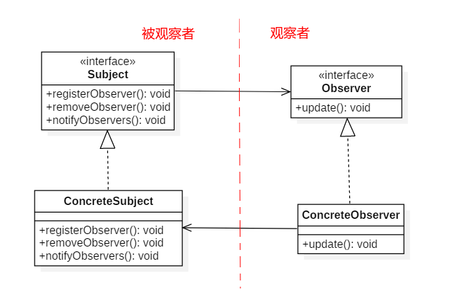
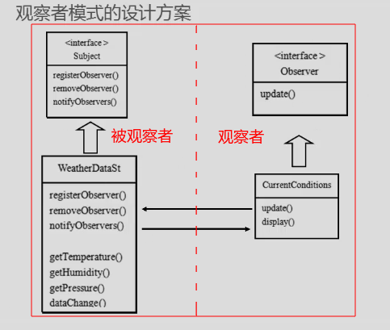
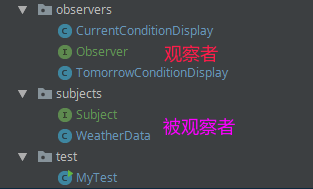
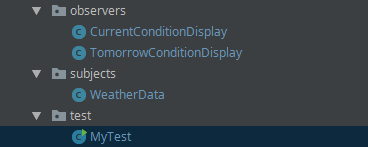

# 观察者模式

* [一、基本概念](#一基本概念)
* [二、结构](#二结构)
* [三、案例](#三案例)
  * [1、自定义的观察者实现](#1自定义的观察者实现)
  * [2、Java内置观察者实现](#2java内置观察者实现)
* [四、总结](#四总结)

## 一、基本概念

观察者模式是行为型设计模式。

* **定义对象间的一种一对多的依赖关系，当一个对象的状态发生改变时，所有依赖于它的对象都得到通知并被自动更新**；
* 被依赖的对象为`Subject`(被观察者)，依赖的对象为`Observer`，`Subject`通知`Observer`变化；
* `Subject` : 登记注册`register/attach`、移除`remove`、通知`notify`；
* `Observer` : 接收变化`update`； 
* 可以把观察者模式想象成订报纸一样，**出版者+订阅者 = 观察者模式**；

## 二、结构

观察者模式所涉及的角色有：

　　● **抽象主题(Subject)角色：**抽象主题角色把所有对**观察者对象**的引用保存在一个聚集（比如`List`对象）里。抽象主题提供一个接口，可以增加和删除观察者对象，抽象主题角色又叫做抽象被观察者(Observable)角色；

　　● **具体主题(ConcreteSubject)角色：**将有关状态存入具体观察者对象；在具体主题的内部状态改变时，给所有登记过的观察者发出通知。具体主题角色又叫做具体被观察者(Concrete Observable)角色；

　　● **抽象观察者(Observer)角色：**为所有的具体观察者定义一个接口，在得到主题的通知时更新自己，这个接口叫做更新接口。

　　● **具体观察者(ConcreteObserver)角色：**存储与主题的状态自恰的状态。具体观察者角色实现抽象观察者角色所要求的更新接口，以便使本身的状态与主题的状态相协调。如果需要，具体观察者角色可以保持一个指向具体主题对象(Concrete Subject)的引用；



## 三、案例

案例：

> 实现的功能是气象站的管理，给你一个`WeatherData`类(**被观察者**)，提供了获取温度，湿度，和气压的函数，要你设计类并添加一些公告板(**观察者**)，可以显示相关的信息；

基本结构图:



**下面使用自定义的观察者和Java内置观察者实现**。

### 1、自定义的观察者实现


基本代码结构组织图:



先看被观察者包`subjects`里面的两个:

`Subject`接口:

```java
/**被观察者接口*/
public interface Subject {
    void registerObservers(Observer o);//注册
    void removeObservers(Observer o); //移除
    void notifyObservers(); //通知
}
```

`WeatherData`类 (被观察者的实现):

```java
/**
 * 被观察者的实现
 * 里面有:
 *   1、观察者接口的集合数据结构
 * 　2、实现添加观察者方法(registerObservers)
 *   3、移除观察者方法(removeObservers)
 *   4、通知所有观察者的方法(notifyObservers)
 */
public class WeatherData implements Subject {

    private double temperature;
    private double humidity;
    private double pressure;

    // 可以提供getter()方法

    private ArrayList<Observer>observers;

    public WeatherData() {
        observers = new ArrayList<>();
    }

    public void setData(double temperature, double humidity, double pressure){
        this.temperature = temperature;
        this.humidity = humidity;
        this.pressure = pressure;

        dataChanged();//更新完信息就马上通知观察者
    }

    //数据改变之后就通知观察者(从气象站得到更新的观测值之后，通知观察者)
    public void dataChanged(){
        notifyObservers();
    }

    @Override
    public void registerObservers(Observer o) {
        observers.add(o);
    }

    @Override
    public void removeObservers(Observer o) {
        int index = observers.indexOf(o);
        if(index >= 0){
            observers.remove(o);
        }
    }

    @Override
    public void notifyObservers() {
        for(int i = 0; i < observers.size(); i++){
            Observer observer = observers.get(i);
            observer.update(temperature, humidity, pressure);
        }
    }
}
```

 然后再看`observers`包的接口和实现类:

`Observer`接口:

```java
/** 观察者 接口*/
public interface Observer {
    void update(double temperature, double humidity, double pressure);
}
```

两个实现类:

```java
/** 观察者1 */
public class CurrentConditionDisplay implements Observer {

    private double temperature;
    private double humidity;
    private double pressure;

    @Override
    public void update(double temperature, double humidity, double pressure) {
        this.temperature = temperature;
        this.humidity = humidity;
        this.pressure = pressure;
        display();
    }

    public void display() {
        System.out.println("CurrentDisplay : " +
                "[" + temperature  +
                ", " + humidity  +
                ", " + pressure + "]");
    }
}

```

```java
/** 观察者2  明天的天气展示 : Math.random * 当前设置值, 主要是为了展示和上一个观察者的不同*/
public class TomorrowConditionDisplay implements Observer {

    private double temperature;
    private double humidity;
    private double pressure;

    @Override
    public void update(double temperature, double humidity, double pressure) {
        this.temperature = temperature;
        this.humidity = humidity;
        this.pressure = pressure;
        display();
    }

    // ( (int)(10 * Math.random())/2 + 1)  生成 [1,5]的随机数
    public void display() {
        System.out.println("TomorrowDisplay : " +
                "[" + temperature * ( (int)(10 * Math.random())/2 + 1) +
                ", " + humidity * ( (int)(10 * Math.random())/2 + 1) +
                ", " + pressure * ( (int)(10 * Math.random())/2 + 1) + "]");
    }
}
```

最后测试:

```java
public class MyTest {
    public static void main(String[] args) {
        WeatherData weatherData = new WeatherData(); // 创建一个被观察者(Subject的实现类)

        // 创建两个观察者 (Observer的实现类)
        CurrentConditionDisplay current = new CurrentConditionDisplay();
        TomorrowConditionDisplay tomorrow = new TomorrowConditionDisplay();

        // 在被观察者的List中注册两个观察者
        weatherData.registerObservers(current);
        weatherData.registerObservers(tomorrow);

        // 设置完(天气更新)就会自动通知两个观察者
        weatherData.setData(10,100,50);

        System.out.println("----------移除Tomorrow公告板----------");
        weatherData.removeObservers(tomorrow);

        weatherData.setData(20,200,25);
    }
}
```

程序输出：

```java
CurrentDisplay : [10.0, 100.0, 50.0]
TomorrowDisplay : [10.0, 100.0, 150.0]
----------移除Tomorrow公告板----------
CurrentDisplay : [20.0, 200.0, 25.0]
```

### 2、Java内置观察者实现

被观察者继承自`Observable`类，观察者实现`Observer`接口:

* `Observable`类中有`addObserver()`方法，类似于我们的`registerObserver()`；
* `Observable`类中有`deleteObserver()`方法，类似与我们的`removeObserver()`；
* 此外`Observable`类中还有两个`notifyObservers()`方法。为什么两个呢?
  * Java内置的被观察者更新的方法有两种，一种是推，一种是拉；
  * `public void notifyObservers(Object arg) `对应的是"推"；意思就是推送给观察者；
  * `public void notifyObservers() `对应的是"拉"；意思就是需要观察者自己拉取数据；
* 内置的和自己定义的在更新的时候有一个很大的不同就是: Java内置观察者在更新的时候，需要先调用一个`setChanged()`方法，标记状态已经被改变的事实。这个可以更加灵活的使用观察者模式(在调用`setChanged()`之前添加一些条件)；

基本代码结构组织图:



代码如下:

首先看被观察者: 

```java
// 这里需要继承Java的Observable类
public class WeatherData extends Observable {

    private double temperature;
    private double humidity;
    private double pressure;


    public double getTemperature() {
        return temperature;
    }

    public double getHumidity() {
        return humidity;
    }

    public double getPressure() {
        return pressure;
    }

    public void setData(double temperature, double humidity, double pressure){
        this.temperature = temperature;
        this.humidity = humidity;
        this.pressure = pressure;
        dataChanged();//更新完信息就马上通知观察者
    }

    //数据改变之后就通知观察者(从气象站得到更新的观测值之后，通知观察者)
    public void dataChanged(){
        this.setChanged(); //这个很重要，一定要设置这个，java底层有一个boolean值 changed = true; , 可以不那么灵活 (可以设置一些条件然后调用setChanged()方法)
        notifyObservers(new Data(temperature, humidity, pressure)); //这个是 "推" 数据
//        notifyObservers();  // 靠观察者自己 "拉" 数据
    }

    // 这个类的作用就是为了 适应Observable里面的这个方法(推数据) : public void notifyObservers(Object arg)
    public static class Data{

        private double temperature;
        private double humidity;
        private double pressure;

        public Data(double temperature, double humidity, double pressure) {
            this.temperature = temperature;
            this.humidity = humidity;
            this.pressure = pressure;
        }

        public double getTemperature() {
            return temperature;
        }

        public double getHumidity() {
            return humidity;
        }

        public double getPressure() {
            return pressure;
        }
    }
}
```

然后是两个观察者:

```java
public class CurrentConditionDisplay implements Observer{

    private double temperature;
    private double humidity;
    private double pressure;


    //这里表示的是直接接受　被观察者的数据("推"　过来的数据　)　　-->  也可以自己获取("拉")数据
    @Override
    public void update(Observable o, Object data) { //注意这里还有被观察者的引用
        this.temperature = ((WeatherData.Data)data).getTemperature(); //强制类型转换一下
        this.humidity = ((WeatherData.Data)data).getHumidity();
        this.pressure = ((WeatherData.Data)data).getPressure();
        display();
    }

    public void display() {
        System.out.println("CurrentDisplay : " +
                "[" + temperature  +
                ", " + humidity  +
                ", " + pressure + "]");
    }
}

```

```java
public class TomorrowConditionDisplay implements Observer{

    private double temperature;
    private double humidity;
    private double pressure;

    // 这个就是
    @Override
    public void update(Observable observable, Object data) {
        // 两种设值方式  "推" | "拉"
        // "推"　过来的
//        this.temperature = ((WeatherData.Data)data).getTemperature();
//        this.humidity = ((WeatherData.Data)data).getHumidity();
//        this.pressure = ((WeatherData.Data)data).getPressure();

        // 自己 "拉" 过来的
        this.temperature = ((WeatherData)observable).getTemperature();
        this.humidity = ((WeatherData)observable).getHumidity();
        this.pressure = ((WeatherData)observable).getPressure();
        display();
    }

    // ( (int)(10 * Math.random())/2 + 1)  生成 [1,5]的随机数
    public void display() {
        System.out.println("TomorrowDisplay : " +
                "[" + temperature * ( (int)(10 * Math.random())/2 + 1) +
                ", " + humidity * ( (int)(10 * Math.random())/2 + 1) +
                ", " + pressure * ( (int)(10 * Math.random())/2 + 1) + "]");
    }
}

```

测试:

```java
public class MyTest {

    public static void main(String[] args) {
        WeatherData weatherData = new WeatherData();// 创建被观察者

        // 创建两个观察者
        CurrentConditionDisplay current = new CurrentConditionDisplay();
        TomorrowConditionDisplay tomorrow = new TomorrowConditionDisplay();

        weatherData.addObserver(current);
        weatherData.addObserver(tomorrow);

        weatherData.setData(11,222,33);

        System.out.println("----------移除Tomorrow公告板----------");
        weatherData.deleteObserver(tomorrow);
        weatherData.setData(22,444,66);
    }
}
```

输出:

```java
TomorrowDisplay : [33.0, 666.0, 33.0]
CurrentDisplay : [11.0, 222.0, 33.0]
----------移除Tomorrow公告板----------
CurrentDisplay : [22.0, 444.0, 66.0]
```

## 四、总结

**使用场景**

- 一个抽象模型有两个方面，其中一个方面依赖于另一个方面。将这些方面封装在独立的对象中使它们可以各自独立地改变和复用。
- 一个对象的改变将导致其他一个或多个对象也发生改变，而不知道具体有多少对象将发生改变，可以降低对象之间的耦合度。
- 一个对象必须通知其他对象，而并不知道这些对象是谁。
- 需要在系统中创建一个触发链，A对象的行为将影响B对象，B对象的行为将影响C对象……，可以使用观察者模式创建一种链式触发机制。