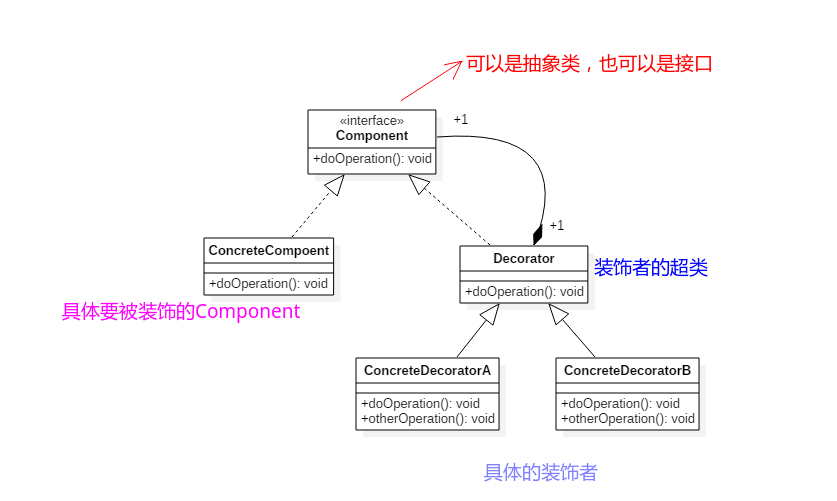
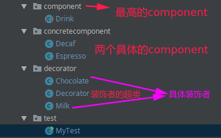
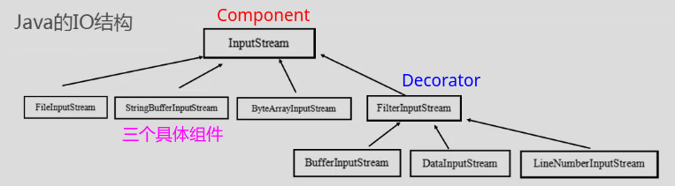
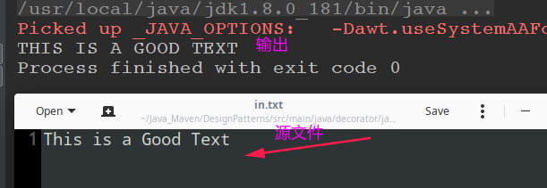

# 装饰者模式

* [一、基本概念](#一基本概念)
* [二、结构](#二结构)
* [三、案例](#三案例)
  * [1、装饰者模式案例](#1装饰者模式案例)
  * [2、JavaIO中使用装饰者模式](#2javaio中使用装饰者模式)
* [四、总结](#四总结)

## 一、基本概念

装饰者模式是结构型设计模式。

装饰模式以**对客户端透明的方式扩展对象的功能**，是继承关系的一个替代方案。

允许向一个现有的对象添加新的功能。同时又不改变其结构，它是作为现有的类的一个包装。

主要解决的问题: 一般我们为了扩展一个类经常使用继承方式实现，由于继承为类引入静态特征，并且随着扩展功能的增多，**子类会很膨胀**。

## 二、结构

结构：

* 装饰者（Decorator）和具体组件（ConcreteComponent）都继承自组件（Component）；
* 所谓装饰，就是把这个装饰者套在被装饰者之上，从而动态扩展被装饰者的功能；
* 装饰者的方法有一部分是自己的，这属于它的功能(**半透明的装饰者模式**)。然后调用被装饰者的方法实现，从而也保留了被装饰者的功能；



## 三、案例

### 1、装饰者模式案例

具体的代码组织结构图:




具体代码:

先看最高的`component`包下的`Drink`类:

```java
/**
 * Component的超类
 * 单品和装饰者都要继承自这个类
 */
public abstract class Drink {

    private String description = ""; //一开始没有描述
    private double price = 0; //一开始价格为0

    /**
     * 抽象方法
     *  1、如果是单品的话就直接是自己的价格
     *  2、如果是装饰者的话就还要加上装饰品自己的价格
     */
    public abstract double cost();


    // setter getter

    public String getDescription() {
        return description;
    }
    public double getPrice() {
        return price;
    }
    public void setDescription(String description) { //描述的时候顺便把价格描述一下
        this.description = description;
    }
    public void setPrice(double price) {
        this.price = price;
    }
}
```

下面看两个具体的`Component`:

```java
/** ConcreteComponent 1*/
public class Decaf extends Drink {

    public Decaf() {
        super.setDescription("Decaf");
        super.setPrice(3); //3块钱
    }

    @Override
    public double cost() {
        return getPrice();//super.getPrice()//这个就是父类的价格(自己什么也没加 (没有被装饰))
    }

    // 重写getter 后面加上自己的花费
    @Override
    public String getDescription() {
        return super.getDescription() + "-" + cost();
    }
}

```

```java
/** ConcreteComponent 2
 *  也可以在ConcreteComponent和Drink类有一个过渡的类)  (比如Coffee类)
 */
public class Espresso extends Drink {

    public Espresso(){
        super.setDescription("Espresso");
        super.setPrice(4);
    }

    @Override
    public double cost() {
        return getPrice();//super.getPrice()//这个就是父类的价格(自己什么也没加)
    }

    @Override
    public String getDescription() {
        return super.getDescription() + "-" + cost();
    }
}
```

下面看`decorator`下的三个类:

第一个是装饰者的超类，继承自`Drink`类:

```java
public class Decorator extends Drink{
    /**
     * 这个引用很重要，可以是单品，也可以是被包装过的类型，所以使用的是超类的对象
     * 这个就是要被包装的单品(被装饰的对象)
     */
    private Drink drink; //这里要拿到父类的引用，因为要控制另一个分支(具体的组件)

    public Decorator(Drink drink) {
        this.drink = drink;
    }

    /**
     * 如果drink是已经被装包过的，那么就会产生递归调用　　最终到单品
     */
    @Override
    public double cost() {
        return super.getPrice() + drink.cost(); // 自己的价格和被包装单品的价格
    }

    @Override
    public String getDescription() {
        return super.getDescription() + "-" + super.getPrice()
                + " && " + drink.getDescription();
    }
}
```

然后是两个装饰者:

```java
/**
 * 这个是具体的装饰者() --> 继承自中间的装饰着Decorator
 */
public class Chocolate extends Decorator{

    public Chocolate(Drink drink) { //如果父类搞了一个　带参数的构造函数，子类必须显示的使用super调用
        super(drink);
        super.setDescription("Chocolate");
        super.setPrice(1);
    }
}
```

```java
public class Milk extends Decorator{

    public Milk(Drink drink) {
        super(drink); //调用父类的构造函数
        super.setDescription("Milk");
        super.setPrice(3);
    }
}
```

测试类:

```java
public class MyTest {
    public static void main(String[] args) {
        //只点一个单品 (Decaf 咖啡)
        Drink order = new Decaf();
        System.out.println("order description : " + order.getDescription());
        System.out.println("order price : " + order.cost());

        System.out.println("---------------加了调料的----------------");

        order = new Milk(order);// 加了牛奶
        order = new Chocolate(order);
        order = new Chocolate(order); // 加了两个巧克力
        System.out.println("order description : " + order.getDescription());
        System.out.println("order price : " + order.cost());
    }
}
```

程序输出:

```java
order description : Decaf-3.0
order price : 3.0
---------------加了调料的----------------
order description : Chocolate-1.0 && Chocolate-1.0 && Milk-3.0 && Decaf-3.0
order price : 8.0
```

### 2、JavaIO中使用装饰者模式

由于Java I/O库需要很多性能的各种组合，如果这些性能都是用继承的方法实现的，那么每一种组合都需要一个类，这样就会造成大量性能重复的类出现，所以Java IO使用的是装饰者设计模式。




所以我们可以定义自己的装饰者。

>  这里我们定义一个流，这个流将读入的小写字母转换成大写字母。

`UpperCaseInputStream`代码如下:

```java
/**
 * 自己定义的输入流　　
 * 扩展FilterInputStream(这个类就是我们的Decorator) 中间装饰者　　
 * 所以我们只要继承这个就可以扩展自己的输入流装饰者　
 */
public class UpperCaseInputStream extends FilterInputStream{

    protected UpperCaseInputStream(InputStream in) {  //这个InputStream就是我们的Drink 类(超类)
        super(in);
    }

    // 实现两个read()方法，将大写转化成小写的读入

    //重写　相当于cost和description
    @Override
    public int read() throws IOException {
        int index = super.read(); //读取一个字节
        return index == -1 ? index : Character.toUpperCase((char)(index));  //小写转换成大写
    }

    //字节数组
    @Override
    public int read(byte[] b, int off, int len) throws IOException {
        int index = super.read(b, off, len);
        for(int i = 0; i < index; i++)
            b[i] = (byte)Character.toUpperCase((char)(b[i]));
        return index;
    }
}
```

测试一下使用这个类:

```java
public class MyTest {

    public static void main(String[] args) throws IOException {
        InputStream in = new UpperCaseInputStream(new BufferedInputStream(new FileInputStream("/home/zxzxin/Java_Maven/DesignPatterns/src/main/java/decorator/java/in.txt")));// 将这个in.txt文件读入的内容转换成大写
        int len;
        while((len = in.read()) >= 0)
            System.out.print((char)(len));
        in.close();
    }
}
```

输出结果演示:



## 四、总结

优缺点:

* **优点：**装饰类和被装饰类可以独立发展，不会相互耦合，装饰模式是继承的一个替代模式，装饰模式可以动态扩展一个实现类的功能。
* **缺点：**多层装饰比较复杂。

实际应用: 　**大多数情况下，装饰模式的实现都要比上面给出的示意性例子要简单。**

* 如果只有一个ConcreteComponent类，那么可以考虑去掉抽象的Component类（接口），把Decorator作为一个ConcreteComponent子类；
* 　如果只有一个ConcreteDecorator类，那么就没有必要建立一个单独的Decorator类，而可以把Decorator和ConcreteDecorator的责任合并成一个类。


更加详细的解释具体可以看[**这篇博客**](http://www.cnblogs.com/java-my-life/archive/2012/04/20/2455726.html)。


