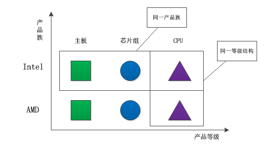
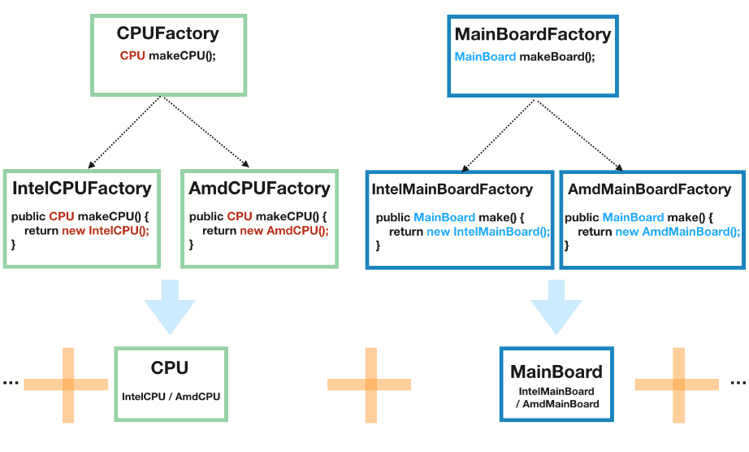
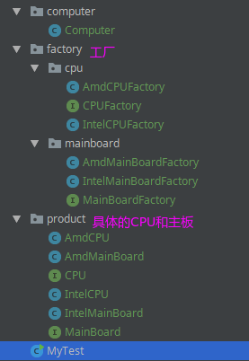
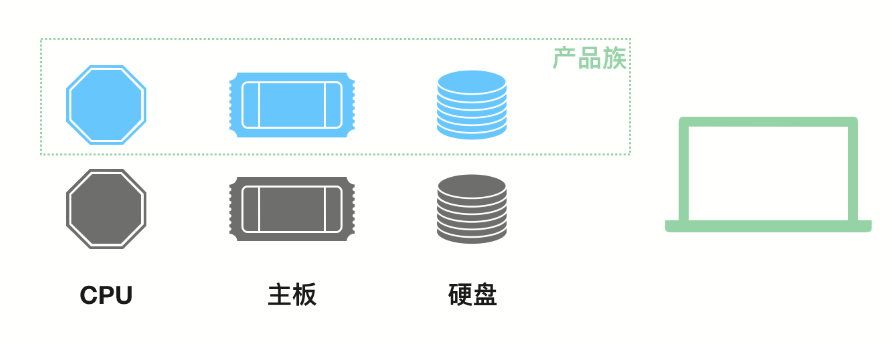
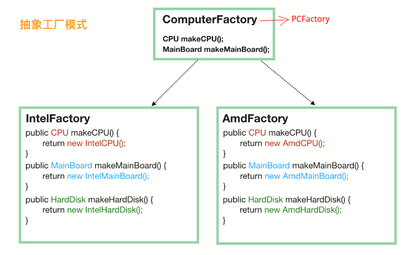
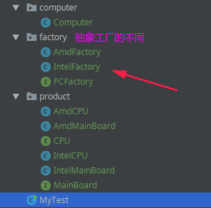

# 抽象工厂模式

* [一、基本概念](#一基本概念)
* [二、案例](#二案例)
* [三、总结](#三总结)

## 一、基本概念

当涉及到**产品族**的时候，就需要引入抽象工厂模式了。

每一个模式都是针对一定问题的解决方案。抽象工厂模式与工厂方法模式的最大区别就在于，**工厂方法模式针对的是一个产品等级结构；而抽象工厂模式则需要面对多个产品等级结构**。

在学习抽象工厂具体实例之前，应该明白两个重要的概念：产品族和产品等级。

所谓产品族，是指位于不同产品等级结构中，功能相关联的产品组成的家族。比如AMD的主板、芯片组、CPU组成一个家族，Intel的主板、芯片组、CPU组成一个家族。而这两个家族都来自于三个产品等级：主板、芯片组、CPU。一个等级结构是由相同的结构的产品组成，示意图如下：



## 二、案例

一个经典的例子是造一台电脑。我们先不引入抽象工厂模式，看看怎么实现。

因为电脑是由许多的构件组成的，我们将 CPU 和主板进行抽象，然后 CPU 由 CPUFactory 生产，主板由 MainBoardFactory 生产，然后，我们再将 CPU 和主板搭配起来组合在一起，如下:



代码组织结构:



这个时候的客户端调用是这样的（测试类）：

```java
public class MyTest {
    public static void main(String[] args){
        // 得到 Intel 的 CPU
        CPUFactory intelCPUFactory = new IntelCPUFactory();
        CPU cpu = intelCPUFactory.makeCPU();

        // 得到 AMD 的主板
        MainBoardFactory mainBoardFactory = new AmdMainBoardFactory();
        MainBoard mainBoard = mainBoardFactory.makeMB();
		
        // 组装 CPU 和主板
        Computer computer = new Computer(cpu, mainBoard);
        System.out.println(computer);
    }
}

```

**具体的完整代码可以看[这里](https://github.com/ZXZxin/ZXNotes/tree/master/%E6%9D%82%E9%A1%B9/%E8%AE%BE%E8%AE%A1%E6%A8%A1%E5%BC%8F/factory)**

单独看 CPU 工厂和主板工厂，它们分别是前面我们说的**工厂模式**。

这种方式也容易扩展，因为要给电脑加硬盘的话，只需要加一个 HardDiskFactory 和相应的实现即可，不需要修改现有的工厂。

但是，这种方式有一个问题，那就是如果 **Intel 家产的 CPU 和 AMD 产的主板不能兼容使用**，那么这代码就容易出错，因为客户端并不知道它们不兼容，也就会错误地出现随意组合。

下面就是我们要说的**产品族**的概念，它代表了组成某个产品的一系列附件的集合：



当涉及到这种产品族的问题的时候，就需要抽象工厂模式来支持了。我们不再定义 CPU 工厂、主板工厂、硬盘工厂、显示屏工厂等等，**我们直接定义电脑工厂，每个电脑工厂负责生产所有的设备，这样能保证肯定不存在兼容问题**。



这个时候，对于客户端来说，不再需要单独挑选 CPU厂商、主板厂商、硬盘厂商等，直接选择一家品牌工厂，品牌工厂会负责生产所有的东西，而且能保证肯定是兼容可用的。

改装的抽象工厂模式代码组织结构如下:



主要的代码:

三个工厂:(一个超类工厂`PCFactory`，两个大厂工厂`AmdFactory`、`InterFactory`)

```java
public interface PCFactory {

    CPU makeCPU();
    MainBoard makeMB();
    // HardDisk makeHD();
}
```

```java
public class AmdFactory implements PCFactory{

    @Override
    public CPU makeCPU() {
        return new AmdCPU();
    }

    @Override
    public MainBoard makeMB() {
        return new AmdMainBoard();
    }
}
```

```java
public class IntelFactory implements PCFactory {

    @Override
    public CPU makeCPU() {
        return new IntelCPU();
    }

    @Override
    public MainBoard makeMB() {
        return new IntelMainBoard();
    }
}
```

最后的测试类:

```java
public class MyTest {
    public static void main(String[] args){
        // 第一步就要选定一个“大厂”
        PCFactory cf = new AmdFactory();
        // 从这个大厂造 CPU
        CPU cpu = cf.makeCPU();
        // 从这个大厂造主板
        MainBoard board = cf.makeMB();

        //... 从这个大厂造硬盘。等等

        // 将同一个厂子出来的 CPU、主板、硬盘组装在一起
        Computer computer = new Computer(cpu, board);
    }
}
```

## 三、总结

当然，抽象工厂的问题也是显而易见的，比如我们要加个显示器，就需要修改所有的工厂，给所有的工厂都加上制造显示器的方法。这有点违反了**对修改关闭，对扩展开放**这个设计原则。