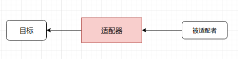
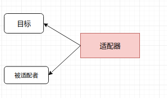
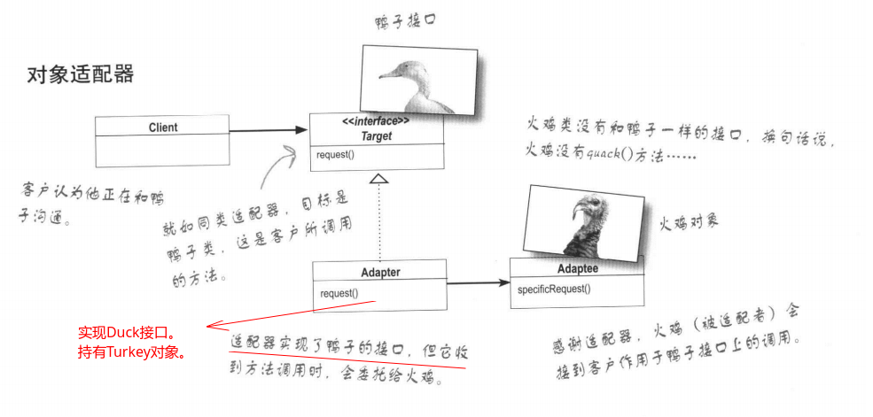
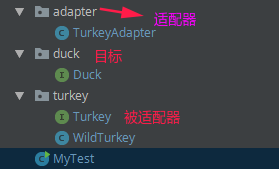
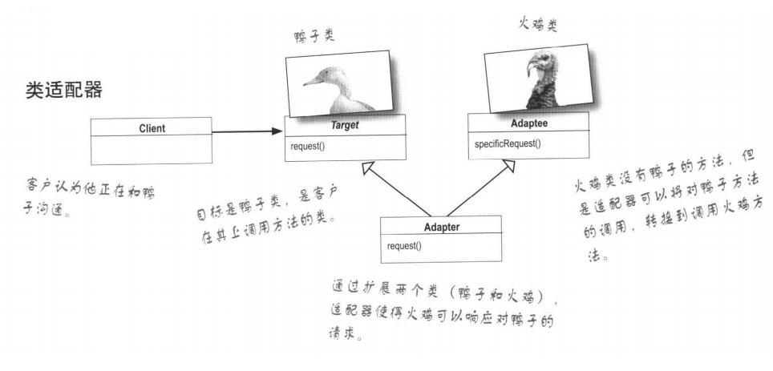
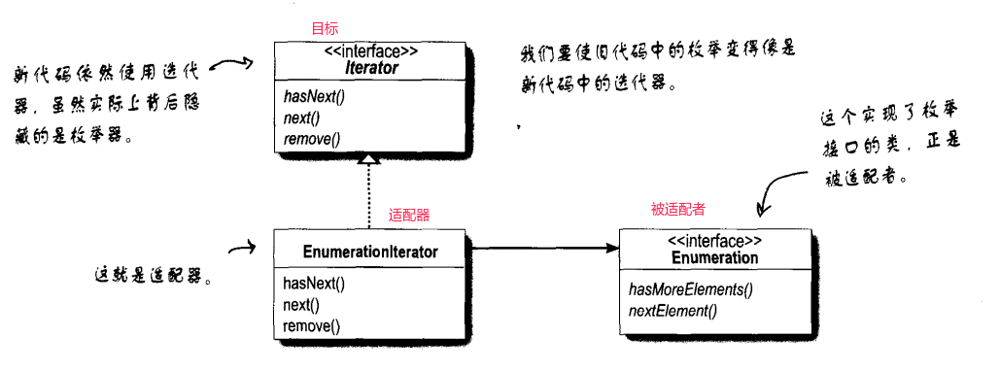

# 适配器模式(一)

* [一、基本概念](#一基本概念)
* [二、结构](#二结构)
* [三、案例](#三案例)
  * [1、对象适配器模式](#1对象适配器模式)
  * [2、类适配器模式](#2类适配器模式)
  * [3、Java中从以前枚举器Enumeration到迭代器Iterator的适配](#3java中从以前枚举器enumeration到迭代器iterator的适配)
* [四、总结](#四总结)

## 一、基本概念

将一个类的接口，转换成客户期望的另一个接口。适配器让原本接口不兼容的类可以合作无间。

## 二、结构

适配器可以分为两种: 对象适配器和类适配器。

**对象适配器**:



从用户的角度看不到**被适配者**。

用户调用适配器转换出来的目标接口方法。适配器再调用被适配者的相关接口方法。

用户收到反馈结果，感觉只是和目标接口交互。

**类适配器**:



通过多重继承目标接口和被适配者类方式来实现适配。

## 三、案例

> 案例: 将火鸡冒充成鸭子。

### 1、对象适配器模式

逻辑图:



代码组织结构图:



被适配者火鸡`Turkey`:

```java
public interface Turkey {
    void gobble(); // 火鸡叫声
    void fly();
}
```

```java
/** 野火鸡 */
public class WildTurkey implements Turkey{
    @Override
    public void gobble() {
        System.out.println("Go Go!");
    }

    @Override
    public void fly() {
        System.out.println("I am Flying a short distance!");
    }
}
```

目标对象`Duck`:

```java
/** 鸭子的接口 */
public interface Duck {
    void quack();//鸭子叫声
    void fly();
}
```

适配器`TurkeyAdapter`:

```java

/**
 * 在外面表现是 鸭子(目标)，但是实质是火鸡(被适配者)
 */
public class TurkeyAdapter implements Duck { //实现目标的接口

    private Turkey turkey; //这种对象型适配器必须要组合  被适配者，也就是要有适配者的引用

    public TurkeyAdapter(Turkey turkey) {
        this.turkey = turkey;
    }

    // 实际是火鸡在叫
    @Override
    public void quack() {
        turkey.gobble();//外面表现是quack,但是内部是turkey.gobble()
    }

    @Override
    public void fly() {
        //由于火鸡飞的短，所以多飞几次，让火鸡更像鸭子
        for(int i = 0; i < 6; i++){
            turkey.fly();
        }
    }
}
```

测试:

```java
public class MyTest {

    public static void main(String[] args) {
        WildTurkey turkey = new WildTurkey();
        Duck duck = new TurkeyAdapter(turkey);
        duck.quack(); //看似是鸭子，其实内置是火鸡
        duck.fly();
    }
}
```

输出:

```java
Go Go!
I am Flying a short distance!
I am Flying a short distance!
I am Flying a short distance!
I am Flying a short distance!
I am Flying a short distance!
I am Flying a short distance!
```

### 2、类适配器模式

基本结构图:



虽然Java不支持多继承，但是可以实现的同时继承。

只有`TurkeyAdapter`有一些代码变动，其他不变:

```java
/**
 * 和 对象适配器模式唯一的不同就是  : 适配器直接继承 被适配者 (而不是组合)
 */
public class TurkeyAdapter extends WildTurkey implements  Duck {

    @Override
    public void quack() {
        super.gobble(); //直接继承 被适配者
    }

    @Override
    public void fly() {
        //让火鸡飞6次，飞的像鸭子
        super.fly();
        super.fly();
        super.fly();
        super.fly();
        super.fly();
        super.fly();
    }
}
```

测试:

```java
public class MyTest {

    public static void main(String[] args) {
        TurkeyAdapter duck = new TurkeyAdapter();//直接new即可
        duck.quack();
        duck.fly();
    }
}

```

输出和上面对象适配器一样。

### 3、Java中从以前枚举器Enumeration到迭代器Iterator的适配

从`Enumeration`到`Iterator`适配的结构图:



一个实例代码:(下面`EnumerationIterator`就是一个适配器)

```java
/** 对象适配器的举例 java中的枚举到迭代器 */
public class EnumerationIterator implements Iterator<Object> {
    private Enumeration enumeration; //枚举 : 被适配者

    public EnumerationIterator(Enumeration enumeration) {
        this.enumeration = enumeration;
    }

    @Override
    public boolean hasNext() {
        return enumeration.hasMoreElements(); //实际调用的是 被适配者 的方法
    }

    @Override
    public Object next() {
        return enumeration.nextElement();
    }

    //这个可以说是适配器的缺点， 有些不能适配，比如两个插孔的插头不能适配为三个插孔的插头
    @Override
    public void remove() {
        throw new UnsupportedOperationException();
    }
}
```

## 四、总结

对象适配器和类适配器使用了不同的方法实现适配，**对象适配器使用组合，类适配器使用继承**。