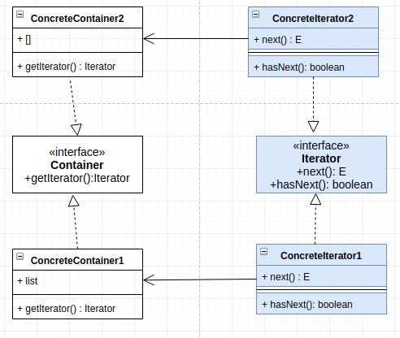
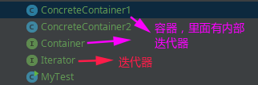

# 迭代器模式

- [一、基本概念](#一基本概念)
- [二、结构](#二结构)
- [三、案例](#三案例)
- [四、总结](#四总结)

## 一、基本概念

迭代器模式属于行为型模式。

这种模式用于顺序访问集合对象的元素，不需要知道集合对象的底层表示。

如果我们需要统一遍历不同的集合(容器)，也可以利用迭代器模式解决(下面的案例就是解决这个问题)。

## 二、结构

结构:



- `Container` 是聚合类，其中 `getIterator()` 方法可以产生一个 `Iterator`；
- `Iterator` 主要定义了 `hasNext()` 和 `next()` 方法；
- 每一个`Container`的实现类都会有一个具体的`Iterator`实现类来帮助实现迭代；

## 三、案例

> 实现两个容器能够统一遍历。(或者两个以上)

先看代码结构: (**这里我将两个迭代器实现类写在两个容器内部**)



代码:

```java
public interface Container {
    Iterator getIterator();
}
```

```java
public interface Iterator<E> {
    boolean hasNext();
    E next();
}
```

两个容器类，他们内部的容器不同，内部有自带不同的迭代器:

```java
public class ConcreteContainer1 implements Container {

    public Integer[] arr;

    public ConcreteContainer1() {
        arr = new Integer[10];
        for(int i = 0; i < 10; i++) arr[i] = i;
    }

    @Override
    public Iterator getIterator() {
        return new ConcreteIterator1<Integer>();
    }

    private class ConcreteIterator1<E> implements Iterator{

        int index;

        @Override
        public boolean hasNext() {
            if(index < arr.length)
                return true;
            return false;
        }

        @Override
        public Object next() {
            if(hasNext())
                return arr[index++];
            return null;
        }
    }
}
```

```java
public class ConcreteContainer2 implements Container {

    public ArrayList arr;

    public ConcreteContainer2() {
        arr = new ArrayList();
        for(int i = 0; i < 10; i++) arr.add(i);
    }

    @Override
    public Iterator getIterator() {
        return new ConcreteIterator1<Integer>();
    }

    private class ConcreteIterator1<E> implements Iterator{

        int index;

        @Override
        public boolean hasNext() {
            if(index < arr.size())
                return true;
            return false;
        }

        @Override
        public Object next() {
            if(hasNext())
                return arr.get(index++);
            return null;
        }
    }
}

```

测试:

```java
// 如果不这么做，需要区分c1和c2的遍历方式, 一个是数组，一个是List
public class MyTest {

    public static void main(String[] args){
        Container c1 = new ConcreteContainer1();
        Container c2 = new ConcreteContainer2();

        ArrayList<Iterator>its = new ArrayList<>();
        its.add(c1.getIterator()); // 将c1迭代器加入its
        its.add(c2.getIterator()); // 将c1迭代器加入its

        // 实现了统一遍历, 只需要将迭代器加入到 its中即可
        for(Iterator it : its) {
            while(it.hasNext())
                System.out.print( it.next() + " ");
            System.out.println();
        }
    }
}
```

输出：

```java
0 1 2 3 4 5 6 7 8 9 
0 1 2 3 4 5 6 7 8 9 
```

## 四、总结

优点:

* 在同一个聚合上可以有多个遍历；
* 在迭代器模式中，增加新的聚合类和迭代器类都很方便，无须修改原有代码；