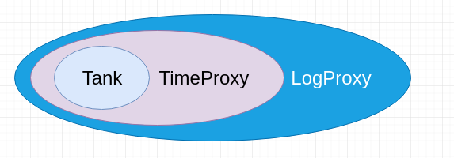
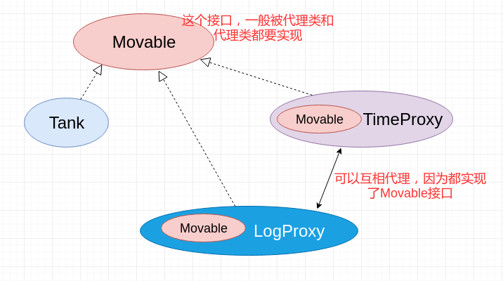

# 代理模式(一)

* [一、基本概念](#一基本概念)
* [二、静态代理](#)
* [三、基本动态代理](#基本动态代理)
* [四、CGLIB动态代理](#四cglib动态代理)


## 一、基本概念

代理模式是对象的结构模式。

**代理模式给某一个对象提供一个代理对象，并由代理对象控制对原对象的引用(接口的引用)**

## 二、静态代理

静态代理是指，代理类在程序运行前就已经定义好，其与**目标类(被代理类)**的关系在程序运行前就已经确立。

静态代理类似于企业与企业的法律顾问间的关系。法律顾问与企业的代理关系，并不
是在“官司“发生后才建立的，而是之前就确立好的一种关系。

代理可以看做就是在被代理对象外面包裹一层（和装饰者类似但又不同）:



两个代理类以及结构关系:



代码:

```java
public interface Movable {
    void move();
}
```

```java
public class Tank implements Movable {
    @Override
    public void move() {
        // 坦克移动
        System.out.println("Tank Moving......");
        try {
            Thread.sleep(new Random().nextInt(5000)); // 随机产生 1~5秒, 模拟坦克在移动　
        } catch (InterruptedException e) {
            e.printStackTrace();
        }
    }
}
```

两个代理类: `TankTimeProxy`和`TankLogProxy`:

```java
public class TankTimeProxy implements Movable {

    private Movable tank;

    public TankTimeProxy(Movable tank) {
        this.tank = tank;
    }

    @Override
    public void move() {
        // 在前面做一些事情: 记录开始时间
        long start = System.currentTimeMillis();

        tank.move();

        // 在后面做一些事情: 记录结束时间,并计算move()运行时间
        long end = System.currentTimeMillis();
        System.out.println("time : " + (end - start)/1000 + "s.");
    }
}
```

```java
public class TankLogProxy implements Movable {

    private Movable tank;

    public TankLogProxy(Movable tank) {
        this.tank = tank;
    }

    @Override
    public void move() {
        // tank 移动前记录日志
        System.out.println("Tank Log start.......");

        tank.move();

        // tank 移动后记录日志
        System.out.println("Tank Log end.......");
    }
}
```

测试:

```java
public class Client {
    public static void main(String[] args){
        Movable m = new TankLogProxy(new TankTimeProxy(new Tank()));    //先记录时间，再记录日志
//        Movable m = new TankTimeProxy(new TankLogProxy(new Tank())); //先记录日志，再记录时间
        m.move();
    }
}
```

输出:

```java
Tank Log start.......
Tank Moving......
time : 3s.
Tank Log end.......
```


## 三、基本动态代理

## 四、CGLIB动态代理
