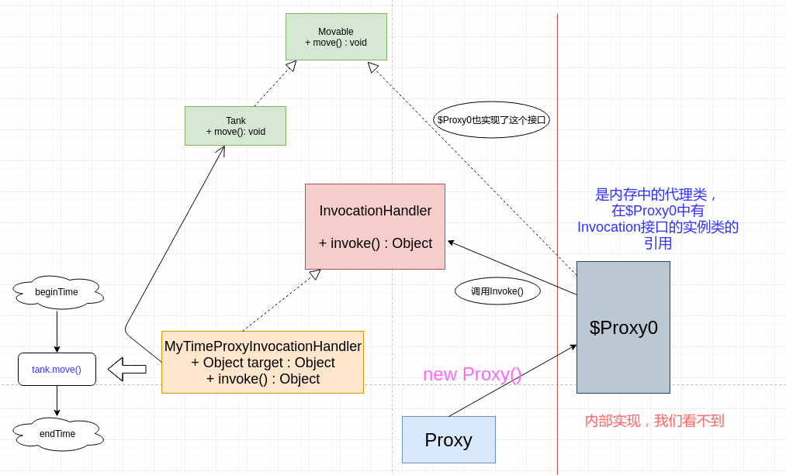

# 代理模式(一)

* [一、基本概念](#一基本概念)
* [二、静态代理](#)
* [三、基本动态代理](#基本动态代理)
* [四、CGLIB动态代理](#四cglib动态代理)

## 一、基本概念

代理模式是对象的结构模式。

**代理模式给某一个对象提供一个代理对象，并由代理对象控制对原对象的引用(接口的引用)**

## 二、静态代理

静态代理是指，代理类在程序运行前就已经定义好，其与**目标类(被代理类)**的关系在程序运行前就已经确立。

静态代理类似于企业与企业的法律顾问间的关系。**法律顾问与企业的代理关系，并不是在“官司“发生后才建立的，而是之前就确立好的一种关系**。

而动态代理就是外面打官司一样，是官司发生了之后临时请的律师。

代理可以看做就是在被代理对象外面包裹一层（和装饰者类似但又不同）:

**案例: 比如我们有一个可以移动的坦克，它的主要方法是`move()`，但是我们需要记录它移动的时间，以及在它移动前后做日志，其静态代理的实现模式就类似下面的图**:


两个代理类以及结构关系:


代码:

```java
public interface Movable {
    void move();
}
```

```java
public class Tank implements Movable {
    @Override
    public void move() {
        // 坦克移动
        System.out.println("Tank Moving......");
        try {
            Thread.sleep(new Random().nextInt(5000)); // 随机产生 1~5秒, 模拟坦克在移动　
        } catch (InterruptedException e) {
            e.printStackTrace();
        }
    }
}
```

两个代理类: `TankTimeProxy`和`TankLogProxy`:

```java
public class TankTimeProxy implements Movable {

    private Movable tank;

    public TankTimeProxy(Movable tank) {
        this.tank = tank;
    }

    @Override
    public void move() {
        // 在前面做一些事情: 记录开始时间
        long start = System.currentTimeMillis();
        System.out.println("start time : " + start);

        tank.move();

        // 在后面做一些事情: 记录结束时间,并计算move()运行时间
        long end = System.currentTimeMillis();
        System.out.println("end time : " + end);
        System.out.println("spend all time : " + (end - start)/1000 + "s.");
    }
}
```

```java
public class TankLogProxy implements Movable {

    private Movable tank;

    public TankLogProxy(Movable tank) {
        this.tank = tank;
    }

    @Override
    public void move() {
        // tank 移动前记录日志
        System.out.println("Tank Log start.......");

        tank.move();

        // tank 移动后记录日志
        System.out.println("Tank Log end.......");
    }
}
```

测试:

```java
public class Client {
    public static void main(String[] args){
        Movable target = new TankLogProxy(new TankTimeProxy(new Tank()));    //先记录时间，再记录日志
//        Movable target = new TankTimeProxy(new TankLogProxy(new Tank())); //先记录日志，再记录时间
        target.move();
    }
}
```

输出:

```java
Tank Log start.......
start time : 1551271511619
Tank Moving......
end time : 1551271514522
spend all time : 2s.
Tank Log end.......
```

这其中有两个很重要的点，那就是:

* 两个代理对象内部都**有着被代理对象(target)实现的接口的引用**；
* 且两个代理对象都**实现了被代理对象(target)实现的接口**；

## 三、基本动态代理

上面静态代理的缺点在哪?

**现在单看做时间这个代理，如果我们现在多了一个飞机，飞机里面的方法是`fly()`，现在要给飞机做代理，那么我们不能用之前写的`TankTimeProxy`，我们需要额外的写一个`PlaneTimeProxy`，这明显是冗余代码，所以这就是静态代理最大的缺点，这可以用动态代理解决**。

动态代理是指，**程序在整个运行过程中根本就不存在目标类的代理类(在JDK内部叫`$Proxy0`，我们看不到)**，目标对象的代理对象只是由代理生成工具(如代理工厂类) 在程序运行时由 JVM 根据反射等机制动态生成的。代理对象与目标对象的代理关系在程序运行时才确立。

对比静态代理，静态代理是指在程序运行前就已经定义好了目标类的代理类。代理类与目标类的代理关系在程序运行之前就确立了。

首先看动态代理的一些特点:

* 动态代理不需要写出代理类的名字，你要的代理对象我直接给你产生，是使用的时候生成的；
* 只需要调用`Proxy.newProxyInstance()`就可以给你产生代理类；

下面看使用动态代理解决上面的问题(可以用`TimeProxy`代理一切对象):

```java
public interface Movable {
    void move();
}
```

```java
public class Tank implements Movable {
    @Override
    public void move() {
        // 坦克移动
        System.out.println("Tank Moving......");
        try {
            Thread.sleep(new Random().nextInt(5000)); // 随机产生 1~5秒, 模拟坦克在移动　
        } catch (InterruptedException e) {
            e.printStackTrace();
        }
    }
}
```

新增的飞机:

```java
public interface Flyable {
    void fly();
}
```

```java
public class Plane implements Flyable{
    @Override
    public void fly() {
        System.out.println("Plane Flying......");
        try {
            Thread.sleep(new Random().nextInt(5000)); // 随机产生 1~5秒, 飞机在飞行　
        } catch (InterruptedException e) {
            e.printStackTrace();
        }
    }
}
```

我们的关键处理，即编写`MyTimeProxyInvocationHandler`:

```java
// 静态代理做不到既为飞机做时间代理，又为坦克做时间代理，但是动态代理可以为所有对象做代理
public class MyTimeProxyInvocationHandler implements InvocationHandler {

    private Object target;//注意这里是 Object ，不是Movable或者Flyable

    public MyTimeProxyInvocationHandler(Object target) {
        this.target = target;
    }

    // proxy  : 代理对象  可以是一切对象 (Object)
    // method : 目标方法
    // args   : 目标方法的参数
    @Override
    public Object invoke(Object proxy, Method method, Object[] args) throws Throwable {

        // 在前面做一些事情: 记录开始时间
        long start = System.currentTimeMillis();
        System.out.println("start time : " + start);

        method.invoke(target, args); // 调用目标方法  invoke是调用的意思, 可以有返回值的方法(我们这里move和fly都没有返回值)

        // 在后面做一些事情: 记录结束时间,并计算move()运行时间
        long end = System.currentTimeMillis();
        System.out.println("end time : " + end);
        System.out.println("spend all time : " + (end - start)/1000 + "s.");

        return null;
    }
}
```

最后测试类:

```java
public class Client {
    public static void main(String[] args){
        Movable tank = new Tank();
        //可以为所有对象产生时间代理的 InvocationHandler
        MyTimeProxyInvocationHandler myInvocationHandler = new MyTimeProxyInvocationHandler(tank);
        Movable tankProxy = (Movable) Proxy.newProxyInstance(
                tank.getClass().getClassLoader(),
                tank.getClass().getInterfaces(),
                myInvocationHandler
        );
        tankProxy.move();

        System.out.println("--------------------");

        Flyable plane = new Plane();
        myInvocationHandler = new MyTimeProxyInvocationHandler(plane);
        // 为飞机产生代理, 为..产生代理，这样可以为很多东西产生代理，静态代理做不到
        Flyable planeProxy = (Flyable) Proxy.newProxyInstance(
                plane.getClass().getClassLoader(),
                plane.getClass().getInterfaces(),
                myInvocationHandler
        );
        planeProxy.fly();
    }
}
```

输出(同时为`Tank`和`Plane`做了代理):

```java
start time : 1551275526486
Tank Moving......
end time : 1551275531193
spend all time : 4s.
--------------------
start time : 1551275531195
Plane Flying......
end time : 1551275532996
spend all time : 1s.
```

我们分析一下这个代理过程:



调用过程(重要):

* JDK内部的`Proxy`类在内部创建了一个`$Proxy0`的代理对象(它实现了目标对象所在接口`Movable`；
* `$Proxy0`内部有`InvocationHandler`接口的引用，然后在`$Proxy`中调用了接口的`invoke()`方法；
* 而我们将`InvocationHandler`接口的实现类传入了`Proxy`，所以我们在实现类中加入的前后逻辑就会得到执行；

如果这里还不够理解，可以看代理模式(二)，会模拟实现JDK的底层实现。

## 四、CGLIB动态代理