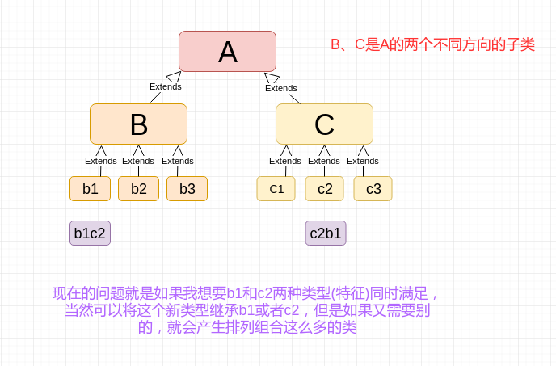
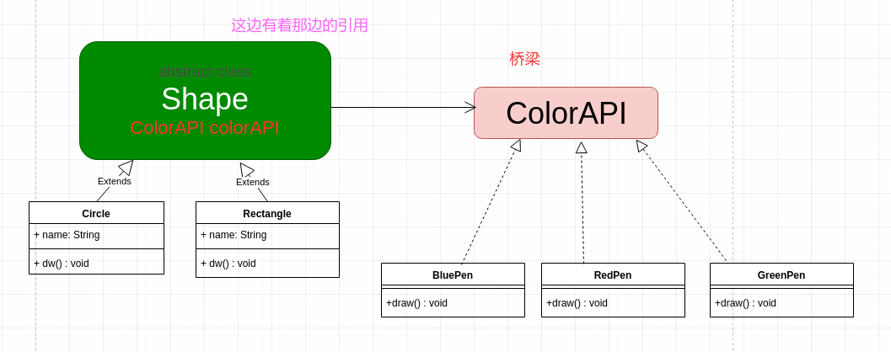
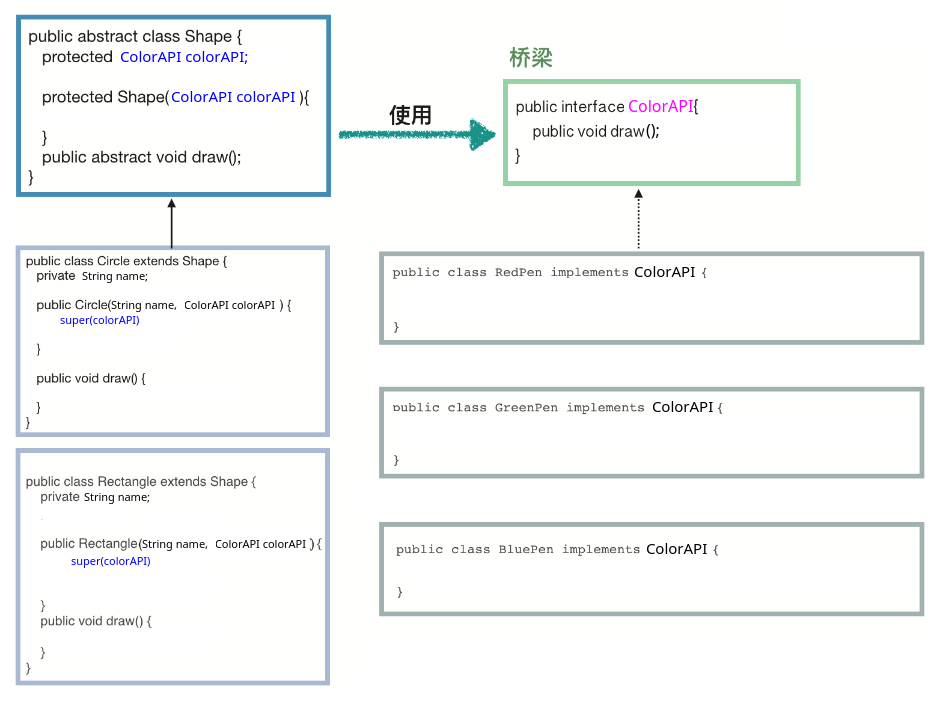

# 桥接模式

* [一、基本概念](#一基本概念)
* [二、案例](#二、案例)
* [三、总结](#三总结)

## 一、基本概念

桥接模式属于结构型模式。

桥接模式其实只需要记住关键的一点: **解决的是不同的子类之间排列组合可以构成巨多的类的问题**。

比如:



举个例子，你要画画了，画画本身是一个类，你画画要考虑画什么形状(`Shape`) (`A`)，你画画还需要考虑用什么颜色去画(`Color`)(`B`)。

形状可以有圆、长方形、正方形....，而颜色可以用红、蓝、绿.....。

那我现在要用蓝笔画长方形，这是一种新的组合，用红笔画长方形，又是一种组合，这样会产生很多的排列组合，如果我们都写一个类，那就是不好的设计了。

## 二、案例

就用上面那个画画的例子来引出我们的桥接模式。

我们的改造就是。不需要那个`A`类了，而是在形状类`B`类这边有这`C`类(这里改成接口， 也可以用类)的引用。

具体结构如下:



然后还有一个关键的点:

注意一定要在`Shape`中有`ColorAPI`的引用，而且子类也要调用父类的构造函数。

```java
public interface ColorAPI {
    void draw(String name);
}
```

颜色(`B`)这边的三个实现类:	

```java
public class BluePen implements ColorAPI {
    @Override
    public void draw(String name) {
        System.out.println("用蓝笔画 " + name);
    }
}
public class GreenPen implements ColorAPI {
    @Override
    public void draw(String name) {
        System.out.println("用绿笔画 " + name);
    }
}
public class RedPen implements ColorAPI {
    @Override
    public void draw(String name) {
        System.out.println("用红笔画 " + name);
    }
}
```

形状这边的大父类(`A`):

```java
public abstract class Shape {

    protected ColorAPI colorAPI;  //这个父类必须要有 另一边的引用

    protected Shape(ColorAPI colorAPI) {
        this.colorAPI = colorAPI;
    }
    public abstract void dw(); // color
}
```

形状的实现类:

```java
public class Circle extends Shape {

    private String name;

    public Circle(String name, ColorAPI colorAPI) {
        super(colorAPI);
        this.name = name;
    }
    @Override
    public void dw() {
        colorAPI.draw(name);
    }
}
```

```java
public class Rectangle extends Shape {

    private String name;

    public Rectangle(String name, ColorAPI colorAPI) {
        super(colorAPI);
        this.name = name;
    }

    @Override
    public void dw() {
        colorAPI.draw(name);
    }
}
```

测试:

```java
//桥接模式简单的说:  解决排列组合导致组合类巨多的问题
public class Test {

    public static void main(String[] args){
        Shape blueRectangle = new Rectangle("长方形", new BluePen());
        blueRectangle.dw();

        Shape redCircle = new Circle("圆", new RedPen());
        redCircle.dw();
    }
}
```

输出:

```java
用蓝笔画 长方形
用红笔画 圆
```

再看一下整体框架图:



## 三、总结

对于两个独立变化的维度，使用桥接模式再适合不过了。实现减少排列组合减少的类。