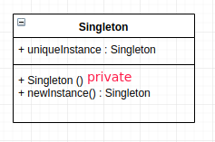

# 单例模式

* [一、基本概念](#一基本概念)
* [二、结构](#二结构)
* [三、几类经典单例模式实现](#三几类经典单例模式实现)
  * [1、懒汉式-线程不安全](#1懒汉式-线程不安全)
  * [2、懒汉式-线程安全-性能不好](#2懒汉式-线程安全-性能不好)
  * [3、饿汉式-线程安全-无延迟加载](#3饿汉式-线程安全-无延迟加载)
  * [4、双重校验锁-线程安全](#4双重校验锁-线程安全)
  * [5、静态内部类实现](#5静态内部类实现)
  * [6、枚举实现](#6枚举实现)
* [四、总结](#四总结)

## 一、基本概念

单例模式属于创建型设计模式。

确保一个类只有一个实例，并提供该实例的全局访问点。

实现: **使用一个私有构造函数、一个私有静态变量以及一个公有静态函数来实现**。

## 二、结构

类图:



**私有构造函数保证了不能通过构造函数来创建对象实例，只能通过公有静态函数返回唯一的私有静态变量**。

## 三、几类经典单例模式实现

### 1、懒汉式-线程不安全

下面的实现中，私有静态变量 `uniqueInstance` 被延迟实例化，这样做的好处是，如果没有用到该类，那么就不会实例化 `uniqueInstance`，从而节约资源。

这个实现在多线程环境下是不安全的，如果多个线程能够同时进入 `if (uniqueInstance == null)` ，并且此时 `uniqueInstance == null`，那么会有多个线程执行 `uniqueInstance = new Singleton();` 语句，这将导致实例化多次 `uniqueInstance`。

```java
// 懒汉式: 线程不安全
// 有延迟加载: 不是在类加载的时候就创建了，而是在调用newStance()的时候才会创建
public class Singleton {

    private static Singleton uniqueInstance;

    private Singleton(){

    }

    public static Singleton newInstance(){
        if(uniqueInstance == null)
            uniqueInstance = new Singleton();
        return uniqueInstance;
    }
}
```

### 2、懒汉式-线程安全-性能不好

为了解决上面的问题，我们可以直接在`newInstance()`方法上面直接加上一把`synchronized`同步锁。那么在一个时间点只能有一个线程能够进入该方法，从而避免了实例化多次 `uniqueInstance`。

但是当一个线程进入该方法之后，其它试图进入该方法的线程都必须等待，即使 `uniqueInstance` 已经被实例化了。这会让线程阻塞时间过长，因此该方法有性能问题，**不推荐使用**。 

```java
public static synchronized Singleton newInstance(){//在上面的基础上加了synchronized
    if(uniqueInstance == null)
        uniqueInstance = new Singleton();
    return uniqueInstance;
}
```

### 3、饿汉式-线程安全-无延迟加载

饿汉式就是 : 采取直接实例化 `uniqueInstance` 的方式，这样就不会产生线程不安全问题。

这种方式比较常用，但容易产生垃圾对象(丢失了延迟实例化(`lazy loading`)带来的节约资源的好处)。

它基于 **classloader机制**避免了多线程的同步问题，不过，instance 在类装载时就实例化，虽然导致类装载的原因有很多种，在单例模式中大多数都是调用 getInstance 方法， **但是也不能确定有其他的方式（或者其他的静态方法）导致类装载，这时候初始化 instance 显然没有达到 lazyloading 的效果**。 

```java
public class Singleton {

    // 急切的创建了uniqueInstance, 所以叫饿汉式
    private static Singleton uniqueInstance = new Singleton();

    private Singleton(){
    }

    public static Singleton newInstance(){
        return uniqueInstance;
    }

    // 瞎写一个静态方法。这里想说的是，如果我们只是要调用 Singleton.getStr(...)，
    // 本来是不想要生成 Singleton 实例的，不过没办法，已经生成了
    public static String getStr(String str) {return "hello" + str;}
}
```

### 4、双重校验锁-线程安全

`uniqueInstance` 只需要被实例化一次，之后就可以直接使用了。**加锁操作只需要对实例化那部分的代码进行**，只有当` uniqueInstance` 没有被实例化时，才需要进行加锁。

双重校验锁**先判断 `uniqueInstance` 是否已经被实例化，如果没有被实例化，那么才对实例化语句进行加锁**。

```java
// 双重加锁
public class Singleton {

    // 和饿汉模式相比，这边不需要先实例化出来
    // 注意这里的 volatile，使用 volatile 可以禁止 JVM 的指令重排，保证在多线程环境下也能正常运行
    private volatile static Singleton uniqueInstance;

    private Singleton() {
    }

    public static Singleton newInstance() {
        if (uniqueInstance == null) {
            synchronized (Singleton.class) {
                // 这一次判断也是必须的，不然会有并发问题
                if (uniqueInstance == null) {
                    uniqueInstance = new Singleton();
                }
            }
        }
        return uniqueInstance;
    }
}
```

> 注意，内层的第二次`if (uniqueInstance == null) {`也是必须的，如果不加:
> 也就是只使用了一个 if 语句。在 `uniqueInstance == null` 的情况下，如果两个线程都执行了 if 语句，那么两个线程都会进入 if 语句块内。虽然在 if 语句块内有加锁操作，但是两个线程都会执行 `uniqueInstance = new Singleton();`这条语句，只是先后的问题，那么就会进行两次实例化。因此必须使用双重校验锁，也就是需要使用两个 if 语句。

`volatile` 关键字修饰也是很有必要的， `uniqueInstance = new Singleton();` 这段代码其实是分为三步执行：

* 1)、为 `uniqueInstance` 分配内存空间；
* 2)、初始化 `uniqueInstance`；
* 3)、将 `uniqueInstance` 指向分配的内存地址；

但是由于 JVM 具有**指令重排**的特性，执行顺序有可能变成 `1>3>2`。指令重排在单线程环境下不会出现问题，但是在多线程环境下会导致一个线程获得还没有初始化的实例。例如，线程 `T1` 执行了 1 和 3，此时 `T2 `调用 `newInstance()` 后发现 `uniqueInstance` 不为空，因此返回 `uniqueInstance`，但此时 `uniqueInstance` 还未被初始化。

**使用 volatile 可以禁止 JVM 的指令重排，保证在多线程环境下也能正常运行**。

### 5、静态内部类实现

当 `Singleton` 类加载时，**静态内部类 Holder 没有被加载进内存**。只有当调用 `newInstance()` 方法从而触发 `Holder.uniqueInstance` 时 `Holder `才会被加载，此时初始化` uniqueInstance` 实例，并且 JVM 能确保 `uniqueInstance` 只被实例化一次。

这种方式不仅具有延迟初始化的好处，而且由 JVM 提供了对线程安全的支持。

> 这种方式是 Singleton 类被装载了，`uniqueInstance` 不一定被初始化。因为 `Holder`s 类没有被主动使用，只有通过显式调用 `newInstance() `方法时，才会显式装载 Holder 类，从而实例化` uniqueInstance`。

```java
public class Singleton {

    private Singleton() {
    }

    // 主要是使用了 嵌套类可以访问外部类的静态属性和静态方法 的特性
    // 很多人都会把这个嵌套类说成是静态内部类，严格地说，内部类和嵌套类是不一样的，它们能访问的外部类权限也是不一样的。
    private static class Holder {
        private static final Singleton uniqueInstance = new Singleton();
    }
    public static Singleton newInstance() {
        return Holder.uniqueInstance;
    }
}
```

### 6、枚举实现

这种实现方式还没有被广泛采用，但这是实现单例模式的最佳方法。它更简洁，自动支持序列化机制，绝对防止多次实例化。

该实现在多次序列化再进行反序列化之后，不会得到多个实例。而其它实现需要使用 `transient` 修饰所有字段，并且实现序列化和反序列化的方法。

```java
public enum Singleton {

    INSTANCE;

    private String name;

    public String getName() {
        return name;
    }

    public void setName(String name) {
        this.name = name;
    }
}
```

测试:

```java
public class Test {

    public static void main(String[] args){
        // 单例测试
        Singleton s1 = Singleton.INSTANCE;
        s1.setName("firstName");
        System.out.println("s1.getName(): " + s1.getName());

        Singleton s2 = Singleton.INSTANCE;
        s2.setName("secondName");

        //注意我这里输出s1 ，但是已经变成了 secondName
        System.out.println("s1.getName(): " + s1.getName());
        System.out.println("s2.getName(): " + s2.getName());

        System.out.println("-----------------");

        // 反射获取实例测试
        Singleton[] enumConstants = Singleton.class.getEnumConstants();
        for (Singleton enumConstant : enumConstants)
            System.out.println(enumConstant.getName());
    }
}
```

输出:

```java
s1.getName(): firstName
s1.getName(): secondName
s2.getName(): secondName
-----------------
secondName
```

> 该实现可以防止反射攻击。在其它实现中，通过 `setAccessible()`(反射中的强制访问私有属性方法) 方法可以将私有构造函数的访问级别设置为 public，然后调用构造函数从而实例化对象，如果要防止这种攻击，需要在构造函数中添加防止多次实例化的代码。该实现是由 JVM 保证只会实例化一次，因此不会出现上述的反射攻击。

## 四、总结

一般情况下，**不建议使用懒汉方式**，建议使用饿汉方式。

只有在要明确实现 `lazy loading` 效果时，才会使用**静态内部类方式**。

如果涉及到**反序列化创建对象**时，可以尝试使用枚举方式。

如果有其他特殊的需求，可以考虑使用双检锁方式。