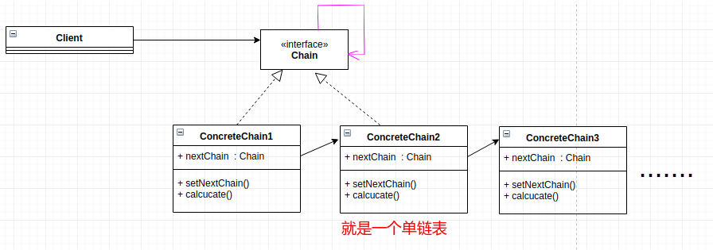
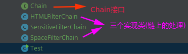

# 责任链模式

* [一、基本概念](#一基本概念)
* [二、结构](#二结构)
* [三、案例](#三案例)
* [四、总结](#四总结)

## 一、基本概念

使多个对象都有机会处理请求，从而避免请求的发送者和接收者之间的耦合关系。

将这些对象连成一条链，并沿着这条链发送该请求，直到有一个对象处理它(或者可以有多个处理它)。

## 二、结构

基本结构:



下面很好的解释了`Chain`和`ConcreteChain`的作用:

- **Chain (Handler) ** : This can be an interface which will primarily recieve the request and dispatches the request to chain of handlers. It has reference of only first handler in the chain and does not know anything about rest of the handlers.
- **Concrete Chain ( handlers) ** : These are actual handlers of the request chained in some sequential order.

简单来说，就是`Chain`是链里面所有处理方法的公共接口，然后链会有一个开始的起点处理器，然后我们的`request`会被这条链的处理器处理。

即需要先建立一个单向链表，然后调用方只需要调用头部节点就可以了，后面会自动流转下去。

## 三、案例

> 我们要实现对一个文本字符串的过滤(比如某个网站，有人发表评论，我们需要过滤不好的信息)。

代码组织结构:



代码:

```java
// 也可以写成　Handler
public interface Chain {

    void setNextChain(Chain nextChain);  //也有写成successor的

    String handle(String request);  //也有写成 handleRequest
}
```

下面是实现`Chain`接口的三个处理类，**它们组成了一条链(单链表)**：

```java
// 链中的第一个处理 : ConcreteChain1 : 处理html代码
public class HTMLFilterChain implements Chain {

    private Chain nextChain;

    @Override
    public void setNextChain(Chain nextChain) {
        this.nextChain = nextChain;
    }

    @Override
    public String handle(String request) {
        if(request.contains("<html>") || request.contains("<body>")){
            request = request.replace("<html>", "").replace("<body>", "");
        }
        // 链式处理完
        if(nextChain != null)
            request = nextChain.handle(request);
        return request;
    }
}
```

```java
// 链中的第二个处理 : ConcreteChain2  : 处理敏感信息
public class SensitiveFilterChain implements Chain {

    private Chain nextChain;

    @Override
    public void setNextChain(Chain nextChain) {
        this.nextChain = nextChain;
    }

    @Override
    public String handle(String request) {
        if(request.contains("敏感")){
            request = request.replace("敏感", "");
        }
        // 链式处理完
        if(nextChain != null)
            request = nextChain.handle(request);
        return request;
    }
}
```

```java
// 链中的第三个处理: ConcreteChain3 : 处理空格: 但是我们的测试例子中没有用到这个
public class SpaceFilterChain implements Chain {

    private Chain nextChain;

    @Override
    public void setNextChain(Chain nextChain) {
        this.nextChain = nextChain;
    }

    @Override
    public String handle(String request) {
        if(request.contains(" ")){
            request = request.replace(" ", "");
        }
        // 链式处理完
        if(nextChain != null)
            request = nextChain.handle(request);
        return request;
    }
}
```

测试:

```java
public class Test {
    public static void main(String[] args) {

        Chain c1 = new HTMLFilterChain();      // 过滤字符串的html
        Chain c2 = new SensitiveFilterChain(); // 过来字符串的敏感信息
        Chain c3 = new SpaceFilterChain();     //过滤字符串的空格

        c1.setNextChain(c2); // 也可以通过构造函数设置某个的nextChain
        c2.setNextChain(c3);

        String notGoodStr = "<html>爱祖国，爱人民，我很敏感<body>"; // 里面有html和敏感信息要去除(没有空格)

        notGoodStr = c1.handle(notGoodStr);

        System.out.println(notGoodStr); // good Str
    }
}
```

输出:

```java
爱祖国，爱人民，我很
```

## 四、总结

给出自己参考的两个博客。

* [博客1](http://www.newthinktank.com/2012/10/chain-of-responsibility-design-pattern-tutorial/)。
* [博客2](https://www.geeksforgeeks.org/chain-responsibility-design-pattern/)。