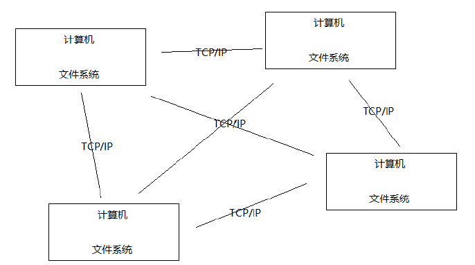

# FastDFS

安装FastDFS这篇文章最好:<https://www.cnblogs.com/chiangchou/p/fastdfs.html> （这里用单服务器）

## 一、分布式文件系统

为什么会有分布文件系统呢？

分布式文件系统是面对互联网的需求而产生，互联网时代对海量数据如何存储？靠简单的增加硬盘的个数已经满足
不了我们的要求，因为硬盘传输速度有限但是数据在急剧增长，另外我们还要要做好数据备份、数据安全等。
**采用分布式文件系统可以将多个地点的文件系统通过网络连接起来，组成一个文件系统网络，结点之间通过网络进**
**行通信，一台文件系统的存储和传输能力有限，我们让文件在多台计算机上存储，通过多台计算共同传输**。如下

好处：

1、一台计算机的文件系统处理能力扩充到多台计算机同时处理。

2、一台计算机挂了还有另外副本计算机提供数据。

3、每台计算机可以放在不同的地域，这样用户就可以就近访问，提高访问速度。

为什么选择FastDFS？

NFS、GFS都是通用的分布式文件系统，通用的分布式文件系统的优点的是开发体验好，但是系统复杂
性高、性能一般，而专用的分布式文件系统虽然开发体验性差，但是系统复杂性低并且性能高。

**fastDFS非常适合存储图片等那些小文件，fastDFS不对文件进行分块，所以它就没有分块合并的开销，fastDFS网络通信采用socket，通信速度很快**。

## 二、FastDFS组成

**客户请求Tracker server进行文件上传、下载，通过Trackerserver调度最终由Storage server完成上传和下载**。

FastDFS 系统有三个角色：跟踪服务器(Tracker Server)、存储服务器(Storage Server)和客户端(Client)。

* **Tracker Server**：跟踪服务器，主要做调度工作，起到均衡的作用；负责管理所有的 storage server和 group，每个 storage 在启动后会连接 Tracker，告知自己所属 group 等信息，并保持周期性心跳。
* **Storage Server**：存储服务器，主要提供容量和备份服务；以 group 为单位，每个 group 内可以有多台 storage server，数据互为备份。
* **Client**：客户端，上传下载数据的服务器，也就是我们自己的项目所部署在的服务器。

1）Tracker

Tracker Server作用是负载均衡和调度，通过Tracker server在文件上传时可以根据一些策略找到Storage server提
供文件上传服务。可以将tracker称为追踪服务器或调度服务器。

FastDFS集群中的Tracker server可以有多台，Tracker server之间是相互平等关系同时提供服务，Tracker server
不存在单点故障。客户端请求Tracker server采用轮询方式，如果请求tracker无法提供服务则换另一台tracker。

2）Storage

Storage Server作用是文件存储，客户端上传的文件最终存储在Storage服务器上，Storage server没有实现自己
的文件系统而是使用操作系统的文件系统来管理文件。可以将storage称为存储服务器。

Storage集群采用了**分组存储方式**。storage集群由一个或多个组构成，集群存储总容量为集群中所有组的存储容
量之和。一个组由一台或多台存储服务器组成，组内的Storage server之间是平等关系，不同组的Storage server
之间不会相互通信，同组内的Storage server之间会相互连接进行文件同步，从而保证同组内每个storage上的文件完全一致的(备份、负载)。一个组的存储容量为该组内的存储服务器容量最小的那个，由此可见组内存储服务器的软硬件配置最好是一致的。

采用分组存储方式的好处是灵活、可控性较强。比如上传文件时，可以由客户端直接指定上传到的组也可以由
tracker进行调度选择。一个分组的存储服务器访问压力较大时，可以在该组增加存储服务器来扩充服务能力（纵向扩容）。当系统容量不足时，可以增加组来扩充存储容量（横向扩容）。当存储空间不足或即将耗尽时，可以动态添加卷。只需要增加一台或多台服务器，并将它们配置为一个新的组，这样就扩大了存储系统的容量。

3）Storage状态收集

Storage server会连接集群中所有的Tracker server，定时向他们报告自己的状态，包括磁盘剩余空间、文件同步
状况、文件上传下载次数等统计信息。

## 三、FastDFS文件上传流程

客户端上传文件后存储服务器将文件ID返回给客户端，**此文件ID用于以后访问该文件的索引信息**。文件索引信息
包括：组名，虚拟磁盘路径，数据两级目录，文件名。

当Tracker收到客户端上传文件的请求时，会为该文件分配一个可以存储文件的group，当选定了group后就要决定给客户端分配group中的哪一个storage server。当分配好storage server后，客户端向storage发送写文件请求，storage将会为文件分配一个数据存储目录。**然后为文件分配一个fileid**，最后根据以上的信息生成文件名存储文件。

* **组名**：文件上传后所在的storage组名称，在文件上传成功后有storage服务器返回，需要客户端自行保存。
* **虚拟磁盘路径**：storage配置的虚拟路径，与磁盘选项store_path*对应。如果配置了store_path0则是M00，
  如果配置了store_path1则是M01，以此类推。
* **数据两级目录**：storage服务器在每个虚拟磁盘路径下创建的两级目录，用于存储数据文件。
* **文件名**：与文件上传时不同。是由存储服务器根据特定信息生成，文件名包含：源存储服务器IP地址、文件创
  建时间戳、文件大小、随机数和文件拓展名等信息。

## 四、FastDFS文件下载流程

客户端uploadfile成功后，会拿到一个storage生成的文件名，接下来客户端根据这个文件名即可访问到该文件。

tracker根据请求的文件路径即**文件ID** 来快速定义文件。

比如请求下边的文件：

1、通过组名tracker能够很快的定位到客户端需要访问的**存储服务器组是group1**，并选择合适的存储服务器提供客户端访问。
2、存储服务器根据"文件存储虚拟磁盘路径"和"数据文件两级目录"可以很快定位到文件所在目录，并根据文件名找到客户端需要访问的文件。

## 五、FastDFS的文件同步

写文件时，客户端将文件写至group内一个storage server即认为写文件成功，storage server写完文件后，会由**后台线程**将文件同步至同group内其他的storage server。

每个storage写文件后，同时会写一份binlog，binlog里不包含文件数据，只包含文件名等元信息，这份binlog用于后台同步，storage会记录向group内其他storage同步的进度，以便重启后能接上次的进度继续同步；进度以时间戳的方式进行记录，所以最好能保证集群内所有server的时钟保持同步。

storage的同步进度会作为元数据的一部分汇报到tracker上，tracke在选择读storage的时候会以同步进度作为参考。

## 六、Nginx配置

在 storage server 上安装 nginx 的目的是对外通过 http 访问 storage server 上的文 件。使用 nginx 的模块
FastDFS-nginx-module 的作用是**通过 http 方式访问 storage 中 的文件**，当 storage 本机没有要找的文件时向源
storage 主机代理请求文件。

图片服务虚拟主机的作用是负载均衡，将图片请求转发到storage server上。

