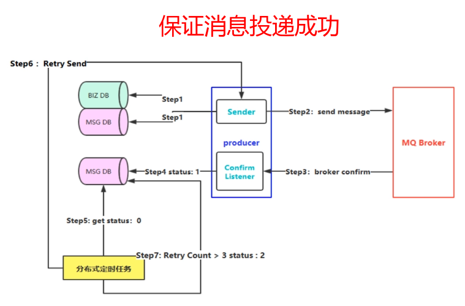

# RabbitMQ

## 一、MQ特点

MQ特点: 

* 异步请求: 将消息放到队列，就可以做别的事情，不需要等待返回结果；
* 降低耦合性；
* 缓冲的作用(防止直接压垮消费者)；

## 二、RabbitMQ解决的问题

RabbitMQ是用来干啥的?

 1）信息的发送者和接收者如何维持这个连接，如果一方的连接中断，这期间的数据如何方式丢失？

 2）如何降低发送者和接收者的耦合度？

 3）如何让Priority高的接收者先接到数据？

 4）如何做到load balance？有效均衡接收者的负载？

 5）如何有效的将数据发送到相关的接收者？也就是说将接收者subscribe 不同的数据，如何做有效的filter。

 6）如何做到可扩展，甚至将这个通信模块发到cluster上？

 7）如何保证接收者接收到了完整，正确的数据？

和SpringAMQP兼容。

`Advanced Message Queueing Protoco` : 高级消息队列协议。

生产者发送消息的时候，要先指明要发送到哪一个`exchange`上。而且还要指定一个路由`key`。

由于队列和路由`key`也有一个绑定的关系。

* Step 1： 首先把消息信息(业务数据）存储到数据库中，紧接着，我们再把这个消息记录也存储到一张消息记录表里（或者另外一个同源数据库的消息记录表）

* Step 2：发送消息到MQ Broker节点（采用confirm方式发送，会有异步的返回结果）

* Step 3、4：生产者端接受MQ Broker节点返回的Confirm确认消息结果，然后进行更新消息记录表里的消息状态。比如默认Status = 0 当收到消息确认成功后，更新为1即可！

* Step 5：但是在消息确认这个过程中可能由于网络闪断、MQ Broker端异常等原因导致 回送消息失败或者异常。这个时候就需要发送方（生产者）对消息进行可靠性投递了，保障消息不丢失，100%的投递成功！（有一种极限情况是闪断，Broker返回的成功确认消息，但是生产端由于网络闪断没收到，这个时候重新投递可能会造成消息重复，需要消费端去做幂等处理）所以我们需要有一个定时任务，（比如每5分钟拉取一下处于中间状态的消息，当然这个消息可以设置一个超时时间，比如超过1分钟 Status = 0 ，也就说明了1分钟这个时间窗口内，我们的消息没有被确认，那么会被定时任务拉取出来）

* Step 6：接下来我们把中间状态的消息进行重新投递 retry send，继续发送消息到MQ ，当然也可能有多种原因导致发送失败

* Step 7：我们可以采用设置最大努力尝试次数，比如投递了3次，还是失败，那么我们可以将最终状态设置为Status = 2 ，最后 交由人工解决处理此类问题（或者把消息转储到失败表中）。

 