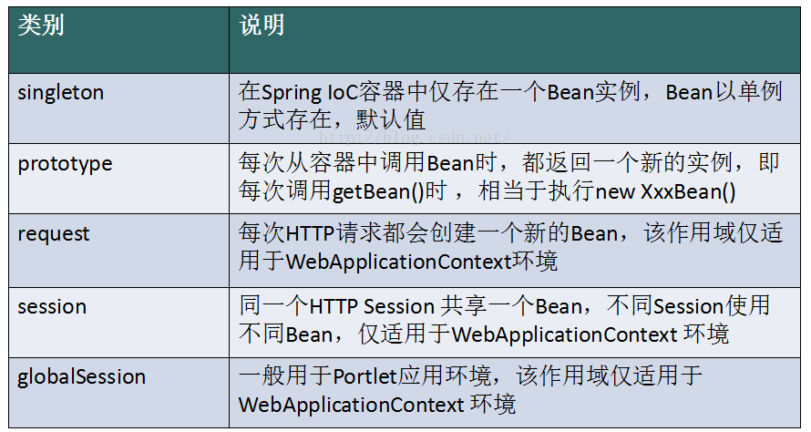
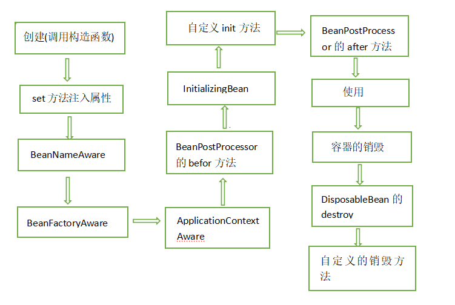

<https://blog.csdn.net/it_man/article/details/4402245>

<https://blog.csdn.net/luoshenfu001/article/details/5816408>

## IoC（Inversion of Control）  

 1、IoC（Inversion of Control）是指容器控制程序对象之间的关系，而不是传统实现中，由程序代码直接操控。控制权由应用代码中转到了外部容器，控制权的转移是所谓反转。 对于Spring而言，就是由Spring来控制对象的生命周期和对象之间的关系；IoC还有另外一个名字——“依赖注入（Dependency Injection）”。从名字上理解，所谓依赖注入，即组件之间的依赖关系由容器在运行期决定，即由容器动态地将某种依赖关系注入到组件之中。  

2、在Spring的工作方式中，所有的类都会在spring容器中登记，告诉spring这是个什么东西，你需要什么东西，然后spring会在系统运行到适当的时候，把你要的东西主动给你，同时也把你交给其他需要你的东西。所有的类的创建、销毁都由 spring来控制，也就是说控制对象生存周期的不再是引用它的对象，而是spring。对于某个具体的对象而言，以前是它控制其他对象，现在是所有对象都被spring控制，所以这叫控制反转。

3、在系统运行中，动态的向某个对象提供它所需要的其他对象。  

4、依赖注入的思想是通过反射机制实现的，在实例化一个类时，它通过反射调用类中set方法将事先保存在HashMap中的类属性注入到类中。 总而言之，在传统的对象创建方式中，通常由调用者来创建被调用者的实例，而在Spring中创建被调用者的工作由Spring来完成，然后注入调用者，即所谓的依赖注入or控制反转。 注入方式有两种：依赖注入和设置注入； IoC的优点：降低了组件之间的耦合，降低了业务对象之间替换的复杂性，使之能够灵活的管理对象。

## AOP（Aspect Oriented Programming）

(1). AOP面向方面编程基于IoC，是对OOP的有益补充；

(2). AOP利用一种称为“横切”的技术，剖解开封装的对象内部，并将那些影响了 多个类的公共行为封装到一个可重用模块，并将其名为“Aspect”，即方面。所谓“方面”，简单地说，就是将那些与业务无关，却为业务模块所共同调用的 逻辑或责任封装起来，比如日志记录，便于减少系统的重复代码，降低模块间的耦合度，并有利于未来的可操作性和可维护性。

(3). AOP代表的是一个横向的关 系，将“对象”比作一个空心的圆柱体，其中封装的是对象的属性和行为；则面向方面编程的方法，就是将这个圆柱体以切面形式剖开，选择性的提供业务逻辑。而 剖开的切面，也就是所谓的“方面”了。然后它又以巧夺天功的妙手将这些剖开的切面复原，不留痕迹，但完成了效果。

(4). 实现AOP的技术，主要分为两大类：一是采用动态代理技术，利用截取消息的方式，对该消息进行装饰，以取代原有对象行为的执行；二是采用静态织入的方式，引入特定的语法创建“方面”，从而使得编译器可以在编译期间织入有关“方面”的代码。

(5). Spring实现AOP：JDK动态代理和CGLIB代理 JDK动态代理：其代理对象必须是某个接口的实现，它是通过在运行期间创建一个接口的实现类来完成对目标对象的代理；其核心的两个类是InvocationHandler和Proxy。 CGLIB代理：实现原理类似于JDK动态代理，只是它在运行期间生成的代理对象是针对目标类扩展的子类。CGLIB是高效的代码生成包，底层是依靠ASM（开源的java字节码编辑类库）操作字节码实现的，性能比JDK强；需要引入包asm.jar和cglib.jar。     使用AspectJ注入式切面和@AspectJ注解驱动的切面实际上底层也是通过动态代理实现的。


（ 1 ）切面（Aspect） 切面泛指交叉业务逻辑。上例中的事务处理、日志处理就可以理解为切面。常用的切面 有通知与顾问。实际就是对主业务逻辑的一种增强。 

（ 2 ）织入（Weaving） 织入是指将切面代码插入到目标对象的过程。上例中MyInvocationHandler类中的invoke() 方法完成的工作，就可以称为织入。 

（ 3 ）连接点（JoinPoint） 连接点指可以被切面织入的方法。通常业务接口中的方法均为连接点。 

（ 4 ）切入点（Pointcut） 切入点指切面具体织入的方法。在 StudentServiceImpl 类中，若 doSome()将被增强，而 doOther()不被增强，则 doSome()为切入点，而 doOther()仅为连接点。  被标记为 final 的方法是不能作为连接点与切入点的。因为最终的是不能被修改的，不 能被增强的。 

（ 5 ）目标对象（Target）目 标 对 象 指 将 要 被 增 强 的 对 象 。 即 包 含 主 业 务 逻 辑 的 类 的 对 象 。 上 例 中 的 StudentServiceImpl 的对象若被增强，则该类称为目标类，该类对象称为目标对象。当然， 不被增强，也就无所谓目标不目标了。

 （ 6 ）通知（Advice） 通知是切面的一种实现，可以完成简单织入功能（织入功能就是在这里完成的）。上例 中的 MyInvocationHandler 就可以理解为是一种通知。换个角度来说，通知定义了增强代码 切 入到目标代码的时间点，是目标方法执行之前执行，还是之后执行等。通知类型不同，切 入时间不同。  切入点定义切入的位置，通知定义切入的时间。 

 （ 7 ）顾问（Advisor） 顾问是切面的另一种实现，能够将通知以更为复杂的方式织入到目标对象中，是将通知 包装为更复杂切面的装配器。  

## IOC和AOP

aop底层用的代理模式，默认目标类实现了接口用jdk的动态代理，动态代理用的是反射，没有实现接口用cglib写字节码文件，cglib用的是asm。

Ioc用的是工厂模式，顶级类是`beanfactory`，常用类是它的子类applicationcontext的实现类，支持国际化。

aop的作用是抽取通用业务逻辑，使代码解耦合，增加可理解性，可扩展性，ioc的作用是使改变类变得容易，内存管理 

Spring不需要我们实例化，已经帮我们做好了实例化；(控制反转(IOC))

```java
//普通的方法  这个对象一定要初始化
A a = new A();

//但是Spring 注入
@autowited A a;  // 使用Spring来注入

@autowited Interface i; // 就注入了这个接口的实现类 
```

* IOC容器就是用来装`java-bean`，因为`Spring`没有使用一个对象来保存，所有使用`SpringIOC`容器来保存；(类似Web容器就是用来装`Servlet`的)；
* 实现`IOC`(控制反转)之后最终目的就是为了实现依赖注入(`DI`)；
* 注入的方式: ① `getter`、`setter`方式；②构造方法；③强制赋值；
* 依赖链中的所有的对象都会先初始化到`IOC`容器中；
* 接口有多个实现类的时候，用`@Qualifier`制定实现类的bean的名字；

**面向切面编程(AOP)**: 

* 简单的讲: 就是把一个整体，拆开，分别开发，等到发布的时候再一起运行；(`AOP`核心思想 - 解耦)

* 如果两个模块之间不能满足一定的规则，那就是说这个两个模块是没有办法合并到一起的；
* 把有规律的东西抽离出来，作为一个独立的整体，共用；

使用到AOP的地方:  ①权限认证`Authentication`②日志`Logging`③事务`Transaction`④懒加载`Lazy Loading`⑤上下文处理`Context Process`⑥错误跟踪异常捕获机制(`Error Handler`)⑦缓冲`Cache`

动态代理: 

1、拿到被代理对象的引用，然后获取它的接口；

2、JDK重新生成一个类`$Proxy0`，同时实现我们给代理对象所实现的接口；

3、把被代理对象的引用也拿到了；

4、重新动态生成一个class字节码；

5、然后编译；

## Spring Bean的作用域



五种作用域中，`request、session和global session`三种作用域仅在基于web的应用中使用（不必关心你所采用的是什么web应用框架），只能用在基于web的`Spring ApplicationContext`环境。

(1)、Singleton: 那么Spring IoC容器中只会存在一个共享的bean实例，并且所有对bean的请求，只要id与该bean定义相匹配，则只会返回bean的同一实例。**Singleton是单例类型，就是在创建起容器时就同时自动创建了一个bean的对象，不管你是否使用，他都存在了，每次获取到的对象都是同一个对象**。注意，Singleton作用域是Spring中的缺省作用域（默认）。

(2)、Prototype: 表示一个bean定义对应多个对象实例。Prototype作用域的bean会导致在每次对该bean请求（将其注入到另一个bean中，或者以程序的方式调用容器的getBean()方法）时都会创建一个新的bean实例。**Prototype是原型类型，它在我们创建容器的时候并没有实例化，而是当我们获取bean的时候才会去创建一个对象，而且我们每次获取到的对象都不是同一个对象**。根据经验，对有状态的bean应该使用prototype作用域，而对无状态的bean则应该使用singleton作用域。

使用:

```xml
<bean id="account" class="com.zxin.AccountImpl" scope="prototype"/>  
```

(3)、Request: 表示在一次HTTP请求中，一个bean定义对应一个实例；**即每个HTTP请求都会有各自的bean实例，它们依据某个bean定义创建而成**。该作用域仅在基于web的Spring ApplicationContext情形下有效。

(4)、Session: 表示在**一个HTTP Session中，一个bean定义对应一个实例**。该作用域仅在基于web的Spring ApplicationContext情形下有效。

(5)、Global Session: 表示在一个全局的HTTP Session中，一个bean定义对应一个实例。

## Bean的生命周期

Bean 实例从创建到最后销毁，需要经过很多过程，执行很多生命周期方法: 

<div align="center"></div><br>
* 1)、调用无参构造器，创建实例对象(new)。 
* 2)、调用参数的 setter，为属性注入值(IOC)。 
* 3)、若 Bean 实现了 `BeanNameAware `接口，则会执行接口方法 setBeanName(String beanId)，**使Bean 类可以获取其在容器中的 id 名称**。
* 4)、若 Bean 实现了 `BeanFactoryAware` 接口，则执行接口方法 setBeanFactory(BeanFactory factory)，**使 Bean 类可以获取到 BeanFactory 对象**。 
* 5)、若 定 义 并 注 册 了 Bean 后 处 理 器 BeanPostProcessor ， 则 执行接口方法`postProcessBeforeInitialization()`。 
* 6)、若 Bean 实现了 InitializingBean 接口，则执行接口方法 afterPropertiesSet ()。 该方法在 Bean 的所有属性的 set 方法执行完毕后执行，是 Bean 初始化结束的标志，即 Bean 实例化结束。 
* 7)、若设置了 init-method 方法，则执行。 
* 8)、若 定 义 并 注 册 了 Bean 后 处 理 器 BeanPostProcessor ， 则 执 行 接 口 方 法
  `postProcessAfterInitialization()`。 

注：以上工作完成以后就可以应用这个Bean了，**这个Bean是一个Singleton的，所以一般情况下我们调用同一个id的Bean会是在内容地址相同的实例，当然在Spring配置文件中也可以配置非Singleton**，这里我们不做赘述。

* 9)、执行业务方法(就是应用Bean)。 
* 10)、若 Bean 实现了 DisposableBean 接口，则执行接口方法 destroy()。
* 11)、若设置了` destroy- method` 方法，则执行。 


