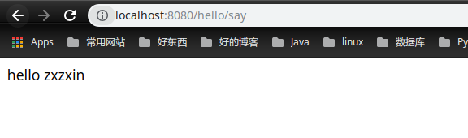

转载自<https://www.cnblogs.com/lfjjava/p/6096884.html>，少数改动。

## 1、配置属性类 xxxProperties

利用值对象注入的方式去配置一些Spring常用的配置

```java
@ConfigurationProperties(prefix = "hello")
//@Component //如果这里添加了注解那么在自动配置类的时候就不用添加@enableConfigurationProperties(MyProperties.class)注解.
public class MyProperties {

    private String msg = "default";//现在我们在配置文件写hello.msg=world,因为简单就不再展示;如果不写,　那么默认为default.

    public String getMsg() {
        return msg;
    }

    public void setMsg(String msg) {
        this.msg = msg;
    }
}
```

这是一个简单的属性值对象，那么相当于写死的字段就是SpringBoot为我们自动配置的配置，那么我们很多时候可以自己在`application.properties`中修改某些配置就是这样的道理，我们不设置就是默认的，设置了就是我们设置的属性。

## 2、自动配置类 xxxAutoConfiguration

上面已经构建了我们简单的属性对象，那么现在我们要**通过属性对象得到相应的属性值将其注入到我们的Bean中**，这些Bean也就是一些SpringBoot启动后为我们自动配置生成的Bean，**当然SpringBoot优先使用我们配置的Bean这个功能是如何实现的**，我们往下看一下就明白了。

首先我们需要一个功能Bean，可以把这个Bean看做是SpringBoot框架启动后在容器里面生成的为我们服务的内置Bean，简单的写一个，如下:

```java
/**
 这里很重要，如果我们添加了这个注解，
 那么按照我们下面的设置SpringBoot会优先使用我们配置的这个Bean，
 这是符合SpringBoot框架优先使用自定义Bean的原则的。
 */
//@Component
public class MyService {

    private String msg = "service";//如果自动配置没有读入成功，那么为默认值

    //为我们服务的方法
    public String say() {
        return "hello " + msg;
    }

    public String getMsg() {
        return msg;
    }

    public void setMsg(String msg) {
        this.msg = msg;
    }
}
```

然后编写自动配置类:

```java
@Configuration //配置类
//这里就是前面说的，这个注解读入我们的配置对象类
@EnableConfigurationProperties(MyProperties.class)
//当类路径存在这个类时才会加载这个配置类，否则跳过,这个很有用, 比如不同jar包间类依赖，依赖的类不存在直接跳过，不会报错
@ConditionalOnClass(MyService.class)
public class MyAutoConfiguration {

    @Autowired
    private MyProperties myProperties;

    @Bean
    //这个配置就是SpringBoot可以优先使用自定义Bean的核心所在，如果没有我们的自定义Bean那么才会自动配置一个新的Bean
    @ConditionalOnMissingBean(MyService.class)
    public MyService auto() {
        MyService myService = new MyService();
        myService.setMsg(myProperties.getMsg());
        return myService;
    }
}
```

## 3、配置文件编写和测试

编写下面的配置文件(`application.properties`)

```properties
hello.msg=zxzxin
```

测试:

```java
@RestController
public class MyController {

    @Autowired
    private MyService myService;

    @RequestMapping("/auto/say")
    public String say(){
        return myService.say();
    }
}

```

访问结果:



## 4、总结

其实在很多时候我们的配置是在很多jar包里的，那么我们新的应用该怎么读入这些jar包里的配置文件呢，SpringBoot是这样管理的。

最主要的注解就是`@enableAutoConfiguration`，而这个注解会导入一个`EnableAutoConfigurationImportSelector`的类，而这个类会去读取一个`spring.factories`下key为`EnableAutoConfiguration`全限定名对应值。


所以如果需要我们可以在我们的`resources`目录下创建`spring.factories`下添加类似的配置即可。