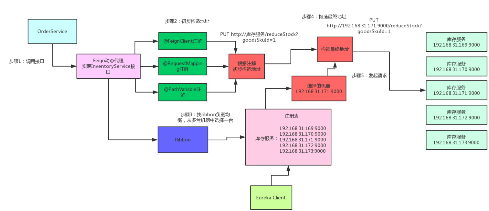

# 一、Eureka


这是基于集群配置的eureka； 

* 处于不同节点的eureka通过Replicate进行数据同步 
* Application Service为服务提供者 
* Application Client为服务消费者 
*  Make Remote Call完成一次服务调用

服务启动后向Eureka注册，Eureka Server会将注册信息向其他Eureka Server进行同步，当服务消费者要调用服务提供者，则向服务注册中心获取服务提供者地址，然后会将服务提供者地址缓存在本地，下次再调用时，则直接从本地缓存中取，完成一次调用。

当服务注册中心Eureka Server检测到服务提供者因为宕机、网络原因不可用时，则在服务注册中心将服务置为`DOWN`状态，并把当前服务提供者状态向订阅者发布，订阅过的服务消费者更新本地缓存。

服务提供者在启动后，周期性（默认30秒）向Eureka Server发送心跳，以证明当前服务是可用状态。Eureka Server在一定的时间（默认90秒）未收到客户端的心跳，则认为服务宕机，注销该实例。

**自我保护机制**

在默认配置中，Eureka Server在默认90s没有得到客户端的心跳，则注销该实例，但是往往因为微服务跨进程调用，网络通信往往会面临着各种问题，比如微服务状态正常，但是因为网络分区故障时，Eureka Server注销服务实例则会让大部分微服务不可用，这很危险，因为服务明明没有问题。

为了解决这个问题，Eureka 有自我保护机制，通过在Eureka Server配置如下参数，可启动保护机制

```
eureka.server.enable-self-preservation=true
```

它的原理是，当Eureka Server节点在短时间内丢失过多的客户端时（可能发送了网络故障），那么这个节点将进入自我保护模式，不再注销任何微服务，当网络故障回复后，该节点会自动退出自我保护模式。

**和Zookeeper区别**

著名的CAP理论指出，一个分布式系统不可能同时满足C(一致性)、A(可用性)和P(分区容错性)。由于分区容错性在是分布式系统中必须要保证的，因此我们只能在A和C之间进行权衡。在此Zookeeper保证的是CP, 而Eureka则是AP。

# 二、Feign

feign原理: https://www.jianshu.com/p/8c7b92b4396c

**Feign的一个关键机制就是使用了动态代理**。咱们一起来看看下面的图，结合图来分析：

- 首先，如果你对某个接口定义了@FeignClient注解，Feign就会针对这个接口创建一个动态代理
- 接着你要是调用那个接口，本质就是会调用 Feign创建的动态代理，这是核心中的核心
- Feign的动态代理会根据你在接口上的@RequestMapping等注解，来动态构造出你要请求的服务的地址
- 最后针对这个地址，发起请求、解析响应


# 三、Ribbon

**Ribbon是和Feign以及Eureka紧密协作，完成工作的，具体如下：**

- 首先Ribbon会从 Eureka Client里获取到对应的服务注册表，也就知道了所有的服务都部署在了哪些机器上，在监听哪些端口号。

- 然后Ribbon就可以使用默认的Round Robin算法，从中选择一台机器

- Feign就会针对这台机器，构造并发起请求。

注意Ribbon是客户端的负载均衡，也就是，Feign调用的，而不是像nginx一样，摆在最外面。

