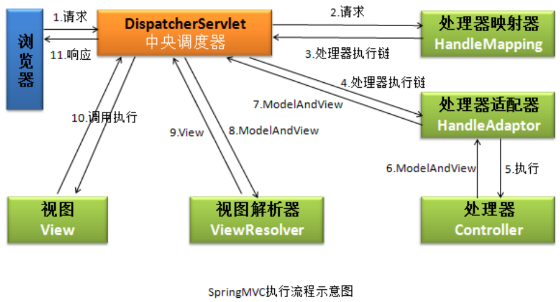

## 一、执行流程

1）、浏览器提交请求到中央调度器。
2）、中央调度器直接将请求转给处理器映射器。
3）、处理器映射器会根据请求，找到处理该请求的处理器，并将其封装为处理器执行链后返回给中央调度器。
4）、中央调度器根据处理器执行链中的处理器，找到能够执行该处理器的处理器适配器。
5）、处理器适配器调用执行处理器。
6）、处理器将处理结果及要跳转的视图封装到一个对象 ModelAndView 中，并将其返回给处理器适配器。
7）、处理器适配器直接将结果返回给中央调度器。
8）、中央调度器调用视图解析器，将 ModelAndView 中的视图名称封装为视图对象。
9）、视图解析器将封装了的视图对象返回给中央调度器。
10）、中央调度器调用视图对象，让其自己进行渲染，即进行数据填充，形成响应对象。
11）、中央调度器响应浏览器。

## 二、SpringMVC优点

（1）可以支持各种视图技术,而不仅仅局限于JSP；

（2）与Spring框架集成（如IoC容器、AOP等）；

（3）清晰的角色分配：前端控制器(dispatcherServlet) , 请求到处理器映射（handlerMapping), 处理器适配器（HandlerAdapter), 视图解析器（ViewResolver）。

（4） 支持各种请求资源的映射策略。

## 三、SpringMVC主要组件

（1）前端控制器 DispatcherServlet（不需要程序员开发）

作用：接收请求、响应结果，相当于转发器，有了DispatcherServlet 就减少了其它组件之间的耦合度。

（2）处理器映射器HandlerMapping（不需要程序员开发）

作用：**根据请求的URL来查找Handler**

（3）处理器适配器HandlerAdapter

注意：**在编写Handler的时候要按照HandlerAdapter要求的规则去编写，这样适配器HandlerAdapter才可以正确的去执行Handler**。

通过 HandlerAdapter 对处理器进行执行，这是适配器模式的应用，通过扩展适配器可以对更多类型的处理器进行执行。中央调度器会根据不同的处理器自动为处理器选择适配器，以执行处理器。

（4）处理器Handler（需要程序员开发）

处理器，也称为后端控制器，在 DispatcherServlet 的控制下 Handler 调用 Service 层 对具体的用户请求进行处理。由于 Handler 涉及到具体的用户业务请求，所以一般情况下 需要程序员根据业务需求自己开发 Handler。

（5）视图解析器 ViewResolver（不需要程序员开发）

作用：进行视图的解析，根据视图逻辑名解析成真正的视图（view）

（6）视图View（需要程序员开发jsp）

View是一个接口， 它的实现类支持不同的视图类型（jsp，freemarker，pdf等等）

## 四、SpringMVC异常处理

答：可以将异常抛给Spring框架，由Spring框架来处理；我们只需要配置简单的异常处理器，在异常处理器中添视图页面即可。

## 五、SpringMVC常用注解

SpringMVC常用的注解有哪些？

`@RequestMapping`：用于处理请求 url 映射的注解，可用于类或方法上。用于类上，则表示类中的所有响应请求的方法都是以该地址作为父路径。

`@RequestBody`：注解**实现接收http请求的json数据，将json转换为java对象**。

`@ResponseBody`：注解**实现将conreoller方法返回对象转化为json对象响应给客户**。

## 六、怎样在方法里面得到Request,或者Session？

答：直接在方法的形参中声明request，SpringMvc就自动把request对象传入。

## 七、SpringMvc用什么对象从后台向前台传递数据的？

答：通过ModelMap对象,可以在这个对象里面调用put方法,把对象加到里面,前台就可以通过el表达式拿到。

## 八、注解原理

注解本质是一个继承了Annotation的特殊接口，其具体实现类是Java运行时生成的动态代理类。

**我们通过反射获取注解时，返回的是Java运行时生成的动态代理对象**。通过代理对象**调用自定义注解的方法**，会最终调用AnnotationInvocationHandler的**invoke方法**。该方法会从memberValues这个Map中索引出对应的值。而memberValues的来源是Java常量池。

