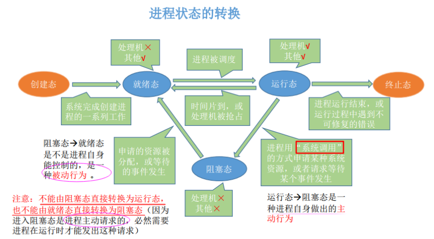
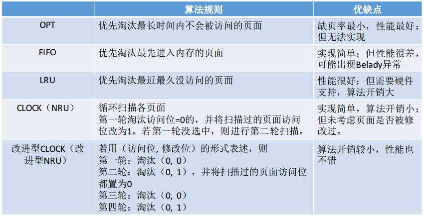

## 一、进程和线程以及它们的区别

* 一段程序的执行过程，是进程实体的运行过程(进程实体)=程序+数据+PCB(进程控制块))，大多数时候我们把进程实体叫做进程。(进程是具有独立功能的程序在数据集合上的运行过程)
* **进程是分配系统资源的单位**，各个进程拥有的内存地址空间相互独立。

* **线程是进程的一个实体，是CPU调度和分派的基本单位**，它是比进程更小的能独立运行的基本单位。

* **进程在执行过程中拥有独立的内存单元，而多个线程共享进程的内存**。 

> 区别:
>
> * 进程是资源分配的基本单位，线程是独立调度的基本单位。
> * 在同一进程中，线程的切换不会引起进程切换。
> * 由于创建或撤销进程时，系统都要为之分配或回收资源，如内存空间、I/O 设备等，所付出的开销远大于创建或撤销线程时的开销。而线程开销小。

## 二、同步、互斥、通信的区别

- 同步：多个进程按一定顺序执行；
- 互斥：多个进程在同一时刻只有一个进程能进入临界区；
- 通信  : 进程间的信息交换；

> 临界区: 对临界资源进行访问的那段代码称为临界区。

## 二、进程间的通信方式

并发进程之间的交互必须满足两个基本要求：**同步和通信**。

**进程之间互相交换信息的工作称之为进程通信IPC （InterProcess Communication）（主要是指大量数据的交换）**。

进程通信: **进程间的信息交换**。

* 管道（pipe文件）及命名管道（named pipe(FIFO)）：管道可用于具有**亲缘关系的父子进程间的通信**，命名管道除了具有管道所具有的功能外，它还允许无亲缘关系进程间的通信；

  * 各个进程要**互斥**的访问管道；

  * 只能实现**半双工通信**；
* 信号（signal）：信号是一种比较复杂的通信方式，用于通知接收进程某个事件已经发生；
* 消息队列：消息队列是消息的链接表，它克服了上两种通信方式中信号量有限的缺点，具有写权限的进程可以按照一定得规则向消息队列中添加新信息；对消息队列有读权限得进程则可以从消息队列中读取信息；
* 共享内存（**共享存储**）：可以说这是最有用的进程间通信方式。它使得多个进程**可以访问同一块内存空间，不同进程可以及时看到对方进程中对共享内存中数据得更新**。这种方式需要依靠某种同步操作，**如互斥锁和信号量**等；
* 信号量：它是一个计数器，用于为多个进程提供对共享数据对象的访问，主要作为进程之间及同一种进程的不同线程之间得同步和互斥手段；
  * 信号量用于进程间同步，若要在进程间传递数据需要结合**共享内存**。
  * 信号量基于操作系统的 PV 操作，程序对信号量的操作都是原子操作。
  * 每次对信号量的 PV 操作不仅限于对信号量值加 1 或减 1，而且可以加减任意正整数。
* 套接字：这是一种更为一般得进程间通信机制，它可用于网络中**不同机器之间的进程间通信**，应用非常广泛。

## 三、进程状态切换

- 只有就绪态和运行态可以相互转换，其它的都是单向转换。**就绪状态的进程通过调度算法从而获得 CPU 时间，转为运行状态**；
- 而运行状态的进程，在分配给它的 **CPU 时间片用完**之后就会转为就绪状态，等待下一次调度。
- 阻塞状态是**缺少需要的资源从而由运行状态转换而来**，但是该资源不包括 CPU 时间，缺少 CPU 时间会从运行态转换为就绪态；
- 进程只能自己阻塞自己，因为只有进程自身才知道何时需要等待某种事件的发生；

## 四、进程同步

进程同步的主要任务：**是对多个相关进程在执行次序上进行协调，以使并发执行的诸进程之间能有效地共享资源和相互合作**，从而使程序的执行具有可再现性。

同步机制遵循的原则：

1）、空闲让进；

2）、忙则等待（保证对临界区的互斥访问）；

3）、有限等待（有限代表有限的时间，避免死等）；

4）、让权等待，（当进程不能进入自己的临界区时，应该释放处理机，以免陷入忙等状态）。

方法:

 1、信号量

 2、管程

 3、互斥量（基于共享内存的快速用户态 ）

 4、文件锁（通过 fcntl 设定，针对文件）

## 五、页面置换算法

