# 操作系统总结 - 进程同步、通信、死锁(三)

* [一、什么是进程同步、进程互斥](#一什么是进程同步进程互斥)
* [二、进程互斥的软件实现方法](#二进程互斥的软件实现方法)
* [三、进程互斥的硬件实现方法](#三进程互斥的硬件实现方法)
* [四、信号量机制](#四信号量机制)
* [五、用信号量实现进程互斥、同步、前驱关系](#五用信号量实现进程互斥同步前驱关系)
* [六、生产者-消费者问题](#六生产者-消费者问题)
* [七、多生产者-多消费者](#七多生产者-多消费者)
* [八、吸烟者问题](#八吸烟者问题)
* [九、读者-写者问题](#九读者-写者问题)
* [十、哲学家进餐问题](#十哲学家进餐问题)
* [十一、管程](#十一管程)
* [十二、死锁的概念](#十二死锁的概念)
* [十三、死锁的处理策略—预防死锁](#十三死锁的处理策略—预防死锁)
* [十四、死锁的处理策略—避免死锁(银行家算法)](#十四死锁的处理策略—避免死锁(银行家算法))
* [十五、死锁的处理策略—死锁的检测与解除](#十五死锁的处理策略—死锁的检测与解除)

***

## 一、什么是进程同步、进程互斥

**基本定义**:

* 进程具有异步性的特征，异步性是指 : 各并发执行的进程以各自独立的、不可预知的速度向前推进(之前提到)；
* 进程同步：指<font color = red>相互合作去完成相同的任务的进程间，由同步机构对执行次序进行协调</font>。(在多道程序环境下，进程是并发执行的，不同进程之间存在着不同的相互制约关系。)；
* 进程互斥：<font color = red>指多个进程在对临界资源进行访问的时候，应采用互斥方式；</font>
* 简单来说，同步：多个进程按一定顺序执行；互斥：多个进程在同一时刻只有一个进程能进入临界区。

**进程同步**


**进程互斥**


**本节小结**:


***
## 二、进程互斥的软件实现方法


**本节小结**


***
## 三、进程互斥的硬件实现方法
主要有三种:

* 中断屏蔽方法；
* TestAndSet( TS指令 / TSL指令)
* Swap指令 (XCHG指令)


**本节小结**


***
##  四、信号量机制(`important`)
**知识总览以及问题引入**


**两种信号量机制:整型(`S`是一个整形变量)和记录型(`S`在一个结构体中)**

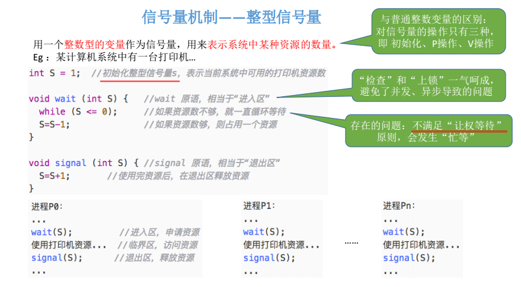


**下面看一个栗子的运行过程(重点)**

**①初始化**


**②、③ 分别给`P1`进程和`P2`进程分配资源，使得`S.value = 0`**


**此时为`P3`、`P4`进程服务，但是剩余资源数为`S.value = -2`，所以只能进入等待队列** 

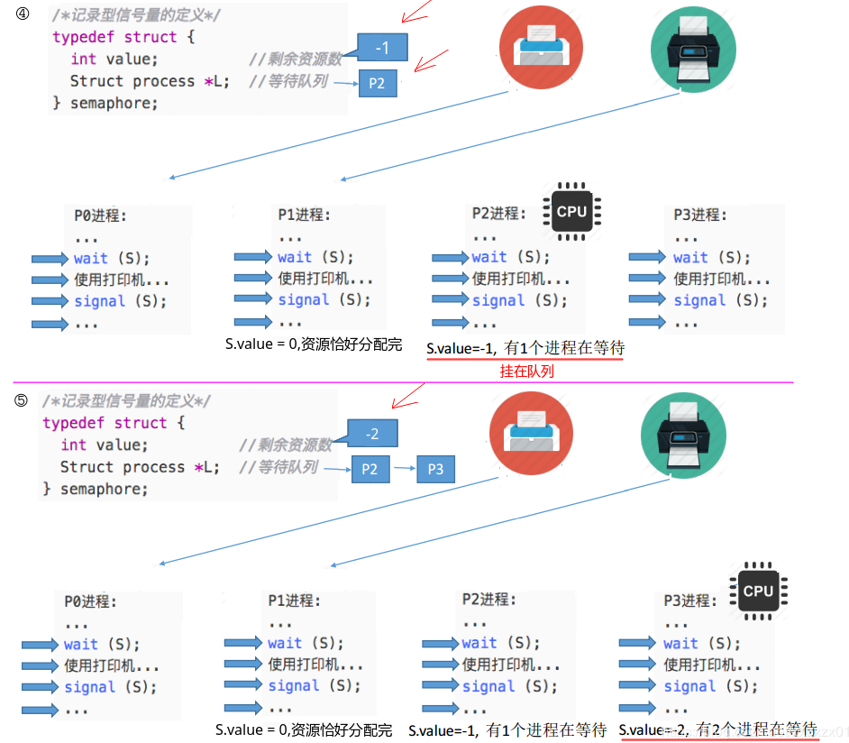

**所以`CPU`接下来只能为`P1`、`P2`服务，此时服务完之后调用 `signal`并`wake up`在等待队列中的`P3`、`P4`(每次空闲一个就唤醒等待队列中的一个)**(下图只画出将`P2`从队列中抽取出来，最后`P3`的过程也是一样的)


**本节小结**


***
## 五、用信号量实现进程互斥、同步、前驱关系

信号量机制:

* 实现进程互斥
* 实现进程同步
* 实现进程的前驱关系


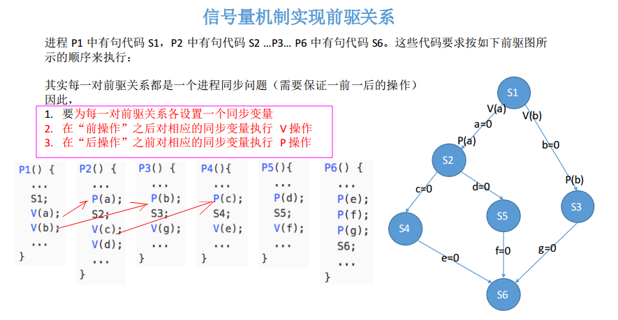

**本节小结**

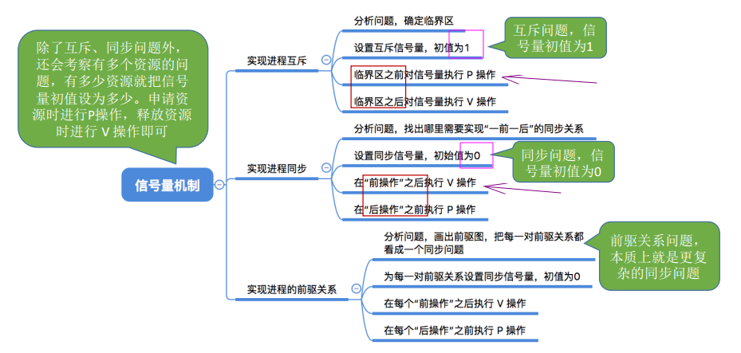

***
## 六、生产者-消费者问题


**本节小结**


***
## 七、多生产者-多消费者

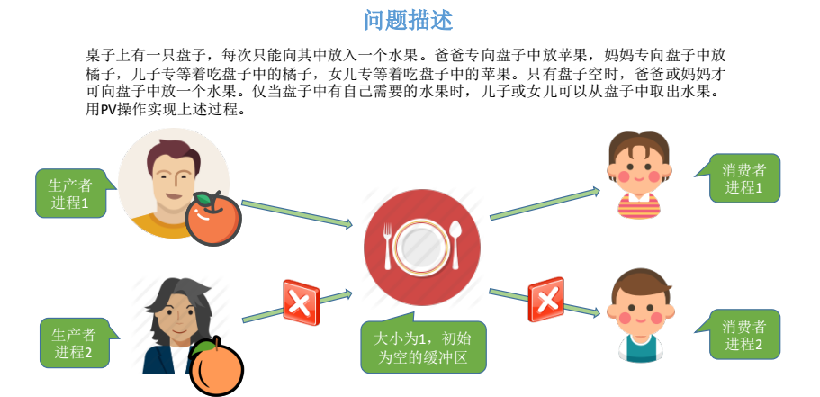


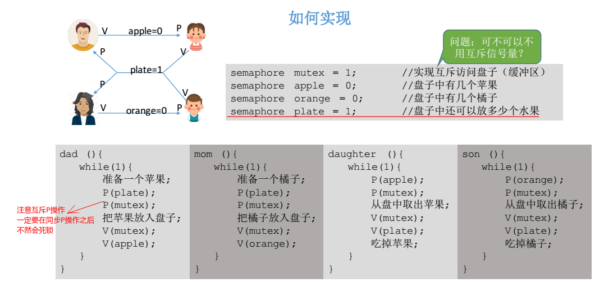


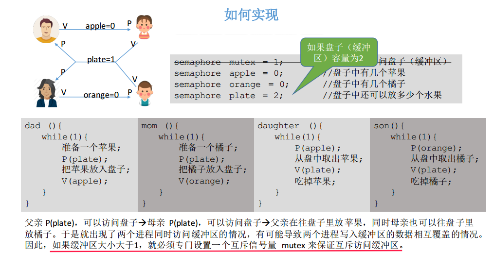

**本节小结**


***
## 八、吸烟者问题


***
## 九、读者-写者问题
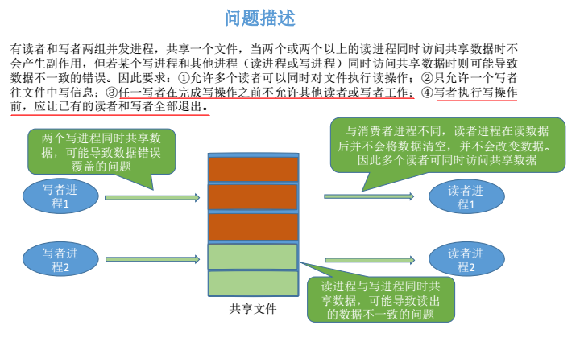


代码实现: 

```c
Rcount = 0; // 当前有几个读进程在访问文件
semaphore CountMutex = 1;// 用于保证对count变量的互斥访问
semaphore WriteMutex = 1; // 用于实现对文件的互斥访问(写操作)

void writer(){
    while(true){
        sem_wait(WriteMutex);// P
        // TO DO write();
        sem_post(WriteMutex);// V
    }
}

// 读者优先策略
void reader(){
    while(true){
        sem_wait(CountMutex); //P
        if(Rcount == 0) // 第一个进程负责加锁
            sem_wait(WriteMutex);
        Rcount++;
        sem_post(CountMutex); //V
        
        // TO DO read();

        sem_wait(CountMutex);
        Rcount--;  // 访问文件的读进程数-1
        if(Rcount == 0)
            sem_post(WriteMutex); // 最后一个进程负责解锁
        sem_post(CountMutex);
	}
}
```
**防止写进程饿死的方法**:


**本节小结**


***
## 十、哲学家进餐问题


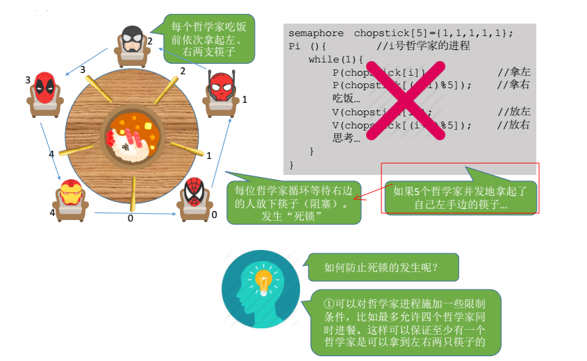

```c
//一种错误的解法，考虑到如果所有哲学家同时拿起左手边的筷子，
//那么就无法拿起右手边的筷子，造成死锁。

#define N 5		   // 哲学家个数
void philosopher(int i)  // 哲学家编号：0 － 4
{
    while(1)
    {
        think();			    // 哲学家在思考
        take_fork(i);			// 去拿左边的叉子
        take_fork((i + 1) % N);	// 去拿右边的叉子
        eat();				//　吃饭
        put_fork(i);			// 放下左边的叉子
        put_fork((i + 1) % N);	// 放下右边的叉子
    }
}
```

三种方案


**第三种方案实现**


为了防止死锁的发生，可以设置两个条件（临界资源）：
* 必须同时拿起左右两根筷子；
* 只有在两个邻居都没有进餐的情况下才允许进餐。

实现思路: 
```c
//1. 必须有一个数据结构，来描述每个哲学家当前的状态
#define N 5
#define LEFT i // 左邻居
#define RIGHT (i + 1) % N    // 右邻居
#define THINKING 0
#define HUNGRY   1
#define EATING   2
typedef int semaphore;
int state[N];                // 跟踪每个哲学家的状态

//2. 该状态是一个临界资源，对它的访问应该互斥地进行
semaphore mutex = 1;         // 临界区的互斥,互斥初始值一般是1

//3. 一个哲学家吃饱后，可能要唤醒邻居，存在着同步关系
semaphore s[N];    // 每个哲学家一个信号量

void philosopher(int i) {
    while(1) {
        think(); // 思考
        take_two(i); // 拿起两个筷子
        eat();
        put_tow(i);
    }
}

//拿走两只筷子
void take_two(int i) {
    P(&mutex);  // 进入临界区

    state[i] = HUNGRY; // 我饿了
    try(i); // 试图拿两只筷子

    V(&mutex); // 退出临界区
    P(&s[i]); // 没有筷子便阻塞
}

//放回两只筷子
void put_tow(i) {
    P(&mutex);

    state[i] = THINKING;
    try(LEFT); // 左边的人尝试
    try(RIGHT); //右边的人尝试

    V(&mutex);
}

void try(i) {         // 尝试拿起两把筷子
    if(state[i] == HUNGRY && state[LEFT] != EATING && state[RIGHT] !=EATING) {
        state[i] = EATING;
        V(&s[i]); // 通知第i个人可以吃饭了
    }
}
```

**本节小结**
* 哲学家问题关键在于解决进程死锁；
* 这些进程之间只存在互斥关系，但是和之前的互斥关系不同的是: 每个进程都需要同时持有两个临界资源，因此有死锁的可能； 
***
## 十一、管程(高级同步机制)
**基本总结**

* 为什么要引入管程
* 管程的定义和基本特征
* 拓展1: 用管程解决生产者消费者问题
* 拓展2: Java中类似管程的机制

**引入**


**本节小结**


***
## 十二、死锁的概念
**知识总览**


* 死锁: 如果一个进程集合里面的每个进程都在等待只能由这个集合中的其他一个进程（包括他自身）才能引发的事件，这种情况就是死锁。

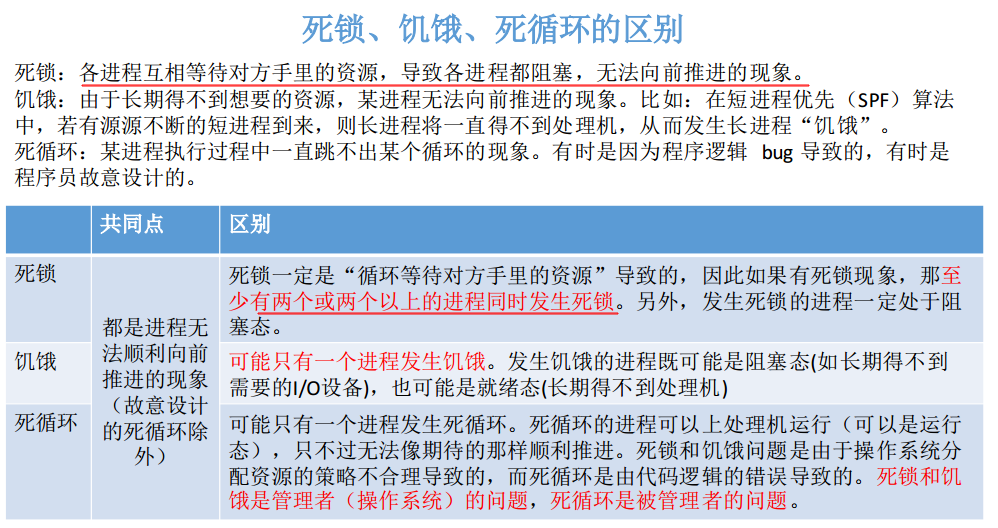


* 互斥：每个资源要么已经分配给了一个进程，要么就是可用的。
* 不可剥夺：已经分配给一个进程的资源不能强制性地被抢占，它只能被占有它的进程显式地释放。
* 请求和保持：已经得到了某个资源的进程可以再请求新的资源。
* 循环等待：有两个或者两个以上的进程组成一条环路，该环路中的每个进程都在等待下一个进程所占有的资源。


**本节小结**

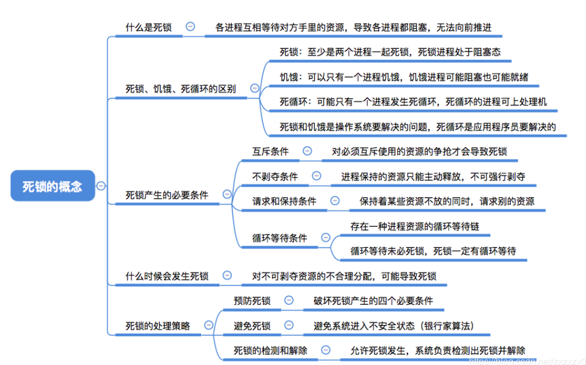

***
## 十三、死锁的处理策略—预防死锁
**知识总览**

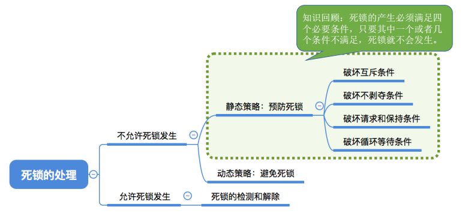


**本节小结**


***
## 十四、死锁的处理策略—避免死锁(银行家算法)
**知识总览**


* 注意安全状态是只要找到一个安全序列即可。

**不会发生死锁的举例**


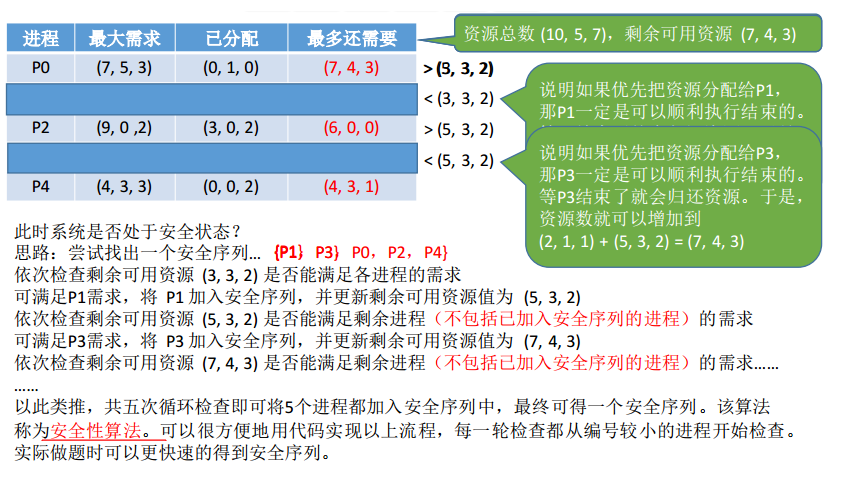


**可能发生死锁的情况举例**


**实现银行家算法**


***
## 十五、死锁的处理策略—死锁的检测与解除
**知识总览**


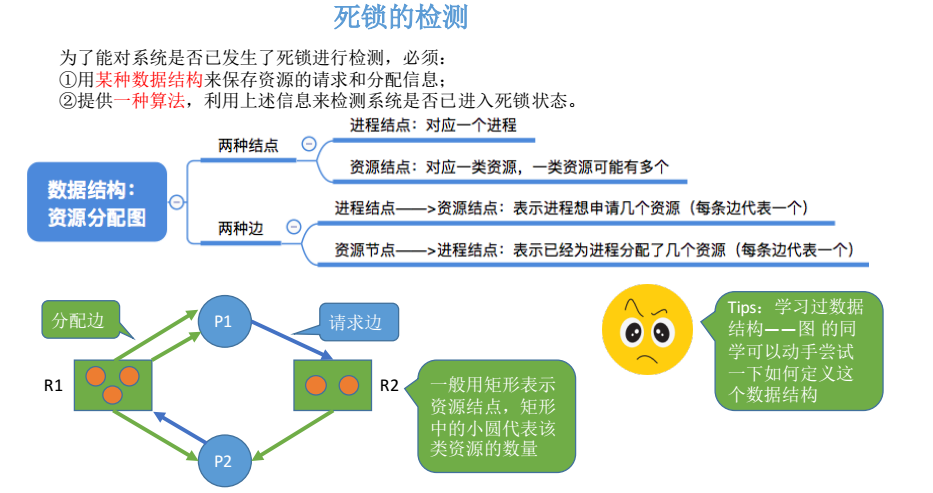


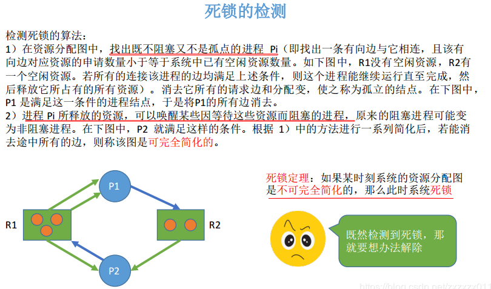


**本节小结**


***
