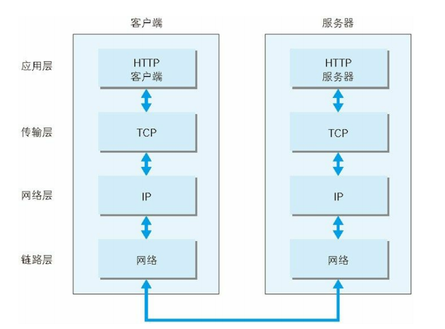
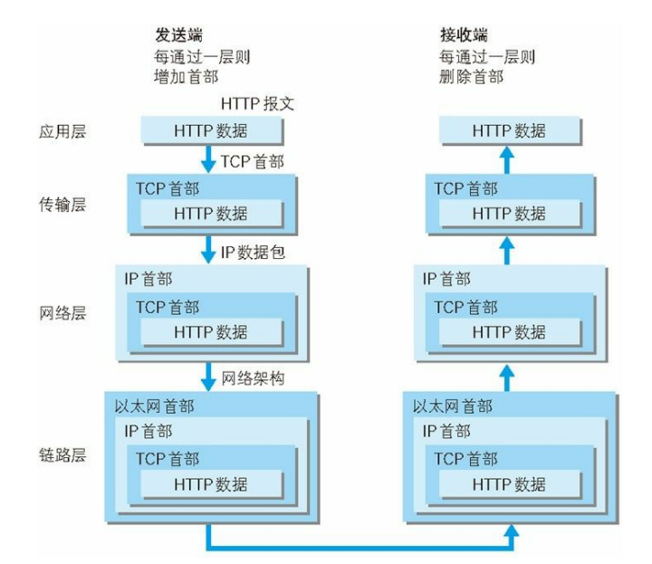
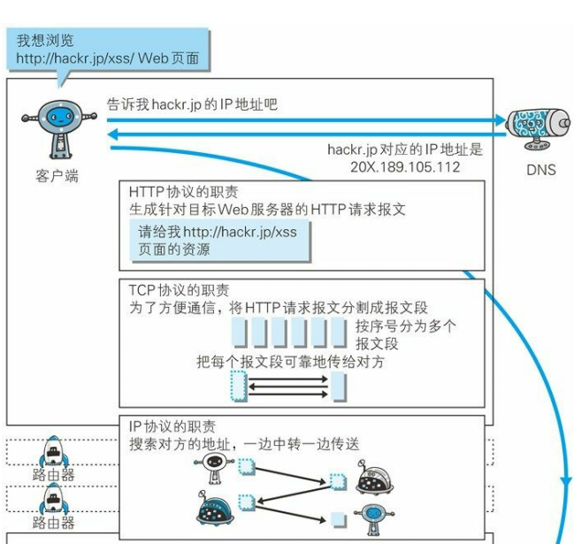
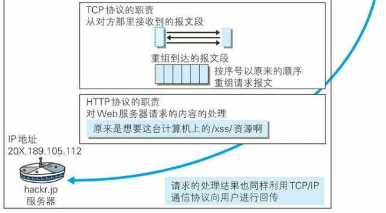
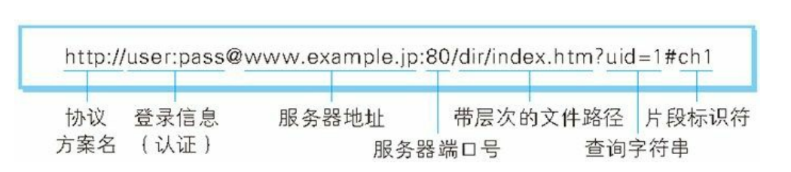

# Http协议

* [一、Web和网络基础](#一web和网络基础)

## 一、Web和网络基础

### 1、使用HTTP协议访问Web

* 客户端: 通过发送请求获取服务器资源的 Web 浏览器等，都可称为客户端（ client ）。
* Web 使用一种名为 HTTP （ `HyperText Transfer Protocol` ，超文本传输协议）的协议作为规范，完成从客户端到服务器端等一系列运作流程。而协议是指规则的约定。Web是建立在Http协议上通信的；


### 2、TCP/IP

TCP/IP 协议族按层次分别分为以下 4 层：应用层、传输层、网络层和数据链路层；

* 应用层: TCP/IP 协议族内预存了各类通用的应用服务。比如， FTP （ File Transfer Protocol ，文件传输协议）和 DNS （ Domain Name System ，域名系统）服务就是其中两类。**HTTP 协议也处于该层**。
* 传输层: 传输层对上层应用层，提供处于网络连接中的两台计算机之间的数据传输。在传输层有两个性质不同的协议： TCP （ Transmission Control Protocol ，传输控制协议）和 UDP （ User Data Protocol ，用户数据报协议）；
* 网络层: 网络层用来处理在网络上流动的数据包。数据包是网络传输的最小数据单位。该层规定了通过怎样的路径（所谓的传输路线）到达对方计算机，并把数据包传送给对方。
* 数据链路层: 用来处理连接网络的硬件部分。

通信传输流:



传输过程:

利用 TCP/IP 协议族进行网络通信时，会通过分层顺序与对方进行通信。

**发送端从应用层往下走，接收端则往应用层往上走**。

我们用 HTTP 举例来说明，首先作为发送端的客户端在应用层（ HTTP 协议）发出一个想看某个 Web 页面的HTTP 请求。

接着，为了传输方便，**在传输层（ TCP 协议）把从应用层处收到的数据（ HTTP 请求报文）进行分割，并在各个报文上打上标记序号及端口号后转发给网络层**。

**在网络层（ IP 协议），增加作为通信目的地的 MAC 地址后转发给链路层**。这样一来，发往网络的通信请求就准备齐全了。

接收端的服务器在链路层接收到数据，按序往上层发送，一直到应用层。当传输到应用层，才能算真正接收到由客户端发送过来的 HTTP请求。



发送端在层与层之间传输数据时，每经过一层时必定会被打上一个该层所属的首部信息。反之，接收端在层与层传输数据时，每经过一层时会把对应的首部消去。
这种把数据信息包装起来的做法称为**封装（ encapsulate ）**。

### 3、IP、TCP和DNS

#### 1)、IP(负责传输)

按层次分， **IP （ Internet Protocol ）网际协议位于网络层**。几乎所有使用网络的系统都会用到 IP 协议。 

可能有人会把 “IP” 和 “IP 地址 ” 搞混， “IP” 其实是一种协议的名称。

* IP 协议的作用是把**各种数据包传送给对方**。而要保证确实传送到对方那里，则需要满足各类条件。其中两个重要的条件是 **IP 地址和 MAC地址**（ Media Access Control Address ）。
* **IP 地址指明了节点被分配到的地址， MAC 地址是指网卡所属的固定地址**。 IP 地址可以和 MAC 地址进行配对。 IP 地址可变换，但 MAC地址基本上不会更改。

使用 ARP 协议凭借 MAC 地址进行通信

* IP 间的通信依赖 MAC 地址。在网络上，通信的双方在同一局域网（ LAN ）内的情况是很少的，通常是经过多台计算机和网络设备中转才能连接到对方。而在进行中转时，**会利用下一站中转设备的 MAC地址来搜索下一个中转目标。这时，会采用 ARP 协议（ Address Resolution Protocol ）**。 
* ARP 是一种用以解析地址的协议，**根据通信方的 IP 地址就可以反查出对应的 MAC 地址**。没有人能够全面掌握互联网中的传输状况，在到达通信目标前的中转过程中，那些计算机和路由器等网络设备只能获悉很粗略的传输路线。这种机制称为路由选择（ routing ）。

> 路由选择：有点像快递公司的送货过程。想要寄快递的人，只要将自己的货物送到集散中心，就可以知道快递公司是否肯收件发货，该快递公司的集散中心检查货物的送达地址，明确下站该送往哪个区域的集散中心。接着，那个区域的集散中心自会判断是否能送到对方的家中。


#### 2)、TCP协议(确保可靠性)

按层次分， TCP 位于传输层，提供可靠的字节流服务。

* 所谓的字节流服务（ Byte Stream Service ）是指，为了方便传输，**将大块数据分割成以报文段（ segment ）为单位的数据包**进行管理；
* 而可靠的传输服务是指，能够把数据准确可靠地传给对方。一言以蔽之，TCP 协议为了更容易传送大数据才把数据分割，而且 TCP 协议能够确认数据最终是否送达到对方。确保数据能到达目标；

为了准确无误地将数据送达目标处， TCP 协议采用了**三次握手（ three-way handshaking ）策略**。

* 用 TCP 协议把数据包送出去后， TCP不会对传送后的情况置之不理，它一定会向对方确认是否成功送达。
* 握手过程中使用了 TCP 的标志（ flag ） —— SYN （ synchronize ） 和ACK （ acknowledgement ）。发送端首先发送一个带 **SYN** 标志的数据包给对方。接收端收到后，回传一个带有 **SYN/ACK** 标志的数据包以示传达确认信息。最后，发送端再回传一个带 **ACK** 标志的数据包，代表 “ 握手 ” 结束。

若在握手过程中某个阶段莫名中断， TCP 协议会再次以相同的顺序发送相同的数据包。


#### 3)、DNS(负责域名解析)

DNS （ Domain Name System ）服务是和 HTTP 协议一样位于应用层的协议。它提供**域名到 IP 地址之间**的解析服务。

用户通常使用**主机名或域名**来访问对方的计算机，而不是直接通过 IP地址访问。因为与 IP 地址的一组纯数字相比，用字母配合数字的表示形式来指定计算机名更符合人类的记忆习惯。

为了解决上述的问题， DNS 服务应运而生。 DNS 协议提供**通过域名查找 IP 地址，或逆向从 IP 地址反查域名的服务**。


### 4)、各种协议与Http协议的关系



### 5、URI和URL

与 URI （统一资源标识符）相比，我们更熟悉 URL （ UniformResource Locator ，统一资源定位符）。

URL 正是使用 Web 浏览器等访问 Web 页面时需要输入的网页地址。

#### 1)、URI(统一资源标识符)

URI 是 Uniform Resource Identifier 的缩写。 

> Uniform
>
> 规定统一的格式可方便处理多种不同类型的资源，而不用根据上下文环境来识别资源指定的访问方式。另外，加入新增的协议方案（如http: 或 ftp: ）也更容易。
>
> Resource
>
> 资源的定义是 “ 可标识的任何东西 ” 。除了文档文件、图像或服务（例如当天的天气预报）等能够区别于其他类型的，全都可作为资源。另外，资源不仅可以是单一的，也可以是多数的集合体。
>
> Identifier
>
> 表示可标识的对象。也称为标识符。

 **URI 就是由某个协议方案表示的资源的定位标识符**。协议方案是指访问资源所使用的协议类型名称。采用 HTTP 协议时，协议方案就是 http 。除此之外，还有 `ftp 、mailto 、 telnet 、 file` 等。标准的 URI 协议方案有 30 种左右。

**URI 用字符串标识某一互联网资源，而 URL 表示资源的地点（互联网上所处的位置）。可见 URL 是 URI 的子集**。
" RFC3986：统一资源标识符（ URI ）通用语法 " 中列举了几种 URI 例子，如下所示。

```c
ftp://ftp.is.co.za/rfc/rfc1808.txt
http://www.ietf.org/rfc/rfc2396.txt
ldap://[2001:db8::7]/c=GB?objectClass?one
mailto:John.Doe@example.com
news:comp.infosystems.www.servers.unix
tel:+1-816-555-1212
telnet://192.0.2.16:80/
urn:oasis:names:specification:docbook:dtd:xml:4.1.2
```

#### 2)、URI格式

表示指定的 URI ，要使用涵盖全部必要信息的绝对 URI 、绝对 URL 以及相对 URL 。相对 URL ，是指从浏览器中基本 URI 处指定的 URL ，形如` /image/logo.gif` 。

绝对 URI 的格式如下:



使用 `http: `或` https: `等协议方案名获取访问资源时要指定协议类型。不区分字母大小写，最后附一个冒号（` :` ）。也可使用 data: 或 javascript: 这类指定数据或脚本程序的方案名。

* 登录信息（认证）: 指定用户名和密码作为从服务器端获取资源时必要的登录信息（身份认证）。此项是可选项。
* 服务器地址 : **使用绝对 URI 必须指定待访问的服务器地址**。地址可以是类似`baidu.com` 这种 DNS 可解析的名称，或是 192.168.1.1 这类 IPv4 地址名，还可以是 `[0:0:0:0:0:0:0:1]` 这样用方括号括起来的 IPv6 地址名。
* 服务器端口号 : **指定服务器连接的网络端口号**。此项也是可选项，若用户省略则自动使用默认端口号。
* 带层次的文件路径 : 指定服务器上的文件路径来定位特指的资源。这与 UNIX 系统的文件目录结构相似。
* 查询字符串 : 针对已指定的文件路径内的资源，可以使用查询字符串传入任意参数。此项可选。
* 片段标识符 : 使用片段标识符通常可标记出已获取资源中的子资源（文档内的某个位置）。但在 RFC 中并没有明确规定其使用方法。该项也为可选项。