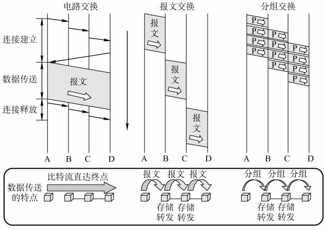
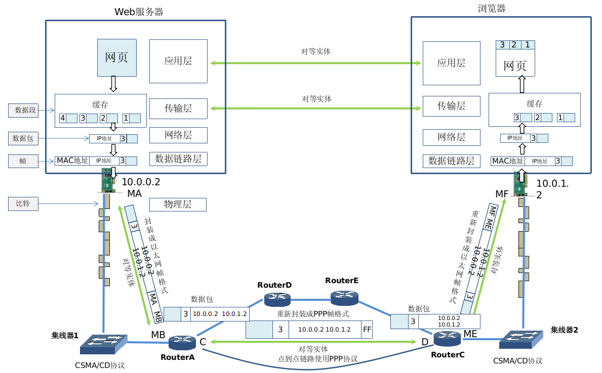

## 计网总结(一)一计算机网络和协议

* [一、互联网概述](#一互联网概述)
* [二、互联网组成](#二互联网组成)
* [三、计算机网络的性能指标](#三计算机网络的性能指标)
* [四、OSI参考模型以及TCP/IP四层模型、五层协议](#四osi参考模型以及tcpip四层模型五层协议)
* [五、通信过程、数据传输、网络设备](#五通信过程数据传输网络设备)
* [六小结](#六小结)
***
### 一、互联网概述

* 计算机网络: 由若干节点和连接这些节点的链路组成，网络中的节点可以是计算机、集线器、交换机、或路由器等；
* 网络之间可以通过路由器相互连接，这就构成了一个更大范围的计算机网路，这样的网路称为互连网，因此互连网是网路的网路；
* 因特网(互联网):  全球最大的特定互连网；

注意以下两个意思相差很大的名词 `internet` 和 `Internet` [RFC 1208]:

* 以小写字母 i 开始的 `internet` (互连网) 是一个通用名词，它泛指由多个计算机网络互连而成的计算机网络。在这些网络之间的通信协议〈即通信规则) 可以任意选择，不一定非要使用`TCP/IP` 协议；

* 以大写字母 I 开始的 `Internet` 〈互联网或因特网) 则是一个专用名词，它指当前全球最大的、开放的、由众多网络相互连接而成的特定互连网，它采用 `TCP/IP` 协议族作为通信的规则，且其前身是美国的 ARPANET；

* 可见，任意把几个计算机网络互连起来〈不管采用什么协议)，并能够相互通信，这样构成的是一个互连网(`internet`，而不是互联网(`Internet`)。

* 路由器（Router），是连接因特网中各局域网、广域网的设备，它会根据信道的情况自动选择和设定路由，以最佳路径，按前后顺序发送信号。
*  路由器是互联网络的枢纽，"交通警察"。**路由和交换机之间的主要区别就是交换机发生在OSI参考模型第二层（数据链路层），而路由发生在第三层，即网络层**。这一区别决定了路由和交换机在移动信息的过程中需使用不同的控制信息，所以说两者实现各自功能的方式是不同的。
* 路由器（`Router`）又称网关设备（`Gateway`）是用于连接多个逻辑上分开的网络，所谓逻辑网络是代表一个单独的网络或者一个子网。当数据从一个子网传输到另一个子网时，可通过路由器的路由功能来完成。因此，路由器具有判断网络地址和选择IP路径的功能。
* **交换机是将不同IP地址的电脑连在一起，共享一根网线；路由器是将同一个IP给不同的电脑使用，就像一条大路分成很多条小路。一句话，路由器是接外网的，路由器是接内网的。(交换机没有开关，路由器有开关)**

***
### 二、互联网组成
基本组成:

* ①边缘部分: 由所有连接在互联网上的主机组成，这部分是用户直接使用的，用来进行通信（传送数据，音频或视频）和资源共享；
* ②核心部分: 由大量网络 和连接这些网络的**路由器** 组成，这部分是为边缘部分提供服务的(提供连通性和交换)；

边缘部分的主机间的通信方式: 

**(1). 客户程序:**

* 被用户调用后运行，在通信时主动向远地服务器发起通信(请求服务)。因此，客

户程序必须知道服务器程序的地址。

* 不需要特殊的硬件和很复杂的操作系统。

**(2). 服务器程序:**

* 是一种专门用来提供某种服务的程序，可同时处理多个远地或本地客户的请求。
* 系统启动后即自动调用并一直不断地运行着，被动地等待并接受来自各地的客户的

通信请求。因此，服务器程序不需要知道客户程序的地址。

**客户与服务器的通信关系建立后，通信可以是双向的，客户和服务器都可发送和接收数据。**

**网络的传输过程(从客户端和服务器的角度来看):**

**电路交换:**

 **分组交换: **

**三种交换方式的比较**

***
###  三、计算机网络的性能指标  

##### 速率 

* 网络技术中的速率是指每秒钟传输的比特数量，称为数据率或比特率，速率的单位是`bit/s`，或`b/s`(比特每秒)；
* 速率较高时，就可以使用kb/s，Mb/s，Gb/s，Tb/s，人们现在所说的10M网速，其实是10Mb/s；
* 360等可以显示网速的软件，测试你电脑的那个网速，这里单位是B/秒，大写的B是字节(byte)，8bit = 1byte，也就是说如果测速为3.82MB/s，则下载速率为3.82 * 8Mb/s。

##### 带宽

* 带宽用来表示网络通信线路传输数据的能力(数字信道所能传送的最高数据率)，即最高速率；
* 比如说家里使用ADSL拨号，有4M带宽、8M带宽，这里说的带宽就是你访问Internet的最高带宽，你家里的带宽由电信运营商控制；

##### 吞吐量

* 吞吐量表示在单位时间内通过某个网络或接口的数据量，包括全部上传和下载的流量；
* 吞吐量受网络带宽或网络额定速率的限制，计算机的网卡如果连接交换机，网卡就可以工作在全双工模式，即能够同时接收和发送数据；如果计算机的网卡连接的是集线器，网卡就只能工作在半双工模式，即不能同时发送和接收数据；

#####  时延

* 时延(delay)是指数据(一个数据包或bit)从网络的一段传送到另一端所需要的时间，是一个很重要的性能指标；
* 时延包括: 发送时延、传播时延、处理时延、排队时延；（数据在网络中经历的的总时延就是这四种时延的累加和）；

###### 发送时延

###### 传播时延
* 传播时延是是电磁波在信道中传播一定的距离要花费的时间； 

###### 排队时延和处理时延

###### 时延带宽积

##### 往返时间

**表示从发送端发送数据开始，到发送端接收到来自接收端的确认(发送端收到确认立即发送确认)，总共经历的时间；**

##### 利用率

***

### 四、OSI参考模型以及TCP/IP四层模型、五层协议

模型图:

TCP/IP只有四层，相当于五层协议中数据链路层和物理层合并为网络接口层。

TCP/IP 体系结构不严格遵循 OSI 分层概念，应用层可能会直接使用 IP 层或者网络接口层。

***
### 五、通信过程、数据传输、网络设备

#### 通信过程 

> **注意: MAC地址由48位二进制数组成，在Windows操作系统命令提示符下，	输入"ipconfig / all"能够看到计算机网卡的MAC地址，物理地址.... : C8-60-00-2E-6E-EB，这里显示的是十六进制表示的MAC地址，使用MA和MB代替MAC地址是为了简化说明。**

**解释:** 

> 为什么计算机通信需要物理地址和IP地址?，物理地址决定了数据帧下一跳给谁，而 IP地址决定了数据包最终给谁。如果全球的计算机都使用集线器或交换机连接，就可以只使用 MAC 地址进行通信了。

通过本图也可以看出:

* **目标MAC地址决定了数据帧下一跳由哪个设备接收；**
* **目标IP地址决定了数据包最终到达那个计算机；**
* **不同的网络数据链路层使用不同的协议，帧格式也不相同，路由器在不同网络转发数据包，需要将数据包重新封装；**
**通信过程上面四层是端到端的，下面三层是点到点的**。

#### 数据封装和解封(数据传输)

下面看几张类似的图，来理解这个过程:

#### 网络设备
现实中各个网络设备的样子: 

### 六、小结

* 计算机网络〈可简称为网络) 把许多计算机连接在一起，而互连网则把许多网络连接在一起，是网络的网络。

* 以小写字母`i `开始的 `internet` 〈互连网) 是通用名词，它泛指由多个计算机网络互连而成的网络。在这些网络之间的通信协议〈即通信规则) 可以是任意的。

*  以大写字母 `I `开始的 Internet (互联网) 是专用名词，它指当前全球最大的、开放的、由众多网络相互连接而成的特定互连网，并采用 TCP/P 协议族作为通信规则，且其前身是美国的 ARPANET。Internet 的推荐译名是“因特网” 但很少被使用。

*  互联网现在采用存储转发的分组交换技术，以及三层 ISP 结构。

* 互联网按工作方式可划分为**边缘部分与核心部分**。**主机在网络的边缘部分，其作用是进行信息处理。路由器在网络的核心部分，其作用是按存储转发方式进行分组交换。**

*  计算机通信是计算机中的进程〈即运行着的程序) 之间的通信。**计算机网络采用的通信方式是客户-服务器方式和对等连接方式 (P2P 方式)。**

*  客户和服务器都是指通信中所涉及的应用进程。客户是服务请求方，服务器是服务 提供方。

* 按作用范围的不同，计算机网络分为广域网 WAN、城域网 MAN、局域网 LAN 和个人区域网 PAN。

* 计算机网络最常用的性能指标是: **速率、带宽、吞吐量、时延〈发送时延、传播时延、处理时延、排队时延)、时延带宽积、往返时间和信道(或网络)利用率。**

* 网络协议即协议，是为进行网络中的数据交换而建立的规则。计算机网络的各层及其协议的集合，称为网络的体系结构。

* 五层协议的体系结构由应用层、运输层、网络层〈或网际层)、数据链路层和物理层组成。**运输层最重要的协议是 `TCP` 和 `UDP` 协议，而网络层最重要的协议是 `IP`协议。**
