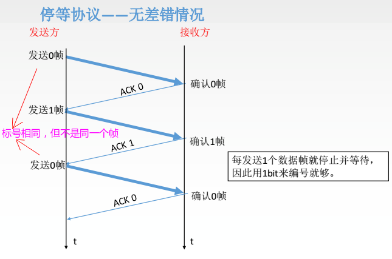
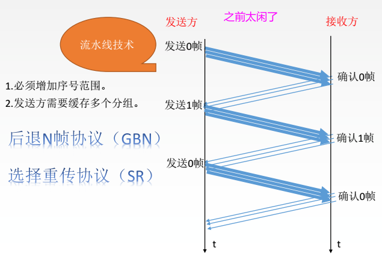

# 计网总结(三)一数据链路层
* [一、概括](#一概括)
* [二、链路层的功能](#二链路层的功能)
  * [1、封装成帧和透明传输](#1封装成帧和透明传输)
  * [2、差错检验](#2差错检验)
  * [3、流量控制](#3流量控制)
* [三、停止等待协议](#三停止等待协议)
* [四、后退N帧协议和选择重传协议](#四后退n帧协议和选择重传协议)
* 点到点信道的数据链路-PPP协议
* 广播信道的数据链路
* 扩展以太网
* 高速以太网
***
## 一、概括
七层模型中所处位置以及涉及知识概括: 

数据链路层使用的信道主要有以下两种类型：
* **点对点信道**。这种信道使用一对一的点对点通信方式。
* **广播信道**。这种信道使用一对多的广播通信方式，因此过程比较复杂。广播信道上连接的主机很多，因此必须使用专用的共享信道协议来协调这些主机的数据发送。
> 结点：主机、路由器；
>
> 帧：链路层的协议数据单元、封装网络层数据报；

**区分链路与数据链路:**
* 链路(`link`):  是一条点到点的物理线路段，中间没有任何其他的交换结点。一条链路只是一条通路的一个组成部分。
* 数据链路(`data link`) : 除了物理线路外，还必须有通信协议来控制这些数据的传输(**逻辑链路**)。若把实现这些协议的硬件和软件加到链路上，就构成了数据链路。现最常用的方法是使用适配器(即网卡)来实现这些协议的硬件和软件。一般的适配器都包括了数据链路层和物理层这两层的功能。

## 二、链路层的功能

三个基本功能: **封装成帧、透明传输、差错检测**

数据链路层在物理层提供服务的基础上向网络层提供服务，其最基本的服务是将源自网络层来的数据**可靠地传输到**
**相邻节点的目标机网络**层。

其主要作用是**加强物理层传输原始比特流的功能**，将物理层提供的可能出错的物理连接改造成为**逻辑上无差错的数据链路**，使之对网络层表现为一条无差错的链路。

* 功能一 : 为网络层提供服务。无确认无连接服务，有确认无连接服务，有确认面向连接服务；
* 功能二 : 链路管理，即连接的建立、维持、释放(用于面向连接的服务) ；
* 功能三 : 组帧 (封装成帧)；
* 功能四 : 流量控制；
* 功能五 : 差错控制(帧错/位错)；

### 1、封装成帧和透明传输

**点到点信道的数据链路层的协议数据单元 一 帧**

封装成帧:

* 封装成帧(framing)就是**在一段数据的前后分别添加首部和尾部**，然后就构成了一个帧。接收端在收到物理层上交的比特流后，就能根据首部和尾部的标记，从收到的比特流中识别帧的开始和结束。
* 首部和尾部包含许多的控制信息，他们的重要作用就是进行帧定界；

帧同步: 接收方应当能从接收到的二进制比特流中区分出帧的起始和终止。

透明传输:

- 指不管所传数据是什么样的比特组合，都应当能在链路上传送；
- 因此，链路层就看不见有什么妨碍数据传输的东西；

**组帧的四种方法: 1.字符计数法，2.字符(节) 填充法，3.零比特填充法，4.违规编码法**。

这里简单介绍一下字符计数法和字符填充法:

字符计数法：

字符填充法:

> 帧使用首部和尾部进行定界，如果帧的数据部分含有和首部尾部相同的内容，那么帧的开始和结束位置就会被错误的判定。需要在数据部分出现首部尾部相同的内容前面插入**转义字符**。如果数据部分出现转义字符，那么就在转义字符前面再加个转义字符。在接收端进行处理之后可以还原出原始数据。**这个过程透明传输的内容是转义字符，用户察觉不到转义字符的存在**。

### 2、差错检验

概括来说，传输中的差错都是由于噪声引起的。

* 全局性: 由于线路本身电气特性所产生的随机噪声(热噪声)，是信道固有的，随机存在的。解决办法: 提高信噪比来减少或避免干扰。( 对传感器下手)
* 局部性: 外界特定的短暂原因所造成的冲击噪声，**是产生差错的主要原因**。解决办法: 通常利用编码技术来解决。

局部性的又可以分为:

> 如果通信质量好，且用有线传输链路，一般会是**无确认无连接服务**。
>
> 如果通信质量差，采用无线传输链路，则会采用**有确认面向连接服务**。

几种处理的方式

检错编码:

### 3、流量控制

较高的发送速度和较低的接收能力的不匹配，会造成传输出错，因此流量控制也是数据链路层的一项重要工作。

数据链路层的流量控制和传输层的流量控制不同：**数据链路层的流量控制是点对点的，而传输层的流量控制是端到端的 **: 

* 数据链路层流量控制手段: **接收方收不下就不回复确认**；
* 传输层流量控制手段: **接收端给发送端一个窗口公告**。

看下图:

注意可靠传输和流量控制都和滑动窗口有关:

## 三、停止等待协议

停止等待协议也可以在传输层讨论。

停止等待协议是**为了实现流量控制**。

简言之: **就是每发送一个分组就停止发送，等待对方确认，在收到确认后再发送下一个分组**。

主要分为: **无差错情况和有差错情况**。

### 1、无差错的情况

> ACK (Acknowledgement）即是确认字符，在数据通信中，接收站发给发送站的一种传输类[控制字符](https://baike.baidu.com/item/%E6%8E%A7%E5%88%B6%E5%AD%97%E7%AC%A6/6913704)。表示发来的数据已确认接收无误。
>
> 在[TCP/IP协议](https://baike.baidu.com/item/TCP%2FIP%E5%8D%8F%E8%AE%AE)中，如果接收方成功的接收到数据，那么会回复一个ACK数据。通常ACK信号有自己固定的格式,长度大小,由接收方回复给发送方。

### 2、有差错的情况

又可以分为两种:

* 数据帧丢失或者检验到帧出错；

* ACK丢失；
* ACK迟到；

数据帧丢失的情况:

ACK丢失和ACK迟到:

### 3、缺点

信道利用率太低:

* 大部分时间都在路上；
* 即RTT（传输往返时延）太长；

## 四、后退N帧协议和选择重传协议

针对上面停止等待协议的缺点，于是就有了在传输数据时的流水线发送数据，也就引出了两种协议:

* 后退N帧协议；
* 选择重传协议；  

解决停等协议的流水线解决方案:

### 1、后退N帧协议

用图来看一下步骤:

在这个过程中，发送方可以分成几个部分:

* 发送完被确认的；
* 已经发送但等待确认的；
* 还能发送的；
* 还不能发送的；

