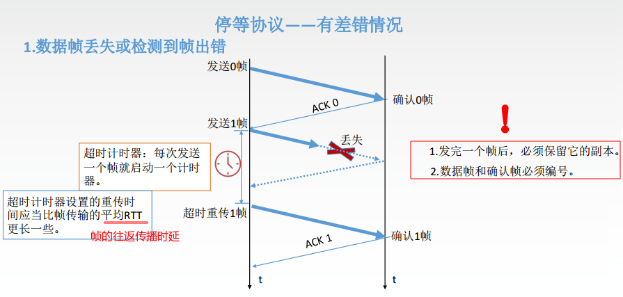
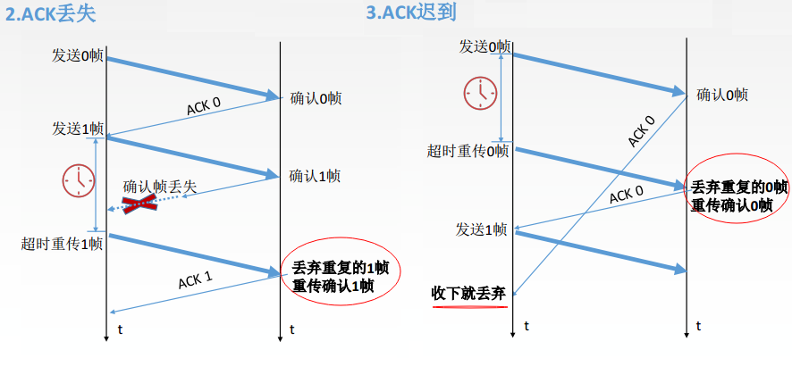
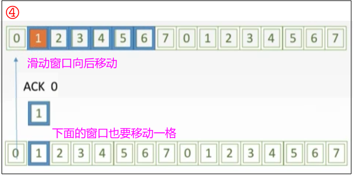
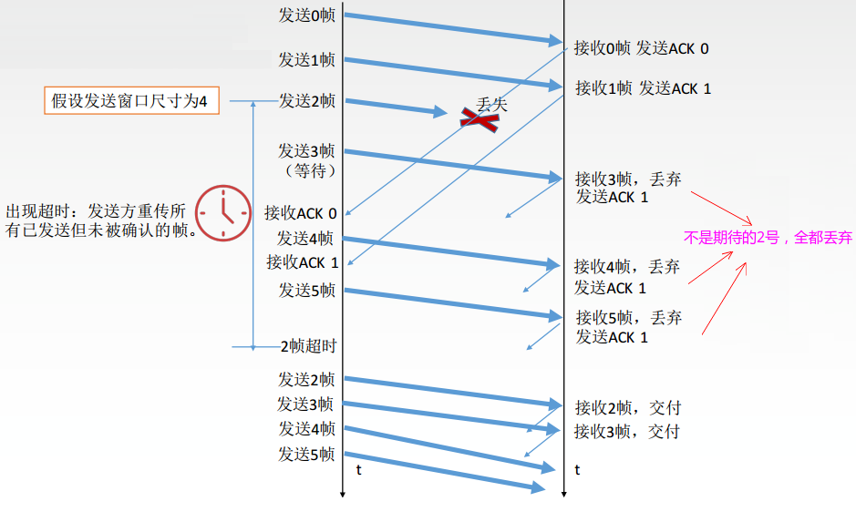
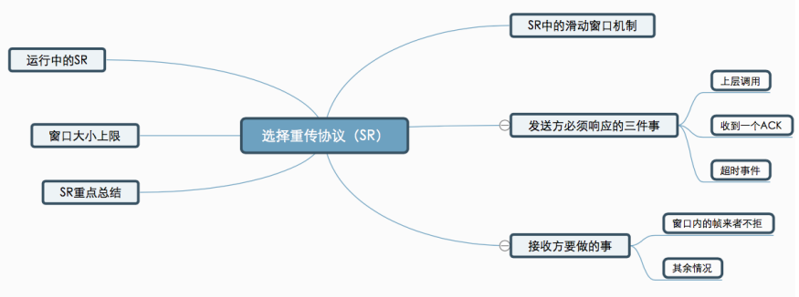

# 计网总结(三)一数据链路层
* [一、概括](#一概括)
* [二、链路层的功能](#二链路层的功能)
  * [1、封装成帧和透明传输](#1封装成帧和透明传输)
  * [2、差错检验](#2差错检验)
  * [3、流量控制](#3流量控制)
* [三、流量控制的三种协议](#三流量控制的三种协议)
  * [1、停止等待协议](#1停止等待协议)
  * [2、后退N帧协议](#2后退n帧协议)
  * [3、选择重传协议](#3选择重传协议)
* [四、介质访问控制](#四介质访问控制)
  * [1、静态划分信道－信道划分介质访问控制-信道复用技术](#1静态划分信道－信道划分介质访问控制信道复用技术)
  * [2、动态划分信道](#2动态划分信道)
* [五、局域网和广域网体系结构](#五局域网和广域网体系结构)
  * [1、局域网](#1局域网)
  * [2、以太网(属于局域网)](#2以太网属于局域网)
  * [3、广域网和PPP协议](#3广域网和ppp协议)
  * [4、链路层设备](#4链路层设备)
***
## 一、概括
七层模型中所处位置以及涉及知识概括: 

数据链路层使用的信道主要有以下两种类型：
* **点对点信道**。这种信道使用一对一的点对点通信方式。
* **广播信道**。这种信道使用一对多的广播通信方式，因此过程比较复杂。广播信道上连接的主机很多，因此必须使用专用的共享信道协议来协调这些主机的数据发送。
> 结点：主机、路由器；
>
> 帧：链路层的协议数据单元、封装网络层数据报；

**区分链路与数据链路:**
* 链路(`link`):  是一条点到点的物理线路段，中间没有任何其他的交换结点。一条链路只是一条通路的一个组成部分。
* 数据链路(`data link`) : 除了物理线路外，还必须有通信协议来控制这些数据的传输(**逻辑链路**)。若把实现这些协议的硬件和软件加到链路上，就构成了数据链路。现最常用的方法是使用适配器(即网卡)来实现这些协议的硬件和软件。一般的适配器都包括了数据链路层和物理层这两层的功能。

## 二、链路层的功能

三个基本功能: **封装成帧、透明传输、差错检测**

数据链路层在物理层提供服务的基础上向网络层提供服务，其最基本的服务是将源自网络层来的数据**可靠地传输到**
**相邻节点的目标机网络**层。

其主要作用是**加强物理层传输原始比特流的功能**，将物理层提供的可能出错的物理连接改造成为**逻辑上无差错的数据链路**，使之对网络层表现为一条无差错的链路。

* 功能一 : 为网络层提供服务。无确认无连接服务，有确认无连接服务，有确认面向连接服务；
* 功能二 : 链路管理，即连接的建立、维持、释放(用于面向连接的服务) ；
* 功能三 : 组帧 (封装成帧)；
* 功能四 : 流量控制；
* 功能五 : 差错控制(帧错/位错)；

### 1、封装成帧和透明传输

**点到点信道的数据链路层的协议数据单元 一 帧**

封装成帧:

* 封装成帧(framing)就是**在一段数据的前后分别添加首部和尾部**，然后就构成了一个帧。接收端在收到物理层上交的比特流后，就能根据首部和尾部的标记，从收到的比特流中识别帧的开始和结束。
* 首部和尾部包含许多的控制信息，他们的重要作用就是进行帧定界；

帧同步: 接收方应当能从接收到的二进制比特流中区分出帧的起始和终止。

透明传输:

- 指不管所传数据是什么样的比特组合，都应当能在链路上传送；
- 因此，链路层就看不见有什么妨碍数据传输的东西；

**组帧的四种方法: 1.字符计数法，2.字符(节) 填充法，3.零比特填充法，4.违规编码法**。

这里简单介绍一下字符计数法和字符填充法:

字符计数法：

字符填充法:

> 帧使用首部和尾部进行定界，如果帧的数据部分含有和首部尾部相同的内容，那么帧的开始和结束位置就会被错误的判定。需要在数据部分出现首部尾部相同的内容前面插入**转义字符**。如果数据部分出现转义字符，那么就在转义字符前面再加个转义字符。在接收端进行处理之后可以还原出原始数据。**这个过程透明传输的内容是转义字符，用户察觉不到转义字符的存在**。

### 2、差错检验

概括来说，传输中的差错都是由于噪声引起的。

* 全局性: 由于线路本身电气特性所产生的随机噪声(热噪声)，是信道固有的，随机存在的。解决办法: 提高信噪比来减少或避免干扰。( 对传感器下手)
* 局部性: 外界特定的短暂原因所造成的冲击噪声，**是产生差错的主要原因**。解决办法: 通常利用编码技术来解决。

局部性的又可以分为:

> 如果通信质量好，且用有线传输链路，一般会是**无确认无连接服务**。
>
> 如果通信质量差，采用无线传输链路，则会采用**有确认面向连接服务**。

几种处理的方式

检错编码:

### 3、流量控制

较高的发送速度和较低的接收能力的不匹配，会造成传输出错，因此流量控制也是数据链路层的一项重要工作。

数据链路层的流量控制和传输层的流量控制不同：**数据链路层的流量控制是点对点的，而传输层的流量控制是端到端的 **: 

* 数据链路层流量控制手段: **接收方收不下就不回复确认**；
* 传输层流量控制手段: **接收端给发送端一个窗口公告**。

看下图:

注意可靠传输和流量控制都和滑动窗口有关:

## 三、流量控制的三种协议

针对流量控制有三种协议: 停止等待协议、后退N帧协议、选择重传协议。这些也可以放在传输层讲解。

### 1、停止等待协议

停止等待协议也可以在传输层讨论。

停止等待协议是**为了实现流量控制**。

简言之: **就是每发送一个分组就停止发送，等待对方确认，在收到确认后再发送下一个分组**。

主要分为: **无差错情况和有差错情况**。

#### 1)、无差错的情况

> ACK (Acknowledgement）即是确认字符，在数据通信中，接收站发给发送站的一种传输类[控制字符](https://baike.baidu.com/item/%E6%8E%A7%E5%88%B6%E5%AD%97%E7%AC%A6/6913704)。表示发来的数据已确认接收无误。
>
> 在[TCP/IP协议](https://baike.baidu.com/item/TCP%2FIP%E5%8D%8F%E8%AE%AE)中，如果接收方成功的接收到数据，那么会回复一个ACK数据。通常ACK信号有自己固定的格式,长度大小,由接收方回复给发送方。

#### 2)、有差错的情况

又可以分为两种:

* 数据帧丢失或者检验到帧出错；

* ACK丢失；
* ACK迟到；

数据帧丢失的情况:

ACK丢失和ACK迟到:

#### 3)、缺点

信道利用率太低:

* 大部分时间都在路上；
* 即RTT（传输往返时延）太长；

针对上面停止等待协议的缺点，于是就有了在传输数据时的流水线发送数据，也就引出了两种协议:

* 后退N帧协议；
* 选择重传协议；  

解决停等协议的流水线解决方案:

### 2、后退N帧协议

用图来看一下步骤:

在这个过程中，发送方可以分成几个部分:

* 发送完被确认的；
* 已经发送但等待确认的；
* 还能发送的；
* 还不能发送的；

#### 1)、GBN发送方必须做的三件事

1)、上层的调用

上层要发送数据时，发送方先检查发送窗口是否已满，如果未满，则产生一个帧并将其发送， 如果窗口已满，
发送方只需将数据返回给上层，暗示上层窗口已满。上层等一会再发送。 (实际实现中，发送方可以缓存这
些数据，窗口不满时再发送帧) 。

2)、收到了一个ACK (重要)

GBN协议中，对n号帧的确认采用**累积确认**的方式，标明接收方已经收到n号帧和它之前的全部帧。

3)、超时事件

**协议的名字为后退N帧/回退N帧**，来源于出现丢失和时延过长帧时发送方的行为。就像在停等协议中一样，
定时器将再次用于恢复数据帧或确认帧的丢失。如果出现超时，发送方重传所有已发送但未被确认的帧。

#### 2)、GBN接收方必须要做的事

1)、如果正确收到n号帧，并且按序，那么接收方为n帧发送一个ACK，并将该帧中的数据部分交付给上层。

2)、**其余情况都丢弃帧，并为最近按序接收的帧重新发送ACK。接收方无需缓存任人 只需要维护一个信息: expectedseqnum** (下一个按序接收的帧序、我期待的下一个的帧的序号，如果一直没来我就一直丢弃你的不符合的帧) 。

> 注意发送窗口不能无限大，范围是`1 ~ 2^n-1`，`n`是代表用`n`个比特对帧编号。

#### 3)、GBN总结和注意事项

几个重点:

* 累积确认( 偶尔捎带确认)；
* **接收方只按顺序接收帧，不按序无情丢弃**；
* 确认序列号最大的、按序到达的帧
* **发送窗口最大为 2n - 1，接收窗口大小为1**；

### 3、选择重传协议

后退N帧协议的缺点 : 有些帧发送的好好的(由于exceptedSeqNum不对)，为什么让我重传呢?

解决办法:

设置单个确认，同时加大接收窗口，设置接收缓存，缓存乱序到达的帧。

基本方法:

#### 1)、SR发送方必须做的三件事

1)、从上层收到数据后，**SR发送方检查下一个可用于该帧的序号，如果序号位于发送窗口内，则发送数据帧**；否
则就像GBN一样，要么将数据缓存，要么返回给上层之后再传输；

2)、如果收到ACK，加入该帧序号在窗口内，则SR发送方将那个被确认的帧标记为已接收。如果该帧序号是窗口
的下界(最左边第一个窗口对应的序号) ，**则窗口向前移动到具有最小序号的未确认帧处**。如果窗口移动了
并且有序号在窗口内的未发送帧，则发送这些帧。

3)、每个帧都有自己的定时器，一个超时时间发生之后只重传一个帧。

#### 2)、SR接收方必须要做的事

1)、**SR接收方将确认一个正确接收的帧而不管其是否按序**。**失序的帧将被缓存**，并返回给发送方一个该帧的确认帧【收谁确认谁】，直到所有帧(即序号更小的帧皆被收到为止，这时才可以将一批帧按序交付给上层，然后向前移动滑动口上。

2)、**如果收到了小于窗口下界的帧，就返回一个ACK，否则就忽略该帧**。

#### 3)、SR总结和注意事项

SR重点:

* 对数据帧逐一确认，收一个确认一个(先来着不拒)；
* 只重传出错帧；
* 接收方有**缓存**；
* W发送方 = W接收方 = 2 n-1；

## 四、介质访问控制

数据传输时使用的两种链路:

* **点对点信道**: 一对一通信。因为不会发生碰撞，因此也比较简单，使用 PPP 协议进行控制。
* **广播信道**: 一对多通信，一个节点发送的数据能够被广播信道上所有的节点接收到。所有的节点都在同一个广播信道上发送数据，因此需要有专门的控制方法进行协调，避免发生冲突（冲突也叫碰撞）。主要有两种控制方法进行协调，一个是使用信道复用技术，一是使用 CSMA/CD 协议。

介质访问控制就是解决避免广播信道产生冲突的:

采取一定的措施，使得两个节点之间的通信不会发生互相干扰的情况。 例如一堆对讲机，不能同时有两个人同时的讲话。

主要的措施:

### 1、静态划分信道－信道划分介质访问控制-信道复用技术

信道划分介质访问控制: 将使用介质的每个设备与来自同一信道上的其他设备的通信隔离开，把时域和
频域资源合理地分配给网络上的设备。

#### 1)、频分多路FDM

#### 2)、时分多路TDM

使用频分复用和时分复用进行通信，在通信的过程中主机会一直占用一部分信道资源。但是由于计算机数据的突发性质，通信过程没必要一直占用信道资源而不让出给其它用户使用，因此这两种方式对信道的利用率都不高。更好的方法是统计时分复用。

**统计时分复用**:

#### 3)、波分多路WDM

波分多路复用就是**光的频分多路复用**，在一根光纤中传输多种不同波长(频率) 的光信号，由于波长(频率)
不同，所以各路光信号互不干扰，最后再用波长分解复用器将各路波长分解出来。

#### 4)、码分多路CDM

码分多址(CDMA) 是码分复用的一种方式。

1个比特分为多个码片/芯片 (chip) ，每一个站点被指定一个唯一的m位的蕊片序列。
发送1时站点发送芯片序列，发送0时发送芯片序列反码(通常把0写成-1) 。

### 2、动态划分信道

#### 1)、随机访问介质访问控制(随机访问MAC协议)

##### a)、ALOHA协议(不听就说，想说就说)

分为两种: 纯ALOHA协议和时隙ALOHA协议。

纯ALOHA协议: 不按时间槽发送，随机重发。想发就发。

时隙ALOHA协议: 把时间分成若干个相同的时间片，所有用户在时间开始时刻同步接入网络信道，若发生冲突，则必须等到下一个时间片开始时刻再发送。

纯ALOHA协议比时隙ALOHA协议吞吐量更低，效率更低。

##### b)、CSMA协议(先听再说)

协议思想: **发送帧之前，监听信道**。发送数据之前要检测一下总线上是否有其他计算机在发送数据。

具体又可以分为三种：

具体:

* 1)、1-坚持CSMA: 空闲则直接传输，不必等待；忙则一直坚挺，直到空闲马上传输；(可能冲突)
* 2)、非坚持CSMA: 空闲则直接传输，不必等待；忙则等待一个随机的时间之后再进行监听；
* 3)、p-坚持: 空闲则以`p`概率直接传输，以`1-p`概率等待到下一个时间槽再传输；忙则等待一个随机的时间之后再进行监听；

##### c)、CSMA/CD协议(重点)

英文名：`Carrier sense multiple access with collision detection`。(CSMA/CD)

主要用于**总线式以太网**。

CSMA/CD协议思想: **先监听再发送，边监听边发送**。

CSMA/CD 表示载波监听多点接入 / 碰撞检测。

* **载波监听(CS)** ：每个主机都必须不停地监听信道。在发送前，如果监听到信道正在使用，就必须等待。

- **多点接入(MA)** ：说明这是总线型网络，许多主机以多点的方式连接到总线上。
- **碰撞检测(CD)** ：在发送中，如果监听到信道已有其它主机正在发送数据，就表示发生了碰撞(冲突检测)。虽然每个主机在发送数据之前都已经监听到信道为空闲，但是由于电磁波的传播时延的存在，还是有可能会发生碰撞(所以适用在半双工网络)。

传播时延对载波监听的影响:

记端到端的传播时延为 `τ`，最先发送的站点最多经过 `2τ` 就可以知道是否发生了碰撞，称 `2τ` 为 **争用期** 。**只有经过争用期之后还没有检测到碰撞，才能肯定这次发送不会发生碰撞**。

当发生碰撞时，站点要停止发送，等待一段时间再发送。这个时间采用 **截断二进制指数退避算法** 来确定。从离散的整数集合 `{0, 1, 2, 4 .., (2^k-1)}` 中随机取出一个数，记作 `r`，然后取 `r` 倍的争用期作为重传等待时间。

帧的传播时延至少要两倍于信号在总线中的传播时延。

即 **帧长(bit) / 数据传输速率 >= 2τ**。

##### d)、CSMA/CA协议

英文名: `Carrier sense multiple access with collision avoidance`。(后面是碰撞**避免**)。

主要用于**无线网**，可以全面的检测碰撞。

过程:

1)、发送数据前，先检测信道是否空闲-空闲则发出`RTS`(`request to send`) ，`RTS`包括发射端的地址、接收端的地址、下一份数据将持续发送的时间等信息。 信道忙则等待。

2)、接收端收到`RTS`后，将响应`CTS` ( `clear to send`) 。

3)、发送端收到`CTS`后，开始发送数据帧，同时**预约信道:** 发送方告知其他站点自己要传多久数据)。

4)、接收端收到数据帧后，将用`CRC`(循环冗余)来检验数据是否正确，正确则响应ACK帧-发送方收到ACK就可以进行下一个数据帧的发送，若没有则一直重传至规定重发次数为止（采用**二进制指数退避算法**来确定随机的推迟时间) 。

#### 2)、轮询访问介质访问控制

主要有两个: **轮询协议和令牌传递协议**。

**轮询协议**: 主节点轮流“邀请”从属节点发送数据。

**令牌传递协议**: 在所有主机之间，有一个特殊格式的令牌(MAC控制帧，不含任何信息)来控制信道的使用，确保同一时刻只有一个节点独占信道。

## 五、局域网和广域网体系结构

### 1、局域网

英文: Local Area Network，简称LAN，**指在某一区域由多态计算机互联组成的计算机组，使用广播信道**。

决定局域网的主要因素: **网络拓扑、传输介质和介质访问控制方法**。

局域网拓扑结构有: **星型拓扑、总线型拓扑、环形拓扑、树型拓扑**。

传输介质: 

* 有线局域网 常用介质: 双绞线、同轴电缆、光纤
* 无线局域网 常用介质: 电磁波

局域网分类

* 1)、以太网，应用最广泛，符合`IEE802.3`系列标准。逻辑拓扑是总线型，物理拓扑是星型。
* 2)、令牌环网: 不用了。
* 3)、FDDI网: 双环拓扑。
* 4)、ATM网。
* 5)、无线局域网(WLAN): 采用`IEE802.11`标准
  

> MAC 地址是链路层地址，长度为 6 字节（48 位），用于唯一标识网络适配器（**网卡**）。
>
> 一台主机拥有多少个**网络适配器**就有多少个 MAC 地址。例如笔记本电脑普遍存在无线网络适配器和有线网络适配器，因此就有两个 MAC 地址。

### 2、以太网(属于局域网)

**以太网是一种星型拓扑结构局域网**。

早期使用**集线器**进行连接，集线器是一种物理层设备， 作用于比特而不是帧，当一个比特到达接口时，集线器重新生成这个比特，**并将其能量强度放大**，从而扩大网络的传输距离，之后再将这个比特发送到其它所有接口。如果集线器同时收到两个不同接口的帧，那么就发生了碰撞()。

目前以太网使用**交换机替代了集线器**，交换机是一种链路层设备，它不会发生碰撞，**能根据 MAC 地址进行存储转发**。

以太网帧格式(**图可以看最文章上面那张图的下方**)：

- **类型** ：标记上层使用的协议；
- **数据** ：长度在 46-1500 之间，如果太小则需要填充；
- **FCS** ：帧检验序列，使用的是 CRC 检验方法；

以太网提供**无连接、不可靠**的服务。

无连接: 发送方和接收方之间无握手过程。

不可靠: 不对发送方的数据帧编号，接收方不向发送方进行确认，帧错直接丢弃，差错纠正由高层负责。

### 3、广域网和PPP协议

广域网 (`WAN`，Wide Area Network) ，通常跨接很大的物理范围。

广域网的通信子网主要使用**分组交换技术**。因特网 (Internet)是世界范围内最大的广域网。

PPP(Point-to-Point Protocol)协议是目前使用最广泛的数据链路层协议，**是在广域网使用的协议，只支持全双工链路**。

特点:

* 简单: 对于链路层的帧，无需纠错，无需序号，无需流量控制。
* 封装成帧: 加上帧定界符
* 透明传输: 与帧定界符一样比特组合的数据应该如何处理: 异步线路用字节填充，同步线路用比特填充。
* 多种网络层协议: 封装的IP数据报可以采用多种协议。
* 多种类型链路”串行/并行，同步/异步，电/光…
* 差错检测: 错就丢弃
* 检测连接状态 : 链路是否正常工作。
* 最大传送单元: **数据部分最大长度MTU**。
* 网络层地址协商: 知道通信双方的网络层地址

组成部分:

(1)、高级数据链路控制协议
高级数据链路控制协议是将 卫 数据报封装到串行链路的方法。PPP 既支持异步链路 (无奇偶校验的 8 比特数据)，也支持面向比特的同步链路。IP 数据报在 PPP 帧中就是其信息部分，这个信息部分的长度受最大传送单元 MTU 的限制。
(2) 链路控制协议
链路控制协议(Link Control Protocol，LCP) 用来建立、配置和测试数据链路连接，通信的双方可协商一些选项(进行**身份验证**)。
(3) 网络控制协议
网络控制协议 NCP (Network Control Protocol) 中的每一个协议支持不同的网络层协议, 如IP、IPv6、DECnet，以及 AppleTalk 等。

PPP 的帧格式：

- F 字段为**帧的定界符**
- FCS 字段是使用 CRC 的检验序列
- 信息部分的长度不超过 1500

 

### 4、链路层设备

物理层设备: 中继系统，即转发器（repeater）或集线器（hub）。  

数据链路层:  即交换机(switch)或网桥（交换机前身）。

**网桥根据MAC帧的目的地址对帧进行转发和过滤**。当网桥收到一个帧时，并不向所有接口转发此帧，而是
**先检查此帧的目的MAC地址，然后再确定将该帧转发到哪一个接口**，或者是把它丢弃 (即过滤) ，这就是比集线器好的地方。

 

集线器既不能分割冲突域也不能分割广播域，它就像一根接口比较多的网线一样。

一个小例题:

关于冲突域和广播域更多可以看[**这篇博客**](https://blog.csdn.net/gui951753/article/details/79402528)。