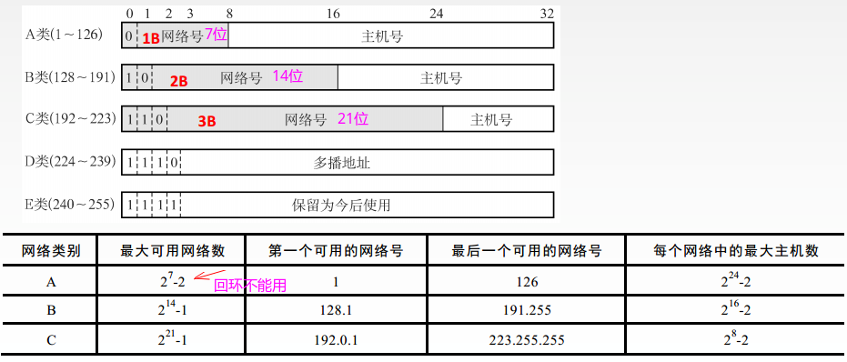
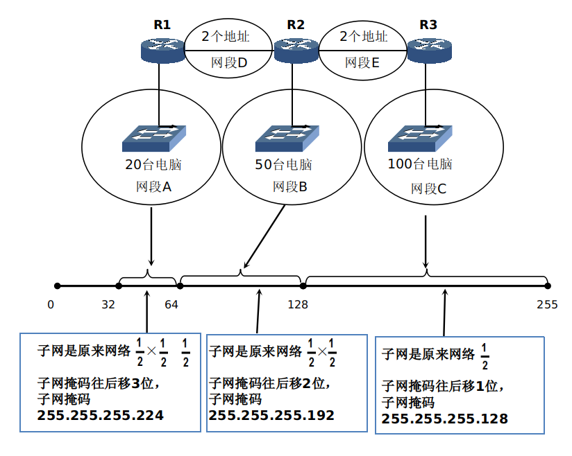
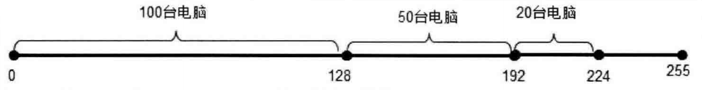

# 计网总结(四)一网络层


* [一、数据交换方式](#一数据交换方式)
* [二、IP数据报](#二ip数据报)

  * [1、IP数据报格式](#1ip数据报格式)
  * [2、IP数据报分片](#2ip数据报分片)
* [三、IP地址](#三ip地址)

  * [1、IP地址概念](#1ip地址概念)
  * [2、子网掩码](#2子网掩码)
  * [3、IP地址分类](#3ip地址分类)
  * [4、子网划分](#4子网划分)
  * [5、变长子网划分](#5变长子网划分)
  * [6、超网合并网段](#6超网合并网段)
* [四、重要协议](#四重要协议)

  * [1、ARP协议(地址解析协议)](#1arp协议地址解析协议)
  * [2、DCHP(动态主机设置协议，传输层协议)](#2dchp动态主机设置协议传输层协议)
  * [3、ICMP(网际控制报文协议)](#3icmp网际控制报文协议)
  * [4、IGMP](#4igmp)
* [五、路由算法和路由选择协议](#五路由算法和路由选择协议)

  * [1、路由器结构](#1路由器结构)
  * [2、路由转发分组流程](#2路由转发分组流程)
  * [3、路由算法概括](#3路由算法概括)
  * [4、RIP(距离向量)](#4rip距离向量)
  * [5、OSPF(开放式最短路径优先)](#5ospf开放式最短路径优先)
  * [6、BGP(边界网关)](#6bgp边界网关)
* [六、其他](#六其他)

  * [1、数据包传输过程以及简单的静态路由配置实验](#1数据包传输过程以及简单的静态路由配置实验)
  * [2、IPV6](#2ipv6)

先上一张总结图:


## 一、数据交换方式

第一章提到数据交换方式分为电路交换、报文交换、分组交换。

其中在网络层。分组交换又可以分为**数据报方式和虚电路方式**。

其中，**数据报方式为网络层提供无连接服务**。**虚电路方式为网路层提供连接服务**。

> 无连接服务: 不事先为分组的传输确定传输路径，每个分组独立确定传输路径，不同分组传输路径可能不同。
>
> 连接服务: 首先为分组的**传输确定传输路径**(建立连接) ，然后沿该路径传输系列分组，系列分组传输路径相同，传输结束后拆除连接。

几种传输单元在各层的位置:


下面看数据包方式和虚电路交换方式:


对比:


## 二、IP数据报

### 1、IP数据报格式


一个 IP 数据报由首部和数据两部分组成。首部的前一部分是固定长度，共` 20 `字节，是所有 IP 数据报必须具有的。在首部的固定部分的后面是一些可选字段，其长度是可变的。 

* 版本——占 4 位，指 IP 协议的版本。目前的 IP 协议版本号为 4 (即 IPv4)；

* 首部长度——占 4 位，可表示的最大数值是 15 个单位(一个单位为 4 字节)，因此 IP 的首部长度的最大值是 60 字节；

* 总长度——占 16 位，指首部和数据之和的长度，单位为字节，因此数据报的最大长度为 65535 字节。总长度必须不超过最大传送单元 MTU(数据链路层规定)；

* 标识(identification) ——占 16 位，它是一个计数器，用来产生 IP 数据报的标识。；

* 标志(flag) ——占 3 位，目前只有前两位有意义。标志字段的最低位是 MF (More Fragment)。MF = 1 表示后面“还有分片”。MF = 0 表示最后一个分片。标志字段中间的一位是 DF (Don't Fragment) 。只有当 DF = 0 时才允许分片； 

* 片偏移——占13 位，指出：较长的分组在分片后某片在原分组中的相对位置。片偏移以 8 个字节为偏移单位；

* 生存时间——占8 位，记为 TTL (Time To Live)，指示数据报在网络中可通过的路由器数的最大值；

* 协议——占8 位，指出此数据报携带的数据使用何种协议，以便目的主机的 IP 层将数据部分上交给那个处理过程；

* 首部检验和——占16 位，只检验数据报的首部，不检验数据部分。这里不采用 CRC 检验码而采用简单的计算方法。 


### 2、IP数据报分片

当IP数据报传送到链路层的时候，如果IP数据报长度超过MTU，就需要分片。


具体的分片过程:


> 中间位 DF(Don't Fragment)
>
> * DF = 1 ，禁止分片；
> * DF = 0，允许分片；
>
> 最低位MF(More Fragment)
>
> * MF = 1，后面"还有分片"；
> * MF = 0，代表最后一片/没分片；

## 三、IP地址

### 1、IP地址概念

* `IP` 地址就是给每个连接在互联网上的主机（或路由器）分配一个在全世界范围是唯一的 `32` 位的标识符，用来定位网络中的计算机和网络设备；
* IP 地址用 `32` 位二进制来表示， 也就是`32` 比特， 换算成字节， 就 是 `4` 个字节。例如一个采用二进制形式的 IP 地址是`10101100 00010000 00011110 00111000 `， 这么长的地址， 处理起来太费劲。于是这些位被分割为`4`    个部分， 每一部分` 8 `位二进制， 中间使用符号 `.`分开 ，上面的 `IP` 地址可以表示为`172.16.30.56`。`IP` 地址的这种表示法叫做“点分十进制表示法”；
* 计算机的 `IP` 地址由两部分组成， **一部分为网络标识， 一部分为主机标识**；同 一网段的计算机网络部分相同。路由器连接不同网段，负责不同网段之间的数据转发，交换机连接的则是同一网段的计算机；见下图: 


> 计算机在和其他计算机通信之前， 首先要判断目标 `IP`  地址和自己的`IP`  地址是否在一个网段， 这决定了数据链路层的目标 `MAC` 地址是目标计算机的还是路由器接口的。 

**IP地址和硬件地址的区别** 


### 2、子网掩码

* 子网掩码 ( `Subnet Mask`) 又叫网络掩码、地址掩码，它是一种用来指明一个`IP`地址的哪些位标识的是主机所在的子网以及哪些位标识的是主机的位掩码。**子网掩码只有一个作用，就是将某个`IP`  地址划分成网络地址和主机地址两部分**。
* 例如: 计算机的 `IP` 地址是 `131.107.41.6`,  子网掩码是 `255.255.0.0`,  计算机所在网段是`131.107.0.0`。该计算机和远程计算机通信 ，目标 `IP` 地址只要前面两部分是 `131.107`就认为和 该计算机在同一个网段；

通过`IP`和子网掩码计算网段: 

方法:  IP 地址和子网掩码做**与运算**：


有关二进制的特殊转换和特征(和划分子网有关系): 
|二进制|十进制|备注|
|-|-|-|
|1000 0000	|128||
|1100 0000|192| 1000 0000+ 10 0000 也就是 128 + 64=192|
|1110 0000|224| 1000 0000 + 100 0000 + 10 0000 也就是 128  + 64 + 32=224|
|1111 0000|240| 128 + 64 + 32 + 16 = 240|
|1111 1000|248| 128 + 64 + 32 + 16 + 8 = 248|
|1111 1100|252| 128 + 64 + 32 + 16 + 8 + 4 = 252|
|1111 1110|254| 128 + 64 + 32+ 16 + 8 + 4 + 2=254|
|1111 1111|255| 128 + 64 + 32 + 16 + 8 + 4 + 2 + 1=255|


一个规律，**如果要你写出十进制转换成二进制后，后n位二进制是多少**: 

> * 能够被 `2` 整除的数， 写成二进制形式， 后一位是 `0`。如果余数是` 1 `,  则最后一位是 `1`。 
> * 能够被 `4 `整除的数， 写成二进制形式， 后两位是 `00`。如果余数是`2` , 那就把 `2 `写成二进制，后两位是`10 `。
> * 能够被 `8` 整除的数， 写成二进制形式， 最后三位是 `000 `。如果余 `5` , 就把`5 `写成二进制， 后三位是 `101`。
> * 能够被 `16` 整除的数， 写成二进制形式， 最后四位是 `0000` 。如果余 `6` ,   就把`6 `写成二进制， 最后四位是 `0110` 。


我们可以找出规律， 如果让你写出一个十进制数转换成二进制数后面的 `n` 位二进制数 ，你可以将该数除以 2<sup>n</sup>,    将余数写成 `n` 位二进制即可。

举例:  写出十进制数 242 转换成二进制数后的最后 4 位: 
2<sup>4</sup>   是 `16` ,  `242` 除以 `16 `,  余 `2` ,  将余数写成 4 位二进制，就是 `0010` 。

### 3、IP地址分类

如图所示: 

* A类地址: **网络地址最高位是 `0` 的地址为 A 类地址**。网络 ID 全 `0` 不能用，`127` 作为保留网段，因此 A 类地址的第 1 部分取值范围为 `1~126`；A 类网络默认子网掩码为`255.0.0.0`。主机ID 由第 2 部分、第 3 部分和第 4 部分组成，每部分的取值范围为 `0~255`，共 256 种取值，由排列组合知道，一个 A 类网络主机数量是 `256 * 256 * 256=166777216`，这里还需减去` 2`，主机 ID 全 0 的地址为网络地址，而主机ID 全 `1` 的地址为广播地址，如果你给主机 ID 全 `1` 的地址发送数据包，计算机产生一个数据链路层广播帧，**发送到本网段全部计算机**；
* B类地址: **网络地址最高位是`10`的地址为B类地址**。IP地址第一部分取值范围为`128 ~ 191`。B类网络默认子网掩码为 `255.255.0.0`。主机 ID 由第 3 部分和第 4 部分组成，每个 B 类网络可以容纳的最大主机数量为 `256X256-2=65023` ；
* C类地址: **网络地址最高位是`110`的地址为C类地址**。IP地址第一部分取值范围为`192 ~ 223`。子网掩码是`255.255.255.0`，主机ID由第4部分组成，每个C类网络可以容纳的最大主机数量为`256 - 2 = 254`；


 数轴表示:

* 一个`A`类网络的主机数量是`256`*`256`*`256`个，这里还需要减去`2`，因为主机`ID`全`0`的地址为网络地址，而主机`ID`全`1`的地址为广播地址，如果给主机`ID`全1的`IP`地址发送数据包，这个电脑将产生一个数据链路层广播帧，发送到本网段全部计算机；
* 在电脑中，我们只需要写出自己的`IP`地址，按下`TAB`键，就能自动将子网掩码补全，这就说明，可以按照前`8`位来推断是哪一类地址，然后推断子网掩码。子网掩码可以来划分网络部分(`net-id`)和主机部分(`host-id`)；
* 在同一个局域网上的主机或路由器的IP 地址中的网络号(`net-id`)必须是一样的。
* 路由器总是具有两个或两个以上的 IP 地址。路由器的每一个接口(`fastethernet`或者`serial`)都有一个不同网络号的 IP 地址。


**保留的IP地址**
有些 IP 地址被保留用于某些特殊目的， 网络管理员不能将这些地址分配给计算机。
* 主机 `ID` 全为 0 的地址： 特指某个网段， 比如 `192.168. 10.0 255.255.255.0`,  指 `192.168.10.0`网段(**网段也叫网络地址**)；
* 主机`ID` 全为 1 的地址： 特指该网段的全部主机 ，如果你的计算机发送数据包使用主机 ID 全是 1 的 IP  地址， 数据链路层地址用广播地址 `FF-FF-FF-FF-FF-FF`。同一网段计算机名称解析就需要发送名称解析的广播包。比如你的计算机 lP 地址是` 192.168.10.10` ,  子网掩码是 `255.255.255.0 `, 它要发送一个广播包， 如目标 IP 地址是 `192.168.10.255` , 帧的目标MAC  地址是 `FF-FF-FF-FF-FF-FF`，该网段中全部计算机都能收到；
* `127.0.0.1`：  是回送地址， 指本机地址， 一般用作测试使用。回送地址 ( `127.x.x.x` )  即本机回送地址 ( `Loopback Address` ) , 指主机 IP 堆栈内部的 IP 地址， 主要用于网络软件测试以及本地机进程间通信， 无论什么程序， 一旦使用回送地址发送数据， 协议软件立即返回， 不进行任何网络传输。任何计算机都可以用该地址访问自己的共享资源或网站，如果  ping该地址能够通， 说明你的计算机的 `TCP/IP `协议栈工作正常， 即便你的计算机没有网卡，ping `127.0.0.1` 还是能够通的；
* `169. 254.0.0`： `169.254.0.0 ~ 169.254.255.255` 实际上是自动私有 IP 地址。 如果计算机无法获取 IP 地址， 对于Windows  2000 以后的操作系统， 则在无法获取 IP  地址时自动配置成 `" IP地址： 169.254.x.x "，" 子网掩码：255.255.0.0“`，这样可以使所有获取不到IP地址的计算机能够通信；


**私网地址和公网地址**

私网 IP 地址可以被用于私有网络 ，在 lnternet 上没有这些 IP 地址， Internet 上的路由器也没有到私有网络的路由表。**我们在 Internet 上不能访问这些私网地址， 从这一点来说使用私网地址的计算机更加安全 ，也有效地节省了宝贵的公网IP 地址**。使用私网地址的计算机可以通过 **NAT** ( Network Address Translation , 网络地址转换）技术访问Internet。

下面列出保留的私有IP 地址。

* A 类： `10.0.0.0 [255.0.0.0]`，  保留了一个 A 类网络。
* B 类： `172.16.0.0 [255.255.0.0] ~ 172.31.0.0 [255.255.0.0]`,    保留了16个B类网络。
* C 类： `192.168.0.0 [255.255.255.0]  ~ 192.168.255.0 [255.255.255.0]`，   保留了 256 个C类网络。

关于**网络地址转换NAT**

由于**路由器对目的地址是私有IP地址的数据包一律不转发**。所以需要使用`NAT`来使得私有地址访问`Internet`。

在专用网链接到因特网的路由器上安装了NAT软件，安装了NAT软件的路由器叫NAT路由器。


IP地址分类总结(**下面的表格重要**):




### 4、子网划分

子网划分就是**将一个网段等分成多个网段，也就是等分成多个子网**。

任务:

* 确定子网掩码的长度；
* 确定子网中第一个可用的IP地址和最后一个可用的IP地址；

在划分子网后，有些人将原来的网络号(地址)和主机号(地址)变成了三部分，即**网络号、子网号、主机号**：


> 例题1:
>
> 已知IP地址是`141.14.72.24`，子网掩码是`255.255.192.0`，求网络地址。如果子网掩码是`255.255.224.0`，求网络地址。
>
> (1)、答:　网络地址就是直接将子网掩码和IP地址逐位相与，这里只需要将`72和192`相与:
>
> ```c
> 01001000
> 11000000
> --------
> 01000000   =  64
> ```
>
> 所以: 网络地址是 `141.14.64.0`。**这里子网号占2位，剩下的主机号占6 + 8 = 14位**。
>
> (2)、同理:
>
> ```c
> 01001000
> 11100000
> --------
> 01100000  = 64
> ```
>
> 可见网络地址还是`141.14.64.0`。**这里子网号占3位，剩下的主机号占5 + 8 = 13位**。
>
> **这个例子说明同样的IP地址可以和不同的子网掩码相与得出不同的网络地址**。
>
> 例题2:
>
> 某主机的IP地址为`180.80.77.55`，子网掩码为`255.255.252.0`。若该主机向其所在子网发送广播分组，则目的地址可以是:  (**D**)
>
> A、 `180.80.76.0`          B、`180.80.76.255`        C、`180.80.77.255`       D、`180.80.79.255`
>
> 首先发现子网掩码是划分了子网的，因为第三位是`252`，对应二进制是`11111100`，则可以知道IP地址的**网络号是16位、子网号是6位、主机号是2+8=10位**。
>
> 将`77`写成二进制`01001101`，由于子网号是`6`位，所以我们取掉前`6`位 即`01001100`即`76`，但由于是广播地址，所以后面`+11`，即`01001111 11111111`，也就是`79.255`，即D。

划分后的路由器分组转发算法(**下面(五)路由算法那里也有讲**)

* 1、提取目的IP地址；
* 2、是否直接交付；
* 3、特定主机路由；
* 4、检测路由表中有无路径；
* 5、默认路由0.0.0.0；
* 6、丢弃，报告转发分组出错； 

#### 1)、无分类编址CIDR


> IP地址后面跟`/24`表示掩码位是24位，即子网掩码是255.255.255.0的IP地址，其主机位最多有254个。 　
> 子网掩码通常有以下2种格式的表示方法： 
> * 1、通过与IP地址格式相同的点分十进制表示。如：`255.0.0.0` 或 `255.255.255.128`等。
> * 2、在IP地址后加上`"/"`符号以及`1-32`的数字，其中`1-32`的数字表示子网掩码中**网络标识位**的长度 　　如：`192.168.1.1/24` 的子网掩码也可以表示为`255.255.255.0`。

下面举几个划分的例子。

#### 2)、C类地址等分成两个子网

下面以一个 C 类网络划分为两个子网为例，讲解子网划分的过程。

如图 所示，某公司有两个部门，每个部门 100 台计算机，通过路由器连接 Internet。给这200台电脑分配一个 C 类网络 `192.168.0.0`，该网段的子网掩码为 `255.255.255.0`，连接局域网的路由器接口使用该网段的第一个可用的IP地址 `192.168.0.1`。


为了安全考虑，打算将这两个部门的计算机分为两个网段，中间使用路由器隔开。计算机数量没有增加，还是 200 台，因此一个 C 类网络的IP地址是足够用的。现在将 `192.168.0.0 [255.255.255.0]`这个 C 类网络划分成两个子网。

如图所示，将IP地址的第 4 部分写成二进制形式，子网掩码使用两种方式表示: 二进制和十进制。**子网掩码往右移一位，这样C类地址主机ID 第1位就成为网络位, 该位为 0 是 A子网，该位为1是B子网**。


如图所示，IP 地址的第 4 部分，其值在 `0~127` 之间的，第 1 位均为 0；其值在 `128~255`之间的，第 1 位均为 1。分成A、B 两个子网，以 128 为界。现在的子网掩码中的1变成了 25 个，写成十进制就是 255.255.255.128。子网掩码向后移动了 1 位，就划分出 2 个子网。**A和B 两个子网的子网掩码都为255.255.255.128** 。

A子网可用的地址范围为 `192.168.0.1~192.168.0.126`，IP 地址 192.168.0.0 由于主机位全为 0，不能分配给计算机使用，如图 所示，`192.168.0.127` 由于主机位全为 1，也不能分配计算机。


B 子网可用的地址范围为`192.168.0.129~192.168.0.254`，IP 地址 `192.168.0.128` 由于主机位全为0，不能分配给计算机使用，IP 地址 `192.168.0.255` 由于主机位全为 1，也不能分配给计算机。划分成两个子网后网络规划如图所示。


#### 3)、C类地址等分成四个子网

假如公司有 4 个部门，每个部门有 50 台计算机，现在使用 `192.168.0.0/24` 这个 C 类网络。从安全考虑，打算将每个部门的计算机放置到独立的网段，这就要求将 `192.168.0.0  [255.255.255.0]` 这个 C 类网络划分为4个子网，那么如何划分成4 个子网呢?

如图 所示， 将 `192.168.0.0  [255.255.255.0]` 网段的地址的第 4 部分写成二进制，要想分成4个子网，需要将子网掩码**往右移动两位**，这样第 1 位和第 2 位就变为网络位。**就可以分成4个子网，第 1 位和第2 位为00是A子网，01是B子网，10是C子网，11是D子网**。


A、B、C、D 子网的子网掩码都为 `255.255.255.192`。

* A子网可用的开始地址和结束地址为 `192.168.0.1~192.168.0.62`；
* B子网可用的开始地址和结束地址为 `192.168.0.65~192.168.0.126`；
* C子网可用的开始地址和结束地址为 `192.168.0.129~192.168.0.190`；
* D子网可用的开始地址和结束地址为 `192.168.0.193~192.168.0.254`；

注意: 如图所示，**每个子网的最后一个地址都是本子网的广播地址**，不能分配给计算机使用，如A子网的63、B子网的 127、C子网的191和D子网的 255。


#### 4)、C类地址等分成八个子网

如果想把一个C类网络等分成 8 个子网，如图所示，子网掩码需要往右移 3 位，才能划分出 8个子网，**第 1 位、第 2 位和第 3 位都变成网络位**。


每个子网的子网掩码都一样，为` 255.255.255.224`。

* A 子网可用的开始地址和结束地址为`192.168.0.1 ~ 192.168.0.30`；
* B 子网可用的开始地址和结束地址为 `192.168.0.33 ~ 192.168.0.62`；

* C 子网可用的开始地址和结束地址为 `192.168.0.65 ~ 192.168.0.94`；

* D 子网可用的开始地址和结束地址为 `192.168.0.97 ~ 192.168.0.126`；

* E 子网可用的开始地址和结束地址为 `192.168.0.129 ~ 192.168.0.158`；

* F 子网可用的开始地址和结束地址为 `192.168.0.161 ~ 192.168.0.190`；

* G 子网可用的开始地址和结束地址为 `192.168.0.193 ~ 192.168.0.222`；

* H 子网可用的开始地址和结束地址为 `192.168.0.225 ~ 192.168.0.254`；

注意: 每个子网能用的主机 IP地址，都要去掉主机位全 0 和主机位全 1 的地址。 如上图所示，31、63、95、127、159、191、223、255 都是相应子网的广播地址。

每个子网是原来的了`1/2 * 1/2 * 1/2 `，即3个`1/2`， 子网掩码往右移 3 位。

总结: 如果一个子网地址是原来网段的`(1/2)^n` ，子网掩码就在原网段的基础上后移`n`位。

#### 5)、B类地址划分子网

将`131.107.0.0 [255.255.0.0]`等分成2个子网。子网掩码往右移动1位，就能等分成两个子网。


这两个子网的子网掩码都是 `255.255.128.0`。

先确定 A 子网第一个可用地址和最后一个可用地址，按照下图将主机部分写成二进制，**主机位不能全是 0，也不能全是 1**，然后再根据二进制写出第一个可用地址和最后一个可用地址。同理B也是。


#### 6)、A类地址划分子网

和 C 类地址和 B 类地址划分子网的规律一样，A 类地址子网掩码往右移动 1 位，也能划分出两个子网。只是写出每个网段第一个和最后一个可用的地址时，需要谨慎。

下面以 A 类网络 `42.0.0.0 [255.0.0.0]` 等分成4 个子网为例，写出各个子网的第一个和最后一个可用的IP地址。如图所示，划分出 4 个子网，子网掩码需要右移 2 位。每个子网的子网掩码为`255.192.0.0`。


参照上图，可以很容易地写出这些子网能够使用的第一个IP地址和最后一个IP地址。

* A子网可用的第一个地址为 `42.0.0.1`，最后一个可用的地址为`42.63.255.254`；
* B 子网可用的第一个地址为` 42.64.0.1`，最后一个可用的地址为 `42.127.255.254`；
* C 子网可用的第一个地址为 `42.128.0.1`，最后一个可用的地址为 `42.191.255.254`；
* D 子网可用的第一个地址为 `42.192.0.1`，最后一个可用的地址为 `42.255.255.254`；

具体如图:


### 5、变长子网划分

如图所示，有一个 C 类网络 `192.168.0.0  [255.255.255.0]`，需要将该网络划分成5个网段以满足以下网络需求，该网络中有 3 个交换机，**分别连接 20 台电脑、50 台电脑和 100 台电脑**，路由器之间的连接接口也需要地址，这两个地址也是一个网段，这样网络中一共有 5 个网段。

如图所示，将 `192.168.0.0  [255.255.255.0]` 的主机位从 0~255 画一条数轴。

从 `128~255` 的地址空间给 100 台电脑的网段比较合适， 该子网的地址范围是原来网络的， 子网掩码往后移 1位，写成十进制形式就是 `255.255.255.128`。第一个能用的地址是`192.168.0.129`，最后一个能用的地址是 `192.168.0.254`。
64~128 之间的地址空间给 50 台电脑的网段比较合适，该子网的地址范围是原来的`1/2 * 1/2`，子网掩码往后移 2 位，写成十进制就是 `255.255.255.192`。第一个能用的地址是 `192.168.0.65`，最后一个能用的地址是`192.168.0.126`。

32~64之间的地址空间给 20 台电脑的网段比较合适， 该子网的地址范围是原来的`1/2 * 1/2 * 1/2` ，
子网掩码往后移 3 位，写成十进制就是 `255.255.255.224`。第一个能用的地址是 `192.168.0.33`，最后
一个能用的地址是 `192.168.0.62`。



当然我们也可以使用以下的子网划分方案，100 台电脑的网段可以使用 `0~128` 之间的子网，50 台电脑的网段可以使用 `128~192` 之间的子网, 20 台电脑的网段可以使用 `192~224` 之间的子网，如图所示。



总结规律: **如果一个子网地址块是原来网段的`(1/2) ^ n`，子网掩码就在原网段的基础上后移n位，不等长子网，子网掩码也不同**。

### 6、超网合并网段

前面讲的子网划分是将一个网络的主机位当作网络位, 来划分出多个子网。我们也可以将多个网段合并成一个大的网段，合并后的网段称为超网，下面就来讲解合并网段的方法。

如图所示，某企业有一个网段，该网段有 200 台计算机，使用 `192.168.0.0 [255.255.255.0]`网段，后来计算机数量增加到 400 台。


在该网络中添加交换机，可以扩展网络的规模，一个C类 IP 地址不够用，再添加一个 C 类地址 `192.168.1.0 [255.255.255.0]`。这些计算机物理上在一个网段，但是IP地址没在一个网段，即逻辑上不在一个网段。

如果想让这些计算机之间能够通信，可以在路由器的接口添加这两个 C 类网络的地址作为这两个网段的网关。

在这种情况下，A 计算机到 B 计算机进行通信，必须通过路由器转发，这样两个子网才能够通信，本来这些计算机物理上在一个网段，还需要路由器转发，可见效率不高。

有没有更好的办法？，可以让这两个 C 类网段的计算机认为在一个网段，这就需要将`192.168.0.0/24` 和 `192.168.1.0/24` 两个 C 类网络合并。如图所示，将这两个网段的 IP地址第 3 部分和第 4 部分写成二进制，可以看到将子网掩码往左移动1位，两个网段的网络部分就一样了，两个网段就在一个网段了。


合并后的网段为 `192.168.0.0/23`， 子网掩码写成十进制 `255.255.254.0`，可用地址为`192.168.0.1　~　192.168.1.254`，网络中计算机的 IP 地址和路由器接口的地址配置，如图所示。


有关超网合并的题目: (有一个**最长匹配算法**)


> 附加题目:
>
> 某网络的IP地址空间为`192.168.5.0/24`，采用定长子网划分，子网掩码为`255.255.255.248`，则该网络中的最大子网个数、每个子网内的最大可分配地址个数分别是(  **B** ) 。
> A. 32，8     B. 32，6     C. 8，32     D. 8，30
>
> 答:由于 248 的二进制 `11111000`，子网号占`5`位，所以最大可以分配子网的个数`2 ^ 5 = 32`(注意CIDR中不要去掉全0和全1)。
>
> 而主机位只剩下`3`位，就是`2 ^ 3 - 2 = 6`(这里要减去全0和全1)。

## 四、重要协议

网络层的四个主要的协议: `ARP`、`IP`、`ICMP`、`IGMP`。


### 1、ARP协议(地址解析协议)

ARP是为IP服务的。`Address Resolution Protocol`。


由于在实际网络的链路上传送数据帧时，最终必须使用MAC地址。

ARP协议: **完成主机或路由器IP地址到MAC地址的映射。 解决下一跳走哪的问题**。

ARP协议使用过程:

**检查ARP高速缓存，有对应表项则写入MAC帧，没有则用目的MAC地址为`FF-FF-FF-FF-FF-FF`的帧封装并广播ARP请求分组，同一局域网中所有主机都能收到该请求。目的主机收到请求后就会向源主机单播一个ARP响应分组，源主机收到后将此映射写入ARP缓存 (10-20min更新一次)** 。ARP协议是自动进行的。

先看**源主机和目的主机在同一个网络内的情况**:

比如1号主机要和3号主机进行通信:


再看**源主机和目的主机不在同一个网络内的情况**:

则1号主机会先判断一下，即将自己IP和目的IP相与一下，判断在不在同一个网段。

则需要先查询默认网关的MAC地址，即需要先跳到`MAC6`，在路由器需要封装，然后从路由器到目的主机再进行ARP转发请求:

这个过程要进行三次APR请求：①第一次是PC1到路由器1； ②第二次是路由器1到路由器2(因为这里我画的是点到点的，但是实际上第一个路由器可能连着多个路由器)；③ 第三次是路由器2到目的主机PC5。


给个图，**注意如果R1和R2中间是点到点的连接**(中间没有别的路由器)，则不需要ARP协议解析MAC地址。


> ARP协议4种典型情况:
>
> * 1、主机A发给本网络上的主机B: 用ARP找到主机B的硬件地址;
> * 2、主机A发给另一网络上的主机B: 用ARP找到本网络上一个路由器(网关) 的硬件地址，
> * 3、路由器发给本网络的主机A: 用ARP找到主机A的硬件地址;
> * 4、路由器发给另一网络的主机B: 用ARP找到本网络上的一个路由器的硬件地址。

### 2、DCHP(动态主机设置协议，传输层协议)

`Dynamic Host Configuration Protocol`。

静态主机配置: 例如机房的电脑的配置，你左边同学的配置的IP和你的IP一般是相邻的。

动态主机配置: 例如我们大学教师上课，是需要经常移动的，到了某个教室，会选择动态分配一个暂用IP。


### 3、ICMP(网际控制报文协议)

`Internet Control Message Protocol`。

 ICMP 是为了更有效地转发 IP 数据报和提高交付成功的机会(桥梁作用)。它封装在 IP 数据报中，但是不属于高层协议。主要有两种: **ICMP差错报文、ICMP询问报文**。


#### 1)、ICMP差错报文

主要有四种:

* 1)、终点不可达: 当路由器或主机不能交付数据报时就向源点发送终点不可达报文。
* 2)、时间超过: 当路由器收到生存时间`TTL=0`的数据报时，除丢弃该数据报外，还要向源点发送时间超过报文。当终点在预先规定的时间内不能收到一个数据报的全部数据报片时，就把已收到的数据报片都丢弃，并向源点发送时间超过报文。
* 3)、参数问题: 当路由器或目的主机收到的数据报的首部中有的字段的值不正确时，就丢弃该数据报，并向源点发送参数问题报文。
* 4)、路由器把改变路由报文发送给主机，让主机知道下次应将数据报发送给另外的路由器(可通过更好的路由) 


#### 2)、ICMP询问报文

也有两种：

* 1)、**回送请求和回答报文** :  主机或路由器向特定目的主机发出的询问，收到此报文的主机必须给源主机或路由
  器发送ICMP回送回答报文。**测试目的站是否可达以及了解其相关状态**；
* 2)、**时间戳请求和回答报文** : 请某个主机或路由器回答当前的日期和时间。**用来进行时钟同步和测量时间**。

一表总结差错报文和询问报文:


#### 3)、ICMP应用

ICMP有两个应用命令: `PING`和`Traceroute`。

**PING**

测试两个主机之间的连通性，**使用了ICMP回送请求和回答报文**。

Ping 的原理是通过向目的主机发送 ICMP Echo 请求报文，目的主机收到之后会发送 Echo 回答报文。Ping 会根据时间和成功响应的次数估算出数据包往返时间以及丢包率。

**Traceroute**

跟踪一个分组从源点到终点的路径，**使用了ICMP时间超过差错报告报文**。

a)、源主机向目的主机发送一连串的 IP 数据报。第一个数据报 P1 的生存时间 TTL 设置为 1，当 P1 到达路径上的第一个路由器 R1 时，R1 收下它并把 TTL 减 1，此时 TTL 等于 0，R1 就把 P1 丢弃，并向源主机发送一个 ICMP 时间超过差错报告报文；
b)、源主机接着发送第二个数据报 P2，并把 TTL 设置为 2。P2 先到达 R1，R1 收下后把 TTL 减 1 再转发给 R2，R2 收下后也把 TTL 减 1，由于此时 TTL 等于 0，R2 就丢弃 P2，并向源主机发送一个 ICMP 时间超过差错报文；
c)、不断执行这样的步骤，直到最后一个数据报刚刚到达目的主机，主机不转发数据报，也不把 TTL 值减 1。但是因为数据报封装的是无法交付的 UDP，因此目的主机要向源主机发送 ICMP 终点不可达差错报告报文；
d)、最后源主机就知道了到达目的主机所经过的路由器 IP 地址以及到达每个路由器的往返时间；

### 4、IGMP

#### 1)、IP数据报的三种传输方式

分为**单播、广播、组播(多播)**。

* 单播:用于发送数据包到单个目的地，且每发送一份单播报文都使用一个单播IP地址作为目的地址。是一种**点对点**传输方式。
* 广播: 广播是指发送数据包到同一广播域或子网内的所有设备的一种数据传输方式。是一种**点对多点**传输方式。
* 组播(多播): 当网络中的某些用户需要特定数据时，**组播数据发送者仅发送一次数据**，借助**组播路由协议**为组播数据包建立**组播分发树**，被传递的数据到达距离用户端尽可能近的节点后才开始复制和分发，是一种**点对多点**传输方式。


#### 2)、IP组播地址

IP组播地址让源设备能够将分组发送给一组设备。**属于多播组的设备将被分配一个组播组IP地址**(一群共同需求主机的相同标识) 。

组播地址范围为`224.0.0.0一239.255.255.255`(D类地址) ，一个D类地址表示一个组播组。**只能用作分组的目标地址。源地址总是为单播地址** 。

* 1)、组播数据报也是“尽最大努力交付”，不提供可靠交付，应用于UDP；
* 2)、对组播数据报不产生ICMP差错报文；
* 3)、并非所有D类地址都可以作为组播地址；

#### 3)、IGMP

IGMP 实现如下双向的功能:

* (1)、主机通过 IGMP 通知路由器**希望接收或离开某个特定组播组**的信息。
* (2)、路由器通过 IGMP 周期性地查询局域网内的组播组成员是否处于活动状态，实现所连网

段组成员关系的收集与维护。

IGMP工作的两个阶段:

* 1)、某主机要加入组播组时，该主机向组播组的组播地址发送一个IGMP报文，声明自己要称为该组的成员。

本地组播路由器收到IGMP报文后，要利用**组播路由选择协议**把这组成员关系发给因特网上的其他组播路由器。

* 2)、本地组播路由器周期性探询本地局域网上的主机，以便知道这些主机是否还是组播组的成员。只要有一个主机对某个组响应，那么组播路由器就认为这个组是活跃的，如果经过几次探询后没有一个主机响应，组播路由器就认为本网络上的没有此组播组的主机，因此就不再把这组的成员关系发给其他的组播路由器。

ICMP和IGMP都使用**IP数据报**传递报文。


> 组播路由协议:
>
> * 目的: 找出以源主机为根节点的组播转发树；
> * 对不同的多播组对应于不同的多播转发树，同一个多播组，对不同的源点也会有不同的多播转发树。

## 五、路由算法和路由选择协议

### 1、路由器结构

路由器从功能上可以划分为：**路由选择和分组转发**。

分组转发结构由三个部分组成：交换结构(`Switch fabric`)、一组输入端口、一组输出端口。

 

### 2、路由转发分组流程

流程:

- 从数据报的首部提取目的主机的 IP 地址 D，得到目的网络地址 N。
- 若 N 就是与此路由器直接相连的某个网络地址，则进行**直接交付**；
- 若路由表中有目的地址为 D 的**特定主机路由**，则把数据报传送给表中**所指明**的下一跳路由器；
- 若路由表中有到达网络 N 的路由，则把数据报传送给路由表中所**指明的下一跳路由器；**
- 若路由表中有一个**默认路由**，则把数据报传送给路由表中所指明的默认路由器；
- 报告转发分组出错。

### 3、路由算法概括

静态路由算法和动态路由算法:


分层次的路由选择协议: 分成自治系统内(`RIP`和`OSPF`)的和自治系统外(`BGP`)的。

> 由于因特网规模很大，许多单位不想让外界知道自己的路由选择协议，但还是想连入因特网。于是有了自治系统`AS`。
>
> 自治系统AS: 在单一的技术管理下的一组路由器，而这些路由器使用一种AS内部的路由选择协议和共同的度
> 量以确定分组在该AS内的路由，同时还使用一种AS之间的路由协议以确定在AS之间的路由。一个As内的所有网络都属于一个行政单位来管辖，一个自治系统的所有路由器在本自治系统内都必须连通。


### 4、RIP(距离向量)

`Routing Information Protocol`，路由信息协议。**RIP其实是应用层的协议**。

RIP是一种分布式的基于**距离向量**的路由选择协议，是因特网的协议标准，最大优点是简单。

RIP协议要求网络中每一个路由器都维护**从它自己到其他每一个目的网络的唯一最佳距离记录** (即一组距离) 。

距离 :  通常为“跳数”，**即从源端口到目的端口所经过的路由器个数，经过一个路由器跳数+1。特别的，从一路**
**由器到直接连接的网络距离为1。RIP允许一条路由最多只能包含15个路由器，因此距离为16表示网络不可达**。所以RIP只适用于小型网络。

看个路由表例子:


相关问题: **RIP协议和谁交换? 多久交换一次？ 交换什么？**

* 仅和**相邻路由器**交换信息；
* **路由器交换的信息是自己的路由表**；
* **每30秒交换一次路由信息**，然后路由器根据新信息更新路由表。若超过180s没收到邻居路由器的通告，则判定邻居没了，并更新自己路由表；

**距离向量算法(重要)**:


例题:


RIP协议报文格式:


### 5、OSPF(开放式最短路径优先)

`Open Shortest Path First`。开放式最短路径优先算法。

RIP协议当网络出现故障时，要经过比较长的时间才能将此消息传送到所有路由器。且只使用小型网络。而OSPF就是为了克服RIP协议的缺点的。

开放表示 OSPF 不受某一家厂商控制，而是公开发表的；最短路径优先表示使用了 Dijkstra 提出的最短路径算法 SPF。

OSPF 具有以下特点：

- 向本自治系统中的**所有路由器发送信息**，这种方法是**洪泛法**(即路由器通过输出端口向所有相邻的路由器发送信息)。
- 发送的信息**就是与相邻路由器的链路状态**，链路状态包括与哪些路由器相连以及链路的度量，度量用费用、距离、时延、带宽等来表示。
- **只有当链路状态发生变化时，路由器才会发送信息**。

所有路由器都具有全网的拓扑结构图，并且是一致的。相比于 RIP，OSPF 的更新过程**收敛的很快**。

### 6、BGP(边界网关)

边界网关协议。`Border Gateway Protocol`。

* 和谁交换? : 与其他AS的邻站BGP发言人交换信息；
* 交换什么? : **交换的网络可达性的信息**，即要到达某个网络所要经过的一些列AS；
* 多久交换? : 发生变化时更新有变化的部分；

**BGP 只能寻找一条比较好的路由，而不是最佳路由**。

**每个 AS 都必须配置 BGP 发言人，通过在两个相邻 BGP 发言人之间建立 TCP 连接来交换路由信息**。

**BGP的邻站是交换整个的BGP路由表，但以后只需要在发生变化时更新有变化的部分**。


## 六、其他

### 1、数据包传输过程以及简单的静态路由配置实验


发送过程: 
* 应用程序准备要传输的文件；
* 传输层: 将文件分段 并编号；
* 网络层: 添加目标`IP`地址和源`IP`地址，路由器根据路由表来选择路径(出口)；
* 数据链路层 两种情况： 先使用自己的子网掩码，判断自己在哪个网段，然后判断目标地址在哪个网段， 如果是同一个网段 `arp`协议广播解析目标IP地址的`MAC` ；这一层的交换机接收到数字信号，看`MAC`地址，决定发送到下一个哪个交换机，即数据转发或存储转发。 (交换机看不到`ip`地址，只能看`MAC`地址)；
* 物理层负责转换成比特流，进行数字信号的传输(注意这一层的集线器只是负责传输比特流)；

> 数据包的目标 `IP` 地址决定了数据包最终到达哪一个计算机， 而目标 `MAC`地址决定了该数据包下一跳由哪个设备接收。


附上路由器`Router0`和`Router1`的配置代码
`Router0`配置: 

```c
Router>en
Router#conf ter
Router(config)#int f0/0
Router(config-if)#no shut
Router(config-if)#ip address 10.0.0.1 255.0.0.0
Router(config-if)#exit
Router(config)#interface serial 2/0
Router(config-if)#no shutdown
Router(config-if)#clock rate 64000
Router(config-if)#ip address 11.0.0.1 255.0.0.0
Router(config-if)#end
Router#show ip route
Router#conf ter
Router(config)#ip route 12.0.0.0 255.0.0.0 11.0.0.2
Router#show ip route
```
`Router1`路由器配置: 

```c
Router>en
Router#conf ter
Router(config)#interface fastethernet 0/0
Router(config-if)#ip address 12.0.0.1 255.0.0.0
Router(config-if)#no shut
Router(config-if)#exit
Router(config)#interface serial 2/0
Router(config-if)#ip address 11.0.0.2 255.0.0.0
Router(config-if)#no shutdown
Router(config)#exit
Router#show ip route
Router#conf ter
Router(config)#ip route 10.0.0.0 255.0.0.0 11.0.0.1
Router(config)#end
Router#show ip route
Router#show running-config
```

### 2、IPV6

解决IPV4不够用的问题。

注意点：

* **IPv6将地址从32位(4B) 扩大到128位(16B)** ，更大的地址空间；
* IPv6将IPv4的校验和字段彻底移除，以减少每跳的处理时间；
* IPv6将IPv4的可选字段移出首部，变成了**扩展首部**，成为灵活的首部格式，路由器通常不对扩展首部进行检查，大大提高了路由器的处理效率。
* IPv6支持即播即用(即自动配置) ，**不需要DHCP协议**。
* **IPv6首部长度必须是8B的整数倍，IPv4首部是48B的整数倍**。
* IPv6只能在主机处分片，IPv4可以在路由器和主机处分片；

