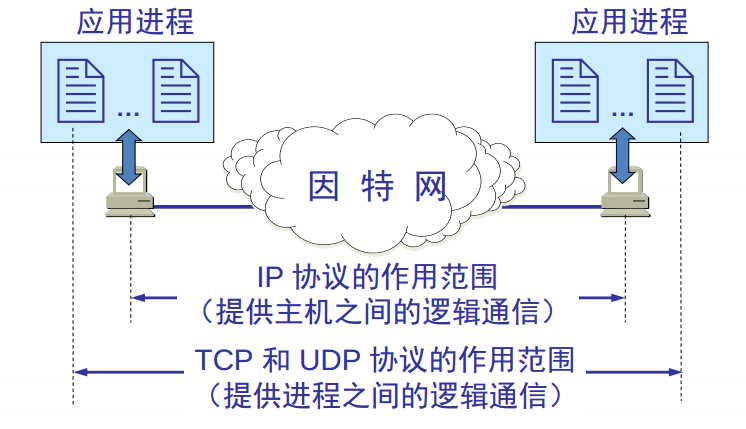

## 计网总结(五)一运输层

网络层是为主机之间提供逻辑通信，而运输层为应用进程之间提供**端到端的逻辑通信**。

即: **为相互通信的应用进程提供了逻辑通信**。


常见的应用层协议使用的端口:

```c
http = TCP + 80
https = TCP + 443
ftp = TCP + 21
SMTP = TCP + 25
POP3 = TCP + 110
Telnet = TCP + 23
DNS = UDP + 53
```

服务和应用层之间的关系:

服务使用TCP或UDP的端口侦听客户端请求。

客户端使用IP地址定位服务器，**使用目标端口，定位服务**。

可以在服务器网卡上设置只开放必要的端口，实现服务器的网络安全。

```c
查看服务侦听的端口命令: netstat -an
查看建立的会话: netstat -n
netstat -nb 查看建立会话的进程
测试远程计算机某个端口是否打开: telnet 192.168.80.100 3389 
```

网络层到传输层，用数据包中的**协议号**来标识是TCP还是UDP协议。

`TCP : 6， UDP : 17`。


### 1、概述

* 传输层是**只有主机才有的层次**；
*  **为相互通信的应用进程提供了逻辑通信**；
* 为应用层提供**通信服务**，使用网络层的服务；
* 复用和分用；
* 传输层对收到的报文进行差错检测；

<div align="center"> </div><br>

<div align="center">


复用: 应用层所有的应用进程都可以通过传输层再传输到网路层。

分用: 传输层从网路层收到数据后交付指明的应用进程。


传输层的寻址与端口:

端口用一个 16 位端口号进行标志。

是逻辑端口/软件端口: 是传输层的SAP，标识主机中的应用进程。只有本地意义。

端口号

> 由此可见，两个计算机中的进程要互相通信，不仅必须知道对方的 IP 地址（为了找到对方的计算机），而且还要知道对方的端口号（为了找到对方计算机中的应用进程）。

(1)、服务器端使用的端口号

* 熟知端口，数值一般为 0~1023(包括)。
* 登记端口号，数值为 1024~49151，为没有熟知端口号的应用程序使用的。使用这个范围的端口号必须在 IANA 登记，以防止重复。

(2)、客户端使用的端口号

* 又称为短暂端口号，数值为 49152~65535，留给客户进程选择暂时使用。
* 当服务器进程收到客户进程的报文时，就知道了客户进程所使用的动态端口号。通信结束后，这个端口号可供其他客户进程以后使用。

常用的熟知端口:


### 2、TCP

**面向连接的传输控制协议**。

传送数据之前必须建立连接，数据传送结束后要释放连接。

不提供广播或多播服务。

由于TCP要提供可靠的面向连接的传输服务，因此不可避免增加了许多开销:确认、流量控制、计时器及连接
管理等。

特点: 可靠、面向连接、时延大、适用于大文件。

### 3、UDP

**无连接的用户数据报协议**。

传送数据之前不需要建立连接，收到UDP报文后也不需要给出任何确认。

 一个数据包就能完成数据通信、不分段、不需要建立会话、不需要流量控制、不可靠传输。

特点: 不可靠、无连接、时延小、适用于小文件。