# 计网总结(五)一运输层

* [一、概述](#一概述)
* [二、UDP](#二udp)
* [三、TCP连接管理](#三tcp连接管理)
* [四、TCP可靠传输和流量控制](#四tcp可靠传输和流量控制)
* [六、TCP拥塞控制](#六tcp拥塞控制)

## 一、概述
网络层是为主机之间提供逻辑通信，而运输层为应用进程之间提供**端到端的逻辑通信**。

即: **为相互通信的应用进程提供了逻辑通信**。

### 1、基本功能

* 传输层是**只有主机才有的层次**；
*  **为相互通信的应用进程提供了逻辑通信**；
* 为应用层提供**通信服务**，使用网络层的服务；
* 复用和分用；
* 传输层对收到的报文进行差错检测；

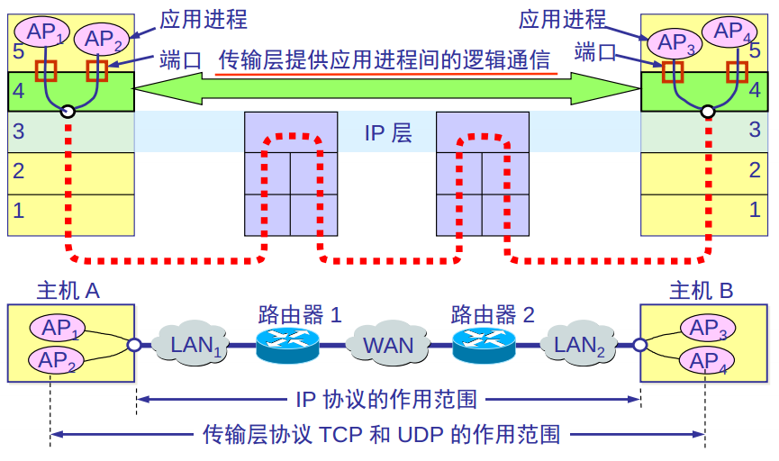 
 

**复用: 应用层所有的应用进程都可以通过传输层再传输到网路层**。

**分用: 传输层从网路层收到数据后交付指明的应用进程**。

### 2、传输层协议和应用层协议之间的关系

应用层协议很多，传输层就两个协议，如何使用传输层两个协议标识应用层协议呢? 通常传输层协议加一个**端口号**来标识一个应用层协议，如下图所示，展示了传输层协议和应用层协议之间的关系。

端口用一个 16 位端口号进行标志。

是逻辑端口/软件端口: 是传输层的SAP，标识主机中的应用进程。只有本地意义。

> 由此可见，两个计算机中的进程要互相通信，不仅必须知道对方的 IP 地址（为了找到对方的计算机），而且还要知道对方的端口号（为了找到对方计算机中的应用进程）。

端口号以及常用的熟知端口:

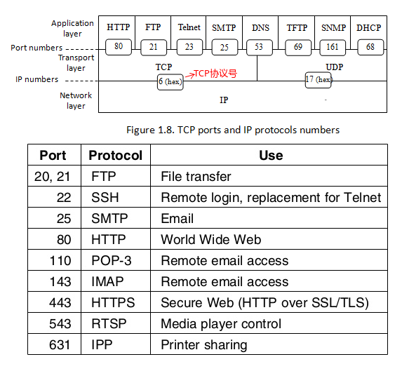
 

> (1)、服务器端使用的端口号
> * 熟知端口，数值一般为 0~1023(包括)。
> * 登记端口号，数值为 1024~49151，为没有熟知端口号的应用程序使用的。使用这个范围的端口号必须在 IANA 登记，以防止重复。
> (2)、客户端使用的端口号
> * 又称为短暂端口号，数值为 49152~65535，留给客户进程选择暂时使用。
> * 当服务器进程收到客户进程的报文时，就知道了客户进程所使用的动态端口号。通信结束后，这个端口号可供其他客户进程以后使用。

> 套接字: **网络中采用发送方和接收方的套接字组合来识别端点，套接字唯一标识了网络中的一个主机和它上面的一个进程**。即套接字Socket = (主机IP地址，端口号)

整体过程:

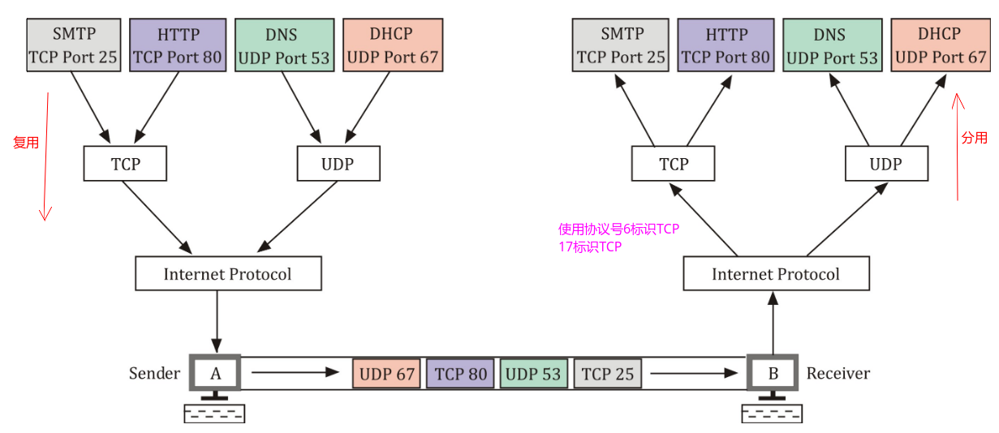

> 网络层到传输层，用数据包中的**协议号**来标识是TCP还是UDP协议。
>
> `TCP : 6， UDP : 17`。

下图展示了A、B、C计算机访问服务器数据包的过程。

客户端使用IP地址定位服务器，**使用目标端口，定位服务**。

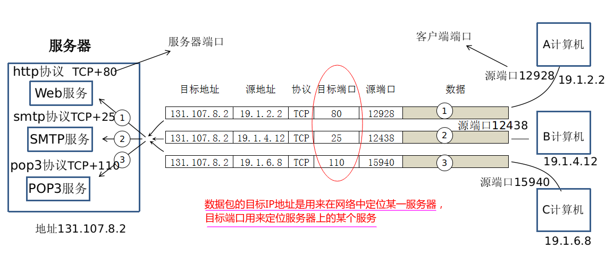

TCP和UDP相当于网络中的两扇大门，门上开的洞就相当于开发TCP和UDP的端口。如果想让服务器更加安全，就把能够通往应用层的TCP和UDP的两扇大门关闭，在大门上只开放必要的端口。

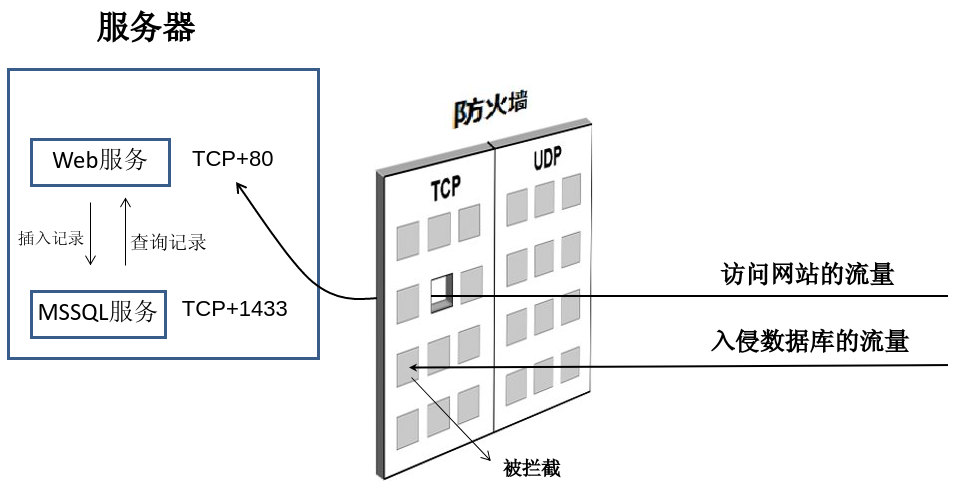

上面讲的是设置服务器的防火墙只开放必要的端口，以加强服务器的网络安全。也可以在路由器上设置访问控制列表`ACL`来实现网络防火墙的功能，控制内网访问Internet的流量。

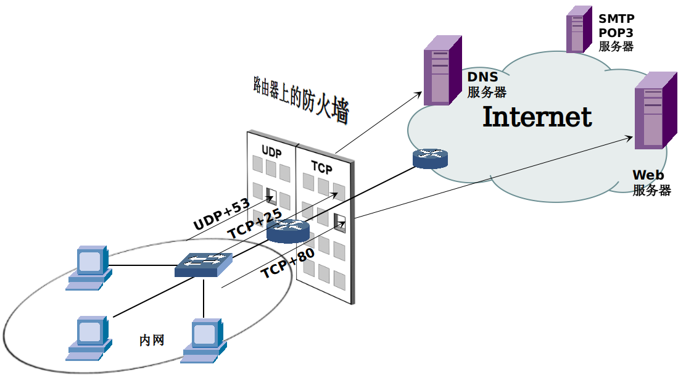

## 二、UDP

### 1、UDP协议的特点

**无连接的用户数据报协议**。

用户数据报协议 (UDP) 只在IP地址的数据报服务之上增加了很少一点功能，就是**复用和分用的功能以及差错检测**的功能，复用和分用，就是使用端口标识不同的应用层协议。

* 传送数据之前不需要建立连接，收到UDP报文后也不需要给出任何确认；
* 使用尽最大努力交付，即不保证可靠交付，因此主机不需要维持复杂的连接状态表(这里面有许多参数)，通信的两端不用保持连接，因此节省系统资源；

 一个数据包就能完成数据通信、不分段、不需要建立会话、不需要流量控制、不可靠传输。

简言之: 不可靠、无连接、时延小、适用于小文件。

接收方 UDP 对 IP 层交上来的 UDP 用户数据报，在去除首部后就原封不动地交付上层的应用进程，**一次交付一个完整的报文**。

### 2、UDP首部格式

用抓包工具捕获的域名解析的数据包，域名解析使用DNS协议，在传输层使用UDP协议。如下图:

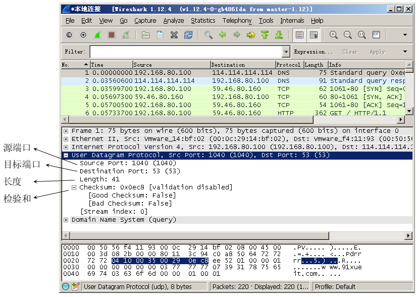

UDP 用户数据报有两个字段: 数据字段和首部字段。如图所示，首部字段很简单，只有8 个字节，由 4 个字段组成，每个字段的长度都是两个字节，各字段含义如下:

* 1)、 源端口。源端口号。在需要对方回信时选用。不需要时可用全 0。
* 2)、**目的端口。目的端口号。在终点交付报文时必须要使用到**。
* 3)、长度。UDP 用户数据报的长度，其最小值是8(仅有首部)。
* 4)、检验和。检测 UDP 用户数据报在传输中是否有错。有错就入弃。

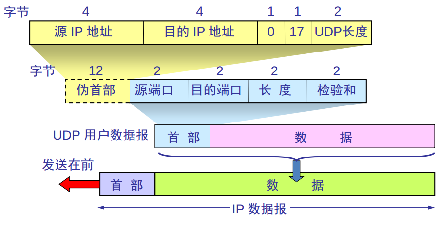

UDP 用户数据报首部中检验和的计算方法有些特殊。在计算检验和时，要在 UDP 用户数据报之前增加 12 个字节的**伪首部**。所谓“伪首部” 是因为这种伪首部并不是 UDP 用户数据报真正的首部。

**UDP校验**:

在发送端:

* 1)、填上伪首部；
* 2)、全0填充检验和字段；
* 3)、全0填充数据部分(UDP数据报要看成许多4B的字串接起来)；
* 4)、伪首部+首部+数据部分采用二进制及码求和；
* 5)、把和求反码填入检验和字段；
* 6)、去掉伪首部，发送；

在接收端:
* 1)、填上伪首部；
* 2)、伪首部+首部+数据部分采用二进制反码求和；
* 3)、结果全为1则无差错，否则丢弃数据报/交给应用层附上出差错的警告(ICMP)；

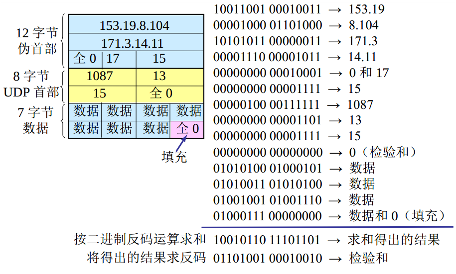

## 三、TCP

**面向连接的传输控制协议**。

传送数据之前必须建立连接，数据传送结束后要释放连接。适用于大文件。

**不提供广播或多播服务**。

由于TCP要提供可靠的面向连接的传输服务，因此不可避免增加了许多开销:确认、流量控制、计时器及连接
管理等。

### 1、TCP协议的特点

* 1)、TCP是面向连接 (**虚连接**) 的传输层协议；(类似打call)
* 2)、每一条TCP连接只能有两个端点，每一条TCP连接**只能是点对点的**；
* 3)、TCP提供可靠交付的服务，无差错、不丢失、不重复、按序到达；(可靠有序，不丢不重)
* 4)、TCP提供**全双工通信**。
  * "**发送缓存**" : 准备发送的数据 & 已发送但尚未收到确认的数据；
  * "**接收缓存**" : 按序到达但尚未被接受应用程序读取的数据 &不按序到达的数据；
* 5)、TCP面向字节流。TCP把应用程序交下来的数据看成仅仅是一连串的无结构的字节流。流: 流入到进程或从进程流出的字节序列。
* 6)、TCP 不保证接收方应用程序所收到的数据块和发送方应用程序所发出的数据块具有对应大小的关系；但接收方应用程序收到的字节流必须和发送方应用程序发出的字节流完全一样；
* 7)、TCP 对应用进程一次把多长的报文发送到TCP 的缓存中是不关心的。 **TCP 根据对方给出的窗口值和当前网络拥塞的程度来决定一个报文段应包含多少个字节**（UDP 发送的报文长度是应用进程给出的）。

### 2、TCP连接

TCP 连接的端点不是主机，不是主机的IP 地址，不是应用进程，也不是运输层的协议端口。TCP 连接的端点叫做**套接字 (socket) 或插口**。
 **端口号拼接到 (contatenated with) IP 地址即构成了套接字**。

套接字 `socket = (IP地址: 端口号)`。

**每一条 TCP 连接唯一地被通信两端的两个端点（即两个套接字）所确定**。

TCP 连接` ::= {socket1, socket2} = { (IP1: port1)，(IP2: port2) } `

同一个 IP 地址可以有多个不同的 TCP 连接。

同一个端口号也可以出现在多个不同的 TCP 连接中。

### 3、TCP首部格式

首部格式:

 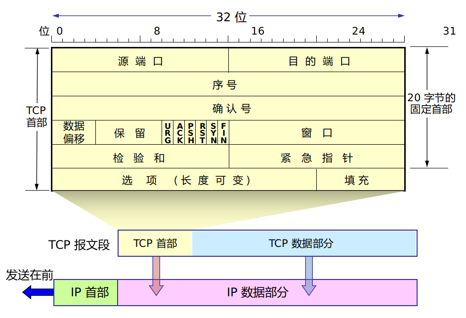
 

相关字段解释(对于理解TCP很重要)

* 序号: 在一个TCP连接中传送的字节流中的每一个字节都按顺序编号，本字段表示本报文段所发送数据的第一个字节的序号，例如发送报文段`1-2-3`，则序号是`1`。
* 确认号: **期望收到对方下一个报文段的第一个数据字节的序号**。若确认号为N,则证明到序号N-1为止的所有数据都已正确收到。例如 B 正确收到 A 发送来的一个报文段，序号为 301，携带的数据长度为 100 字节，因此 B 期望下一个报文段的序号为 401，B 发送给 A 的确认报文段中确认号就为 401；
* 数据偏移(**首部长度**) : TCP报文段的数据起始处距离TCP报文段的起始处有多远，以4B位单位，即1个数值是4B。
* 6个控制位。
  * **紧急位URG** : URG=1时，标明此报文段中有紧急数据，是高优先级的数据，应尽快传送，不用在缓存里排队，配合**紧急指针字段**使用；
  * **确认位ACK** : ACK=1时确认号有效，在连接建立后所有传送的报文段都必须把ACK置为1；
  * **推送位PSH** : PSH=1时，**接收方尽快交付接收应用进程，不再等到缓存填满再向上交付**；
  * **复位RST** : RST=1时，表明TCP连接中出现严重差错，必须释放连接，然后再**重新建立**传输链接；
  * **同步位SYN** : SYN=1时，表明是一个连接请求/连接接受报文；
  * **终止位FIN** : FIN=1时，表明此报文段发送方数据已发完，**要求释放连接**。
* **窗口** ：窗口值作为接收方让发送方设置其发送窗口的依据。之所以要有这个限制，是因为接收方的数据缓存空间是有限的。
* 检验和: 占 2 字节。检验和字段检验的范围包括首部和数据这两部分。在计算检验和时，要在 TCP 报文段的前面加上 12 字节的伪首部。 
* 紧急指针: URG = 1时才有意义，指出本报文段紧急数据的字节数；
* 选项: 最大报文段长度MSS、窗口扩大、时间戳、时间确认....；

> MSS (Maximum Segment Size)是 TCP 报文段中的数据字段的最大长度。**数据字段加上 TCP 首部才等于整个的 TCP 报文段**。所以，MSS是 `TCP 报文段长度 -  TCP 首部长度`；

捕获的TCP报文段:

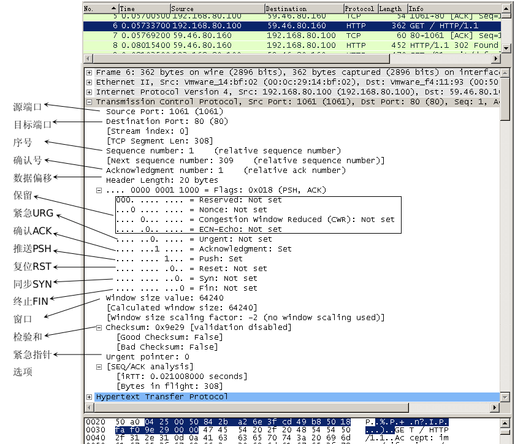

### 4、TCP和UDP的区别

* 1、TCP面向连接（如打电话要先拨号建立连接）；UDP是无连接的，即发送数据之前不需要建立连接。
* 2、TCP提供可靠的服务。也就是说，通过TCP连接传送的数据，无差错，不丢失，不重复，且按序到达；UDP尽最大努力交付，即不保证可靠交付。
* 3、TCP面向字节流，实际上是TCP把数据看成一连串无结构的字节流；UDP是面向报文的，UDP没有拥塞控制，因此网络出现拥塞不会使源主机的发送速率降低（对实时应用很有用，如IP电话，实时视频会议等）。
* 4、每一条TCP连接只能是点到点的；UDP支持一对一，一对多，多对一和多对多的交互通信。
* 5、TCP首部开销20字节；UDP的首部开销小，只有8个字节。
* 6、TCP的逻辑通信信道是全双工的可靠信道；UDP则是不可靠信道。

## 三、TCP连接管理

### 1、TCP的连接建立

#### 1)、三次握手

TCP连接传输三个阶段:

* 连接建立；
* 数据传送；
* 连接释放；

TCP连接的建立采用客户端服务器方式，主动发起连接建立的应用进程叫做客户端(A)，而被动等待连接建立的应用进程叫服务器(B)。

假设运行在一台主机(客户)上的一个进程想与另一台主机（服务器）上的一个进程建立一条连接，客户应用进程首先通知客户TCP，他想建立一个与服务器上某个进程之间的连接，客户中的TCP会用以下步骤与服务器中的TCP建立一条TCP连接:

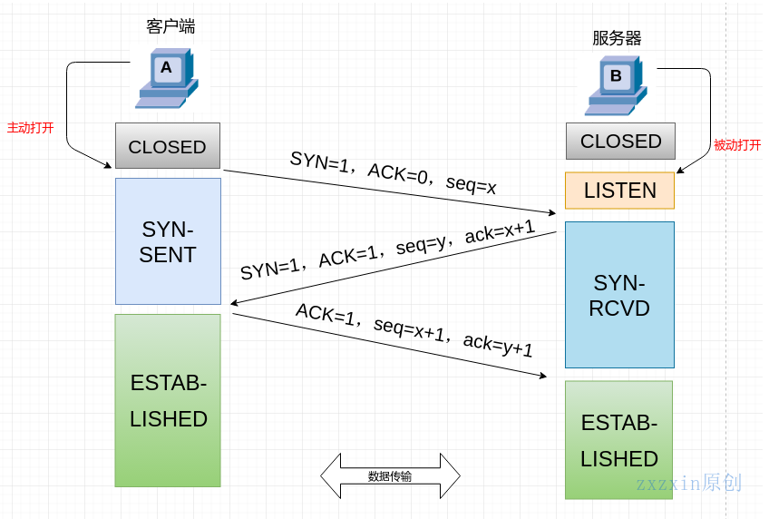
 

步骤:

* 1)、A 向 B 发送连接请求报文段，SYN=1，ACK=0，选择一个初始的序号 seq = x；
* 2)、B 收到连接请求报文段，，如果同意建立连接，服务器为该TCP连接分配缓存和变量，向 A 发送连接确认报文段，SYN=1，ACK=1，确认号`ack`为 `x+1`，同时也选择一个初始的序号 seq = y (随机)；
* 3)、A 收到 B 的连接确认报文段后，为该TCP连接分配缓存和变量，同时还要向 B 发出确认，ACK = 1，确认号为 ack = y+1，序号为 `seq = x+1`(接上一开始的`x`)；(SYN = 0，因为只有在连接请求和连接请求接受的时候才会置为1)；
* 4)、最后，B收到A确认报文，状态变为ESTABLISHED(连接建立)，双方就可以进行双向通信了；

实战:

(1)、第一次握手

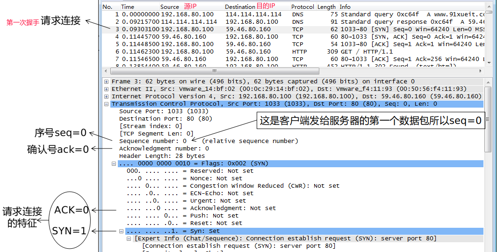
 

(2)、第二次握手

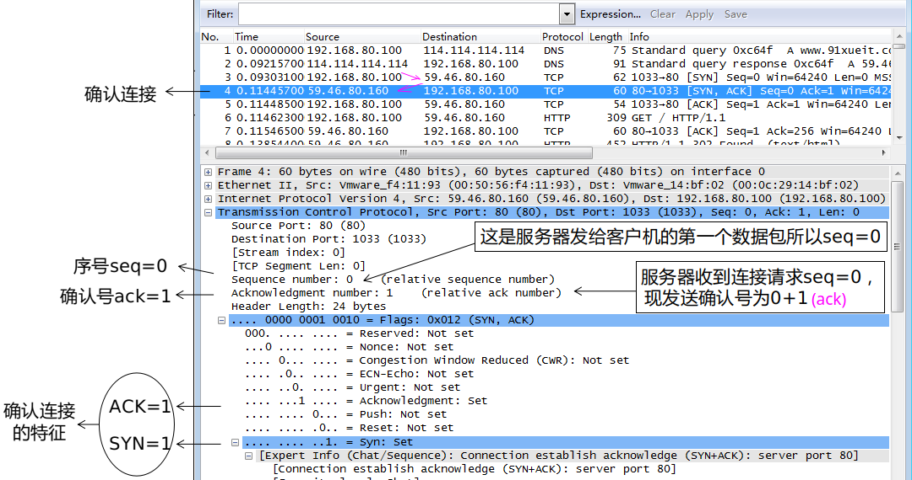
 

(3)、第三次握手

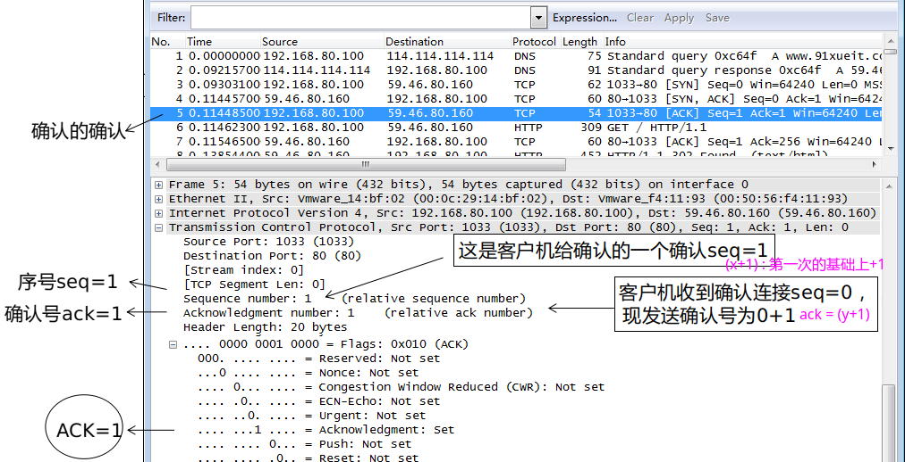
 

#### 2)、为什么TCP连接需要三次握手，两次不可以吗，为什么?

主要是 : **为了防止已失效的连接请求报文段突然又传送到了服务端，占用服务器资源** 。(A是客户端，B是服务器)

现假定出现一种异常情况，即A发出的第一个连接请求报文段并没有丢失，而是在某些网络节点长时间滞留了，以致延误到连接释放以后的某个时间才到B。本来这是一个已失效的报文段，但是B收到此失效的连接请求报文段后，就误认为是A又发出一次新的连接请求。于是就向A发出确认报文段，同意建立连接。假定不采用三次握手，那么只要B发出确认，新的连接就建立了。

由于现在A并没有发出建立连接的请求，因此不会理睬B的确认，也不会向B发送数据。但B却以为新的运输连接已经建立了，并一直等待A发来数据。B的许多资源就这样白白浪费了。

采用三次握手的办法可以防止上述现象的发生。例如在刚才的情况下，A不会向B的确认发出确认。B由于收不到确认，就知道A并没有要求建立连接。

#### 3)、SYN攻击

SYN洪泛攻击发生在OSI第四层，这种方式利用TCP协议的特性，就是三次握手。**攻击者发送TCP SYN，SYN是TCP三次握手中的第一个数据包，而当服务器返回ACK后，该攻击者就不对其进行再确认，那这个TCP连接就处于挂起状态，也就是所谓的半连接状态**，服务器收不到再确认的话，还会重复发送ACK给攻击者。这样更加会浪费服务器的资源。攻击者就对服务器发送非常大量的这种TCP连接，由于每一个都没法完成三次握手，所以在服务器上，这些TCP连接会因为挂起状态而消耗CPU和内存，最后服务器可能死机，就无法为正常用户提供服务了。

### 2、TCP的连接释放

#### 1)、四次挥手

过程:

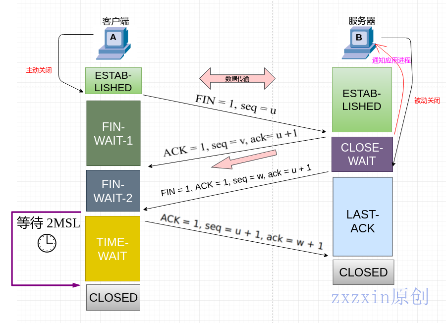

数据传输结束后，通信的双方都可释放连接。现在 A 的应用进程先向其 TCP **发出连接释放报文段**，并停止再发送数据，主动关闭 TCP连接。

- A 把连接释放报文段首部的 FIN = 1，其序号 seq = u，等待 B 的确认。
- B 发出确认(会送一个确认报文段)，ACK = 1，确认号 ack = u+1，而这个报文段自己的序号 seq = v(随机)。（TCP 服务器进程通知高层应用进程）
- 从 A 到 B 这个方向的连接就释放了，TCP 连接处于**半关闭状态**。A 不能向 B 发送数据；**B 若发送数据，A 仍要接收**。
- 当 B 不再需要连接时，发送连接释放请求报文段，FIN=1，ACK =1，seq = w(随机)，确认号ack = u + 1(为什么确认号是一样的，因为在这段时间内，A没有发送数据) (这时B进入`LAST-ACK`(最后确认阶段))。
- A 收到后发出确认，ACK =1, seq = u + 1（因为FIN要消耗一个序号，所以从u+1开始），进入 TIME-WAIT 状态，等待 2 MSL（2*2 = 4 mins）时间后释放连接。
- B 收到 A 的确认后释放连接。

#### 2)、四次挥手的原因

客户端发送了 FIN 连接释放报文之后，服务器收到了这个报文，就进入了 CLOSE-WAIT 状态。**这个状态是为了让服务器端发送还未传送完毕的数据**，传送完毕之后，服务器会发送 FIN 连接释放报文。 

#### 3)、为什么A在TIME-WAIT状态必须等待2MSL的时间内？

 MSL是`Maximum Segment Lifetime`英文的缩写，中文可以译为 “报文最大生存时间”，他是任何报文在网络上存在的最长时间，超过这个时间报文将被丢弃。2MSL = 2*2mins = 4mins
客户端接收到服务器端的 FIN 报文后进入此状态，此时并不是直接进入 CLOSED 状态，还需要等待一个时间计时器设置的时间 2MSL。这么做有两个理由：
* **确保最后一个确认报文段能够到达B**。如果 B 没收到 A 发送来的确认报文段，那么就会重新发送连接释放请求报文段，接着 A 重传一次确认，重新启动 2MSL 计时器。A 等待一段时间就是为了处理这种情况的发生。
* 等待一段时间是为了让本连接持续时间内所产生的所有报文段都从网络中消失，使得下一个新的连接不会出现旧的连接请求报文段。

### 3、三次握手和四次挥手涉及的状态

三次握手

- CLOSED：初始状态。
- LISTEN：服务器处于监听状态。
- SYN_SEND：客户端socket执行CONNECT连接，发送SYN包，进入此状态。
- SYN_RECV：服务端收到SYN包并发送服务端SYN包，进入此状态。
- ESTABLISH：表示连接建立。客户端发送了最后一个ACK包后进入此状态，服务端接收到ACK包后进入此状态。

四次挥手:

- FIN_WAIT_1：终止连接的一方（通常是客户机）发送了FIN报文后进入。等待对方FIN。
- CLOSE_WAIT：（假设服务器）接收到客户机FIN包之后等待关闭的阶段。在接收到对方的FIN包之后，自然是需要立即回复ACK包的，表示已经知道断开请求。但是本方是否立即断开连接（发送FIN包）取决于是否还有数据需要发送给客户端，若有，则在发送FIN包之前均为此状态。
- FIN_WAIT_2：此时是半连接状态，即有一方要求关闭连接，等待另一方关闭。客户端接收到服务器的ACK包，但并没有立即接收到服务端的FIN包，进入FIN_WAIT_2状态。
- LAST_ACK：服务端发动最后的FIN包，等待最后的客户端ACK响应，进入此状态。
- TIME_WAIT：客户端收到服务端的FIN包，并立即发出ACK包做最后的确认，在此之后的2MSL时间称为TIME_WAIT状态。

## 四、TCP可靠传输和流量控制

针对可靠传输和流量控制有三种协议: 停止等待协议、后退N帧协议、选择重传协议。

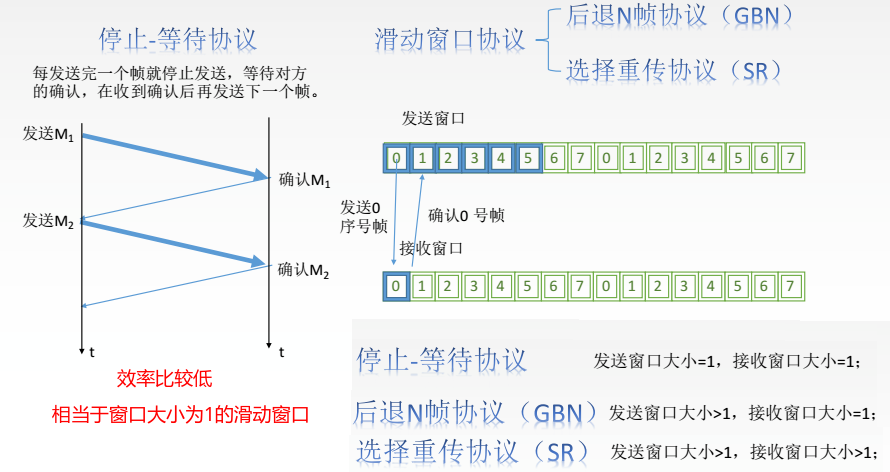

### 1、停止等待协议

停止等待协议也可以在传输层讨论。

停止等待协议是**为了实现流量控制**。

简言之: **就是每发送一个分组就停止发送，等待对方确认，在收到确认后再发送下一个分组**。

主要分为: **无差错情况和有差错情况**。

#### 1)、无差错的情况

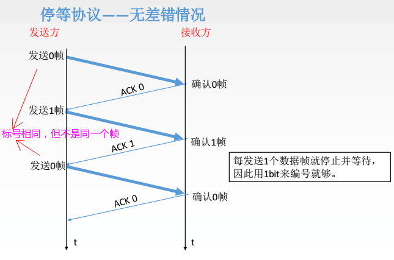

这里应注意以下三点。

* 第一，A 在发送完一个分组后，必须**暂时保留已发送的分组的副本**(发生超时重传时使用)。只有在收到相应的确认后才能清除暂时保留的分组副本。
* 第二，**分组和确认分组都必须进行编号**。这样才能明确是哪一个发送出去的分组收到了确认，而哪一个分组还没有收到确认。
* 第三，超时计时器设置的重传时间应当比数据分组传输的平均往返时间(RTT)更长一些。

> ACK (Acknowledgement）即是确认字符，在数据通信中，接收站发给发送站的一种传输类控制字符。表示发来的数据已确认接收无误。
>
> 在TCP/IP协议中，如果接收方成功的接收到数据，那么会回复一个ACK数据。通常ACK信号有自己固定的格式,长度大小,由接收方回复给发送方。

#### 2)、有差错的情况

又可以分为两种:

* 数据帧丢失或者检验到帧出错；

* ACK丢失；
* ACK迟到；

数据帧丢失的情况:

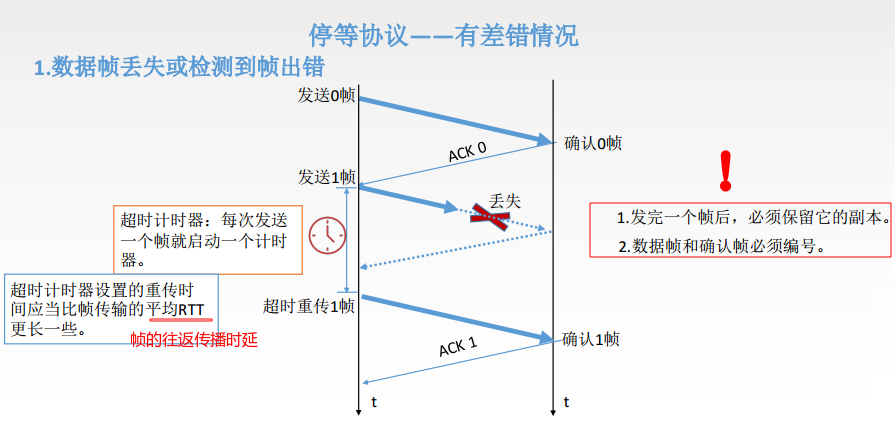

ACK丢失和ACK迟到:

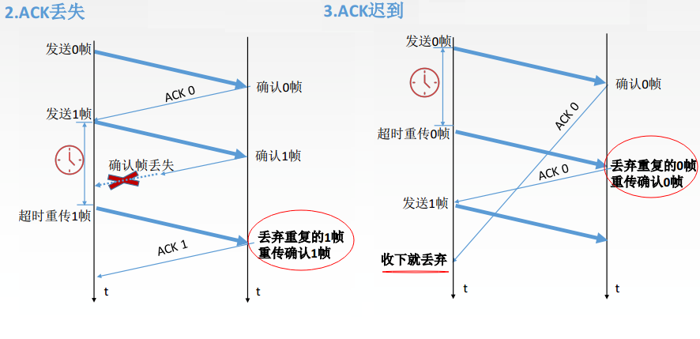

#### 3)、缺点

信道利用率太低:

* 大部分时间都在路上；
* 即RTT（传输往返时延）太长；

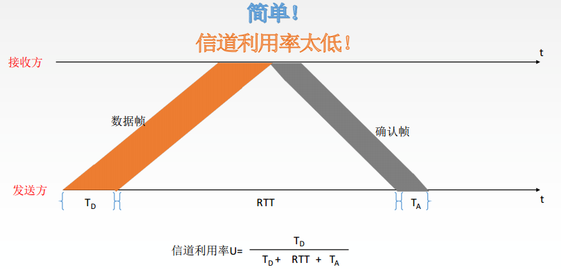

针对上面停止等待协议的缺点，于是就有了在传输数据时的流水线发送数据，也就引出了两种协议:

* 后退N帧协议；
* 选择重传协议；  

解决停等协议的流水线解决方案:

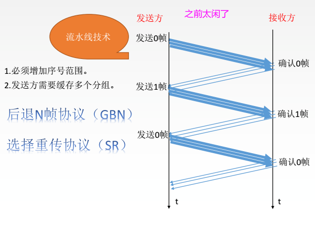

### 2、后退N帧协议(ARQ)

用图来看一下步骤:

 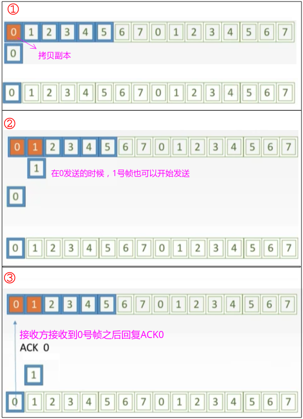
 

  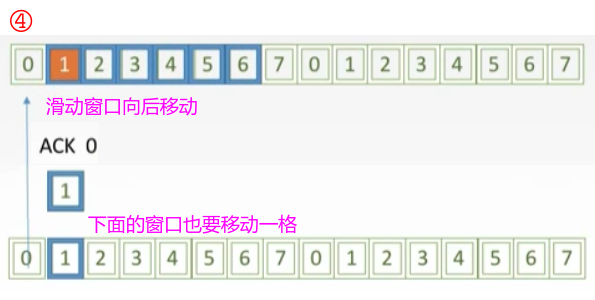
 

在这个过程中，发送方可以分成几个部分:

* 发送完被确认的；
* 已经发送但等待确认的；
* 还能发送的；
* 还不能发送的；

#### 1)、GBN发送方必须做的三件事

1)、上层的调用

上层要发送数据时，发送方先检查发送窗口是否已满，如果未满，则产生一个帧并将其发送， 如果窗口已满，
发送方只需将数据返回给上层，暗示上层窗口已满。上层等一会再发送。 (实际实现中，发送方可以缓存这
些数据，窗口不满时再发送帧) 。

2)、收到了一个ACK (重要)

GBN协议中，对n号帧的确认采用**累积确认**的方式，**标明接收方已经收到n号帧和它之前的全部帧**。

3)、超时事件

**协议的名字为后退N帧/回退N帧**，来源于出现丢失和时延过长帧时发送方的行为。就像在停等协议中一样，
定时器将再次用于恢复数据帧或确认帧的丢失。如果出现超时，发送方重传所有已发送但未被确认的帧。

#### 2)、GBN接收方必须要做的事

1)、如果正确收到n号帧，并且按序，那么接收方为n帧发送一个ACK，并将该帧中的数据部分交付给上层。

2)、**其余情况都丢弃帧，并为最近按序接收的帧重新发送ACK。接收方无需缓存任何东西，只需要维护一个信息: expectedseqnum** (下一个按序接收的帧序、我期待的下一个的帧的序号，如果一直没来我就一直丢弃你的不符合的帧) 。

> 注意发送窗口不能无限大，范围是`1 ~ 2^n-1`，`n`是代表用`n`个比特对帧编号。

#### 3)、GBN总结和注意事项

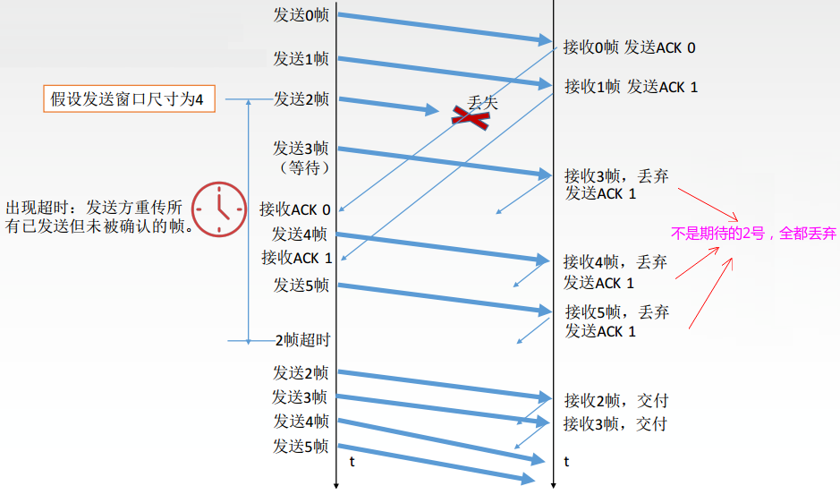

几个重点:

* 累积确认( 偶尔捎带确认)；
* **接收方只按顺序接收帧，不按序无情丢弃**；
* 确认序列号最大的、按序到达的帧；
* **发送窗口最大为 2n - 1，接收窗口大小为1**；

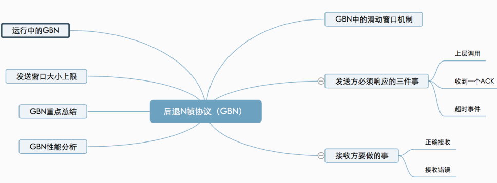

### 3、选择重传协议

后退N帧协议的缺点 : 有些帧发送的好好的(由于`exceptedSeqNum`不对)，为什么让我重传呢?

解决办法:

设置单个确认，同时加大接收窗口，设置接收缓存，缓存乱序到达的帧。

基本方法:

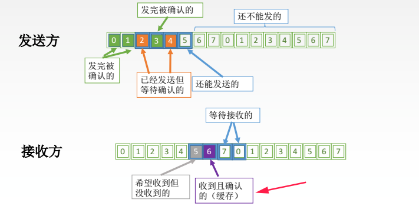

#### 1)、SR发送方必须做的三件事

1)、从上层收到数据后，**SR发送方检查下一个可用于该帧的序号，如果序号位于发送窗口内，则发送数据帧**；否
则就像GBN一样，要么将数据缓存，要么返回给上层之后再传输；

2)、如果收到ACK，加入该帧序号在窗口内，则SR发送方将那个被确认的帧标记为已接收。如果该帧序号是窗口
的下界(最左边第一个窗口对应的序号) ，**则窗口向前移动到具有最小序号的未确认帧处**。如果窗口移动了
并且有序号在窗口内的未发送帧，则发送这些帧。

3)、每个帧都有自己的定时器，一个超时时间发生之后只重传一个帧。

#### 2)、SR接收方必须要做的事

1)、**SR接收方将确认一个正确接收的帧而不管其是否按序**。**失序的帧将被缓存**，并返回给发送方一个该帧的确认帧【收谁确认谁】，直到所有帧(**即序号更小的帧)**皆被收到为止，这时才可以将一批帧按序交付给上层，然后向前移动滑动口上。

2)、**如果收到了小于窗口下界的帧，就返回一个ACK，否则就忽略该帧**。

#### 3)、SR总结和注意事项

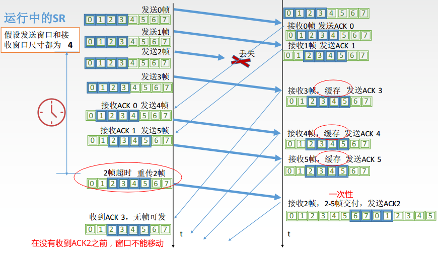

SR重点:

* 对数据帧逐一确认，收一个确认一个(先来着不拒)；
* 只重传出错帧；
* 接收方有**缓存**；
* W发送方 = W接收方 = 2 n-1；

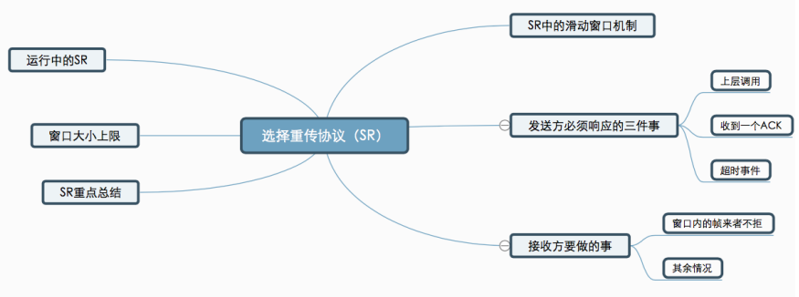

以字节为单位的滑动窗口技术详解（总的流程图）:

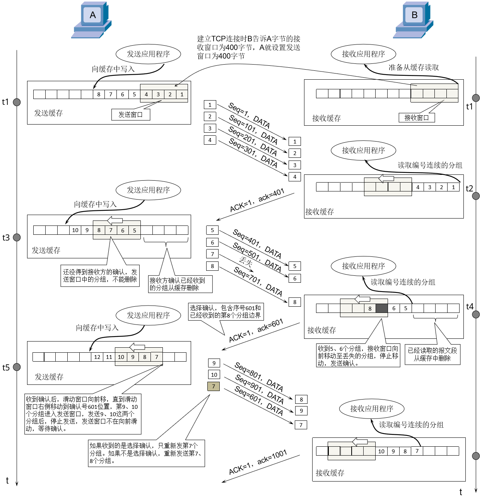

**窗口是缓存的一部分，用来暂时存放字节流**。发送方和接收方各有一个窗口，**接收方通过 TCP 报文段中的窗口字段告诉发送方自己的窗口大小，发送方根据这个值和其它信息设置自己的窗口大小**。

发送窗口内的字节都允许被发送，接收窗口内的字节都允许被接收。**如果发送窗口左部的字节已经发送并且收到了确认，那么就将发送窗口向右滑动一定距离**，直到左部第一个字节不是已发送并且已确认的状态；

接收窗口的滑动类似，接收窗口左部字节已经发送确认并交付主机，就向右滑动接收窗口。

接收窗口只会对窗口内最后一个按序到达的字节进行确认，例如接收窗口已经收到的字节为 {1, 2, 4, 5}，其中 {1, 2} 按序到达，而 {4, 5} 就不是，因此只对字节 {1, 2}  进行确认。发送方得到一个字节的确认之后，就知道这个字节之前的所有字节都已经被接收。

> 发送缓存用来暂时存放：
>
> * 发送应用程序传送给发送方 TCP 准备发送的数据；
> * TCP 已发送出但尚未收到确认的数据。
>
> 接收缓存用来暂时存放：
>
> *  按序到达的、但尚未被接收应用程序读取的数据；
> * **不按序到达的数据**。

### 4、流量控制

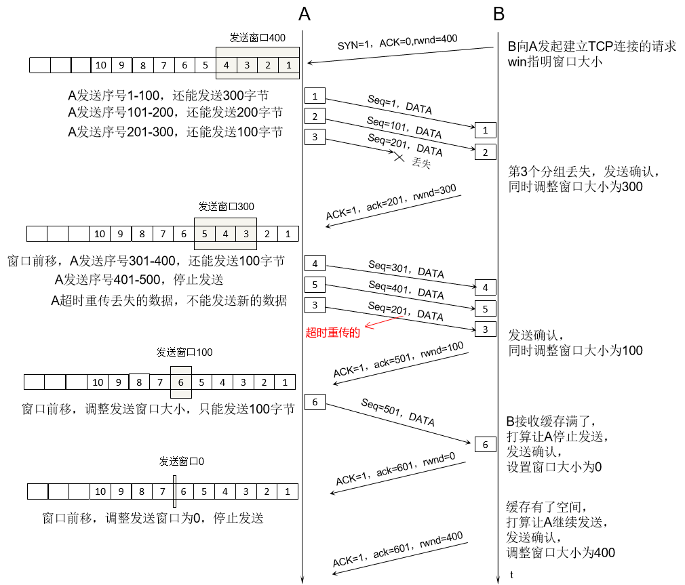

> rwnd : Receive Window，即接收窗口。注意TCP的窗口单位是字节，不是报文段。

这个过程主机B进行了三次流量控制，第一次把窗口减小到`rwnd = 300`，第二次又减到`rwnd = 100`，最后减到`rwnd = 0`，即不允许发送方再发送数据了。

> 可能发生死锁的问题:
>
> B 向 A 发送了零窗口的报文段后不久，B 的接收缓存又有了一些存储空间。于是 B 向 A 发送了 rwnd = 
> 400 的报文段。
> 但这个报文段在传送过程中丢失了。A 一直等待收到B 发送的非零窗口的通知，而 B 也一直等待 A 发送的
> 数据。
> 如果没有其他措施，这种互相等待的死锁局面将一直延续下去。
> 为了解决这个问题，TCP 为每一个连接设有一个**持续计时器** (persistence timer)。

## 五、TCP拥塞控制

### 1、拥塞控制原理

拥塞控制原理

- 在某段时间，若**对网络中某资源的需求超过了该资源所能提供的可用部分**，网络的性能就要变坏——产生拥塞(congestion)。
- 出现资源拥塞的条件：**对资源需求的总和 > 可用资源**；
- 若网络中有许多资源同时产生拥塞，网络的性能就要明显变坏，整个网络的吞吐量将随输入负荷的增大而下降。

拥塞控制: 防止过多的数据注入到网络中。

注意流量控制和拥塞控制的本质区别: **流量控制是为了让接收方能来得及接收，而拥塞控制是为了降低整个网络的拥塞程度**。

 
 

> rwnd : Receive Window，即接收窗口。接收方根据接受缓存设置的值，并告知给发送方，反映接收方容量。
>
> cwnd: Congestion Window，即拥塞窗口。发送方根据自己估算的网络拥塞程度而设置的窗口值，反映网络当前容量。
>
> 接收窗口: 是接收方设置的。拥塞窗口: 是发送方设置的
>
> 拥塞窗口只是一个状态变量，实际决定发送方能发送多少数据的是发送方窗口。

 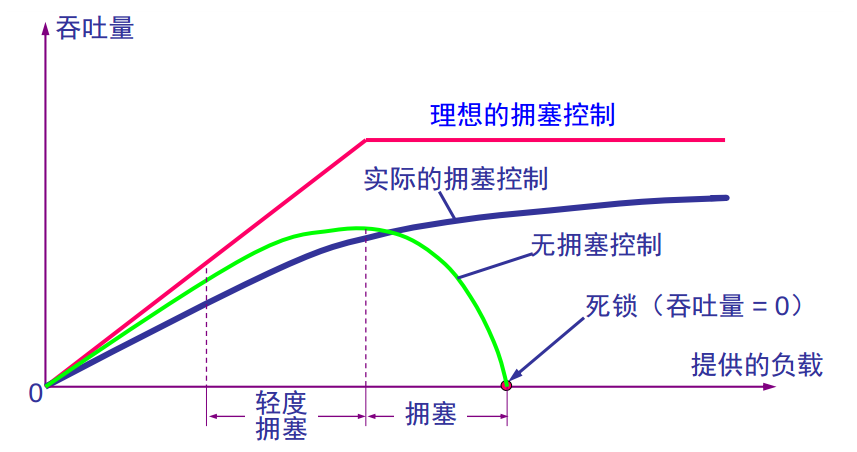
 

> 提供的负载，就是往网络上放的数据的量。

TCP 主要通过四种算法来进行拥塞控制：**慢开始、拥塞避免、快重传、快恢复**。

虽然 TCP 的窗口基于字节，但是这里按照窗口的大小单位为报文段来讨论。

### 2、慢开始和拥塞避免

慢开始的原理: **由小到大逐渐增大拥塞窗口数值**。每次可以按照收到的确认的个数来判断成功的概率。逐步增大发送方的拥塞窗口 cwnd，可以使分组注入到网络的速率更加合理。发送方每收到一个对新报文段的确认（重传的不算在内）就使 cwnd 加 1。

 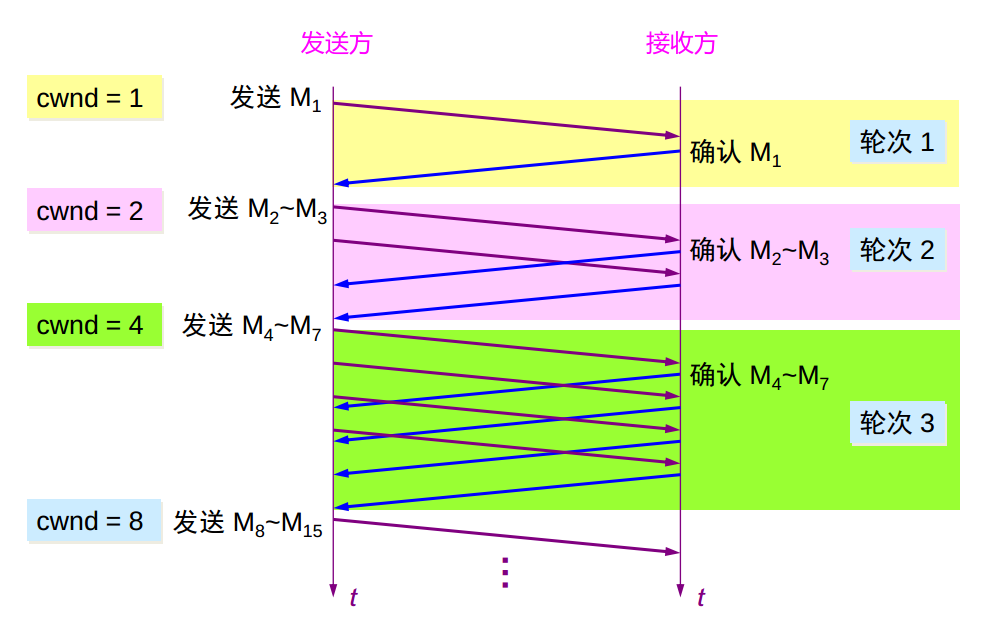

过程:

 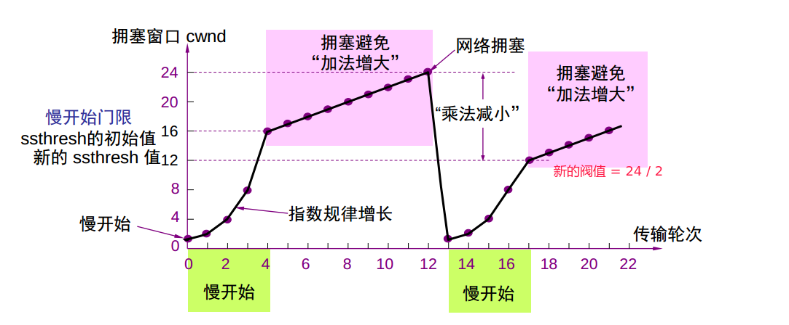
 

发送的最初执行慢开始，令 cwnd=1，发送方只能发送 1 个报文段；当收到确认后，将 cwnd 加倍，因此之后发送方能够发送的报文段数量为：2、4、8 ...

注意到慢开始每个轮次都将 cwnd 加倍，这样会让 cwnd 增长速度非常快，从而使得发送方发送的速度增长速度过快，网络拥塞的可能也就更高。

设置一个慢开始阈值 (门限)ssthresh，当 `cwnd >= ssthresh` 时，进入拥塞避免，每个轮次只将 cwnd 加 1。

如果出现了超时(最大拥塞窗口)，则令 `ssthresh = cwnd/2`，然后重新执行慢开始。

>  慢开始门限 ssthresh 的用法如下：
>
> * 当 cwnd < ssthresh 时，使用慢开始算法。
> * 当 cwnd > ssthresh 时，停止使用慢开始算法而改用拥塞避免算法。
> * 当cwnd = ssthresh 时，既可使用慢开始算法，也可使用拥塞避免算法。

### 3、快重传和快恢复

思想: 发送方只要一连收到**三个重复确认**，就知道接收方确实没有收到报文段，因而应当立即进行重传（即“快重传”），这样就不会出现超时，发送方也不就会误认为出现了网络拥塞。

不难看出，快重传并非取消重传计时器，而是在某些情况下可更早地重传丢失的报文段。

 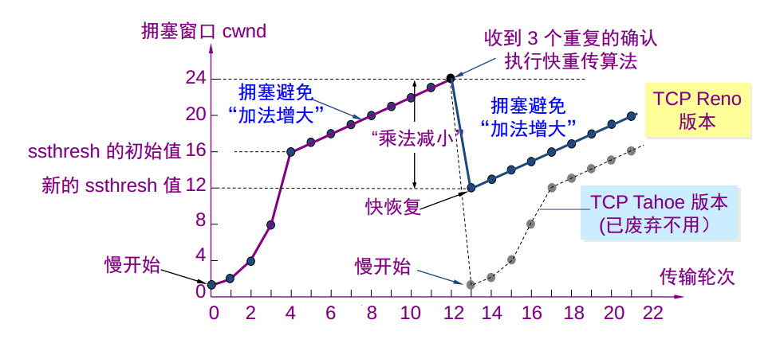
 

在接收方，要求每次接收到报文段都应该对最后一个已收到的有序报文段进行确认。例如已经接收到 M1 和 M2，此时收到 M4，应当发送对 M2 的确认。

在发送方，如果收到三个重复确认，那么可以知道下一个报文段丢失，此时执行快重传，立即重传下一个报文段。例如收到三个 M2，则 M3 丢失，立即重传 M3。

在这种情况下，只是丢失个别报文段，而不是网络拥塞。因此执行快恢复，令` ssthresh = cwnd/2 ，cwnd = ssthresh`，注意到此时直接进入拥塞避免。

慢开始和快恢复的快慢指的是 cwnd 的设定值，而不是 cwnd 的增长速率。慢开始 cwnd 设定为 1，而快恢复 cwnd 设定为 ssthresh。

> 注意: 
>
> 发送方的发送窗口的上限值应当取为接收方窗口 rwnd 和拥塞窗口 cwnd 这两个变量中较小的一个，即应按以下公式确定：
>
> 发送窗口的上限值 = `min {rwnd, cwnd}`
> 当 rwnd < cwnd 时，是接收方的接收能力限制发送窗口的最大值。
> 当 cwnd < rwnd 时，则是网络的拥塞限制发送窗口的最大值。

### 4、流量控制和拥塞控制区分

- 拥塞控制是一个全局性的过程，涉及到所有的主机、所有的路由器，以及与降低网络传输性能有关的所有因素。
- 流量控制往往指在给定的发送端和接收端之间的**点对点**通信量的控制。
- 流量控制所要做的就是抑制发送端发送数据的速率，以便使接收端来得及接收。
- 流量控制属于通信双方协商；拥塞控制涉及通信链路**全局**。
- 流量控制需要通信双方各维护一个发送窗、一个接收窗，对任意一方，接收窗大小由自身决定，发送窗大小由接收方响应的TCP报文段中窗口值确定；拥塞控制的拥塞窗口大小变化由**试探性**发送一定数据量数据探查网络状况后而自适应调整。 

### 5、超时重传、RTO、RTT

* 超时重传：发送端发送报文后若长时间未收到确认的报文则需要重发该报文。可能有以下几种情况：
  * 发送的数据没能到达接收端，所以对方没有响应。	
  * 接收端接收到数据，但是ACK报文在返回过程中丢失。
  * 接收端拒绝或丢弃数据。
* RTO(`Retransmission TimeOut`)：**从上一次发送数据，因为长期没有收到ACK响应，到下一次重发之间的时间**。就是重传间隔。通常每次重传RTO是前一次重传间隔的两倍，计量单位通常是RTT。例：1RTT，2RTT，4RTT，8RTT......重传次数到达上限之后停止重传。
* RTT (`Round Trip Time`)：**数据从发送到接收到对方响应之间的时间间隔**，即数据报在网络中一个往返用时。大小不稳定。